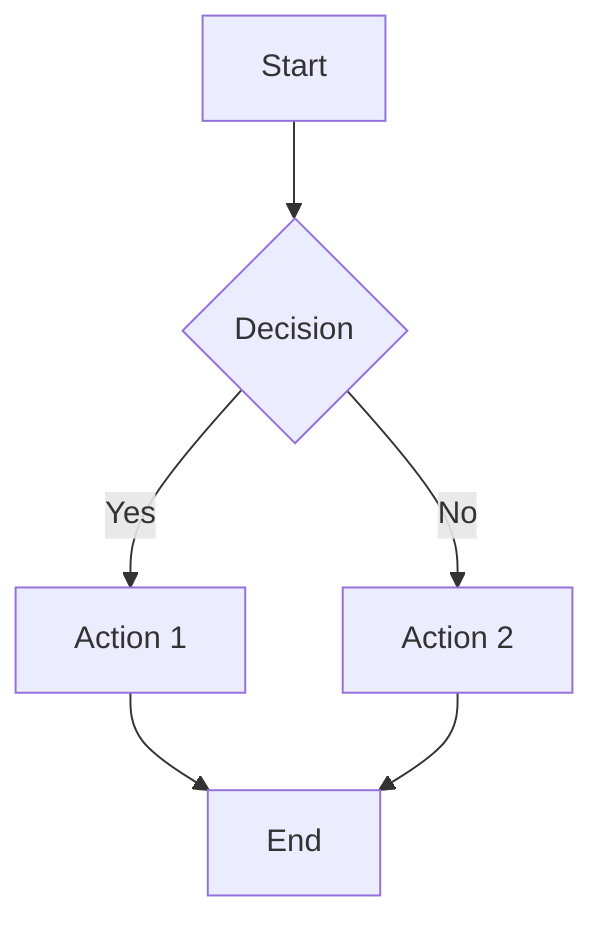
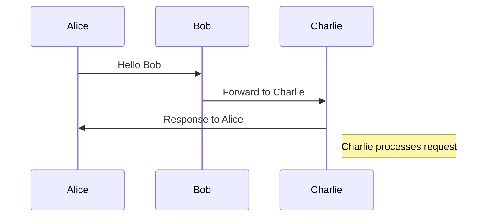
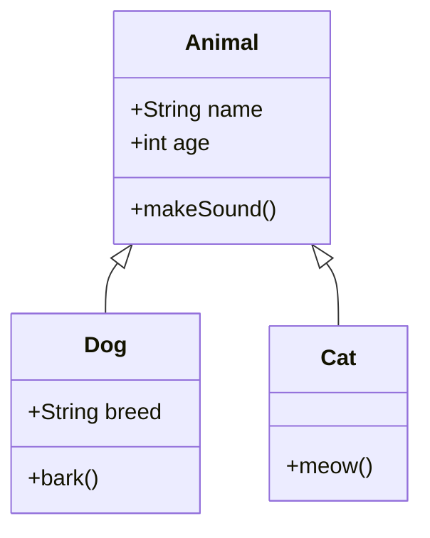
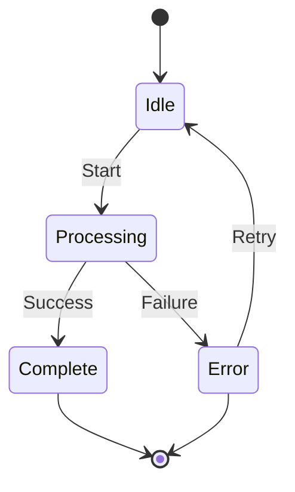
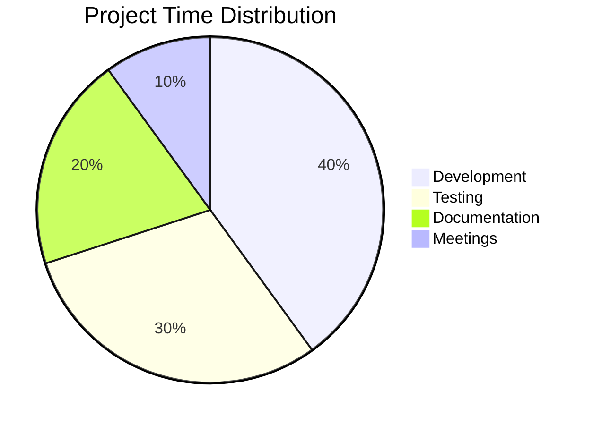
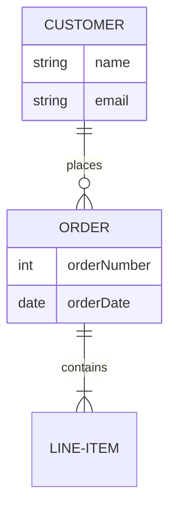
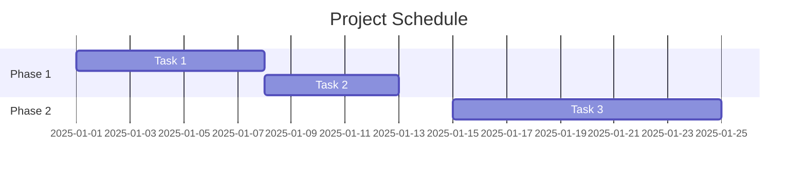
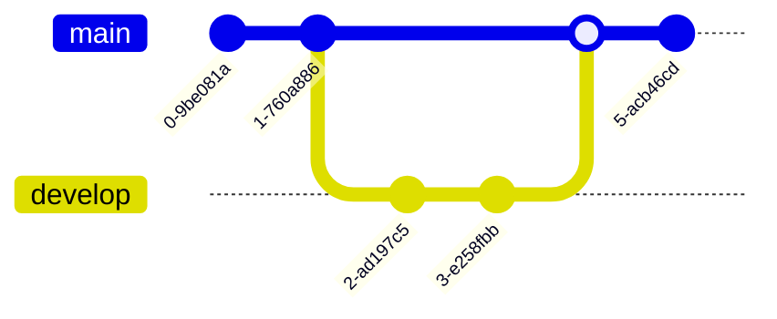

# Mermaid Diagram Types Test Fixtures

This file contains examples of different Mermaid diagram types to validate that MarkdownRenderer correctly transforms them all.

## Flowchart

## Sequence Diagram

## Class Diagram

## State Diagram

## Pie Chart

## ER Diagram

## Gantt Chart

## Git Graph

