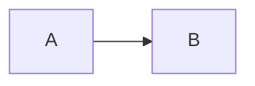

# MarkdownRenderer

> Convert Markdown content to HTML using flexmark library.

## Import

```scala
import iw.core.output.*
```

## API

### MarkdownRenderer.toHtml(markdown: String): String

Convert markdown content to HTML fragment. Supports GitHub Flavored Markdown:
- Tables (GFM style)
- Fenced code blocks with syntax highlighting classes
- Strikethrough
- Autolinks
- Anchor links
- Mermaid diagram blocks (transformed to `<div class="mermaid">`)

## Examples

```scala
// Basic markdown conversion
val html = MarkdownRenderer.toHtml("""
# Heading

Some **bold** and *italic* text.

```scala
val x = 42
```
""")

// Tables
val tableHtml = MarkdownRenderer.toHtml("""
| Column 1 | Column 2 |
|----------|----------|
| Value 1  | Value 2  |
""")

// Mermaid diagrams (automatically transformed)
val diagramHtml = MarkdownRenderer.toHtml("""

""")
// Result: <div class="mermaid">graph LR\n    A --> B</div>
```

## Notes

- Returns HTML fragment (not full page with `<html>` tags)
- Mermaid code blocks are transformed from `<pre><code class="language-mermaid">` to `<div class="mermaid">` for Mermaid.js compatibility
- HTML entities in Mermaid blocks are decoded
