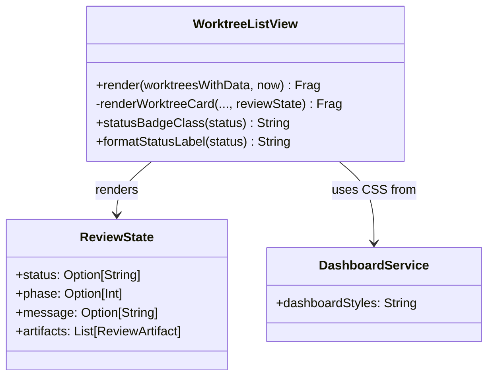
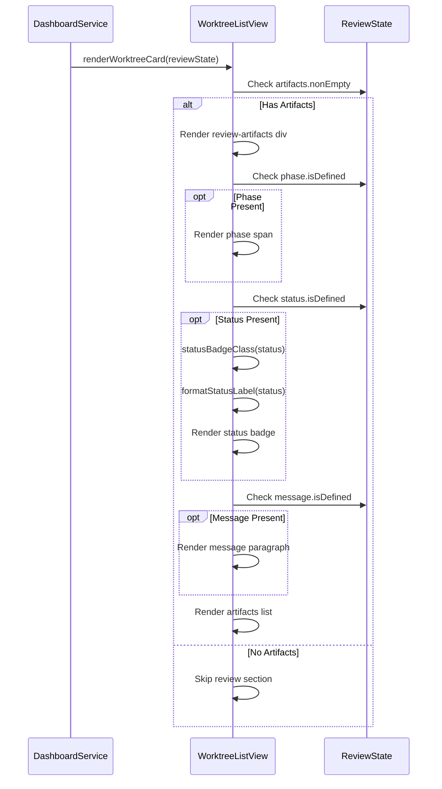
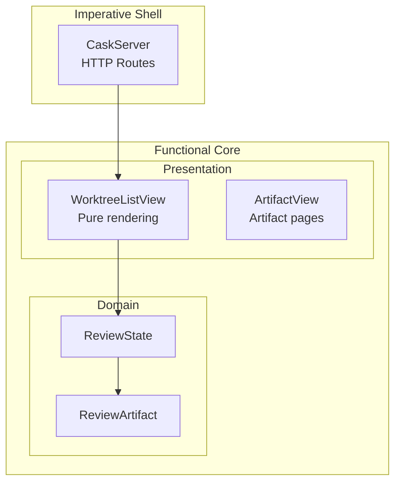

# Review Packet: Phase 4 - Review Status and Phase Display

**Issue:** #46
**Phase:** 4 of 6
**Story:** Story 3 - Review state indicates phase and status

## Goals

This phase extends the dashboard's review artifacts section to display status, phase number, and message from `review-state.json`. The implementation focuses on:

1. **Status badge rendering** with visual indicators (color-coded by status)
2. **Phase number display** when present in review state
3. **Review message display** when present
4. **Graceful degradation** for missing optional fields
5. **Consistent styling** with existing dashboard components

## Scenarios

- [ ] Status "awaiting_review" displays as green badge with "Awaiting Review" label
- [ ] Status "in_progress" displays as yellow badge with "In Progress" label
- [ ] Status "completed" displays as gray badge with "Completed" label
- [ ] Unknown status values display as blue badge with formatted label
- [ ] Phase number shows as "Phase 8" in header when present
- [ ] Message displays below status badge when present
- [ ] Missing status field renders no badge (graceful degradation)
- [ ] Missing phase field renders no phase number (graceful degradation)
- [ ] Missing message field renders no message (graceful degradation)
- [ ] All three fields (status, phase, message) render correctly together
- [ ] Artifacts list still displays correctly with all optional fields missing

## Entry Points

| File | Method/Class | Why Start Here |
|------|--------------|----------------|
| `.iw/core/WorktreeListView.scala:128-162` | `renderWorktreeCard()` | Main rendering logic for review section with status/phase/message |
| `.iw/core/WorktreeListView.scala:228-233` | `statusBadgeClass()` | Maps status values to CSS classes for color coding |
| `.iw/core/WorktreeListView.scala:240-241` | `formatStatusLabel()` | Converts status strings to human-readable labels |
| `.iw/core/DashboardService.scala:526-582` | CSS styles | Status badge and message styling definitions |
| `.iw/core/test/WorktreeListViewTest.scala:146-416` | Test suite | Comprehensive tests for all rendering paths |

## Diagrams

### Architecture Overview

```mermaid
graph TB
    subgraph Domain["Domain Layer (Phase 1)"]
        RS[ReviewState<br/>status: Option[String]<br/>phase: Option[Int]<br/>message: Option[String]]
    end

    subgraph Presentation["Presentation Layer (Phase 4)"]
        WLV[WorktreeListView]
        DS[DashboardService<br/>CSS Styles]
    end

    RS --> WLV
    WLV --> |Renders HTML| HTML[Dashboard HTML]
    DS --> |Styles| HTML
```

### Component Relationships



### Rendering Flow



### Layer Diagram (FCIS)



## Test Summary

| Test | Type | Verifies |
|------|------|----------|
| `formatStatusLabel converts awaiting_review to Awaiting Review` | Unit | Label formatting for awaiting_review |
| `formatStatusLabel converts in_progress to In Progress` | Unit | Label formatting for in_progress |
| `formatStatusLabel converts completed to Completed` | Unit | Label formatting for completed |
| `formatStatusLabel handles arbitrary strings` | Unit | Label formatting for unknown values |
| `statusBadgeClass maps awaiting_review to review-status-awaiting-review` | Unit | CSS class mapping for awaiting_review |
| `statusBadgeClass maps in_progress to review-status-in-progress` | Unit | CSS class mapping for in_progress |
| `statusBadgeClass maps completed to review-status-completed` | Unit | CSS class mapping for completed |
| `statusBadgeClass maps unknown status to review-status-default` | Unit | CSS class mapping for unknown values |
| `statusBadgeClass handles awaiting-review with hyphens` | Unit | CSS class normalization |
| `statusBadgeClass handles in-progress with hyphens` | Unit | CSS class normalization |
| `renderWorktreeCard includes status badge when status is defined` | Unit | Status badge rendering |
| `renderWorktreeCard includes status badge with correct class for in_progress` | Unit | In-progress status rendering |
| `renderWorktreeCard includes status badge with correct class for completed` | Unit | Completed status rendering |
| `renderWorktreeCard omits status badge when status is None` | Unit | Graceful degradation for missing status |
| `renderWorktreeCard includes phase number when phase is defined` | Unit | Phase number rendering |
| `renderWorktreeCard displays phase 0 correctly` | Unit | Edge case: phase 0 |
| `renderWorktreeCard omits phase number when phase is None` | Unit | Graceful degradation for missing phase |
| `renderWorktreeCard includes message when message is defined` | Unit | Message rendering |
| `renderWorktreeCard omits message when message is None` | Unit | Graceful degradation for missing message |
| `renderWorktreeCard displays status, phase, and message together` | Unit | Combined rendering |
| `renderWorktreeCard handles missing status, phase, and message gracefully` | Unit | All fields missing |
| `renderWorktreeCard displays partial fields correctly (only status)` | Unit | Partial fields rendering |

**Test Counts:** 22 new tests added (16 for Phase 4 + 6 existing from Phase 1)

## Files Changed

**5 files changed, +429 insertions, -61 deletions**

<details>
<summary>Full file list</summary>

- `.iw/core/WorktreeListView.scala` (M) - Added helper functions and extended review section rendering
- `.iw/core/DashboardService.scala` (M) - Added CSS styles for status badges and message
- `.iw/core/test/WorktreeListViewTest.scala` (M) - Added 16 new test cases
- `.iw/commands/test.scala` (M) - Fixed compilation issue with test directory
- `project-management/issues/46/phase-04-tasks.md` (M) - Updated task checkboxes

</details>

## Key Implementation Details

### Helper Functions (Public for Testability)

```scala
def statusBadgeClass(status: String): String =
  status.toLowerCase.replace(" ", "-") match
    case "awaiting_review" | "awaiting-review" => "review-status-awaiting-review"
    case "in_progress" | "in-progress" => "review-status-in-progress"
    case "completed" | "complete" => "review-status-completed"
    case _ => "review-status-default"

def formatStatusLabel(status: String): String =
  status.toLowerCase.replace("_", " ").split(" ").map(_.capitalize).mkString(" ")
```

### CSS Color Scheme

| Status | Background Color | Text Color | Purpose |
|--------|-----------------|------------|---------|
| `awaiting_review` | Green (#28a745) | White | Ready for action |
| `in_progress` | Yellow (#ffc107) | Dark (#333) | Work ongoing |
| `completed` | Gray (#6c757d) | White | Finished |
| Default | Blue (#007bff) | White | Unknown status |

### Scalatags Conditional Rendering Pattern

```scala
state.status.map { statusValue =>
  div(
    cls := s"review-status ${statusBadgeClass(statusValue)}",
    span(cls := "review-status-label", formatStatusLabel(statusValue))
  )
}
```

Returns `Option[Frag]` - Scalatags handles automatically (renders if `Some`, skips if `None`).
