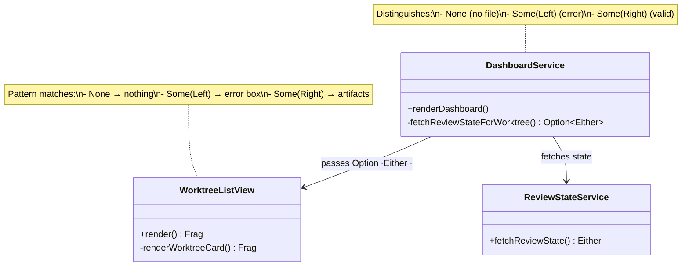
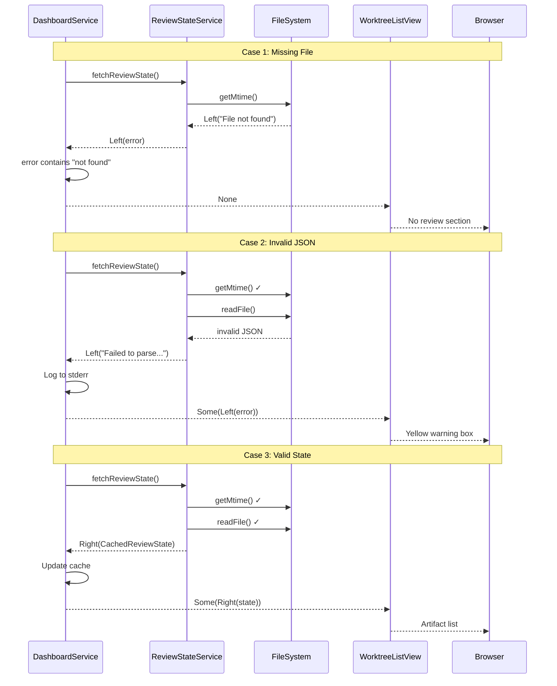
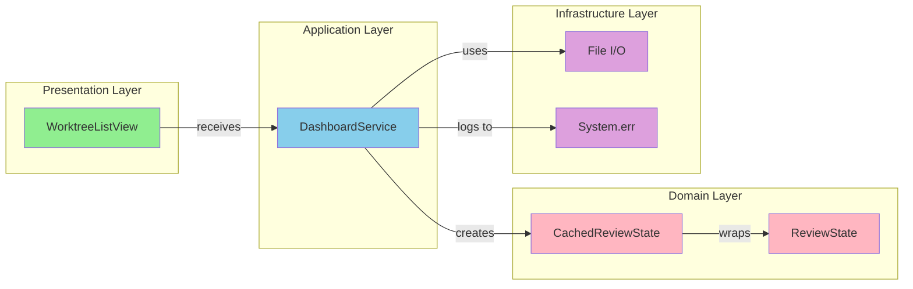

# Review Packet: Phase 6 - Graceful Error Handling

**Issue:** #46 - Dashboard: Display workflow review artifacts from state file
**Phase:** 6 of 6
**Story:** Missing or invalid state files handled gracefully

## Goals

This phase enhances error handling across the review artifacts feature to ensure:

1. **Error messages are user-friendly** - Don't leak implementation details or filesystem paths
2. **Partial failures are handled gracefully** - Some artifacts can fail while others work
3. **Logging provides debugging context** - Errors logged to stderr without breaking dashboard
4. **UI clearly distinguishes error states** - "no state" vs "invalid state" vs "valid state"
5. **Comprehensive testing** - All error scenarios validated with unit tests

## Scenarios

- [ ] Missing review-state.json shows no review section (no error)
- [ ] Invalid JSON syntax shows yellow warning box with "Review state unavailable"
- [ ] Valid state with artifacts displays all artifact links correctly
- [ ] Invalid state errors are logged to stderr with issueId context
- [ ] One broken worktree state doesn't break other worktrees
- [ ] Cache is only updated for valid states (not errors)

## Entry Points

| File | Method/Class | Why Start Here |
|------|--------------|----------------|
| `DashboardService.scala` | `fetchReviewStateForWorktree()` | Core logic for distinguishing error types and logging |
| `WorktreeListView.scala` | `renderWorktreeCard()` | UI pattern matching for error state rendering |
| `DashboardServiceTest.scala` | Test class | Validates error handling for missing/invalid states |
| `WorktreeListViewTest.scala` | Error handling tests | Validates UI rendering for all error cases |

## Diagrams

### Architecture Overview

```mermaid
graph TB
    subgraph "Error Flow"
        RSService[ReviewStateService] -->|Either[String, CachedReviewState]| DSFetch[fetchReviewStateForWorktree]
        DSFetch -->|File not found| None[None - No section]
        DSFetch -->|Parse error| Left[Some Left - Error message]
        DSFetch -->|Valid| Right[Some Right - Valid state]
    end

    subgraph "UI Rendering"
        None -->|Pattern match| NoRender[No review section]
        Left -->|Pattern match| ErrorBox[Yellow warning box]
        Right -->|Pattern match| ArtifactList[Artifact links]
    end

    subgraph "Side Effects"
        Left -->|System.err.println| Logging[Error logged]
        Right -->|Cache update| Cache[reviewStateCache]
    end
```

### Component Relationships



### Error Handling Sequence



### Layer Diagram (FCIS)



## Test Summary

| Test | Type | Verifies |
|------|------|----------|
| `fetchReviewStateForWorktree returns None when state file missing` | Unit | Missing file → None (no error) |
| `fetchReviewStateForWorktree returns Some(Left) when JSON invalid` | Unit | Parse error → Some(Left(error)) |
| `fetchReviewStateForWorktree returns Some(Right) for valid state` | Unit | Valid file → Some(Right(cached)) |
| `renderDashboard logs invalid JSON errors without crashing` | Unit | Logging doesn't break rendering |
| `Cache not updated when state is invalid` | Unit | Only valid states update cache |
| `render with None shows no review section` | Unit | None → no review-artifacts |
| `render with Some(Left(error)) shows error message` | Unit | Error → yellow warning box |
| `render error message has correct CSS classes` | Unit | .review-error, .review-error-message, .review-error-detail |
| `render with Some(Right(state)) and artifacts shows artifact list` | Unit | Valid → artifact links |
| `render with Some(Right(state)) and empty artifacts shows nothing` | Unit | Empty artifacts → no section |
| `Error message does not leak filesystem paths` | Unit | Security - no path leakage |

## Files Changed

5 files changed, +367 insertions, -108 deletions

<details>
<summary>Full file list</summary>

- `.iw/core/DashboardService.scala` (M) - Return type change, error logging, CSS
- `.iw/core/WorktreeListView.scala` (M) - Type signature, pattern matching, error rendering
- `.iw/core/test/DashboardServiceTest.scala` (M) - 5 new error handling tests
- `.iw/core/test/WorktreeListViewTest.scala` (M) - 6 new error rendering tests
- `project-management/issues/46/phase-06-tasks.md` (M) - Checkbox updates

</details>

## Key Changes Summary

### 1. Return Type Enhancement

**Before:** `Option[CachedReviewState]`
- Missing file → None
- Invalid file → None (error silently swallowed)
- Valid file → Some(cached)

**After:** `Option[Either[String, CachedReviewState]]`
- Missing file → None (clean, normal case)
- Invalid file → Some(Left(error)) (error visible to UI)
- Valid file → Some(Right(cached))

### 2. Error Logging

Added `System.err.println` for invalid JSON errors:
```
[WARN] Failed to load review state for IWLE-123: Failed to parse review state JSON: unexpected token
```

### 3. UI Error Display

Pattern matching in WorktreeListView:
- `None` → No review section rendered
- `Some(Left(error))` → Yellow warning box with "Review state unavailable"
- `Some(Right(state))` → Normal artifact list (if artifacts non-empty)

### 4. CSS Additions

```css
.review-error { background-color: #fff3cd; border-left: 4px solid #ffc107; }
.review-error-message { font-weight: bold; color: #856404; }
.review-error-detail { font-size: 0.9em; color: #856404; }
```
