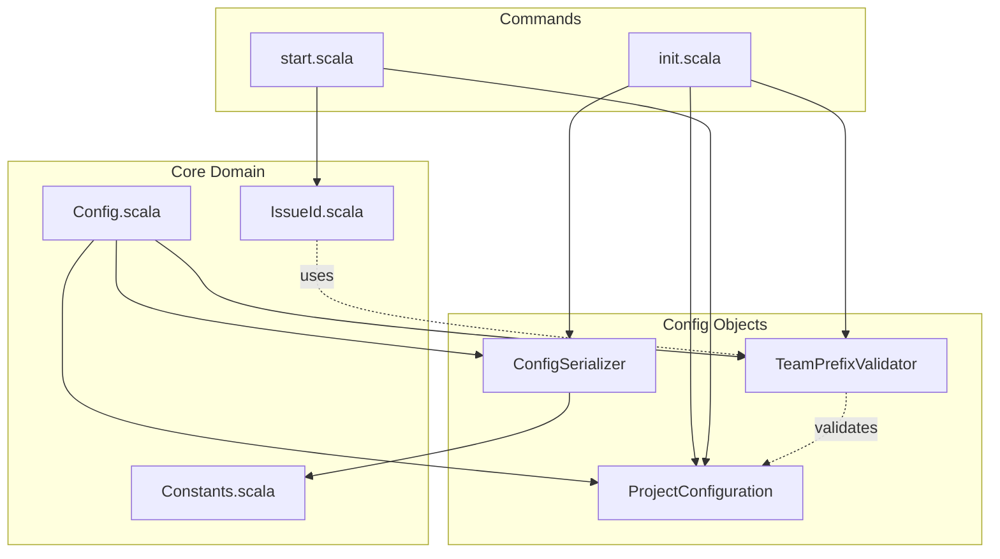
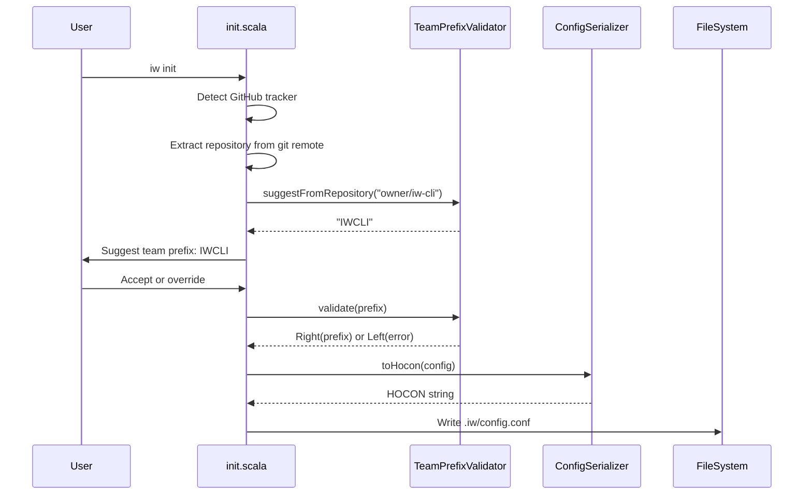
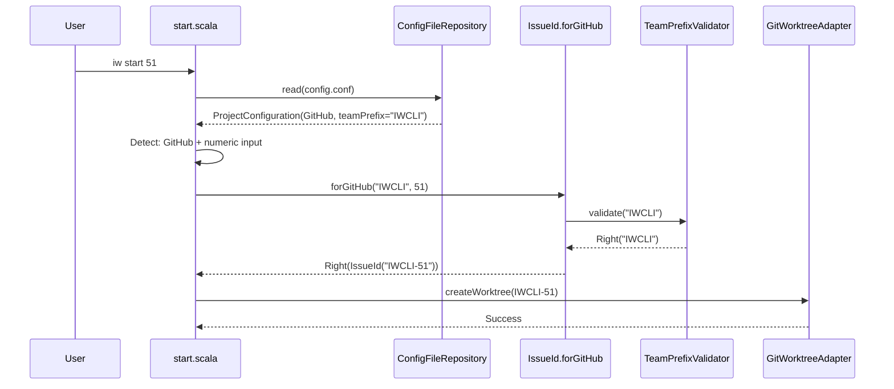
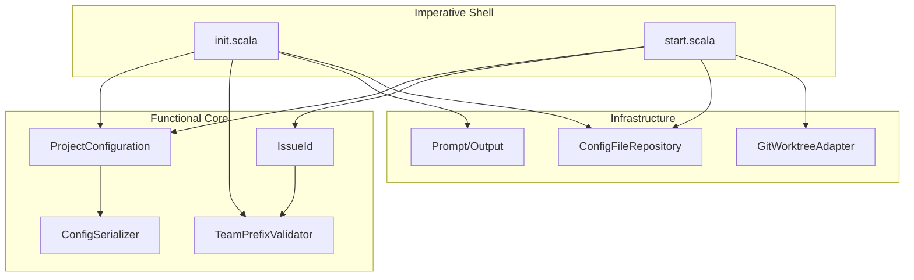

# Review Packet: Phase 1 - Configure team prefix for GitHub projects

**Issue:** #51
**Phase:** 1 of 3
**Branch:** `51-phase-01`

## Goals

Enable GitHub projects to configure a team prefix so that issue branches follow the unified `TEAM-NNN` format (e.g., `IWCLI-51`) instead of bare numeric format (e.g., `51`).

This phase establishes the foundation for the unified branch naming convention across all tracker types (Linear, YouTrack, and GitHub).

**Key Deliverables:**
- Add `teamPrefix` field to `ProjectConfiguration` for GitHub tracker
- Create `TeamPrefixValidator` with validation (2-10 uppercase letters) and suggestion logic
- Add `IssueId.forGitHub(prefix, number)` factory method
- Update `iw init` to prompt for and validate team prefix for GitHub projects
- Update `iw start` to apply team prefix when given numeric input for GitHub projects

## Scenarios

- [ ] User runs `iw init` with GitHub tracker and is prompted for team prefix
- [ ] User runs `iw init --tracker=github --team-prefix=IWCLI` and config is created with prefix
- [ ] Invalid team prefix (lowercase, too short, too long) is rejected during init
- [ ] Team prefix is suggested from repository name (e.g., `iw-cli` → `IWCLI`)
- [ ] User runs `iw start 51` with GitHub config and branch `IWCLI-51` is created
- [ ] User runs `iw start IWCLI-51` with GitHub config and it works (existing parse path)
- [ ] Linear and YouTrack configs continue to work without team prefix (no regression)

## Entry Points

| File | Method/Class | Why Start Here |
|------|--------------|----------------|
| `.iw/core/Config.scala` | `TeamPrefixValidator` | Core validation logic - validates format and suggests prefix from repository |
| `.iw/core/Config.scala` | `ConfigSerializer.fromHocon` | Deserializes config and enforces teamPrefix requirement for GitHub |
| `.iw/core/IssueId.scala` | `IssueId.forGitHub` | Factory method that composes TEAM-NNN format from prefix and number |
| `.iw/commands/init.scala` | `init()` (lines 82-125) | GitHub-specific flow: prompts for prefix, validates, stores in config |
| `.iw/commands/start.scala` | `start()` (lines 26-32) | Applies team prefix for numeric GitHub inputs |

## Diagrams

### Component Relationships



### Data Flow: `iw init` with GitHub



### Data Flow: `iw start 51` with GitHub



### Layer Diagram (FCIS)



## Test Summary

| Test | Type | Verifies |
|------|------|----------|
| `TeamPrefixValidator accepts valid uppercase prefix` | Unit | Validates "IWCLI" is accepted |
| `TeamPrefixValidator rejects lowercase prefix` | Unit | Validates "iwcli" is rejected with clear error |
| `TeamPrefixValidator rejects too short prefix` | Unit | Validates single-char prefix is rejected |
| `TeamPrefixValidator rejects too long prefix` | Unit | Validates 11+ char prefix is rejected |
| `TeamPrefixValidator rejects prefix with numbers` | Unit | Validates "IW2CLI" is rejected |
| `TeamPrefixValidator rejects prefix with special chars` | Unit | Validates "IW-CLI" is rejected |
| `TeamPrefixValidator suggests prefix from repository` | Unit | "iterative-works/iw-cli" → "IWCLI" |
| `TeamPrefixValidator truncates long suggestions` | Unit | Long repo names truncated to 10 chars |
| `ConfigSerializer requires teamPrefix for GitHub` | Unit | GitHub config without teamPrefix fails |
| `ConfigSerializer validates teamPrefix format` | Unit | Invalid formats rejected during parse |
| `ConfigSerializer round-trip for GitHub config` | Unit | Serialize/deserialize preserves all fields |
| `ConfigSerializer omits teamPrefix for Linear` | Unit | No regression - Linear config unchanged |
| `ConfigSerializer omits teamPrefix for YouTrack` | Unit | No regression - YouTrack config unchanged |
| `IssueId.forGitHub creates TEAM-NNN format` | Unit | forGitHub("IWCLI", 51) → "IWCLI-51" |
| `IssueId.forGitHub validates prefix` | Unit | Invalid prefix returns Left with error |
| `IssueId.forGitHub extracts correct team` | Unit | Created ID has correct team property |
| `init with GitHub prompts for team prefix` | E2E | Interactive prompt appears for GitHub |
| `init with --team-prefix flag` | E2E | Flag bypasses prompt, validates format |
| `init rejects invalid team prefix` | E2E | Error message shown, exit 1 |
| `init suggests prefix from repository` | E2E | Suggestion derived from repo name |
| `start creates team-prefixed branch` | E2E | `iw start 51` → branch IWCLI-51 |
| `start with full format still works` | E2E | `iw start IWCLI-51` works as before |

## Files Changed

**10 files changed**, +787 insertions, -188 deletions

<details>
<summary>Full file list</summary>

- `.iw/core/Constants.scala` (M) - Added `TrackerTeamPrefix` config key
- `.iw/core/Config.scala` (M) - Added `teamPrefix` field, `TeamPrefixValidator`, updated serialization
- `.iw/core/IssueId.scala` (M) - Added `IssueId.forGitHub` factory method
- `.iw/commands/init.scala` (M) - Added team prefix prompt and validation for GitHub
- `.iw/commands/start.scala` (M) - Added logic to apply team prefix for numeric inputs
- `.iw/core/test/ConfigTest.scala` (M) - Added 17 tests for team prefix validation and serialization
- `.iw/core/test/IssueIdTest.scala` (M) - Added 12 tests for `IssueId.forGitHub` factory
- `.iw/test/init.bats` (M) - Added 7 E2E tests for init with team prefix
- `.iw/test/start.bats` (M) - Added 4 E2E tests for start with team prefix
- `project-management/issues/51/phase-01-tasks.md` (M) - Task checkboxes updated

</details>

## Key Implementation Details

### TeamPrefixValidator

```scala
object TeamPrefixValidator:
  private val ValidPattern = """^[A-Z]{2,10}$""".r

  def validate(prefix: String): Either[String, String]
  def suggestFromRepository(repository: String): String
```

- Validates: uppercase letters only, 2-10 characters
- Suggestion: extracts repo name, removes hyphens, uppercases, truncates to 10 chars

### IssueId.forGitHub

```scala
def forGitHub(teamPrefix: String, number: Int): Either[String, IssueId] =
  TeamPrefixValidator.validate(teamPrefix) match
    case Left(err) => Left(err)
    case Right(validPrefix) =>
      val composed = s"$validPrefix-$number"
      parse(composed)  // Validate through existing pattern
```

### Start Command Logic

```scala
val issueIdResult = (config.trackerType, config.teamPrefix) match
  case (IssueTrackerType.GitHub, Some(prefix)) if rawIssueId.matches("^[0-9]+$") =>
    IssueId.forGitHub(prefix, rawIssueId.toInt)
  case _ =>
    IssueId.parse(rawIssueId)
```

## Backward Compatibility

- **Linear configs**: Unchanged - no teamPrefix field, uses existing `team` field
- **YouTrack configs**: Unchanged - no teamPrefix field, uses existing `team` field
- **Existing GitHub branches**: Still work via `IssueId.parse` path (e.g., `IWCLI-51` input)
- **Numeric branches**: Still parsed by `fromBranch` (Phase 3 will remove this)

## Notes for Reviewers

1. **Focus areas**: Validation logic in `TeamPrefixValidator`, serialization in `ConfigSerializer`
2. **Test coverage**: 29 new unit tests + 11 new E2E tests
3. **No breaking changes**: All existing functionality preserved
4. **Phase 2 dependency**: This phase creates the foundation; Phase 2 adds parsing support
