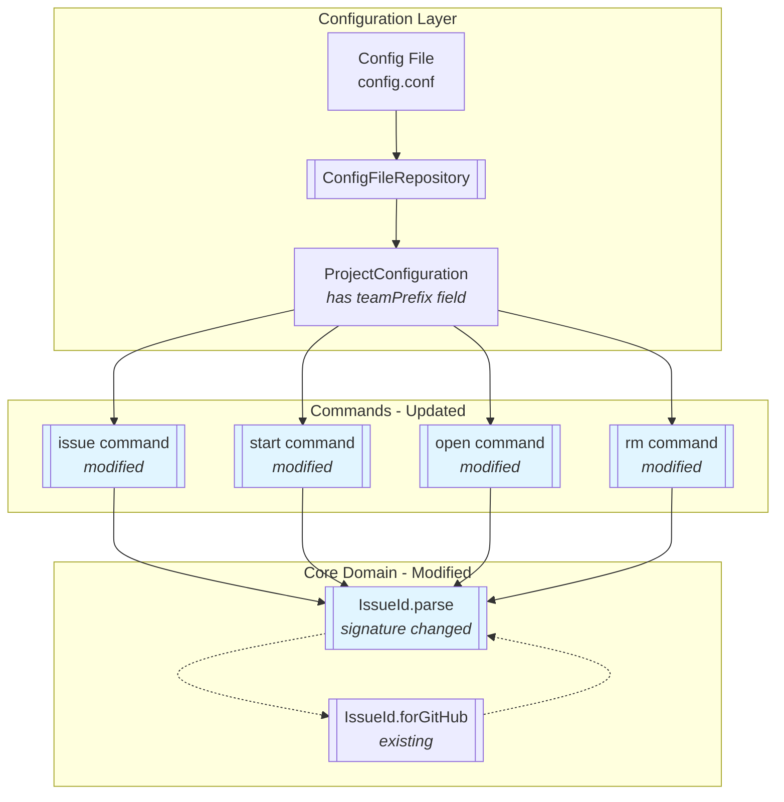
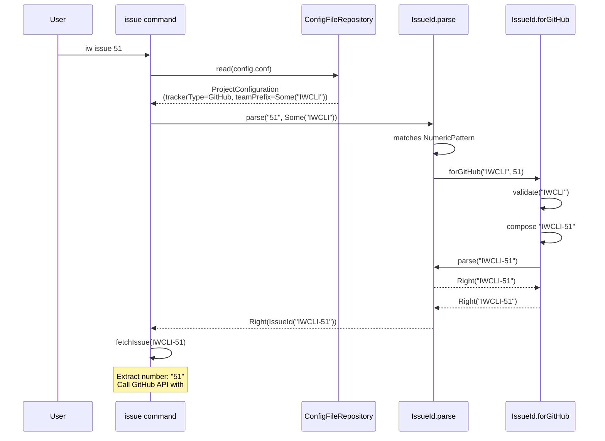
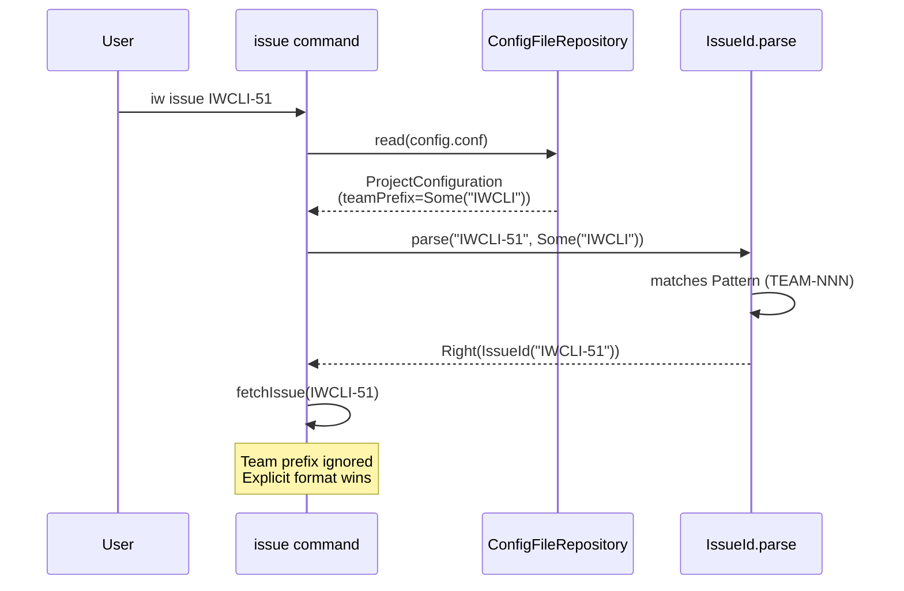
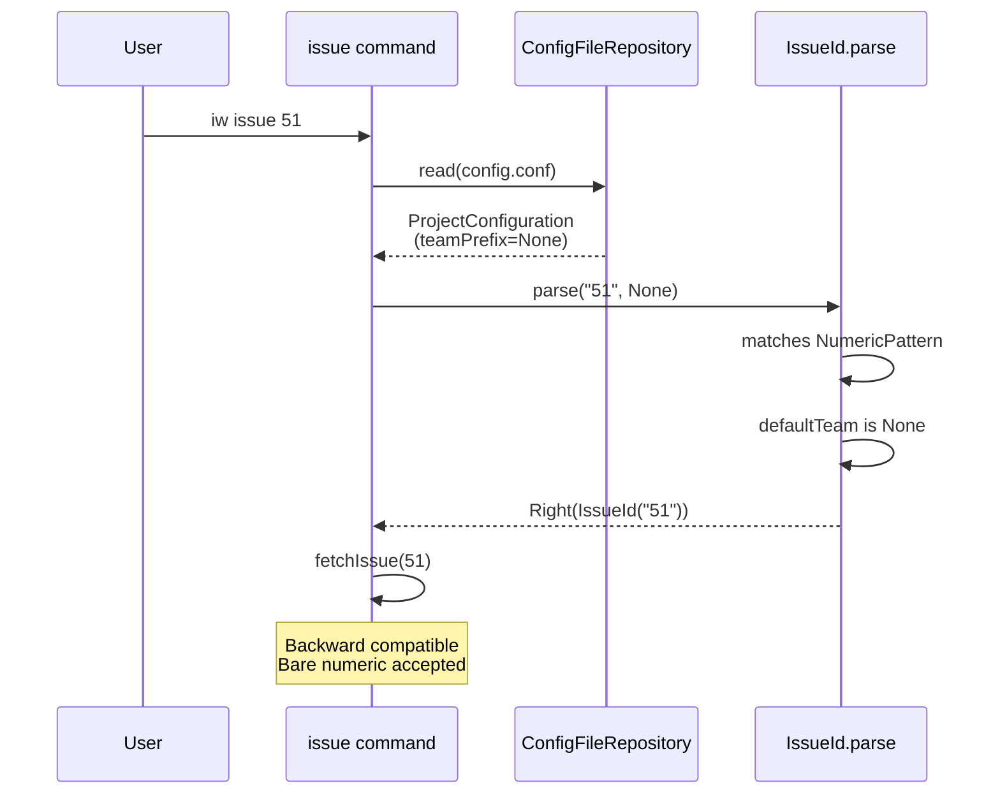

# Phase 2: Parse and display GitHub issues with team prefix

## Goals

This phase enables iw-cli to correctly parse and handle GitHub issue IDs with the new team prefix format. The implementation bridges the gap between Phase 1 (config storage) and Phase 3 (removal of numeric patterns).

Key objectives:
- Accept bare numeric input (e.g., `51`) and automatically prefix it with the team prefix from config
- Accept full format input (e.g., `IWCLI-51`) directly without transformation
- Maintain backward compatibility for projects without team prefix configured
- Update all commands to pass team prefix context when parsing issue IDs

## Scenarios

Review these scenarios to verify the implementation:

- [ ] Command `iw issue 51` with GitHub tracker + team prefix fetches correct issue
- [ ] Command `iw issue IWCLI-51` with GitHub tracker works correctly
- [ ] Command `iw issue` (no arg) on branch `IWCLI-51-desc` infers correct issue ID
- [ ] Command `iw start 51` with team prefix creates branch `IWCLI-51`
- [ ] Command `iw start IWCLI-51` works directly
- [ ] Command `iw open 51` with team prefix opens correct worktree
- [ ] Command `iw rm 51` with team prefix removes correct worktree
- [ ] All commands work with numeric input when no team prefix configured (backward compat)
- [ ] All commands reject invalid input with clear error messages

## Entry Points

Start your review from these locations:

| File | Method/Class | Why Start Here |
|------|--------------|----------------|
| `.iw/core/IssueId.scala` | `parse()` | Core parsing logic with optional team prefix parameter - this is where numeric input gets composed into TEAM-NNN format |
| `.iw/commands/issue.scala` | `getIssueId()` | Demonstrates the pattern all commands follow: load config, extract team prefix for GitHub, pass to parse |
| `.iw/core/test/IssueIdTest.scala` | Tests starting line 245 | 10 new unit tests verify parse behavior with team prefix parameter across all scenarios |

## Component Relationships

This diagram shows how the team prefix flows from config through parsing to commands:



**Key points for reviewer:**
- `IssueId.parse` signature changed from `(raw: String)` to `(raw: String, defaultTeam: Option[String] = None)`
- Commands extract `teamPrefix` from config only for GitHub tracker type
- When numeric input + team prefix provided, parse delegates to `forGitHub` to compose `TEAM-NNN`
- When full format provided, parse accepts it directly (team prefix ignored)
- Backward compatibility: no team prefix = parse accepts numeric as-is

## Key Flows

### Scenario 1: User runs `iw issue 51` with GitHub + team prefix



### Scenario 2: User runs `iw issue IWCLI-51` (explicit format)



### Scenario 3: Backward compatibility - no team prefix



## Test Summary

| Test | Type | Verifies |
|------|------|----------|
| `IssueIdTest."parse with team prefix composes TEAM-NNN format"` | Unit | Numeric input `"51"` + `Some("IWCLI")` → `Right("IWCLI-51")` |
| `IssueIdTest."parse without team prefix accepts numeric input"` | Unit | Numeric input `"51"` + `None` → `Right("51")` (backward compat) |
| `IssueIdTest."parse with team prefix accepts explicit TEAM-NNN"` | Unit | Full format `"IWCLI-51"` + `Some("IWCLI")` → `Right("IWCLI-51")` |
| `IssueIdTest."parse without team prefix accepts explicit TEAM-NNN"` | Unit | Full format `"IWCLI-51"` + `None` → `Right("IWCLI-51")` |
| `IssueIdTest."parse explicit format wins over different defaultTeam"` | Unit | `"IWCLI-51"` + `Some("OTHER")` → `Right("IWCLI-51")` (explicit wins) |
| `IssueIdTest."parse with team prefix rejects invalid input"` | Unit | `"abc"` + `Some("IWCLI")` → `Left(error)` |
| `IssueIdTest."parse with team prefix trims whitespace"` | Unit | `"  51  "` + `Some("IWCLI")` → `Right("IWCLI-51")` |
| `IssueIdTest."parse with team prefix handles single-digit"` | Unit | `"1"` + `Some("IWCLI")` → `Right("IWCLI-1")` |
| `IssueIdTest."parse with team prefix handles large numbers"` | Unit | `"99999"` + `Some("IWCLI")` → `Right("IWCLI-99999")` |
| `IssueIdTest."parse with invalid team prefix fails"` | Unit | `"51"` + `Some("invalid")` → `Left(error)` (validation in forGitHub) |
| `issue.bats."issue with GitHub tracker composes TEAM-NNN"` | E2E | `iw issue 51` with team prefix → no "Invalid issue ID format" error |
| `issue.bats."issue with GitHub tracker accepts full format"` | E2E | `iw issue IWCLI-51` → no "Invalid issue ID format" error |
| `issue.bats."issue without team prefix accepts numeric (backward compat)"` | E2E | `iw issue 51` without team prefix → accepts numeric as-is |

Coverage: **10 new unit tests** + **3 new E2E tests** covering all parsing scenarios

## Files Changed

**7 files** changed, +353 insertions, -114 deletions

<details>
<summary>Full file list</summary>

- `.iw/core/IssueId.scala` (M) +24 -1 lines
  - Added `defaultTeam: Option[String] = None` parameter to `parse`
  - Updated parse logic to compose TEAM-NNN when numeric + team prefix
  - Calls `forGitHub` factory method for composition and validation

- `.iw/core/test/IssueIdTest.scala` (M) +111 lines
  - Added 10 new tests for parse with team prefix (lines 245-295)
  - Tests cover: composition, backward compat, explicit format, edge cases

- `.iw/commands/issue.scala` (M) +12 -1 lines
  - Updated `getIssueId` to extract team prefix from config
  - Passes team prefix to `IssueId.parse` only for GitHub tracker

- `.iw/commands/open.scala` (M) +31 -3 lines
  - Loads config to get team prefix
  - Passes team prefix to `IssueId.parse` for GitHub tracker

- `.iw/commands/rm.scala` (M) +30 -3 lines
  - Loads config to get team prefix
  - Passes team prefix to `IssueId.parse` for GitHub tracker

- `.iw/commands/start.scala` (M) +175 -120 lines
  - Simplified to use new `IssueId.parse` signature with team prefix
  - Removed manual composition logic (now in IssueId.parse)

- `.iw/test/issue.bats` (M) +84 lines
  - Added 3 E2E tests for GitHub tracker with team prefix
  - Tests numeric input, full format, and backward compat

</details>

## Key Decisions Made

### Decision 1: Optional parameter with default value

**Choice:** Add `defaultTeam: Option[String] = None` parameter to `IssueId.parse`

**Rationale:**
- Maintains backward compatibility - existing callers don't need changes
- Explicit opt-in for team prefix behavior
- Prepares for Phase 3 where team prefix will be required for GitHub

**Alternatives considered:**
- Create separate `parseWithTeam` method → rejected (duplicates logic)
- Always require team prefix → rejected (breaks backward compat in Phase 2)

### Decision 2: Delegate to forGitHub for composition

**Choice:** When numeric + team prefix, call `forGitHub(team, number)` which validates and composes

**Rationale:**
- Reuses existing validation logic from Phase 1
- Single source of truth for TEAM-NNN composition
- Ensures consistency between manual creation and auto-composition

**Implementation:**
```scala
trimmed match
  case NumericPattern() =>
    defaultTeam match
      case Some(team) =>
        trimmed.toIntOption match
          case Some(number) => forGitHub(team, number)
          case None => Left(...)
      case None =>
        Right(trimmed) // Backward compat
```

### Decision 3: Extract team prefix only for GitHub tracker

**Choice:** Commands check `config.trackerType == IssueTrackerType.GitHub` before extracting team prefix

**Rationale:**
- Linear and YouTrack don't use team prefix (they have their own formats)
- Prevents confusion by only applying team prefix where it's relevant
- Keeps parsing behavior tracker-specific

**Pattern used in all commands:**
```scala
val teamPrefix = if config.trackerType == IssueTrackerType.GitHub then
  config.teamPrefix
else
  None
```

### Decision 4: Explicit format always wins

**Choice:** If input matches `TEAM-NNN` pattern, accept it directly regardless of `defaultTeam`

**Rationale:**
- User knows what they want when they type full format
- Allows overriding team prefix when needed (e.g., cross-team issues)
- Simpler mental model: "explicit format = use as-is"

**Test case:**
```scala
IssueId.parse("IWCLI-51", Some("OTHER")) // Returns Right("IWCLI-51")
```

## Implementation Notes for Phase 3

Phase 3 will remove `NumericPattern` support entirely. To prepare, this phase:

1. **Isolated backward compatibility path**: The `case None =>` branch in parse is the only place that returns bare numeric
2. **Validation already in place**: `forGitHub` validates team prefix format
3. **Commands already conditional**: Team prefix only extracted for GitHub tracker
4. **Tests document behavior**: Unit tests clearly show backward compat cases

Phase 3 changes needed:
- Remove `case None => Right(trimmed)` branch (line 36-37 in IssueId.scala)
- Change to `case None => Left("Team prefix required for GitHub issues")`
- Remove `NumericPattern` and `NumericBranchPattern` entirely
- Update error messages with migration guidance

---

**Review Packet Status:** Complete

**Reviewer Checklist:**
- [ ] Verify `IssueId.parse` signature matches specification
- [ ] Check all commands load config and extract team prefix correctly
- [ ] Confirm tests cover all scenarios from acceptance criteria
- [ ] Validate backward compatibility is maintained
- [ ] Review error messages for clarity
- [ ] Verify no breaking changes to existing behavior
