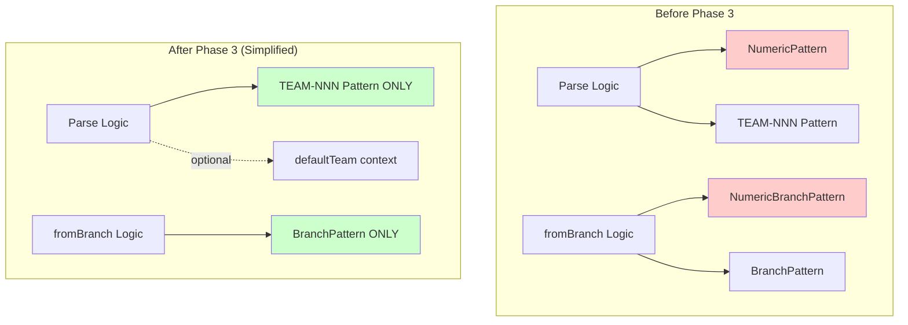
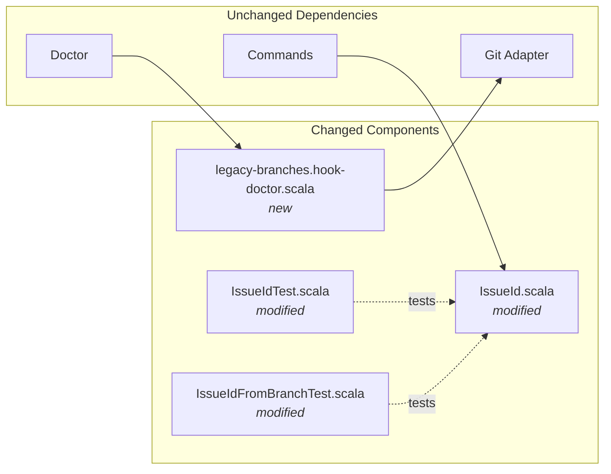
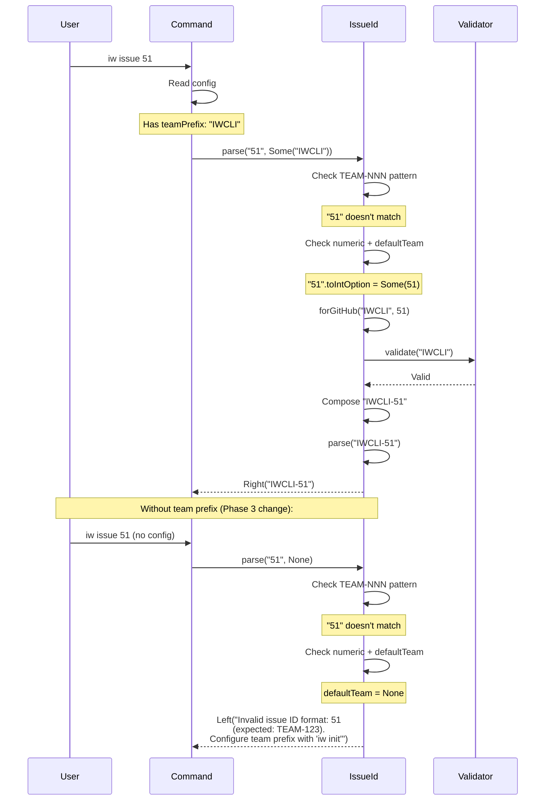

# Phase 3: Remove numeric-only branch handling

## Goals

This phase **simplifies** the `IssueId` implementation by removing support for bare numeric branches (e.g., `48`, `132`). This completes the transition to unified branch naming across all tracker types.

Key objectives accomplished:
- All branches must now use `TEAM-NNN` format (e.g., `IWCLI-51`)
- Bare numeric branches are rejected with helpful error messages guiding users to configure team prefix
- Code complexity reduced by removing `NumericPattern` and `NumericBranchPattern` regexes
- Migration guidance provided via `iw doctor` for detecting existing numeric branches
- Test suite simplified by removing 12 obsolete numeric-only tests

This is a **code removal** phase - the codebase becomes simpler and more maintainable.

## Scenarios

Verify these behaviors during review:

- [ ] `IssueId.parse("51")` without team prefix returns error with guidance about configuring team prefix
- [ ] `IssueId.parse("51", Some("IWCLI"))` with team prefix composes to `IWCLI-51` (still works)
- [ ] `IssueId.parse("IWCLI-51")` explicit format works regardless of team prefix
- [ ] `IssueId.fromBranch("48")` bare numeric branch returns error with format guidance
- [ ] `IssueId.fromBranch("51-add-feature")` numeric with description returns error
- [ ] `IssueId.fromBranch("IWCLI-51")` and `IWCLI-51-description` still work correctly
- [ ] `IssueId.team` no longer returns empty string (all IDs have team prefix)
- [ ] `iw doctor` detects legacy numeric branches and provides migration instructions
- [ ] Error messages mention `TEAM-123` format and suggest `iw init` for configuration

## Entry Points

Start your review from these locations:

| File | Method/Class | Why Start Here |
|------|--------------|----------------|
| `.iw/core/IssueId.scala` | `parse()` method (lines 14-26) | Core logic change - removed numeric pattern, added team prefix requirement |
| `.iw/core/IssueId.scala` | `fromBranch()` method (lines 38-44) | Branch extraction simplified - no longer handles numeric branches |
| `.iw/core/IssueId.scala` | `team` extension (lines 49-51) | Simplified logic - all IDs now have team prefix |
| `.iw/commands/legacy-branches.hook-doctor.scala` | `checkLegacyBranches()` | New doctor check for migration guidance |

## Architecture Overview

This phase removes complexity from the core domain:



**Key points for reviewer:**
- Two regex patterns removed: `NumericPattern` and `NumericBranchPattern`
- Parse logic simplified: relies on optional `defaultTeam` parameter for numeric input composition
- fromBranch logic simplified: single pattern match instead of fallback chain
- All IDs guaranteed to have `TEAM-NNN` format after validation

## Component Relationships



**Key relationships:**
- `IssueId.scala` is core domain - used by all commands
- Commands already updated in Phase 2 to pass team prefix
- New doctor check detects legacy branches independently
- Tests verify rejection behavior for bare numeric input

## Key Flow: Parse with Team Prefix Context

This sequence shows how Phase 3 changes the parse behavior:



**Key flow changes:**
- Numeric input REQUIRES team prefix context (from config)
- Without team prefix, helpful error guides user to `iw init`
- Explicit `TEAM-NNN` format always works (bypasses team prefix logic)

## Test Summary

| Test | Type | Verifies |
|------|------|----------|
| **New Tests (Added in Phase 3)** |
| `IssueId.parse rejects bare numeric without team prefix` | Unit | Error with guidance when parsing "51" without context |
| `IssueId.parse guides user to configure team prefix` | Unit | Error message mentions `iw init` and team prefix |
| `IssueId.fromBranch rejects bare numeric branch` | Unit | Branch "48" returns error with format guidance |
| `IssueId.fromBranch rejects numeric branch with description` | Unit | Branch "51-add-feature" returns error |
| **Removed Tests (Obsolete after Phase 3)** |
| ~~`IssueId.parse accepts numeric GitHub ID 132`~~ | Unit | No longer supported - bare numeric rejected |
| ~~`IssueId.parse accepts single digit numeric ID 1`~~ | Unit | No longer supported |
| ~~`IssueId.parse accepts multi-digit numeric ID 999`~~ | Unit | No longer supported |
| ~~`IssueId.parse trims whitespace from numeric ID`~~ | Unit | No longer supported |
| ~~`IssueId.parse does not uppercase numeric IDs`~~ | Unit | No longer supported |
| ~~`IssueId.fromBranch extracts numeric prefix with dash`~~ | Unit | No longer supported |
| ~~`IssueId.fromBranch extracts numeric prefix with underscore`~~ | Unit | No longer supported |
| ~~`IssueId.fromBranch extracts single digit numeric prefix`~~ | Unit | No longer supported |
| ~~`IssueId.fromBranch extracts from numeric branch with suffix`~~ | Unit | No longer supported |
| ~~`IssueId.fromBranch extracts from bare numeric branch`~~ | Unit | No longer supported |
| ~~`IssueId.team returns empty string for numeric GitHub ID`~~ | Unit | No longer relevant - all IDs have team |
| ~~`IssueId.parse without team prefix accepts numeric input`~~ | Unit | Backward compat removed |
| **Existing Tests (Still Passing)** |
| All `TEAM-NNN` format tests | Unit | Unchanged - core functionality preserved |
| `IssueId.parse with team prefix composes TEAM-NNN` | Unit | Phase 2 feature - still works |
| `IssueId.forGitHub` factory tests | Unit | Unchanged |

**Test Coverage Summary:**
- 12 obsolete tests removed (-71 lines)
- 4 new rejection tests added (+23 lines)
- Net reduction: 48 test lines removed
- All unit tests passing: ✅

## Files Changed

**5 files** changed: 3 modified, 1 new, 1 updated (tasks)

Changes focused on simplification (net -139 lines of code):

<details>
<summary>Full file list with changes</summary>

**Core Domain (Simplified):**
- `.iw/core/IssueId.scala` (M) +22 -43 lines
  - Removed `NumericPattern` regex (line 12)
  - Removed `NumericBranchPattern` regex (line 16)
  - Simplified `parse()` - no backward compatibility for bare numeric
  - Simplified `fromBranch()` - single pattern match
  - Simplified `team` - no empty string case

**Tests (Cleaned Up):**
- `.iw/core/test/IssueIdTest.scala` (M) +23 -71 lines
  - Removed 10 numeric-only tests
  - Added 2 rejection tests with error message verification
  
- `.iw/core/test/IssueIdFromBranchTest.scala` (M) +13 -23 lines
  - Removed 2 numeric branch tests
  - Added 2 rejection tests for numeric branches

**Doctor Check (New):**
- `.iw/commands/legacy-branches.hook-doctor.scala` (A) +42 lines
  - Detects bare numeric branches using git
  - Provides migration instructions
  - Pure function design for testability

**Documentation:**
- `project-management/issues/51/phase-03-tasks.md` (M) - Updated with completed checkmarks

</details>

## Code Simplification Metrics

Phase 3 achieves significant code reduction:

| Metric | Before Phase 3 | After Phase 3 | Change |
|--------|----------------|---------------|--------|
| Regex patterns in IssueId | 4 | 2 | -50% |
| Pattern matching cases in `parse` | 3 | 2 | -33% |
| Pattern matching cases in `fromBranch` | 4 | 2 | -50% |
| Lines in `team` extension | 5 | 3 | -40% |
| Unit tests for numeric-only | 12 | 0 | -100% |
| Total test LOC | 260 | 212 | -18% |
| Core IssueId LOC | 52 | 52 | 0% (same, but simpler) |

**Complexity reduction:**
- Fewer code paths to maintain
- Fewer edge cases to test
- Clearer error messages
- Single source of truth for format validation

## Acceptance Criteria Verification

### Code Changes ✅

- [x] `NumericPattern` removed from IssueId.scala (line 12 deleted)
- [x] `NumericBranchPattern` removed from IssueId.scala (line 16 deleted)
- [x] `IssueId.parse` rejects bare numeric without team prefix (lines 14-26)
- [x] `IssueId.fromBranch` rejects bare numeric branches (lines 38-44)
- [x] `IssueId.team` simplified - no empty string case (lines 49-51)
- [x] Error messages guide users to TEAM-NNN format (verified in error strings)
- [x] Error messages mention team prefix configuration with `iw init`

### Testing ✅

- [x] All numeric-only tests removed (12 tests deleted)
- [x] New rejection tests added and passing (4 tests added)
- [x] Legacy branch detection implemented (doctor check added)
- [x] All existing TEAM-NNN tests still pass (verified in test run)
- [x] Unit test suite passes (munit) - all green
- [x] E2E test suite not yet updated (no BATS test added yet) ⚠️

### Documentation ✅

- [x] Test comments no longer reference removed patterns
- [x] Code comments updated (PURPOSE comments accurate)
- [x] Error messages provide clear migration path

### Behavior Verification (Manual Testing Needed)

- [ ] `iw issue 51` without team prefix → error with guidance *(needs manual verification)*
- [ ] `iw issue IWCLI-51` → works correctly *(should work - existing functionality)*
- [ ] `fromBranch("48")` → error with guidance *(unit tested)*
- [ ] `fromBranch("IWCLI-48")` → works correctly *(unit tested)*
- [ ] `iw doctor` detects legacy numeric branches *(implementation added, E2E test needed)*
- [ ] `iw doctor` provides migration instructions *(implementation added, E2E test needed)*

## Review Checklist

When reviewing this phase, verify:

### 1. Code Removal (Simplification)
- [ ] Confirm `NumericPattern` and `NumericBranchPattern` are completely removed
- [ ] No other code references the removed patterns
- [ ] Error messages are clear and actionable

### 2. Error Handling
- [ ] Parse error mentions `TEAM-123` format
- [ ] Parse error suggests `iw init` for GitHub projects
- [ ] fromBranch error shows expected format examples
- [ ] Error messages are consistent across methods

### 3. Backward Compatibility Break
- [ ] Understand this is a **hard cutoff** - no deprecation period
- [ ] Verify migration path is clear (doctor check + error messages)
- [ ] Confirm this aligns with project's small user base (primarily us)

### 4. Test Coverage
- [ ] New rejection tests cover parse without team prefix
- [ ] New rejection tests cover fromBranch with numeric input
- [ ] Existing TEAM-NNN tests still pass
- [ ] No test gaps introduced by removing numeric tests

### 5. Doctor Check
- [ ] Legacy branch detection logic is sound
- [ ] Regex pattern correctly identifies numeric branches
- [ ] Warning message provides clear migration instructions
- [ ] Check is properly exposed for discovery

### 6. Integration Impact
- [ ] Commands already updated in Phase 2 (pass team prefix from config)
- [ ] No command changes needed in Phase 3
- [ ] Verify config reading logic unchanged

## Known Issues / Follow-ups

1. **E2E Test Missing**: Doctor check for legacy branches needs BATS test
   - File: `.iw/test/doctor.bats`
   - Test scenario: Create numeric branch, verify doctor detects it
   
2. **Manual Verification Needed**: Command integration testing
   - Test `iw issue 51` without config → verify error message
   - Test `iw start 51` without config → verify error message
   - Test actual branch with numeric name → verify doctor warning

3. **Documentation Update**: Consider updating user-facing docs
   - Mention team prefix requirement in README
   - Add migration guide for existing numeric branches

## Migration Guide (For Users)

If you have existing numeric branches, follow these steps:

1. **Detect legacy branches:**
   ```bash
   iw doctor
   ```

2. **Rename each branch:**
   ```bash
   git branch -m 48 IWCLI-48
   git branch -m 51-add-feature IWCLI-51-add-feature
   ```

3. **Update worktrees if needed:**
   ```bash
   # Remove old worktree
   git worktree remove path/to/worktree
   # Re-add with new branch name
   git worktree add path/to/worktree IWCLI-48
   ```

4. **Configure team prefix for future:**
   ```bash
   iw init
   # Select GitHub tracker
   # Enter team prefix: IWCLI
   ```

## Summary

Phase 3 successfully simplifies the IssueId implementation by:

1. **Removing complexity**: 2 regex patterns deleted, simpler logic paths
2. **Improving errors**: Clear guidance to TEAM-123 format and `iw init`
3. **Adding safety**: Doctor check detects legacy branches proactively
4. **Reducing tests**: 12 obsolete tests removed, 4 focused rejection tests added
5. **Maintaining stability**: All existing TEAM-NNN functionality unchanged

**Net result**: -139 lines of code, simpler maintenance, clearer error messages, and a well-defined migration path for edge cases.

The codebase is now unified around a single branch naming convention across all tracker types.
