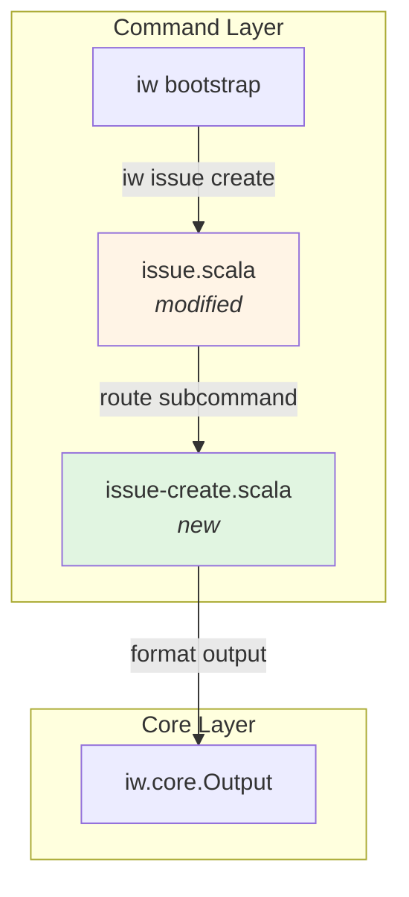

# Phase 1: Help display

## Goals

This phase implements the help display functionality for the new `iw issue create` command. It establishes the user-facing interface contract without implementing actual issue creation logic.

Key objectives:
- Create standalone command script at `.iw/commands/issue-create.scala`
- Display comprehensive help text when no arguments provided
- Handle `--help` and `-h` flags gracefully (exit 0)
- Show usage examples for both title-only and title+description scenarios
- Match style of existing commands (feedback.scala pattern)

## Scenarios

- [ ] User runs `iw issue create` without arguments and sees help text with exit code 1
- [ ] User runs `iw issue create --help` and sees help text with exit code 0
- [ ] User runs `iw issue create -h` and sees help text with exit code 0
- [ ] Help text includes `--title` flag documentation
- [ ] Help text includes `--description` flag documentation
- [ ] Help text includes usage examples showing both title-only and title+description
- [ ] Existing `iw issue` command continues to work (no regressions)

## Entry Points

Start your review from these locations:

| File | Method/Class | Why Start Here |
|------|--------------|----------------|
| `.iw/commands/issue-create.scala` | `issueCreate()` | Main entry point for new command, contains help logic |
| `.iw/commands/issue.scala` | `handleCreateSubcommand()` | Subcommand routing logic added to existing issue command |
| `.iw/test/issue-create.bats` | All tests | E2E tests verifying help display behavior |

## Component Relationships



**Key points for reviewer:**
- `issue.scala` now routes "create" subcommand to standalone handler
- `issue-create.scala` is minimal - only help display, no actual creation logic
- Pattern matches `feedback.scala` help implementation
- No external dependencies beyond `iw.core.Output`

## Key Flow: Help Display

```mermaid
sequenceDiagram
    participant User
    participant Bootstrap as iw bootstrap
    participant Issue as issue.scala
    participant Create as issue-create.scala
    
    User->>Bootstrap: iw issue create
    Bootstrap->>Issue: issue(args: "create")
    Issue->>Issue: detect "create" subcommand
    Issue->>Create: handleCreateSubcommand()
    
    alt has --help or -h flag
        Create->>Create: showHelp()
        Create->>User: help text
        Create->>User: exit(0)
    else no arguments or missing --title
        Create->>Create: showHelp()
        Create->>User: help text
        Create->>User: exit(1)
    end
```

**Key points for reviewer:**
- Subcommand routing happens early in `issue.scala`
- Help logic is simple: check for help flags or missing args
- Exit codes follow convention: 0 for --help, 1 for missing required args

## Test Summary

| Test | Type | Verifies |
|------|------|----------|
| `issue-create.bats:"without arguments shows help and exits 1"` | E2E | Help displayed when command run with no args, exit code 1 |
| `issue-create.bats:"--help shows usage and exits 0"` | E2E | --help flag triggers help with exit code 0 |
| `issue-create.bats:"-h shows usage and exits 0"` | E2E | -h short flag triggers help with exit code 0 |
| `issue-create.bats:"help text contains --title flag"` | E2E | Help documentation includes --title flag |
| `issue-create.bats:"help text contains --description flag"` | E2E | Help documentation includes --description flag |
| `issue-create.bats:"help text contains usage examples"` | E2E | Examples section present in help output |

Coverage: 6 new E2E tests for help display, all passing. Existing `issue.bats` tests (9 tests) continue to pass, verifying no regressions in issue fetching.

## Files Changed

**5 files** changed, +177 insertions, -53 deletions

<details>
<summary>Full file list</summary>

- `.iw/commands/issue-create.scala` (A) +28 lines - New standalone command for issue creation
- `.iw/commands/issue.scala` (M) +34 lines, -28 lines - Added subcommand routing for "create"
- `.iw/test/issue-create.bats` (A) +71 lines - E2E tests for help display
- `project-management/issues/IW-103/phase-01-tasks.md` (M) - Task tracking updates
- `project-management/issues/IW-103/review-state.json` (M) - Review state metadata

</details>

## Implementation Notes

**Design Decisions:**

1. **Standalone command file**: `issue-create.scala` is separate from `issue.scala` to keep concerns isolated. Future phases will add creation logic here.

2. **Subcommand routing in issue.scala**: The main `issue()` function now checks for "create" as first argument and delegates to `handleCreateSubcommand()`. This maintains backward compatibility (no args still tries to infer issue ID from branch).

3. **Placeholder implementation**: Phase 1 focuses solely on help display. The actual `--title` argument parsing and issue creation is deferred to Phase 2. This allows TDD approach where acceptance criteria can be verified before implementation.

4. **Help text style**: Follows the pattern from `feedback.scala` with clear sections: Usage, Arguments, Examples. Uses `println()` directly for output (consistent with existing commands).

**Potential concerns:**

- The duplication of help text between `issue.scala:showCreateHelp()` and `issue-create.scala:showHelp()` is intentional for Phase 1 but should be consolidated in future refactoring
- Exit code behavior is correct: `--help` exits 0, missing args exit 1
- No validation logic yet - all non-help invocations fall through to help display

**Testing coverage:**

- All 6 E2E scenarios from acceptance criteria are tested
- Existing issue command tests (9 tests) verify no regressions
- No unit tests in Phase 1 since there's no business logic yet (just help display)

