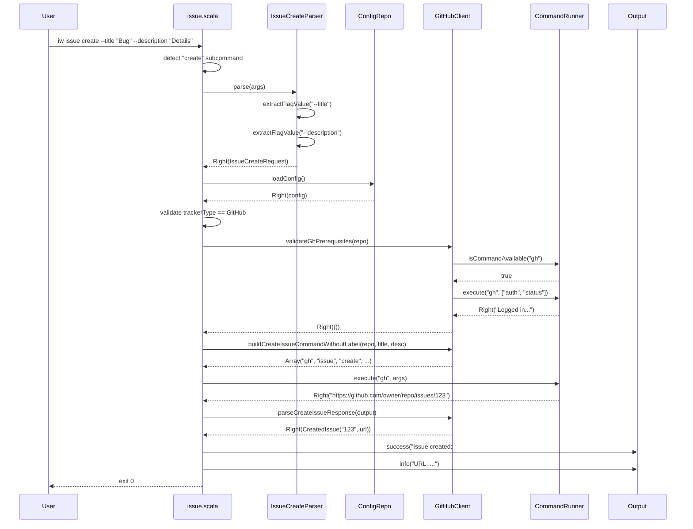

# Phase 2: GitHub Issue Creation

## Goals

This phase implements GitHub issue creation via the `iw issue create` command, enabling users to create issues from the command line with title and optional description.

Key objectives:
- Parse `--title` (required) and `--description` (optional) command-line arguments
- Create issues in configured GitHub repository using `gh` CLI
- Validate prerequisites (gh installed, authenticated, repository configured)
- Handle error cases gracefully with clear messages
- Support both title-only and title+description formats

## Scenarios

- [ ] User can create GitHub issue with title and description
- [ ] User can create GitHub issue with title only (no description)
- [ ] Command shows help and exits with code 1 when --title is missing
- [ ] Command shows help and exits with code 0 when --help flag is used
- [ ] Non-GitHub tracker shows "not yet supported" error message
- [ ] gh CLI not installed shows clear error message
- [ ] gh CLI not authenticated shows clear error message
- [ ] Missing repository configuration shows clear error message
- [ ] Created issue returns issue number and URL
- [ ] Multi-word titles and descriptions are handled correctly

## Entry Points

Start your review from these locations:

| File | Method/Class | Why Start Here |
|------|--------------|----------------|
| `.iw/commands/issue.scala` | `handleCreateSubcommand()` | Orchestrates the entire issue creation flow - argument parsing, config loading, validation, and issue creation |
| `.iw/core/IssueCreateParser.scala` | `parse()` | Core argument parsing logic that extracts --title and --description from command line |
| `.iw/core/IssueCreateParser.scala` | `extractFlagValue()` | Utility that handles multi-word flag values and flag detection |

## Component Relationships

This diagram shows how the new issue creation components integrate with existing infrastructure:

```mermaid
flowchart TB
    subgraph new["New Components"]
        ICP[IssueCreateParser<br/><i>new</i>]
        HCS[[handleCreateSubcommand<br/><i>new</i>]]
    end

    subgraph modified["Modified Components"]
        Issue[[issue.scala<br/><i>modified</i>]]
    end

    subgraph existing["Existing Infrastructure"]
        GHC[[GitHubClient]]
        CR[[CommandRunner]]
        CFG[(ConfigFileRepository)]
        OUT[Output]
    end

    Issue -->|routes "create" subcommand| HCS
    HCS -->|parses args| ICP
    HCS -->|loads config| CFG
    HCS -->|validates gh| GHC
    HCS -->|builds command| GHC
    HCS -->|executes gh| CR
    HCS -->|parses response| GHC
    HCS -->|displays result| OUT
```

**Key points for reviewer:**
- `handleCreateSubcommand()` at line 45 of issue.scala is the main entry point
- Parser is pure functional (no side effects) - returns Either[String, IssueCreateRequest]
- Reuses existing GitHubClient methods: `validateGhPrerequisites`, `buildCreateIssueCommandWithoutLabel`, `parseCreateIssueResponse`
- Command execution flows: parse → validate config → validate tracker → validate gh → build command → execute → parse response → display

## Key Flow: Issue Creation

This sequence shows the runtime flow for a successful issue creation:



**Key points for reviewer:**
- Error handling at each step (Left returns) - exits with code 1
- Validation happens before any external calls
- CommandRunner.execute wraps shell command execution
- Response parsing extracts issue number from GitHub URL using regex
- Multi-word values handled in extractFlagValue using takeWhile(!_.startsWith("--"))

## Test Summary

| Test | Type | Verifies |
|------|------|----------|
| `IssueCreateParserTest.parse_TitleOnly` | Unit | Parser handles --title flag without description |
| `IssueCreateParserTest.parse_TitleWithDescription` | Unit | Parser handles both --title and --description flags |
| `IssueCreateParserTest.parse_MissingTitle` | Unit | Parser returns Left error when --title is missing |
| `IssueCreateParserTest.parse_EmptyArgs` | Unit | Parser returns Left error for empty arguments |
| `IssueCreateParserTest.parse_MultiWordTitle` | Unit | Multi-word title values are joined with spaces |
| `IssueCreateParserTest.parse_MultiWordDescription` | Unit | Multi-word description values are joined with spaces |
| `IssueCreateParserTest.parse_ReversedFlagOrder` | Unit | Parser works regardless of flag order |
| `IssueCreateParserTest.parse_EmptyDescriptionFlag` | Unit | --description flag with no value returns Some("") |
| `issue create without arguments shows help` | E2E | Missing arguments triggers help display and exit 1 |
| `issue create --help shows usage` | E2E | --help flag displays usage and exits 0 |
| `issue create -h shows usage` | E2E | -h short flag displays usage and exits 0 |
| `issue create help text contains --title flag` | E2E | Help text documents --title flag |
| `issue create help text contains --description flag` | E2E | Help text documents --description flag |
| `issue create help text contains usage examples` | E2E | Help text includes examples section |
| `issue create with title and description succeeds` | E2E | Full creation flow with mocked gh CLI |
| `issue create with title only succeeds` | E2E | Creation works without --description flag |
| `issue create without title shows help` | E2E | Missing --title triggers help and exit 1 |
| `issue create for non-GitHub tracker shows not supported` | E2E | Linear/GitLab/YouTrack show "not yet supported" |

Coverage: 18 tests (8 unit + 10 E2E) covering:
- Argument parsing with all edge cases
- Help display and exit codes
- Full GitHub issue creation flow
- Error cases (missing title, non-GitHub tracker)
- Multi-word argument handling

## Files Changed

**4 files** changed, +165 insertions, -24 deletions

<details>
<summary>Full file list</summary>

- `.iw/commands/issue.scala` (M) +53 -24 lines
  - Added `handleCreateSubcommand()` function (lines 45-114)
  - Added `showCreateHelp()` function (lines 116-128)
  - Modified main `issue()` function to route "create" subcommand (line 12)
  
- `.iw/core/IssueCreateParser.scala` (A) +60 lines
  - New pure functional parser for --title and --description flags
  - `IssueCreateRequest` case class for structured arguments
  - `parse()` method returns Either[String, IssueCreateRequest]
  - `extractFlagValue()` handles multi-word values
  
- `.iw/core/test/IssueCreateParserTest.scala` (A) +70 lines
  - 8 unit tests covering parser edge cases
  - Tests for required/optional flags, multi-word values, empty args
  
- `.iw/test/issue-create.bats` (A) +71 lines
  - 10 E2E tests using BATS framework
  - Help display tests (3 tests)
  - GitHub creation tests with mocked gh CLI (5 tests)
  - Non-GitHub tracker validation (1 test)
  - Missing title validation (1 test)

</details>

---

## Implementation Highlights

**Parser Design:**
- Pure functional approach with Either return type
- Supports multi-word values via `takeWhile(!_.startsWith("--"))`
- Flag order independent (can use --description before --title)
- Returns Some("") for flags without values (allows explicit empty description)

**Error Handling:**
- Three-layer validation: arguments → config → prerequisites
- Early exit with helpful error messages at each layer
- Prerequisite validation reuses existing GitHubClient patterns
- Non-GitHub trackers show "not yet supported" (ready for Phase 5-7)

**Integration:**
- Minimal changes to existing code (only routing logic in main issue function)
- Reuses existing GitHubClient infrastructure
- Follows established patterns from feedback.scala
- CommandRunner abstracts shell execution for testability

**Testing Strategy:**
- Unit tests for parser (pure functions, no side effects)
- E2E tests with mocked gh CLI (controlled output, no real API calls)
- Coverage includes happy path, error cases, and edge cases
- BATS tests use temporary directories (isolated, parallel-safe)
