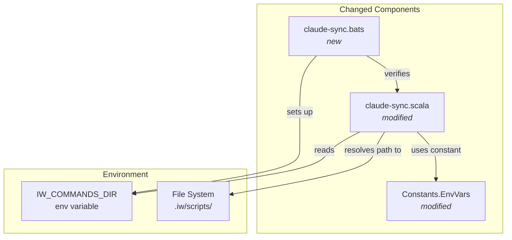
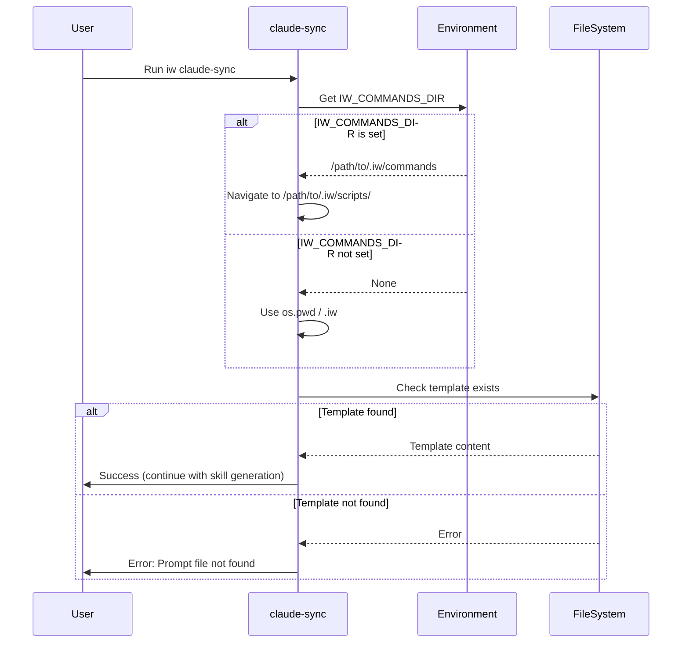

# Phase 1: Template Path Resolution Fix

## Goals

This phase fixes the `iw claude-sync` command to locate the prompt template file from the iw-cli installation directory instead of the current working directory. This enables users to run the command successfully from any project that has iw-cli installed, not just from within the iw-cli repository itself.

Key objectives:
- Resolve template path from `IW_COMMANDS_DIR` environment variable
- Implement fallback to `os.pwd` when `IW_COMMANDS_DIR` is not set
- Add `IwCommandsDir` constant to `Constants.EnvVars` for consistency
- Ensure backward compatibility for direct scala-cli usage during development

## Scenarios

- [ ] User can run `iw claude-sync` from the iw-cli repository itself
- [ ] User can run `iw claude-sync` from any project with iw-cli installed
- [ ] Command finds template from `IW_COMMANDS_DIR` when environment variable is set
- [ ] Command falls back to `os.pwd` when `IW_COMMANDS_DIR` is not set
- [ ] `Constants.EnvVars` contains `IwCommandsDir` constant
- [ ] E2E tests verify all path resolution scenarios

## Entry Points

Start your review from these locations:

| File | Method/Class | Why Start Here |
|------|--------------|----------------|
| `.iw/commands/claude-sync.scala` | Lines 17-22 | Template path resolution logic - core fix for this phase |
| `.iw/core/Constants.scala` | `EnvVars.IwCommandsDir` | New constant defining the environment variable name |
| `.iw/test/claude-sync.bats` | Test setup | E2E test structure showing how path resolution is verified |

## Component Relationships

**Key points for reviewer:**
- `claude-sync.scala` now checks `IW_COMMANDS_DIR` first, falls back to `os.pwd`
- Path calculation: `IW_COMMANDS_DIR` points to `.iw/commands`, so we navigate up one level to `.iw`, then to `scripts/`
- `Constants.EnvVars.IwCommandsDir` provides centralized constant for environment variable name
- BATS tests verify both scenarios: installation directory usage and fallback

## Key Flow: Template Path Resolution

**Key points for reviewer:**
- Resolution logic is straightforward: try env var first, fall back to current directory
- Both paths lead to same template structure: `.iw/scripts/claude-skill-prompt.md`
- Error handling remains consistent: exit with code 1 if template not found

## Test Summary

| Test | Type | Verifies |
|------|------|----------|
| `claude-sync finds template from IW_COMMANDS_DIR when set` | E2E | External project usage scenario - template resolved from installation |
| `claude-sync works from iw-cli repository (os.pwd fallback)` | E2E | Direct repository usage - fallback to current directory works |
| `claude-sync fails gracefully when template not found in either location` | E2E | Error handling when template genuinely missing |

**Test Coverage:**
- 3 E2E tests covering all path resolution scenarios
- Tests simulate both installation usage (external project) and repository usage (development)
- Error path explicitly tested (template removal scenario)

## Files Changed

**3 files** changed (1 new), +119 insertions, -1 deletion

Full file list

- `.iw/commands/claude-sync.scala` (M) +6 -1 lines
  - Lines 17-22: Template path resolution logic
  - Added environment variable check and fallback
  
- `.iw/core/Constants.scala` (M) +1 line
  - Line 13: Added `IwCommandsDir = "IW_COMMANDS_DIR"` to `EnvVars`
  
- `.iw/test/claude-sync.bats` (A) +112 lines
  - Complete E2E test suite for template path resolution
  - 3 test cases covering all scenarios

---

## Review Checklist

Use this checklist to guide your review:

- [ ] **Path resolution logic** (`.iw/commands/claude-sync.scala:17-22`)
  - [ ] `IW_COMMANDS_DIR` environment variable is checked first
  - [ ] Path calculation correctly navigates from `.iw/commands` to `.iw` (using `os.up`)
  - [ ] Fallback to `os.pwd / ".iw"` when env var not set
  - [ ] Final path correctly points to `scripts/claude-skill-prompt.md`

- [ ] **Constants addition** (`.iw/core/Constants.scala:13`)
  - [ ] `IwCommandsDir` constant added to `EnvVars` object
  - [ ] Follows naming convention of existing constants

- [ ] **E2E tests** (`.iw/test/claude-sync.bats`)
  - [ ] Test setup correctly simulates installation structure
  - [ ] Mock Claude CLI prevents external dependencies
  - [ ] Test 1 verifies `IW_COMMANDS_DIR` usage
  - [ ] Test 2 verifies fallback behavior
  - [ ] Test 3 verifies error handling
  - [ ] Teardown properly cleans up test directory

- [ ] **Backward compatibility**
  - [ ] Existing usage from iw-cli repository still works
  - [ ] No breaking changes to command interface

- [ ] **Code quality**
  - [ ] Comments explain the path calculation logic
  - [ ] Code follows functional programming style
  - [ ] No side effects in path resolution
