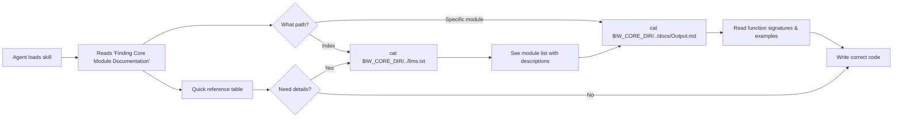

# Phase 3: Integrate llms.txt with iw-command-creation skill

## Goals

This phase completes the documentation discoverability loop by updating the `iw-command-creation` skill to reference the newly created llms.txt documentation instead of directing agents to read source files directly.

Key objectives:
- Point agents to llms.txt as the primary API documentation source
- Provide correct path resolution (`$IW_CORE_DIR/../llms.txt`)
- Maintain quick reference table for developer convenience
- Enable agents to navigate from skill → llms.txt → detailed docs

## Scenarios

- [ ] Agent reads skill and finds "Finding Core Module Documentation" section
- [ ] Agent follows path `$IW_CORE_DIR/../llms.txt` to read documentation index
- [ ] Agent follows path `$IW_CORE_DIR/../docs/Output.md` to read specific module docs
- [ ] Agent understands llms.txt format (H1 title, H2 sections, links to docs/)
- [ ] Agent can use quick reference table for overview before diving into details
- [ ] Documentation path works regardless of iw-cli installation location

## Entry Points

Start your review from these locations:

| File | Method/Class | Why Start Here |
|------|--------------|----------------|
| `.claude/skills/iw-command-creation/SKILL.md` | "Finding Core Module Documentation" section (lines 103-126) | Updated section that redirects to llms.txt instead of source files |
| `.claude/skills/iw-command-creation/SKILL.md` | "Available Core Modules" table (lines 128-147) | Enhanced table with docs links and llms.txt reference |
| `.claude/skills/iw-command-creation/SKILL.md` | "Tips" section (lines 225-232) | Updated tips to prioritize llms.txt reading |

## Documentation Flow

This diagram shows how agents discover and navigate the documentation:



**Key points for reviewer:**
- Two-level documentation: quick reference in skill + detailed docs in llms.txt
- Path resolution uses `$IW_CORE_DIR/../` to work from any installation location
- Agents can choose fast path (table) or comprehensive path (llms.txt)

## Changes Overview

### Before (source file references)

The skill directed agents to read Scala source files:
```markdown
## Finding Core Module Documentation
The core modules are located in the iw-cli installation. To find them:
...
To explore a module's API, read its source:
cat $IW_CORE_DIR/Output.scala
```

### After (llms.txt references)

The skill now points to structured documentation:
```markdown
## Finding Core Module Documentation
Complete API documentation is available in llms.txt format...

cat $IW_CORE_DIR/../llms.txt
cat $IW_CORE_DIR/../docs/Output.md
```

### Key Changes

1. **Documentation Source Changed**
   - FROM: Reading raw Scala source files
   - TO: Reading structured llms.txt documentation

2. **Path Pattern Added**
   - New: `$IW_CORE_DIR/../llms.txt` for index
   - New: `$IW_CORE_DIR/../docs/<Module>.md` for details

3. **Format Explanation Added**
   - Explains llms.txt standard format (H1, H2, links)
   - Lists what's in each module doc (imports, signatures, examples)

4. **Quick Reference Enhanced**
   - Added "Docs" column with links to documentation files
   - Added note pointing to llms.txt for full details
   - Removed `.scala` extension from module names (cleaner)

5. **Tips Updated**
   - Tip #1 now: "Read llms.txt first"
   - Tip #5 now: "Read module docs" (was "Read the source")

## Test Summary

This is a documentation-only change with manual verification:

| Test | Type | Verifies |
|------|------|----------|
| Path resolution test | Manual | `$IW_CORE_DIR/../llms.txt` exists and is readable |
| YAML frontmatter validation | Manual | Skill file YAML is valid and parses correctly |
| Markdown structure check | Manual | Headers, code blocks, tables render correctly |
| Link verification | Manual | Relative links to docs/ files are correct |

**Verification approach:**
```bash
# Test path resolution
export IW_CORE_DIR=".iw/core"
test -f "$IW_CORE_DIR/../llms.txt" && echo "✓ llms.txt found"
test -d "$IW_CORE_DIR/../docs" && echo "✓ docs/ found"

# Verify YAML frontmatter
head -n 10 .claude/skills/iw-command-creation/SKILL.md | grep -E "^(name|description):"

# Check markdown structure
grep -E "^##+ " .claude/skills/iw-command-creation/SKILL.md
```

## Files Changed

**1 file** changed, +34 insertions, -27 deletions (net +7 lines)

<details>
<summary>Full file list</summary>

- `.claude/skills/iw-command-creation/SKILL.md` (M) +34 -27 lines
  - "Finding Core Module Documentation" section rewritten
  - "Available Core Modules" table enhanced with docs links
  - "Tips" section updated with llms.txt-first approach

</details>

## Review Checklist

When reviewing this change, verify:

- [ ] Path `$IW_CORE_DIR/../llms.txt` is correct and documented
- [ ] Path `$IW_CORE_DIR/../docs/<Module>.md` is correct and documented
- [ ] llms.txt format explanation is accurate (matches llmstxt.org standard)
- [ ] Quick reference table includes all essential modules
- [ ] Links in "Docs" column use correct relative paths
- [ ] Tips section encourages llms.txt usage appropriately
- [ ] YAML frontmatter remains valid
- [ ] No references to reading source files remain
- [ ] Language is clear and actionable for agents
- [ ] Change achieves stated goals (documentation discoverability)
