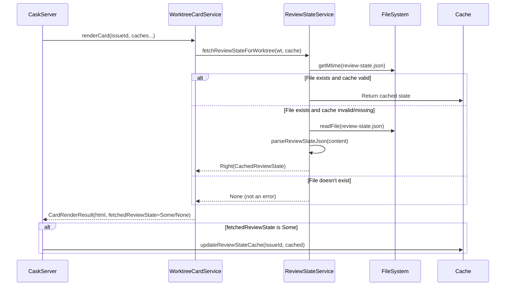

# Review Packet: Phase 1 - Review State Regression Test

**Issue:** IW-164
**Phase:** 1
**Branch:** IW-164-phase-01

## Goals

Establish a working reference pattern by creating regression tests for review state, which already works correctly. This documents the correct approach for the other stories (Progress and PR caching) and ensures we don't break what's working.

## Scenarios

- [x] Review state is fetched and returned in CardRenderResult when review-state.json exists
- [x] Review state returns None when no review-state.json file exists (normal case)
- [x] Cached review state is returned when file mtime is unchanged (cache hit)
- [x] All existing tests continue to pass

## Entry Points

Start your review from these files:

1. **`.iw/core/test/WorktreeCardServiceTest.scala`** - Main file with new regression tests
   - Look for "Review State Regression Tests (IW-164)" section
   - 3 new tests documenting the working pattern

2. **`.iw/core/test/YouTrackClientCreateIssueTest.scala`** - Minor fix
   - Added missing import (pre-existing bug blocking compilation)

## Architecture Diagram

## Test Summary

| Test Type | Count | Description |
|-----------|-------|-------------|
| Unit (new) | 3 | Regression tests for review state pattern |
| Unit (existing) | 163+ | All existing tests still pass |

### New Tests Added

1. **`renderCard returns fetchedReviewState when review-state.json exists`**
   - Creates temp directory with review-state.json
   - Verifies CardRenderResult.fetchedReviewState is populated
   - Validates parsed state matches JSON content

2. **`renderCard returns None for fetchedReviewState when no review-state.json`**
   - Creates temp directory WITHOUT review-state.json
   - Verifies CardRenderResult.fetchedReviewState is None
   - Documents normal case (not an error)

3. **`renderCard uses cached review state when mtime unchanged`**
   - Pre-populates cache with existing state
   - Verifies cached state is returned on cache hit
   - Validates mtime-based caching works correctly

## Files Changed

| File | Type | Changes |
|------|------|---------|
| `.iw/core/test/WorktreeCardServiceTest.scala` | Test | +178 lines: 3 new regression tests with documentation |
| `.iw/core/test/YouTrackClientCreateIssueTest.scala` | Test | +1 line: Added missing import |
| `project-management/issues/IW-164/phase-01-tasks.md` | Doc | Task checkboxes updated |
| `project-management/issues/IW-164/review-state.json` | Doc | Status updated |

## Key Observations

### The Working Pattern (Document for Stories 1-2)

Review state works because `WorktreeCardService.renderCard`:
1. **Always calls filesystem** via `fetchReviewStateForWorktree` (line 97)
2. **Uses mtime-based caching** to avoid re-parsing unchanged files
3. **Returns fetched data** in `CardRenderResult.fetchedReviewState` (line 127)
4. **Server updates cache** from this returned value (CaskServer.scala lines 156-158)

This pattern should be followed for:
- **Story 1 (Progress)**: Currently reads from `progressCache` only (line 100), needs to read from filesystem
- **Story 2 (PR)**: Currently reads from `prCache` only (line 102), needs to return fetched data

### No Production Code Changes

This phase only adds tests - no changes to production code. The review state implementation already works correctly.
