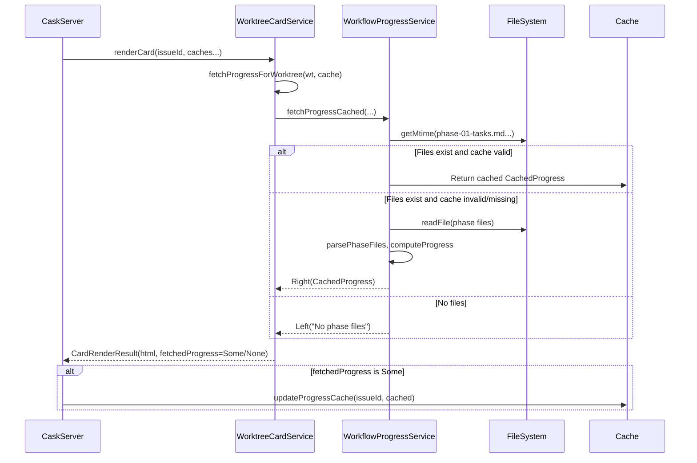

# Review Packet: Phase 2 - Progress bars persist across card refresh

**Issue:** IW-164
**Phase:** 2
**Branch:** IW-164-phase-02

## Goals

Fix the progress cache so that progress bars remain visible after HTMX card refresh. Progress bars were vanishing because `WorktreeCardService.renderCard` read from cache only but never populated it.

## Scenarios

- [x] Progress is fetched from filesystem and returned in CardRenderResult when task files exist
- [x] Progress returns None when no task files exist (normal case)
- [x] Cached progress is returned when file mtime is unchanged (cache hit)
- [x] All existing tests continue to pass

## Entry Points

Start your review from these files:

1. **`.iw/core/dashboard/WorktreeCardService.scala`** - Main changes
   - New `fetchProgressForWorktree` method (mirrors `fetchReviewStateForWorktree`)
   - Modified `renderCard` to call progress fetching and return result

2. **`.iw/core/dashboard/WorkflowProgressService.scala`** - Service changes
   - New `fetchProgressCached` method that returns `CachedProgress`
   - Internal refactoring: `fetchProgressInternal` extracted
   - Original `fetchProgress` preserved for backward compatibility

3. **`.iw/core/test/WorktreeCardServiceTest.scala`** - New tests
   - 3 new tests for progress persistence

## Architecture Diagram



## Test Summary

| Test Type | Count | Description |
|-----------|-------|-------------|
| Unit (new) | 3 | Progress persistence tests |
| Unit (existing) | 166+ | All existing tests still pass |

### New Tests Added

1. **`renderCard returns fetchedProgress when phase task files exist`**
   - Creates temp directory with phase-01-tasks.md
   - Verifies CardRenderResult.fetchedProgress is populated
   - Validates task counts are correct

2. **`renderCard returns None for fetchedProgress when no phase files`**
   - Creates temp directory WITHOUT task files
   - Verifies CardRenderResult.fetchedProgress is None
   - Documents normal case (not an error)

3. **`renderCard uses cached progress when mtime unchanged`**
   - Pre-populates cache with existing progress
   - Verifies cached progress is returned on cache hit
   - Validates mtime-based caching works

## Files Changed

| File | Type | Changes |
|------|------|---------|
| `.iw/core/dashboard/WorktreeCardService.scala` | Prod | +55 lines: `fetchProgressForWorktree` method, call in `renderCard` |
| `.iw/core/dashboard/WorkflowProgressService.scala` | Prod | +20 lines: `fetchProgressCached`, internal refactoring |
| `.iw/core/test/WorktreeCardServiceTest.scala` | Test | +123 lines: 3 new tests |
| `project-management/issues/IW-164/phase-02-tasks.md` | Doc | Task checkboxes updated |

## Key Implementation Details

### Pattern Applied (Same as Review State)

The fix follows the exact pattern documented in Phase 1:

1. **Read from filesystem** via `WorkflowProgressService.fetchProgressCached`
2. **Use mtime-based caching** to avoid re-parsing unchanged files
3. **Return `CachedProgress`** in `CardRenderResult.fetchedProgress`
4. **Server updates cache** from returned value (existing code at CaskServer.scala lines 150-152)

### Backward Compatibility

- Original `fetchProgress` method preserved (returns `WorkflowProgress`)
- New `fetchProgressCached` method added (returns `CachedProgress`)
- Internal implementation extracted to `fetchProgressInternal`

### Changes in renderCard

Before:
```scala
val progress = progressCache.get(issueId).map(_.progress)
// ...
CardRenderResult(html, fetchedCachedIssue, None, None, reviewStateCacheUpdate)
```

After:
```scala
val freshProgress = fetchProgressForWorktree(worktree, progressCache)
val (progress, progressCacheUpdate) = freshProgress match { ... }
// ...
CardRenderResult(html, fetchedCachedIssue, progressCacheUpdate, None, reviewStateCacheUpdate)
```
