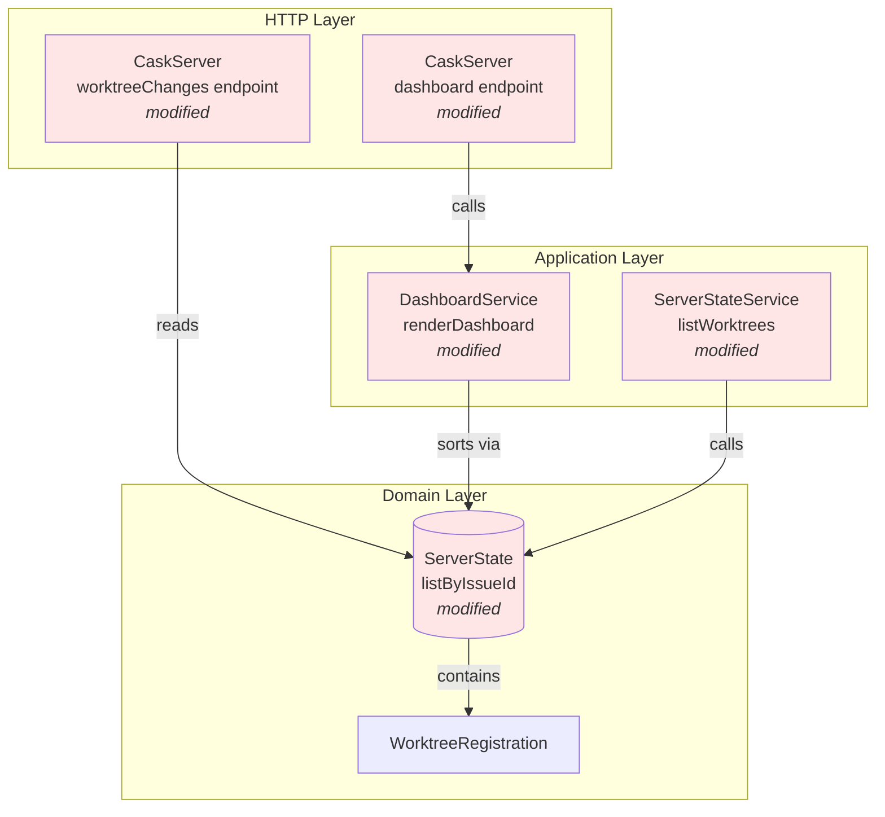
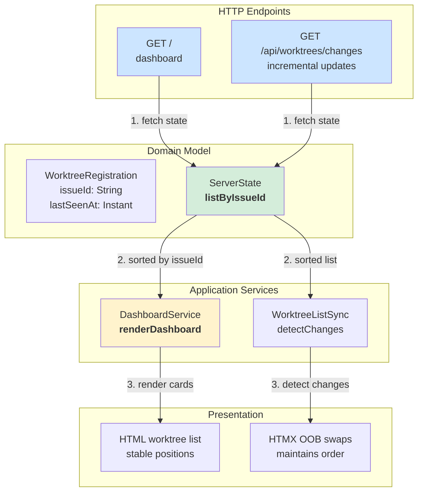
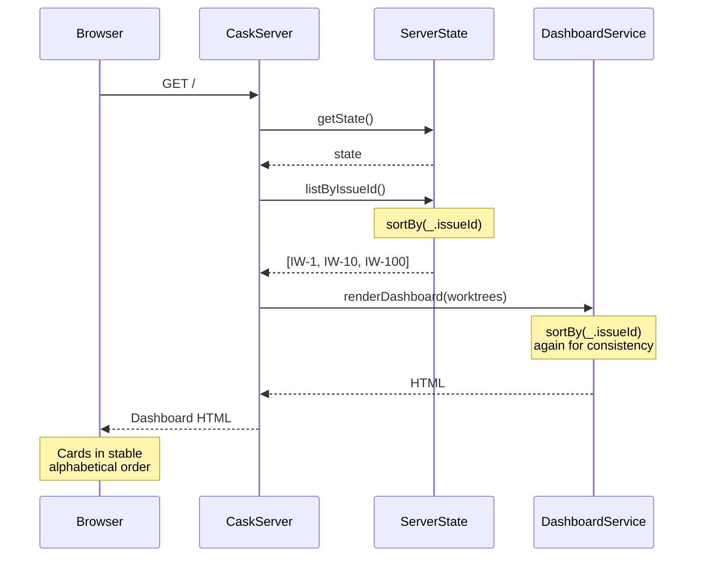
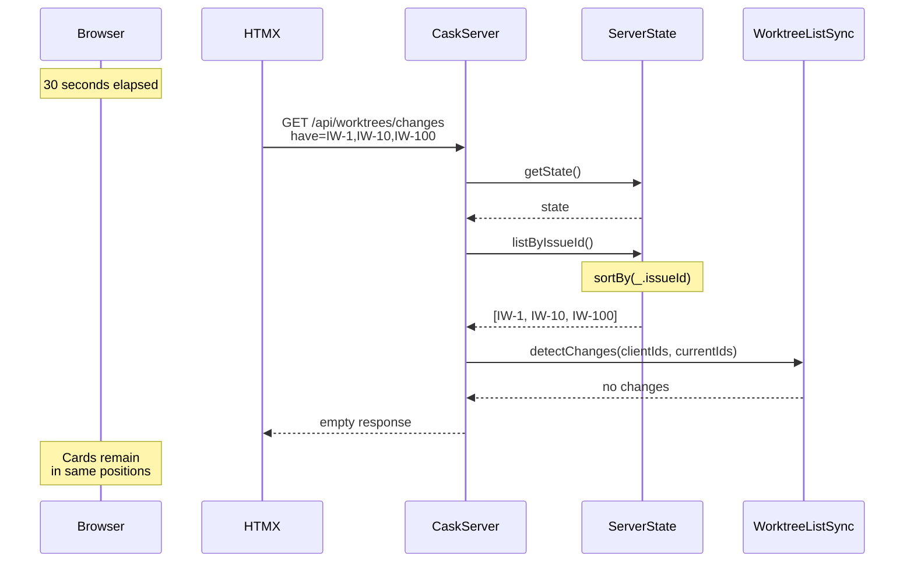

# Phase 1: Stable card positions during auto-refresh

## Goals

This phase replaces dynamic activity-based sorting with stable Issue ID-based sorting, eliminating the misclick problem caused by cards reordering unpredictably during auto-refresh.

Key objectives:
- Replace `lastSeenAt`-based sorting with alphabetical Issue ID sorting
- Maintain card positions during 30-second auto-refresh cycles
- Ensure predictable card ordering across all dashboard views

## Scenarios

- [ ] Cards maintain positions during auto-refresh when no worktrees are added/removed
- [ ] Card order is alphabetically sorted by Issue ID (ascending)
- [ ] Mixed prefix Issue IDs sort correctly (GH-50 < IW-100 < LINEAR-25)
- [ ] Same-prefix IDs use pure alphabetical sorting (IW-1 < IW-10 < IW-100 < IW-2)
- [ ] Auto-refresh incremental updates respect Issue ID ordering
- [ ] Existing card refresh functionality continues to work

## Entry Points

Start your review from these locations:

| File | Method/Class | Why Start Here |
|------|--------------|----------------|
| `.iw/core/model/ServerState.scala` | `listByIssueId` | Core domain change - replaces activity sorting with stable Issue ID sorting |
| `.iw/core/dashboard/DashboardService.scala` | `renderDashboard()` (line 42) | Application layer - uses new sorting when rendering full dashboard |
| `.iw/core/dashboard/CaskServer.scala` | `dashboard()` & `worktreeChanges()` | HTTP endpoints that consume sorted worktree lists |

## Architecture Overview

This shows where the sorting changes fit within the dashboard architecture.

**Key points for reviewer:**
- Pure domain change in `ServerState.listByIssueId` - sorts by `issueId` field instead of `lastSeenAt`
- Application layer (`DashboardService`) simplified - removed `WorktreePriority` dependency
- HTTP endpoints updated to use new method name
- No changes to data model structure or persistence format

## Component Relationships

This diagram shows how the sorting change propagates through the layers.

**Key relationships:**
1. `ServerState.listByIssueId` is the single source of truth for worktree ordering
2. Both full render and incremental updates use the same sorting logic
3. HTMX OOB swaps maintain the stable ordering during incremental updates

## Key Flows

### Dashboard Load Flow

### Auto-Refresh Flow (30s interval)

**Critical invariants:**
- `listByIssueId` always returns the same order for the same set of worktrees
- Incremental updates respect the same ordering as full renders
- No card position changes when worktree set is unchanged

## Test Summary

| Test | Type | Verifies |
|------|------|----------|
| `ServerState with empty worktrees map` | Unit | Empty state returns empty list |
| `listByIssueId returns worktrees sorted by issueId ascending` | Unit | Basic alphabetical sorting with same prefix |
| `ServerState with single worktree` | Unit | Single worktree edge case |
| `listByIssueId sorts alphabetically with different prefixes` | Unit | Mixed prefixes: GH-50 < IW-100 < LINEAR-25 |
| `listByIssueId uses pure alphabetical string sorting` | Unit | Same prefix pure alphabetical: IW-1 < IW-10 < IW-100 < IW-2 |
| `removeWorktree removes entry from worktrees map` | Unit | Removal maintains sorting invariants |
| `removeWorktree removes entry from all cache maps` | Unit | Cache consistency during removal |
| `removeWorktree is idempotent for non-existent issueId` | Unit | Safe removal of non-existent items |
| `removeWorktree clears review state cache entry` | Unit | Review state cache cleanup |

**Coverage:** 9 unit tests covering sorting behavior, edge cases, and removal operations

**Note:** Pure alphabetical sorting means "IW-2" comes after "IW-10" because string comparison is character-by-character. This is predictable and consistent, though natural numeric sorting (IW-2 before IW-10) could be added in a future enhancement if needed.

## Files Changed

**5 files** changed, approximately +40 insertions, -20 deletions

Full file list with changes

### Core Changes

- `.iw/core/model/ServerState.scala` (M)
  - Renamed `listByActivity` → `listByIssueId`
  - Changed sorting from `sortBy(_.lastSeenAt.getEpochSecond)(reverse)` to `sortBy(_.issueId)`
  - Updated PURPOSE comment to reflect issue ID sorting
  - **Lines changed:** ~5

- `.iw/core/dashboard/DashboardService.scala` (M)
  - Line 42: Changed from `sortBy(wt => WorktreePriority.priorityScore(wt, now))(reverse)` to `sortBy(_.issueId)`
  - Removed `WorktreePriority` import (no longer needed)
  - Updated comment to describe alphabetical sorting
  - **Lines changed:** ~3

- `.iw/core/dashboard/CaskServer.scala` (M)
  - Line 43: Changed `state.listByActivity` → `state.listByIssueId`
  - Line 187: Changed `state.listByActivity` → `state.listByIssueId`
  - Updated comments to reference issue ID ordering
  - **Lines changed:** ~4

- `.iw/core/dashboard/ServerStateService.scala` (M)
  - Updated deprecated `listWorktrees()` to call `state.listByIssueId`
  - Updated deprecation comment
  - **Lines changed:** ~3

### Test Changes

- `.iw/core/test/ServerStateTest.scala` (M)
  - Updated existing test expectations to match alphabetical ordering
  - Added test for mixed-prefix sorting (GH-50, IW-100, LINEAR-25)
  - Added test for pure alphabetical sorting (IW-1, IW-10, IW-100, IW-2)
  - Renamed test names to reference `listByIssueId` instead of `listByActivity`
  - Updated PURPOSE comment
  - **Lines changed:** ~25 (including 2 new tests)

## Review Checklist

Before approving, verify:

- [ ] `ServerState.listByIssueId` is a pure function with no side effects
- [ ] Sorting is stable and deterministic (same input → same output)
- [ ] All HTTP endpoints using worktree lists are updated
- [ ] Test expectations match the new alphabetical ordering
- [ ] No references to `listByActivity` remain in the codebase
- [ ] `WorktreePriority.priorityScore` removed from dashboard rendering (can remain for other uses)
- [ ] Comments and documentation reflect issue ID sorting
- [ ] Edge cases tested (empty list, single item, mixed prefixes)

## Notes for Reviewer

**Design Decision: Pure Alphabetical Sorting**

This implementation uses pure alphabetical string sorting (`sortBy(_.issueId)`), which means:
- "IW-1" < "IW-10" < "IW-100" < "IW-2"

This is **intentional** and provides:
- Simple, predictable behavior
- No parsing or numeric extraction logic needed
- Consistent with standard string sorting

If natural numeric sorting is desired later (IW-2 before IW-10), it can be added as a small enhancement without changing the architecture.

**What's NOT Changed**

The following remain unchanged (by design):
- `WorktreePriority.priorityScore` - still used for staggered card loading priority
- `WorktreeRegistration.lastSeenAt` field - still tracked and persisted
- Data persistence format - no migration needed
- Card refresh endpoint (`/worktrees/:issueId/card`) - still works the same
- HTMX OOB swap mechanism - respects the stable ordering automatically

**Performance**

Sorting is O(n log n) where n = number of worktrees. With typical dashboard usage (< 20 worktrees), performance impact is negligible (< 1ms).

---

**Phase 1 Status:** Implementation complete, ready for review
