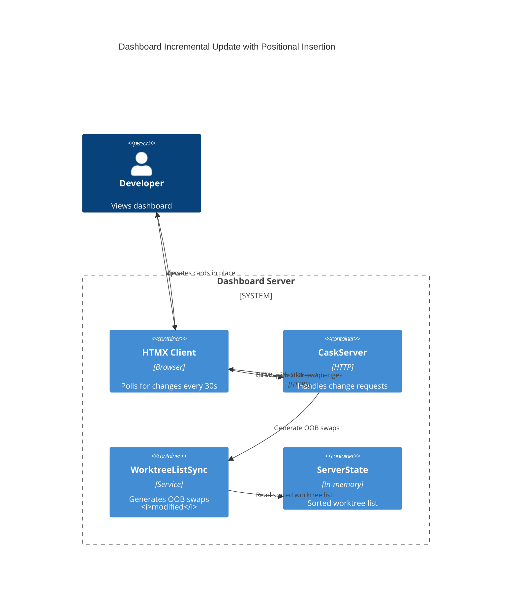
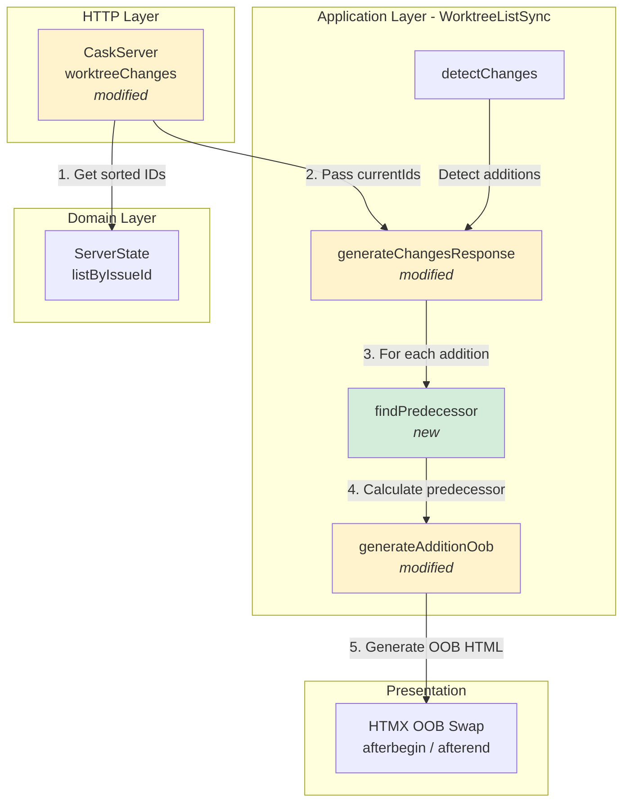
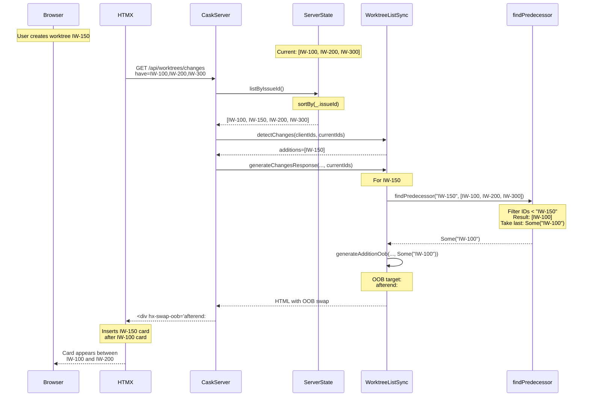
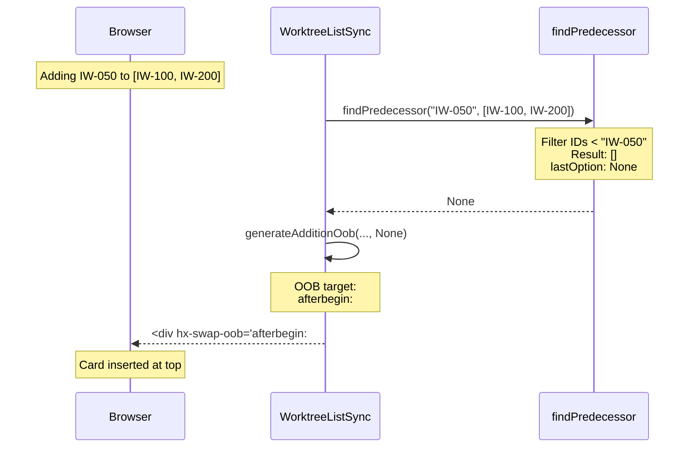

# Phase 2: New worktrees appear at predictable location

## Goals

This phase ensures that when a new worktree is created, its card appears at the correct sorted position in the dashboard (based on Issue ID alphabetical ordering from Phase 1) rather than simply appending to the end. This makes new worktree placement predictable - users can anticipate where a new card will appear based on its Issue ID.

Key objectives:
- New worktree cards insert at the position dictated by alphabetical Issue ID sorting
- No full page refresh required for correct positioning
- Users can predict where new cards will appear based on Issue ID
- Existing cards shift smoothly to accommodate new cards

## Scenarios

Based on Phase 2 acceptance criteria:

- [ ] New worktree card for IW-150 appears between existing IW-100 and IW-200 cards
- [ ] New worktree card for IW-050 appears at the top (before IW-100)
- [ ] New worktree card for IW-350 appears at the bottom (after IW-300)
- [ ] Multiple new worktrees in same update each insert at correct positions
- [ ] Cards insert via HTMX OOB swap without full page refresh
- [ ] Existing cards shift predictably to accommodate new card

## Entry Points

Start your review from these locations:

| File | Method/Class | Why Start Here |
|------|--------------|----------------|
| `.iw/core/dashboard/WorktreeListSync.scala` | `findPredecessor()` (line 30) | Core algorithm - finds where to insert new card in sorted list |
| `.iw/core/dashboard/WorktreeListSync.scala` | `generateAdditionOob()` (line 83) | Generates HTMX OOB swap with positional targeting |
| `.iw/core/dashboard/WorktreeListSync.scala` | `generateChangesResponse()` (line 234) | Integration point - calculates predecessor for each addition |
| `.iw/core/dashboard/CaskServer.scala` | `worktreeChanges()` (line 207) | HTTP endpoint - passes currentIds to sync logic |

## Architecture Overview

This shows how positional insertion fits into the existing dashboard synchronization flow.

**Key points for reviewer:**
- Positional insertion logic is purely in `WorktreeListSync` (application layer)
- No changes to domain model or HTTP layer (except passing currentIds)
- HTMX standard OOB swap mechanism handles the actual insertion

## Component Relationships

This diagram shows the new positional insertion logic and how it integrates with existing components.

**Key relationships:**
1. `findPredecessor` is a pure helper function - no side effects
2. `generateAdditionOob` now accepts `predecessorId` parameter to determine OOB target
3. `generateChangesResponse` orchestrates: for each addition, calculate predecessor, then generate OOB
4. `CaskServer` passes `currentIds` (sorted list) to enable predecessor calculation

## Key Flows

### New Worktree Addition Flow (Positional Insertion)

**Critical invariants:**
- `findPredecessor` is a pure function (no side effects, deterministic)
- `currentIds` must be sorted (comes from `ServerState.listByIssueId`)
- OOB target selection based on predecessor presence:
  - `None` → `afterbegin:#worktree-list` (insert at top)
  - `Some(predId)` → `afterend:#card-{predId}` (insert after predecessor)

### Edge Case: First Card (No Predecessor)

## Test Summary

| Test | Type | Verifies |
|------|------|----------|
| `findPredecessor returns None for empty list` | Unit | Edge case - empty worktree list |
| `findPredecessor returns None when new ID should be first` | Unit | New card should be first (IW-050 before IW-100) |
| `findPredecessor returns correct predecessor for middle insertion` | Unit | New card in middle (IW-150 after IW-100) |
| `findPredecessor returns last ID when new ID should be last` | Unit | New card at end (IW-400 after IW-300) |
| `generateAdditionOob with predecessorId = None uses afterbegin` | Unit | OOB attribute generation for first position |
| `generateAdditionOob with predecessorId = Some uses afterend` | Unit | OOB attribute generation for middle/end position |
| `generateChangesResponse: addition inserts at beginning when ID is smallest` | Integration | Full flow - new card at top |
| `generateChangesResponse: addition inserts in middle at correct position` | Integration | Full flow - new card in middle |
| `generateChangesResponse: addition inserts at end when ID is largest` | Integration | Full flow - new card at end |
| `generateChangesResponse: multiple additions each get correct predecessor` | Integration | Multiple new cards in same update |

Coverage: 10 new tests covering positional insertion logic

**Test coverage breakdown:**
- `findPredecessor` helper: 4 tests (all edge cases)
- `generateAdditionOob` OOB targeting: 2 tests (with/without predecessor)
- `generateChangesResponse` integration: 4 tests (beginning/middle/end/multiple)

## Files Changed

**3 files** changed, +292 insertions, -48 deletions

Full file list with changes

### Core Changes

- `.iw/core/dashboard/WorktreeListSync.scala` (M)
  - **NEW:** `findPredecessor()` helper function (lines 24-31)
    - Pure function: finds predecessor in sorted list
    - Returns `None` if new ID should be first
    - Returns `Some(predId)` if there's a predecessor
  - **MODIFIED:** `generateAdditionOob()` signature (line 83)
    - Added `predecessorId: Option[String]` parameter
    - Updated doc comment to describe positional insertion
  - **MODIFIED:** `generateAdditionOob()` implementation (lines 118-125)
    - OOB target selection based on `predecessorId`:
      - `None` → `afterbegin:#worktree-list`
      - `Some(predId)` → `afterend:#card-{predId}`
    - Changed from fixed `beforeend` to dynamic targeting
  - **MODIFIED:** `generateChangesResponse()` signature (line 218)
    - Added `currentIds: List[String]` parameter
    - Updated doc comment
  - **MODIFIED:** `generateChangesResponse()` implementation (lines 234-247)
    - For each addition, calculate predecessor using `findPredecessor`
    - Pass predecessor to `generateAdditionOob`
  - **Lines changed:** ~35 insertions

- `.iw/core/dashboard/CaskServer.scala` (M)
  - Line 207: Pass `currentIds` to `generateChangesResponse`
    - `currentIds` is the sorted list from `state.listByIssueId`
  - **Lines changed:** ~3 insertions

### Test Changes

- `.iw/core/test/WorktreeListSyncTest.scala` (M)
  - **NEW:** 4 tests for `findPredecessor` (lines 197-212)
    - Empty list edge case
    - First position (no predecessor)
    - Middle insertion
    - Last position
  - **NEW:** 2 tests for `generateAdditionOob` OOB targeting (lines 215-254)
    - With `predecessorId = None`
    - With `predecessorId = Some(id)`
  - **NEW:** 4 integration tests for `generateChangesResponse` (lines 257-414)
    - Addition at beginning
    - Addition in middle
    - Addition at end
    - Multiple additions
  - **MODIFIED:** Existing tests updated to pass `predecessorId` parameter
  - **Lines changed:** +235 insertions, -6 deletions

## Review Checklist

Before approving, verify:

- [ ] `findPredecessor` is a pure function with no side effects
- [ ] OOB target selection logic is correct:
  - `None` → `afterbegin:#worktree-list`
  - `Some(predId)` → `afterend:#card-{predId}`
- [ ] `currentIds` parameter is correctly sourced from `ServerState.listByIssueId`
- [ ] All call sites of `generateAdditionOob` updated with new parameter
- [ ] Test coverage for all edge cases (empty, first, middle, last, multiple)
- [ ] HTMX OOB swap syntax is correct (`afterbegin` vs `afterend`)
- [ ] No regressions in deletion or reorder behavior
- [ ] Alphabetical sorting assumption from Phase 1 is maintained

## Notes for Reviewer

**Design Decision: Predecessor-Based Insertion**

This implementation uses a "predecessor" approach:
1. Find the card that should come BEFORE the new card
2. Insert AFTER that predecessor using `afterend:#card-{predId}`
3. Special case: if no predecessor, insert at beginning using `afterbegin`

**Alternative approaches considered:**
- **Successor-based:** Insert BEFORE the next card - rejected because requires handling "no successor" case differently
- **Delete + re-render range:** More complex, less efficient - rejected
- **Full list replacement:** Loses HTMX benefits - rejected

The predecessor approach is:
- Simple and intuitive
- Efficient (single OOB swap per card)
- Leverages standard HTMX OOB mechanics

**Pure Function Design**

`findPredecessor` is intentionally designed as a pure function:
- No side effects
- Deterministic (same input → same output)
- Easy to test
- Easy to reason about

This follows FCIS principles - pure logic in the functional core.

**HTMX OOB Swap Reference**

HTMX OOB (out-of-band) swap strategies used:
- `hx-swap-oob="afterbegin:#target"` - insert at beginning of target container
- `hx-swap-oob="afterend:#card-ID"` - insert immediately after specific card

Why not `beforeend`?
- `beforeend:#worktree-list` always appends to end (old behavior)
- We need positional insertion based on sorted order

**Backward Compatibility**

This change:
- **Does NOT** change HTTP API contract
- **Does NOT** change JSON schema
- **Does NOT** change card rendering
- **DOES** change OOB swap targeting (internal implementation)

Clients don't need updates - HTMX handles the OOB swaps automatically.

**Performance Considerations**

`findPredecessor` complexity:
- Filter operation: O(n) where n = number of existing worktrees
- `lastOption`: O(1)
- Total: O(n) per new card

With typical dashboard usage (< 20 worktrees), this is negligible (< 1ms).

**What's NOT Changed**

The following remain unchanged:
- `detectChanges` logic - still identifies additions/deletions/reorders
- Deletion OOB generation - still uses `hx-swap-oob="delete"`
- Reorder OOB generation - still uses delete + add pattern
- Full page refresh behavior - still renders in sorted order
- Card content and structure - unchanged
- HTMX polling interval - still 30 seconds

**Integration with Phase 1**

Phase 2 builds on Phase 1's stable sorting:
- **Phase 1** established alphabetical Issue ID sorting as the stable sort order
- **Phase 2** ensures new cards insert at their correct position in that order
- Without Phase 1, positional insertion would still be based on unstable `lastSeenAt`

Together, these phases deliver the complete solution:
1. Phase 1: Cards stay in place during refresh (no layout shift)
2. Phase 2: New cards appear at predictable positions (no append-to-end)

---

**Phase 2 Status:** Implementation complete, ready for review
