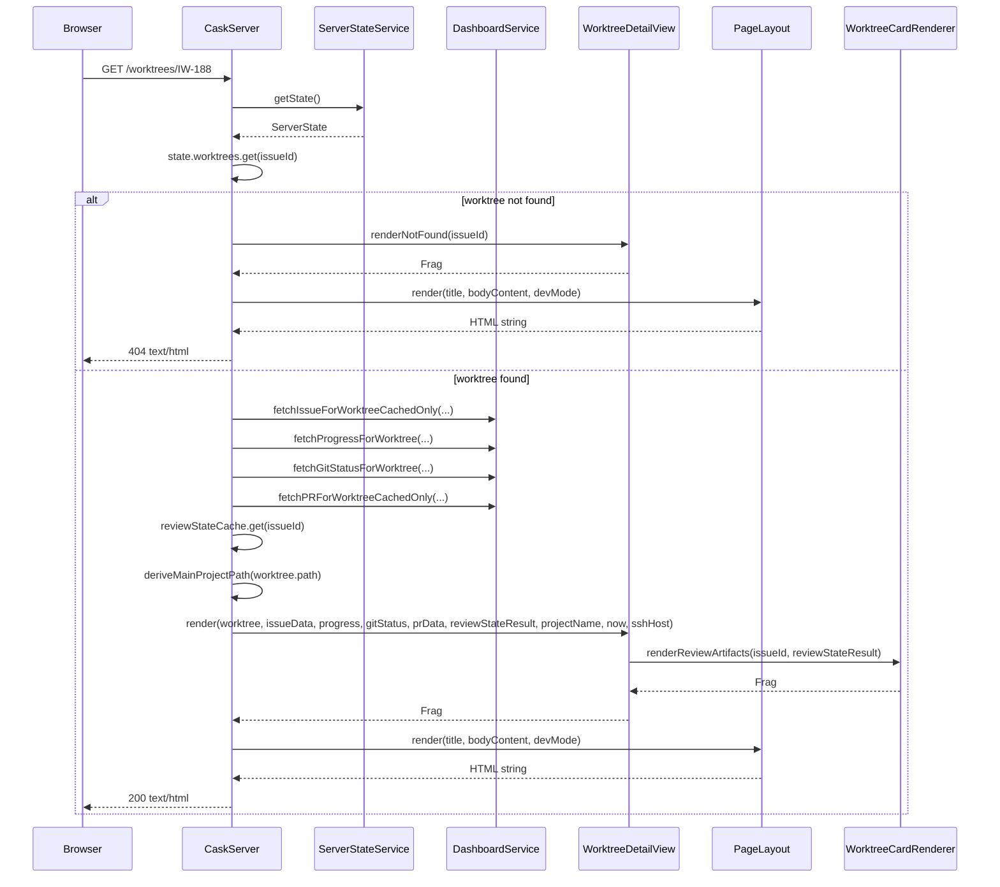
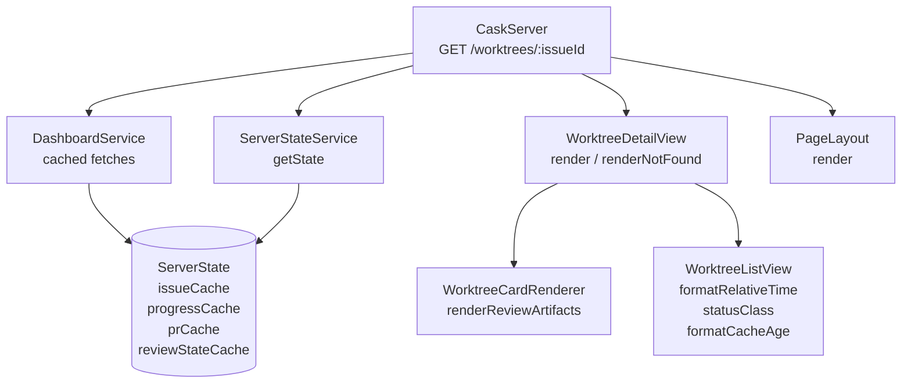
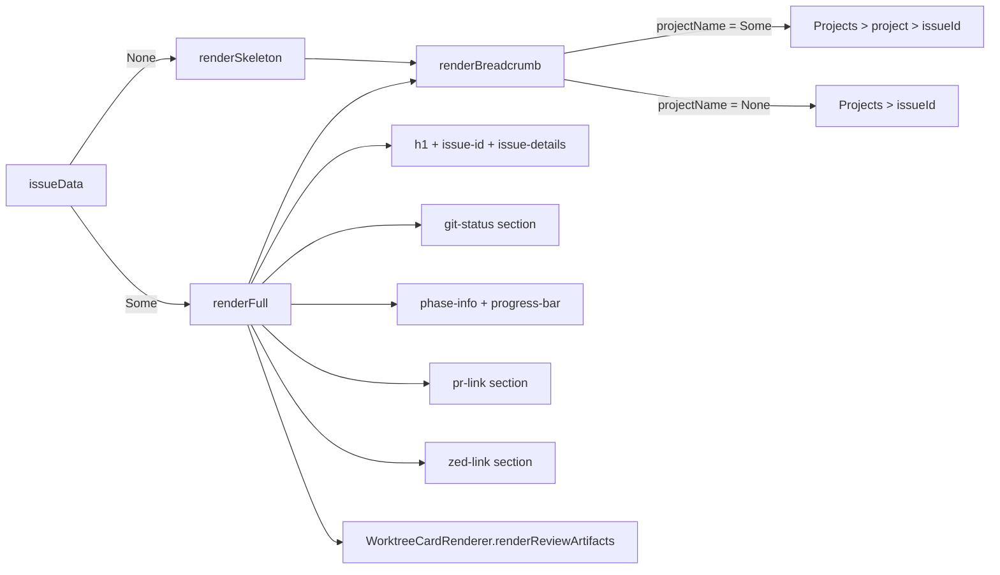

# Review Packet: IW-188 Phase 1

**Phase:** 1 - Worktree detail page with complete context
**Branch:** IW-188-phase-01
**Date:** 2026-03-14

---

## Goals

Phase 1 introduces a dedicated, bookmarkable URL for each registered worktree. Before this phase, the only way to see a worktree's details was to scan the compressed card grid on the project page. After this phase, navigating to `/worktrees/IW-188` loads a full-page view of that worktree with all available context: issue title, status, assignee, git branch, workflow progress, PR state, review artifacts, and a Zed editor link.

This is Iteration 1 from the analysis (Stories 1, 2, and 5 combined): the core detail page with breadcrumb navigation and graceful error handling.

**Out of scope for this phase:** HTMX auto-refresh (Phase 5), clickable artifact navigation (Phase 4), card title linking to detail page (Phase 6), workflow action buttons (deferred to #47).

---

## Scenarios

### Known worktree with full data

- [ ] `GET /worktrees/IW-188` returns HTTP 200 with `Content-Type: text/html`
- [ ] Response contains the issue ID `IW-188`
- [ ] Issue title appears in an `<h1>` heading
- [ ] Status badge is rendered (e.g., "In Progress")
- [ ] Assignee name appears when present
- [ ] Git branch name and clean/dirty indicator appear when git status is available
- [ ] Workflow phase name and progress bar appear when workflow progress is available
- [ ] PR number, URL, and state badge appear when PR data is available
- [ ] Review artifacts section appears when review state has artifacts
- [ ] Zed editor link uses the correct `zed://ssh/{sshHost}{worktreePath}` URL
- [ ] Breadcrumb reads `Projects > {projectName} > {issueId}` when project is derivable from the worktree path
- [ ] Page is wrapped in `PageLayout` (consistent with `/projects/:projectName`)

### Missing optional data (graceful degradation)

- [ ] When `issueData` is `None`, page shows skeleton state (`Loading...` heading + issue ID)
- [ ] Skeleton state still shows git status when git data is available
- [ ] No PR section rendered when PR data is absent
- [ ] No review artifacts section rendered when review state is absent
- [ ] No assignee shown when assignee field is absent on the issue
- [ ] Breadcrumb shows `Projects > {issueId}` (no middle link) when project name cannot be derived

### Unknown worktree

- [ ] `GET /worktrees/NONEXISTENT-999` returns HTTP 404 with `Content-Type: text/html`
- [ ] Response body contains the requested issue ID `NONEXISTENT-999`
- [ ] Page includes a back link to `/` (Projects Overview)
- [ ] Page includes breadcrumb or equivalent navigation

---

## Entry Points

**Start here to understand the route:**

1. `CaskServer.scala` — `@cask.get("/worktrees/:issueId")` handler at line 148. This is the single new route. It reads state, dispatches to `renderNotFound` or `render`, and wraps in `PageLayout`.

2. `WorktreeDetailView.scala` — The new view object. Read `render` first (the happy path), then `renderNotFound`, then the private helpers `renderBreadcrumb`, `renderFull`, and `renderSkeleton`.

3. `WorktreeCardRenderer.scala` — The `renderReviewArtifacts` method was changed from `private` to package-accessible. The detail view calls it directly at line 223.

**Start here to understand the tests:**

4. `WorktreeDetailViewTest.scala` — 22 unit tests covering all rendering combinations including error paths and cache indicators. No server required. Uses `renderDefault` helper for concise test bodies.

5. `CaskServerTest.scala` — Two new integration tests at the bottom (lines 1037–1102): one for a known worktree returning 200, one for an unknown worktree returning 404.

---

## Architecture

### Request flow for `GET /worktrees/:issueId`

### Component relationships

### Data flow within `WorktreeDetailView.render`

---

## Test Summary

### Unit tests — `WorktreeDetailViewTest.scala` (22 tests)

| Test | What it verifies |
|------|-----------------|
| render includes issue title in heading | `<h1>` contains issue title |
| render includes issue status badge | Status text and `status-badge` CSS class present |
| render includes assignee when present | Assignee name rendered |
| render omits assignee when absent | `Assigned:` label absent when `assignee = None` |
| render includes git branch name when git status is present | Branch name and `Branch:` label present |
| render includes clean indicator for clean git status | `clean` or `✓` present |
| render omits git section when git status is absent | `git-status` CSS class absent |
| render includes PR number and link when PR data is present | PR number and URL in output |
| render omits PR section when PR data is absent | `pr-link` and `pr-button` absent |
| render includes workflow phase info when progress is present | Phase name and `phase-info` present |
| render includes progress bar for workflow progress | `progress-bar` and task counts present |
| render includes review artifacts when review state is present | `Review Artifacts` heading and artifact label present |
| render omits review artifacts section when review state is absent | `review-artifacts` CSS class absent |
| render shows review error when review state result is a Left | `review-error` CSS class and `Review Artifacts` heading present |
| render includes Zed editor link with correct URL | Full `zed://ssh/...` URL present |
| render shows breadcrumb with project name when derivable | Three-level breadcrumb with project link |
| render shows breadcrumb without project name when not derivable | Two-level breadcrumb, `Projects` and issue ID only |
| render shows skeleton state when issue data is absent | `Loading...` shown, issue title absent |
| render shows git status in skeleton state when available | Branch name present in skeleton state |
| render shows cache indicator when data is from cache | `cache-indicator` CSS class present |
| render shows stale indicator when data is stale | `stale-indicator` CSS class present |
| renderNotFound includes the issue ID | Issue ID in not-found page |
| renderNotFound includes link back to overview | `href="/"` present |
| renderNotFound includes breadcrumb | `Projects` and `breadcrumb` present |
| renderNotFound shows not found heading and explanation | "Worktree Not Found" and "not registered" present |

### Integration tests — `CaskServerTest.scala` (2 new tests)

| Test | What it verifies |
|------|-----------------|
| GET /worktrees/:issueId returns 200 with HTML for known worktree | 200 status, `text/html` content type, issue ID in body, skeleton state markers |
| GET /worktrees/NONEXISTENT returns 404 with error page | 404 status, `text/html` content type, issue ID in body, not-found message, styled view container |

### Regression tests (existing, unchanged)

The following existing tests in `CaskServerTest.scala` confirm no regressions were introduced:
- `GET /` dashboard route still works
- `GET /projects/:projectName` project details page still works
- `GET /worktrees/:issueId/card` card refresh endpoint still works
- `DELETE /api/v1/worktrees/:issueId` unregistration still works

---

## Files Changed

| File | Change | Description |
|------|--------|-------------|
| `.iw/core/dashboard/presentation/views/WorktreeDetailView.scala` | NEW | Full-page view for a single worktree. Public API: `render(...)` and `renderNotFound(issueId)`. Contains private helpers `renderBreadcrumb`, `renderFull`, `renderSkeleton`. |
| `.iw/core/dashboard/CaskServer.scala` | MODIFIED | Added `@cask.get("/worktrees/:issueId")` route (`worktreeDetail` method). Added `WorktreeDetailView` to the import list. |
| `.iw/core/dashboard/presentation/views/WorktreeCardRenderer.scala` | MODIFIED | `renderReviewArtifacts` visibility changed from `private` to package-accessible so `WorktreeDetailView` can call it without duplicating the rendering logic. |
| `.iw/core/test/WorktreeDetailViewTest.scala` | NEW | 22 unit tests for `WorktreeDetailView.render` and `renderNotFound`. Uses inline test fixtures; no server required. |
| `.iw/core/test/CaskServerTest.scala` | MODIFIED | Two integration tests added under the `// Worktree detail page tests (IW-188 Phase 1)` comment block. |

---

## Notes for Reviewer

**On `renderReviewArtifacts` visibility change:** Making the method non-private is the minimal change to enable reuse from `WorktreeDetailView`. The alternative — duplicating the artifact rendering logic — would create a divergence risk. The method remains within the same package.

**On cached-only data fetching:** The route uses `fetchIssueForWorktreeCachedOnly` and `fetchPRForWorktreeCachedOnly`, which read from in-memory caches without making API calls. This is intentional: the card refresh endpoint (`GET /worktrees/:issueId/card`) is responsible for keeping caches warm. The detail page renders whatever is already cached, showing a skeleton state if the cache is cold. This is consistent with how `/projects/:projectName` works.

**On the `reviewStateCache` access pattern:** Unlike issue/PR/progress data, the review state is accessed directly from `state.reviewStateCache.get(issueId)` rather than through a `DashboardService` method. This mirrors the existing pattern in the card refresh endpoint.
