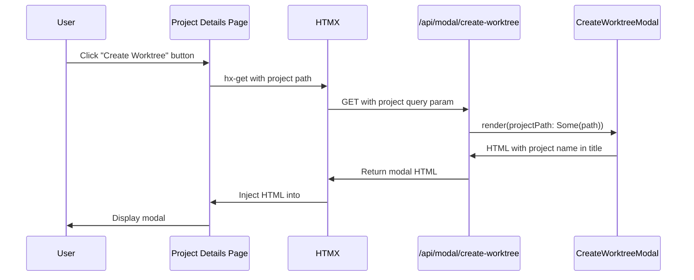

# Review Packet: Phase 4 - Project-scoped Create Worktree Button

## Goals

This phase adds a project-scoped "Create Worktree" button to the project details page. The button reuses the existing create-worktree modal infrastructure but scopes it to the current project by passing the project path as a query parameter.

Key objectives:
- Add a "Create Worktree" button to the project header that opens the existing modal
- Include a `#modal-container` div for HTMX to render the modal into
- URL-encode the project path for the `hx-get` query parameter
- Ensure comprehensive unit test coverage for button and container rendering

## Scenarios

- [ ] User navigates to project details page and sees "Create Worktree" button
- [ ] Clicking the button loads the create-worktree modal with the project name in the title
- [ ] Modal's issue search is scoped to the project's tracker configuration
- [ ] Modal container div is present for HTMX to render into
- [ ] Root dashboard create button functionality remains unchanged

## Entry Points

| File | Method/Class | Why Start Here |
|------|--------------|----------------|
| `.iw/core/dashboard/presentation/views/ProjectDetailsView.scala` | `render()` (lines 24-93) | Main rendering logic that produces the project details page HTML |
| `.iw/core/test/ProjectDetailsCreateButtonTest.scala` | All test methods | Verifies button and container rendering with HTMX attributes |

## Diagrams

```mermaid
graph LR
    A[Project Details Page] -->|hx-get| B[/api/modal/create-worktree?project=...]
    B -->|returns HTML| C[CreateWorktreeModal]
    C -->|renders into| D[#modal-container]
    
    style A fill:#e1f5ff
    style B fill:#fff4e1
    style C fill:#e8f5e9
    style D fill:#fce4ec
```

### Component Flow



## Test Summary

### Unit Tests (5 tests)

| Test | Type | File | Status |
|------|------|------|--------|
| `render includes create worktree button` | Unit | `ProjectDetailsCreateButtonTest.scala:28` | ✓ |
| `render create button has correct hx-get URL with encoded project path` | Unit | `ProjectDetailsCreateButtonTest.scala:32` | ✓ |
| `render create button targets modal container` | Unit | `ProjectDetailsCreateButtonTest.scala:44` | ✓ |
| `render create button uses innerHTML swap` | Unit | `ProjectDetailsCreateButtonTest.scala:51` | ✓ |
| `render includes modal container div` | Unit | `ProjectDetailsCreateButtonTest.scala:58` | ✓ |

All tests verify the button renders with correct HTMX attributes and the modal container is present.

## Implementation Details

### Changes to ProjectDetailsView.scala

**Added imports (lines 11-12):**
```scala
import java.net.URLEncoder
import java.nio.charset.StandardCharsets
```

**URL encoding logic (line 31):**
```scala
val encodedPath = URLEncoder.encode(mainProject.path.toString, StandardCharsets.UTF_8.toString)
```

**Create Worktree button (lines 65-71):**
```scala
button(
  cls := "create-worktree-button",
  attr("hx-get") := s"/api/modal/create-worktree?project=$encodedPath",
  attr("hx-target") := "#modal-container",
  attr("hx-swap") := "innerHTML",
  "+ Create Worktree"
)
```

**Modal container div (line 92):**
```scala
div(id := "modal-container")
```

### Test Implementation

The test file creates a `MainProject` fixture and renders the view to HTML string, then verifies:

1. Button CSS class is present
2. `hx-get` attribute contains the correct endpoint and URL-encoded project path
3. `hx-target` points to `#modal-container`
4. `hx-swap` strategy is `innerHTML`
5. Modal container div exists with correct `id` attribute

## Files Changed

<details>
<summary>2 files changed: 1 modified, 1 added</summary>

### Modified Files

**`.iw/core/dashboard/presentation/views/ProjectDetailsView.scala`** (+15 lines)
- Added imports for URL encoding
- Added URL-encoded path variable
- Added create worktree button in project header
- Added modal container div

### Added Files

**`.iw/core/test/ProjectDetailsCreateButtonTest.scala`** (+63 lines)
- 5 unit tests for button and container rendering
- Tests verify HTMX attributes and URL encoding

</details>

## Verification Notes

This phase reuses existing infrastructure:
- The `/api/modal/create-worktree?project=...` endpoint already exists in `CaskServer`
- The `CreateWorktreeModal.render(projectPath: Option[String])` already supports project scoping
- The CSS for `.create-worktree-button` already exists from Phase 1
- The button pattern matches the existing pattern in `MainProjectsView.renderProjectCard`

No integration or E2E tests were added because the existing test coverage for the create-worktree modal flow applies to both entry points (root dashboard and project details page).

## Related Documentation

- Phase 4 Context: `project-management/issues/IW-206/phase-04-context.md`
- Phase 4 Tasks: `project-management/issues/IW-206/phase-04-tasks.md`
- Implementation Log: `project-management/issues/IW-206/implementation-log.md` (Phase 4 section)
