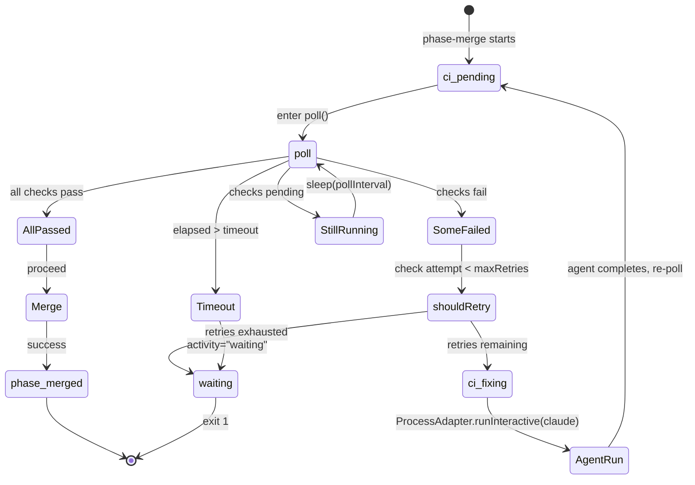

# Review Packet: Phase 5 - CI Failure Recovery via Agent Re-invocation

## Goals

This phase adds automatic CI failure recovery to `iw phase-merge`. When CI checks fail, instead of
immediately exiting, the command invokes a claude agent with a recovery prompt describing the
failures. The agent fixes the issue and pushes. The command then re-polls CI. This retry loop
continues up to `maxRetries` times. If retries are exhausted, review-state is set to
`activity: "waiting"` and the command exits non-zero.

Key objectives:

- Add `--max-retries` CLI flag (default `2`, non-negative integer validation)
- Restructure `poll()` to return `CIVerdict` instead of calling `sys.exit` on `SomeFailed`
- Add outer `retryLoop(attempt)` wrapping poll calls with agent invocation on failure
- Agent invocation via `ProcessAdapter.runInteractive` with recovery prompt (no timeout)
- Review-state transitions: `ci_fixing` during agent run, `ci_pending` after agent completes,
  `activity: "waiting"` on retries exhausted

## Scenarios

- [ ] `phase-merge` accepts `--max-retries <N>` flag (default `2`)
- [ ] Invalid `--max-retries` value (e.g., `abc`) produces clear error message and non-zero exit
- [ ] Negative `--max-retries` value produces clear error message and non-zero exit
- [ ] `--max-retries 0` disables recovery: exits immediately on CI failure without invoking agent
- [ ] On `SomeFailed` with retries remaining: invokes claude agent with recovery prompt containing failed check names and URLs
- [ ] Review-state transitions to `ci_fixing` with attempt counter display before agent runs
- [ ] Review-state transitions back to `ci_pending` after agent completes
- [ ] After agent completes, re-polls CI checks (does not blindly assume success)
- [ ] On CI pass after recovery: merges PR as usual (happy path unchanged)
- [ ] On retries exhausted: sets `activity: "waiting"` in review-state and exits non-zero with exhaustion message
- [ ] Agent invocation uses `ProcessAdapter.runInteractive` with `--dangerously-skip-permissions` flag
- [ ] All existing Phase 3/4 tests still pass

## Entry Points

| File | Method/Location | Why Start Here |
|------|-----------------|----------------|
| `.iw/commands/phase-merge.scala` | `maxRetriesStr` / `maxRetries` parsing (lines 13, 27-34) | Where `--max-retries` is extracted and validated |
| `.iw/commands/phase-merge.scala` | `poll()` return type change (line 98) | Core restructuring: now returns `CIVerdict` instead of calling `sys.exit` on `SomeFailed` |
| `.iw/commands/phase-merge.scala` | `retryLoop(attempt)` (lines 142-181) | Outer retry loop: agent invocation, review-state transitions, exhaustion handling |
| `.iw/test/phase-merge.bats` | Tests 12-15 (lines 305-471) | Four new E2E tests covering recovery scenarios |

## Diagrams

### Retry loop state machine



### Data flow: retry loop

```
retryLoop(attempt=0)
    │
    ├─ poll() ─────────────────────────────────────┐
    │   returns CIVerdict                           │
    │                                               │
    ├─ AllPassed / NoChecksFound ──► merge PR ──► done
    │
    └─ SomeFailed(failedChecks)
         │
         ├─ shouldRetry(attempt, config) == true
         │   │
         │   ├─ review-state → ci_fixing (attempt M/K)
         │   ├─ buildRecoveryPrompt(failedChecks)
         │   ├─ ProcessAdapter.runInteractive(claude -p prompt)
         │   ├─ review-state → ci_pending
         │   └─ retryLoop(attempt + 1)
         │
         └─ shouldRetry == false
             │
             ├─ review-state → activity: "waiting"
             └─ sys.exit(1)
```

### Agent invocation command

```
claude --dangerously-skip-permissions -p "<fullPrompt>"

fullPrompt =
  "You are fixing CI failures for PR <prUrl> (branch <currentBranch>).\n"
  + buildRecoveryPrompt(failedChecks) + "\n"
  + "Fix the issues, commit your changes, and push to the branch."
```

## Test Summary

### E2E tests (`phase-merge.bats`)

| Test | Type | Status |
|------|------|--------|
| `phase-merge --max-retries with invalid value exits non-zero with parse error` | E2E | New |
| `phase-merge --max-retries 0 exits non-zero immediately without invoking agent` | E2E | New |
| `phase-merge agent recovery succeeds: CI fails then passes after agent runs` | E2E | New |
| `phase-merge retries exhausted: review-state has activity waiting and exits non-zero` | E2E | New |

No new unit tests were needed — the pure functions `shouldRetry` and `buildRecoveryPrompt` were
already tested in Phase 1.

All 11 existing tests from Phases 3/4 are unchanged and must still pass.

## Files Changed

| File | Change |
|------|--------|
| `.iw/commands/phase-merge.scala` | Added `--max-retries` flag parsing and validation; changed `poll()` return type from `Unit` to `CIVerdict`; added `retryLoop(attempt)` with agent invocation and review-state transitions; replaced direct `poll()` call with `retryLoop(0)` |
| `.iw/test/phase-merge.bats` | Added 4 E2E tests: invalid flag, zero retries (no agent), successful recovery, and retries exhausted |

<details>
<summary>Diff summary</summary>

### `.iw/commands/phase-merge.scala`

**Flag parsing (lines 13, 27-34):**
- Extracts `--max-retries` using `PhaseArgs.namedArg` with default `"2"`.
- Validates with `toIntOption`: rejects non-integer and negative values with clear error messages.
- Passes `maxRetries` into `PhaseMergeConfig` construction.

**`poll()` restructuring (lines 98-141):**
- Return type changed from `Unit` to `CIVerdict`.
- `AllPassed` and `NoChecksFound` now return their verdict instead of falling through.
- `SomeFailed` returns the verdict instead of calling `sys.exit(1)`.
- `StillRunning` and `TimedOut` behavior unchanged (sleep/recurse and sys.exit respectively).

**`retryLoop(attempt)` (lines 142-183):**
- Tail-recursive outer loop wrapping `poll()`.
- On `SomeFailed`: calls `PhaseMerge.shouldRetry(attempt, mergeConfig)`.
- If retries remain: updates review-state to `ci_fixing` with attempt display, builds recovery
  prompt via `PhaseMerge.buildRecoveryPrompt`, invokes claude agent via
  `ProcessAdapter.runInteractive`, updates review-state back to `ci_pending`, recurses with
  `attempt + 1`.
- If retries exhausted: prints exhaustion message, sets `activity: "waiting"`, exits non-zero.
- On any other verdict (AllPassed, NoChecksFound): falls through to merge logic.

### `.iw/test/phase-merge.bats`

4 new BATS tests appended:

1. **Invalid `--max-retries`** — passes `abc`; expects exit 1 and "Invalid" in output.
2. **Zero retries** — mock `gh` returns failing checks, mock `claude` logs invocations; expects
   exit 1 and verifies `claude-calls.log` does not exist (agent never invoked).
3. **Recovery succeeds** — mock `gh` returns `FAILURE` on first call then `SUCCESS`; mock `claude`
   logs invocation; expects exit 0, agent invoked, recovery message in output, review-state updated
   to `phase_merged`.
4. **Retries exhausted** — mock `gh` always returns `FAILURE`; mock `claude` logs invocation;
   expects exit 1, agent invoked, exhaustion message in output, review-state has
   `activity: "waiting"`.

</details>
