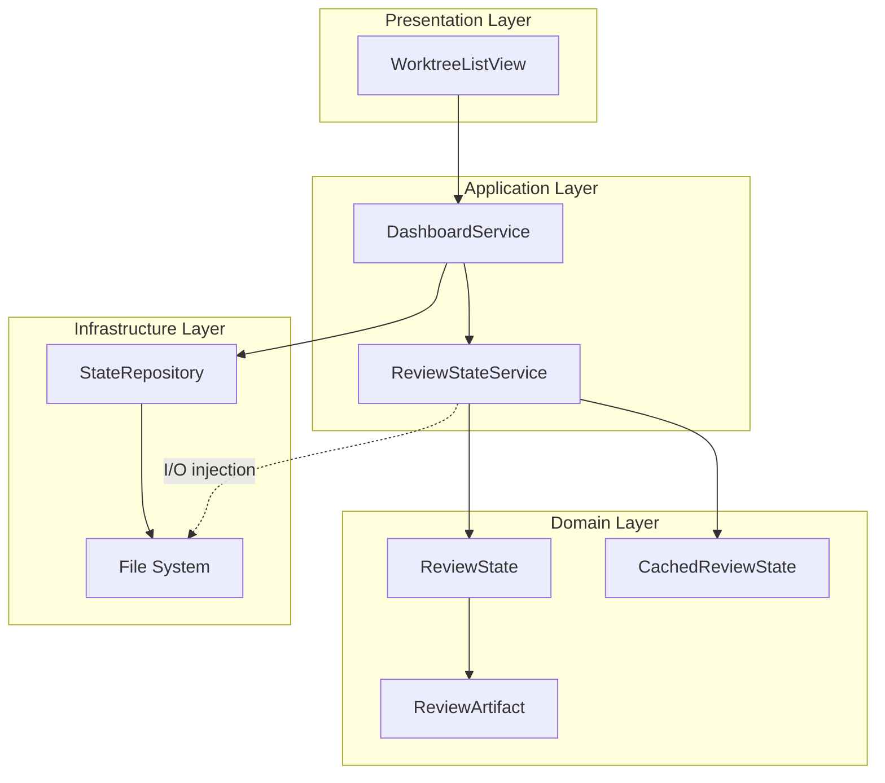
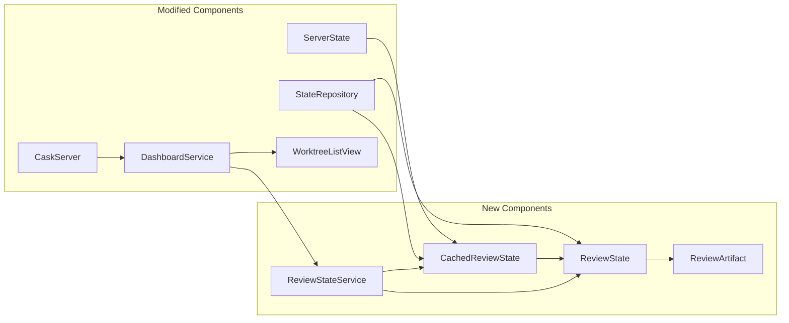
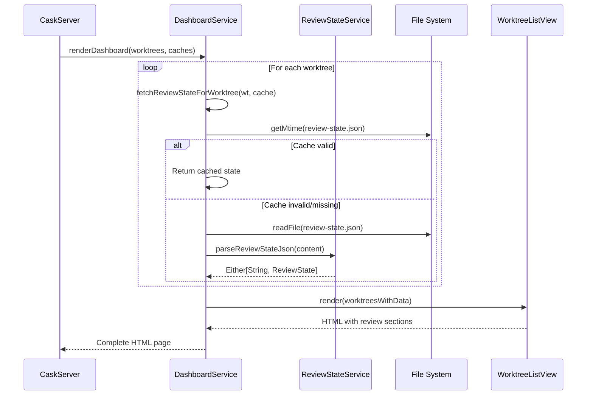
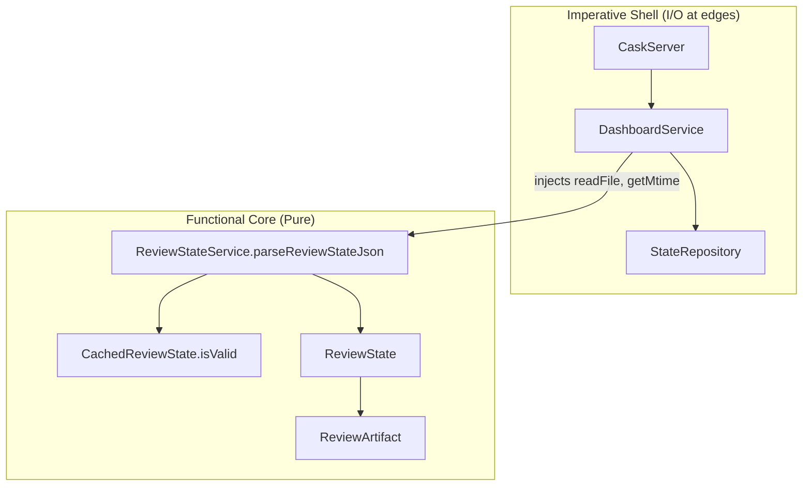

# Review Packet: Phase 1 - Display artifacts from state file

**Issue:** #46
**Phase:** 1 of 6
**Branch:** 46-phase-01

## Goals

This phase implements the **foundation** for displaying review artifacts in the dashboard:

1. **Review State Domain Model**: Define `ReviewState` and `ReviewArtifact` value objects
2. **JSON Parsing**: Parse `review-state.json` files using existing uJson library
3. **Review State Service**: Implement `ReviewStateService` with I/O injection pattern
4. **Dashboard Integration**: Extend `WorktreeListView` to display review artifacts section
5. **Graceful Degradation**: Handle missing/invalid state files without breaking dashboard

**Success Criteria:** Dashboard displays a "Review Artifacts" section on worktree cards when `project-management/issues/{issueId}/review-state.json` exists.

## Scenarios

- [ ] Dashboard shows "Review Artifacts" section when state file exists
- [ ] Artifact labels are displayed as list items
- [ ] Missing state files don't break dashboard rendering
- [ ] Invalid JSON doesn't crash the server
- [ ] Cache returns valid data when mtime unchanged
- [ ] Cache invalidates when file is modified (mtime changes)
- [ ] State persists across server restarts

## Entry Points

| File | Method/Class | Why Start Here |
|------|--------------|----------------|
| `ReviewStateService.scala:30` | `parseReviewStateJson` | Core JSON parsing logic - pure function |
| `ReviewStateService.scala:105` | `fetchReviewState` | Service orchestration with I/O injection |
| `DashboardService.scala:246` | `fetchReviewStateForWorktree` | Integration point - file I/O injection |
| `WorktreeListView.scala:128` | Review artifacts section | UI rendering - conditional display |
| `CachedReviewState.scala:28` | `isValid` | Cache validation logic - mtime comparison |

## Diagrams

### Architecture Overview

### Component Relationships

### Data Flow Sequence

### Layer Diagram (FCIS Pattern)

## Test Summary

| Test | Type | Verifies |
|------|------|----------|
| `ReviewStateTest."ReviewState requires artifacts list"` | Unit | Domain model requires artifacts |
| `ReviewStateTest."ReviewState accepts optional status, phase, message"` | Unit | Optional fields work as None |
| `ReviewStateTest."ReviewArtifact has label and path"` | Unit | Artifact structure correct |
| `ReviewStateTest."ReviewState can have multiple artifacts"` | Unit | List handling works |
| `ReviewStateTest."ReviewState can have empty artifacts list"` | Unit | Empty list is valid |
| `CachedReviewStateTest."isValid returns true when mtimes match"` | Unit | Cache hit detection |
| `CachedReviewStateTest."isValid returns false when mtime changed"` | Unit | Cache invalidation on change |
| `CachedReviewStateTest."isValid returns false when file added"` | Unit | Cache invalidation on add |
| `CachedReviewStateTest."isValid returns false when file removed"` | Unit | Cache invalidation on remove |
| `ReviewStateServiceTest."parseReviewStateJson parses valid JSON with all fields"` | Unit | Full JSON parsing |
| `ReviewStateServiceTest."parseReviewStateJson parses minimal JSON (only artifacts)"` | Unit | Lenient parsing |
| `ReviewStateServiceTest."parseReviewStateJson returns error for missing artifacts"` | Unit | Required field validation |
| `ReviewStateServiceTest."parseReviewStateJson returns error for invalid JSON syntax"` | Unit | Syntax error handling |
| `ReviewStateServiceTest."parseReviewStateJson handles optional fields as None"` | Unit | Optional field handling |
| `ReviewStateServiceTest."parseReviewStateJson handles multiple artifacts"` | Unit | Multiple artifacts |
| `ReviewStateServiceTest."parseReviewStateJson handles empty artifacts list"` | Unit | Empty list parsing |
| `ReviewStateServiceTest."fetchReviewState returns cached state when mtime unchanged"` | Integration | Cache hit path |
| `ReviewStateServiceTest."fetchReviewState re-reads file when mtime changed"` | Integration | Cache miss path |
| `ReviewStateServiceTest."fetchReviewState returns error for missing file"` | Integration | Missing file handling |
| `ReviewStateServiceTest."fetchReviewState returns error for invalid JSON"` | Integration | Parse error handling |
| `ReviewStateServiceTest."fetchReviewState handles cache miss"` | Integration | Cold start path |
| `StateRepositoryTest."StateRepository serializes ReviewState"` | Integration | JSON serialization |
| `StateRepositoryTest."StateRepository serializes CachedReviewState"` | Integration | Cache serialization |
| `StateRepositoryTest."StateRepository deserializes reviewStateCache"` | Integration | JSON deserialization |
| `StateRepositoryTest."StateRepository handles missing reviewStateCache gracefully"` | Integration | Backward compatibility |
| `ServerStateTest."ServerState includes reviewStateCache"` | Unit | State structure |
| `ServerStateTest."ServerState.removeWorktree clears review state cache"` | Unit | Cache cleanup |

## Files Changed

**13 files changed** (6 new, 7 modified)

Full file list

**New Files:**
- `.iw/core/ReviewState.scala` (A) - Domain models
- `.iw/core/CachedReviewState.scala` (A) - Cache wrapper with validation
- `.iw/core/ReviewStateService.scala` (A) - Application service
- `.iw/core/test/ReviewStateTest.scala` (A) - Domain model tests
- `.iw/core/test/CachedReviewStateTest.scala` (A) - Cache validation tests
- `.iw/core/test/ReviewStateServiceTest.scala` (A) - Service tests

**Modified Files:**
- `.iw/core/ServerState.scala` (M) - Added reviewStateCache field
- `.iw/core/StateRepository.scala` (M) - Added serialization for review types
- `.iw/core/DashboardService.scala` (M) - Added fetchReviewStateForWorktree
- `.iw/core/WorktreeListView.scala` (M) - Added review artifacts section
- `.iw/core/CaskServer.scala` (M) - Pass reviewStateCache to dashboard
- `.iw/core/test/ServerStateTest.scala` (M) - Added reviewStateCache tests
- `.iw/core/test/StateRepositoryTest.scala` (M) - Added serialization tests

## Key Design Decisions

| Decision | Choice | Rationale |
|----------|--------|-----------|
| I/O Pattern | Injection via function parameters | Enables pure functional core, easy testing |
| Cache Key | Issue ID | Matches existing cache patterns |
| Cache Validation | mtime-based | Proven pattern from CachedProgress |
| Required Fields | Only `artifacts` | Lenient parsing for forward/backward compatibility |
| Error Handling | Either[String, ReviewState] | Explicit error paths, graceful degradation |

## Review Notes

This implementation follows the established patterns in the codebase:
- **WorkflowProgressService** pattern for I/O injection
- **CachedProgress** pattern for mtime-based cache validation
- **StateRepository** pattern for JSON serialization
- **Scalatags** for HTML rendering

The code is fully tested with 27 tests covering:
- Domain model construction
- Cache validation logic
- JSON parsing (valid, invalid, missing fields)
- Service integration (cache hit/miss, file errors)
- State serialization/deserialization
