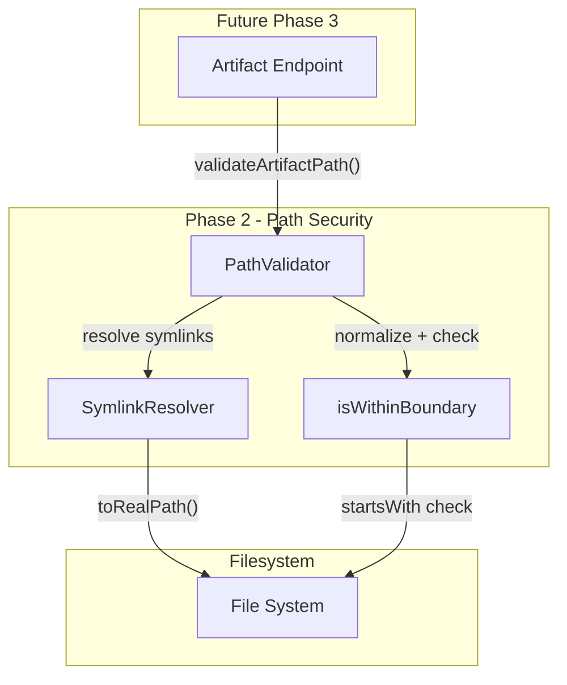
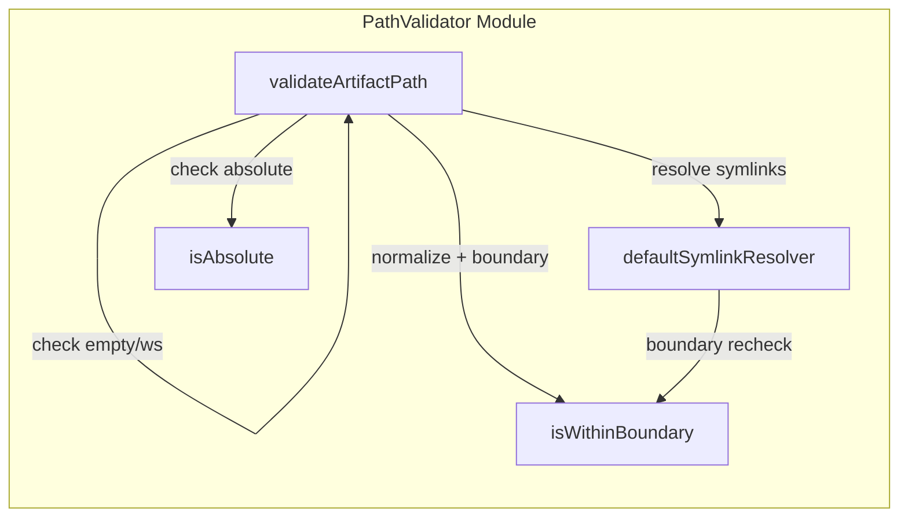
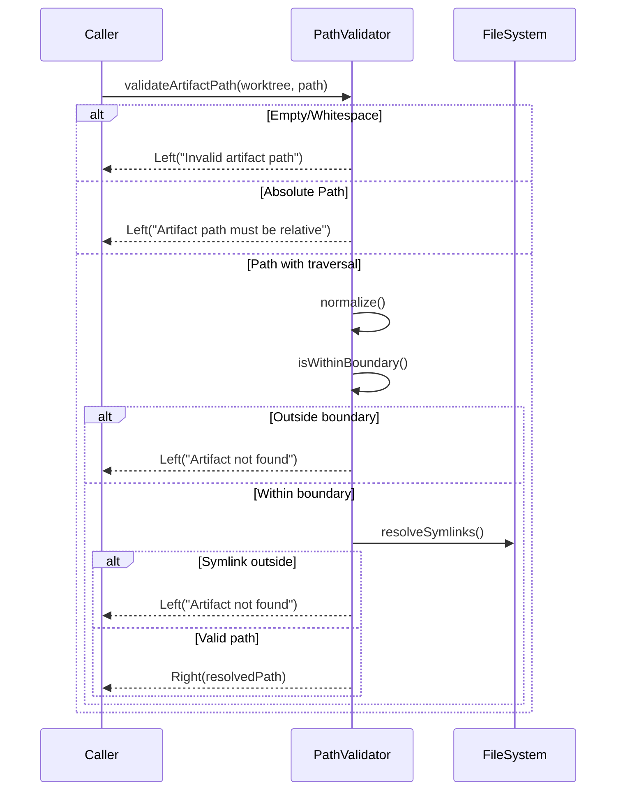
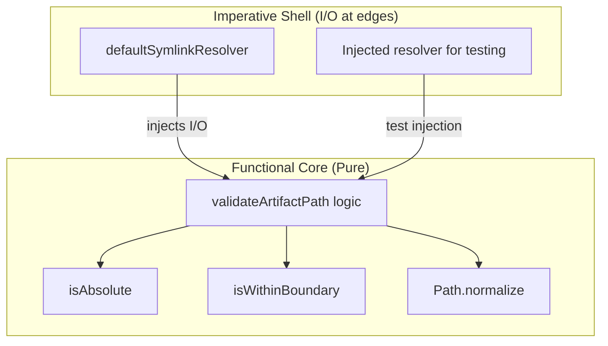

# Review Packet: Phase 2 - Path validation security

**Issue:** #46
**Phase:** 2 of 6
**Branch:** 46-phase-02

## Goals

This phase implements **security validation** for artifact paths to prevent directory traversal attacks:

1. **PathValidator module**: Pure functions for validating artifact paths
2. **Canonical path resolution**: Normalize paths and detect traversal attempts
3. **Worktree boundary enforcement**: Ensure paths stay within worktree root
4. **Error messages**: Secure error messages that don't leak filesystem structure

**Success Criteria:** All artifact path validation rejects malicious paths (../, absolute, symlinks outside worktree) while allowing legitimate paths within worktree boundaries.

## Scenarios

- [ ] Relative paths within worktree are accepted
- [ ] Absolute Unix paths (/etc/passwd) are rejected
- [ ] Absolute Windows paths (C:\Windows) are rejected
- [ ] Empty and whitespace-only paths are rejected
- [ ] Simple traversal paths (../../../etc/passwd) are rejected
- [ ] Embedded traversal paths (a/../../../etc/passwd) are rejected
- [ ] Paths with ".." that stay within boundary are accepted
- [ ] Filenames containing ".." (file..name.md) are accepted
- [ ] Symlinks pointing outside worktree are rejected
- [ ] Symlinks pointing within worktree are accepted
- [ ] Broken symlinks are handled gracefully
- [ ] Unicode path components are supported
- [ ] Special characters in filenames are supported
- [ ] Error messages don't leak filesystem structure

## Entry Points

| File | Method/Class | Why Start Here |
|------|--------------|----------------|
| `PathValidator.scala:17` | `validateArtifactPath` | Main entry point - orchestrates all validation steps |
| `PathValidator.scala:60` | `isWithinBoundary` | Core security check - determines if path escapes boundary |
| `PathValidator.scala:49` | `isAbsolute` | First-line defense - rejects absolute paths |
| `PathValidator.scala:72` | `defaultSymlinkResolver` | I/O boundary - handles real filesystem symlinks |
| `PathValidatorTest.scala:18` | `PathValidatorTest` | Test suite entry - validates all security scenarios |

## Diagrams

### Architecture Overview

### Component Relationships

### Validation Flow

### Layer Diagram (FCIS Pattern)

## Test Summary

| Test | Type | Verifies |
|------|------|----------|
| `PathValidatorTest."validateArtifactPath accepts valid relative path within worktree"` | Unit | Valid paths work |
| `PathValidatorTest."validateArtifactPath rejects empty path"` | Unit | Empty path rejection |
| `PathValidatorTest."validateArtifactPath rejects whitespace-only path"` | Unit | Whitespace-only rejection |
| `PathValidatorTest."validateArtifactPath rejects absolute Unix path"` | Unit | Unix absolute path blocked |
| `PathValidatorTest."validateArtifactPath rejects absolute Windows path"` | Unit | Windows absolute path blocked |
| `PathValidatorTest."validateArtifactPath rejects simple traversal"` | Unit | ../../../ traversal blocked |
| `PathValidatorTest."validateArtifactPath rejects embedded traversal"` | Unit | a/../../../ traversal blocked |
| `PathValidatorTest."validateArtifactPath accepts path with .. that stays within boundary"` | Unit | Safe .. usage allowed |
| `PathValidatorTest."validateArtifactPath accepts filename containing .. like file..name.md"` | Unit | Double dots in filename OK |
| `PathValidatorTest."isWithinBoundary returns true when path is under base"` | Unit | Boundary detection works |
| `PathValidatorTest."isWithinBoundary returns false when path escapes base"` | Unit | Escape detection works |
| `PathValidatorTest."isWithinBoundary handles equal paths"` | Unit | Same directory handling |
| `PathValidatorTest."validateArtifactPath rejects symlink pointing outside worktree"` | Integration | Symlink escape blocked |
| `PathValidatorTest."validateArtifactPath accepts symlink pointing within worktree"` | Integration | Valid symlinks work |
| `PathValidatorTest."validateArtifactPath handles broken symlinks gracefully"` | Integration | Broken symlink handling |
| `PathValidatorTest."validateArtifactPath end-to-end with real worktree path"` | E2E | Full validation flow |
| `PathValidatorTest."validateArtifactPath handles Unicode path components"` | Unit | Unicode support |
| `PathValidatorTest."validateArtifactPath handles special characters in filenames"` | Unit | Special char support |

## Files Changed

**2 files changed** (2 new, 0 modified)

Full file list

**New Files:**
- `.iw/core/PathValidator.scala` (A) - Pure validation functions with I/O injection
- `.iw/core/test/PathValidatorTest.scala` (A) - Comprehensive security tests

## Key Design Decisions

| Decision | Choice | Rationale |
|----------|--------|-----------|
| I/O Pattern | Injection via function parameter | Enables pure functional core, testable without filesystem |
| Error Messages | Generic, no path details | Security - don't leak filesystem structure to attackers |
| Boundary Check | Path.startsWith after normalize | Reliable cross-platform detection of escape attempts |
| Symlink Handling | toRealPath() with boundary recheck | Ensures symlink targets also within boundary |
| Platform Support | Windows (C:\) + Unix (/) detection | Cross-platform security coverage |

## Review Notes

This implementation follows FCIS (Functional Core, Imperative Shell) pattern:
- All path validation logic is pure (no I/O)
- Symlink resolution is injected, allowing pure tests with mock resolver
- Integration tests use real filesystem for symlink scenarios

**Security considerations:**
- Error messages intentionally vague ("Artifact not found" vs "Path escapes boundary")
- Uses java.nio.file.Path which handles Unicode normalization attacks
- Double boundary check: before and after symlink resolution

**For Phase 3 integration:**
- Import PathValidator and call validateArtifactPath before any file read
- Pass worktree root as first parameter
- Handle Left results as 404/403 errors
