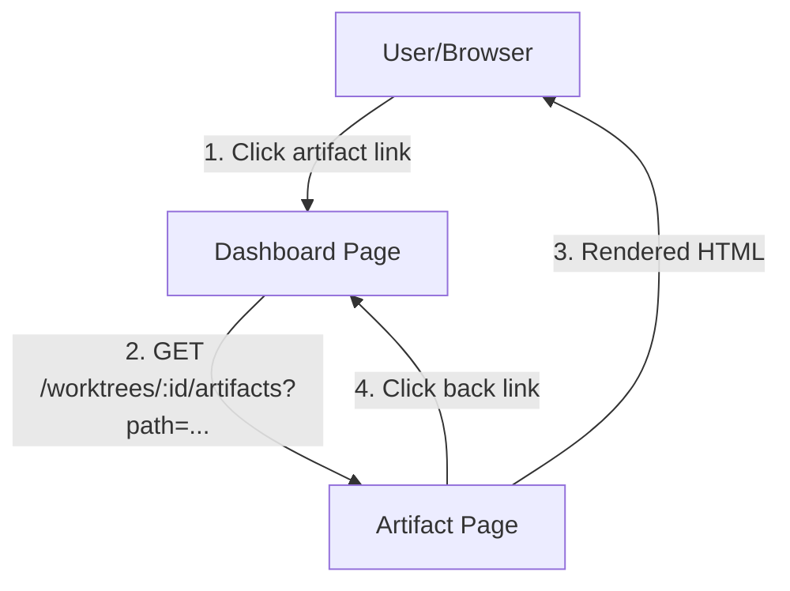
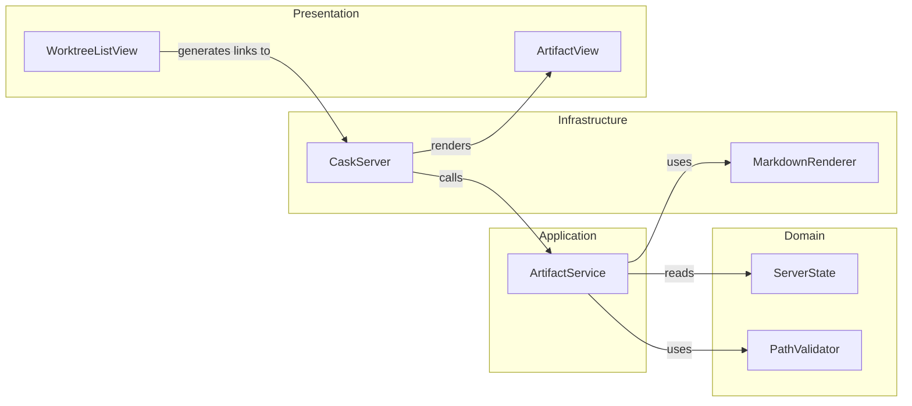
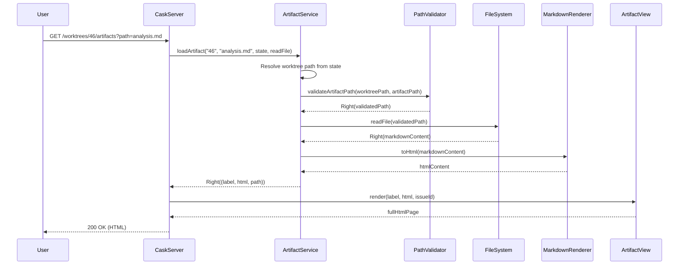
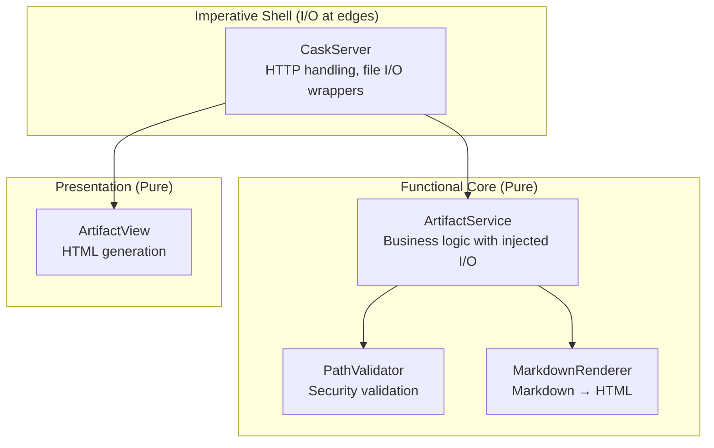

# Review Packet: Phase 3 - View Artifact Content

**Issue:** #46
**Phase:** 3 of 6
**Story:** Click artifact to view rendered markdown content

---

## Goals

This phase enables users to click on review artifacts in the dashboard and view their markdown content rendered as HTML in a readable format. The implementation focuses on:

1. **HTTP endpoint** to serve artifact content with path validation
2. **Server-side markdown rendering** to convert markdown files to HTML using flexmark
3. **Server-rendered artifact page** with navigation back to dashboard
4. **Security integration** using PathValidator from Phase 2
5. **Clean separation** between artifact viewing and list display

**What success looks like:**
- User clicks "Analysis" artifact → sees rendered analysis.md as HTML
- User clicks "Back to Dashboard" → returns to worktree list
- Invalid paths → clear error message, no filesystem leaks
- Large markdown files (>100KB) → render without issues

---

## Scenarios

From Story 2 acceptance criteria:

- [ ] Artifact links are clickable in dashboard
- [ ] Clicking link navigates to `/worktrees/:issueId/artifacts?path=...`
- [ ] Markdown is rendered with proper formatting (headers, lists, code blocks, tables)
- [ ] Page includes "Back to Dashboard" link
- [ ] Page shows artifact filename and issue ID in header
- [ ] Can view first artifact, return to dashboard, view second artifact
- [ ] Each artifact shows its own content (no caching issues)
- [ ] Back button works from any artifact view
- [ ] Missing file shows "Artifact not found" error page
- [ ] Invalid path (traversal) shows "Artifact not found" error page
- [ ] Worktree not found shows clear error
- [ ] Missing path param shows 400 error
- [ ] Errors don't leak filesystem structure

---

## Entry Points

| File | Method/Class | Why Start Here |
|------|--------------|----------------|
| `.iw/core/CaskServer.scala:57` | `artifactPage()` | HTTP entry point - handles `/worktrees/:issueId/artifacts` route |
| `.iw/core/ArtifactService.scala:21` | `loadArtifact()` | Orchestrates the business logic - path validation, file reading, markdown rendering |
| `.iw/core/MarkdownRenderer.scala:22` | `toHtml()` | Infrastructure - converts markdown to HTML using flexmark |
| `.iw/core/presentation/views/ArtifactView.scala:16` | `render()` | Presentation layer - generates full HTML page with rendered content |
| `.iw/core/WorktreeListView.scala:134` | Artifact link generation | Dashboard update - makes artifact labels clickable |

---

## Diagrams

### Architecture Overview (Context Diagram)



### Component Relationships



### Key Flow: Artifact Viewing (Sequence Diagram)



### Layer Diagram (FCIS Architecture)



---

## Test Summary

| Test | Type | Verifies |
|------|------|----------|
| **MarkdownRendererTest** | | |
| `renders basic markdown headers` | Unit | H1-H4 rendering |
| `renders paragraphs` | Unit | Paragraph separation |
| `renders unordered lists` | Unit | UL/LI elements |
| `renders ordered lists` | Unit | OL/LI elements |
| `renders inline code` | Unit | Code tag generation |
| `renders code blocks with language tags` | Unit | Fenced code blocks |
| `renders tables (GFM style)` | Unit | Table structure |
| `renders links` | Unit | Anchor tags with href |
| `renders autolinks` | Unit | URL auto-linking |
| `renders blockquotes` | Unit | Blockquote elements |
| `handles empty input` | Unit | Edge case - empty string |
| `escapes special HTML characters` | Unit | XSS prevention |
| `renders nested lists` | Unit | Nested UL/LI |
| `renders strikethrough (GFM extension)` | Unit | DEL tag |
| `handles large markdown input` | Unit | Performance with 1000 sections |
| **ArtifactServiceTest** | | |
| `loadArtifact succeeds with valid issueId and path` | Unit | Happy path |
| `loadArtifact returns Left when worktree not found` | Unit | Error handling |
| `loadArtifact returns Left when PathValidator rejects path (absolute)` | Unit | Security |
| `loadArtifact returns Left when PathValidator rejects path (traversal)` | Unit | Security |
| `loadArtifact returns Left when file read fails` | Unit | Error propagation |
| `loadArtifact integrates with MarkdownRenderer` | Unit | Integration |
| `extractLabel returns filename from path` | Unit | Label extraction |
| `extractLabel handles single filename` | Unit | Edge case |
| `loadArtifact returns correct worktree path` | Unit | Return value |
| `loadArtifact handles nested artifact paths` | Unit | Complex paths |
| `loadArtifact preserves markdown rendering errors` | Unit | Empty input handling |
| **ArtifactViewTest** | | |
| `render produces valid HTML5 document structure` | Unit | HTML structure |
| `render includes artifact label in title` | Unit | Title element |
| `render includes artifact label in h1` | Unit | Heading |
| `render includes issueId in subtitle` | Unit | Issue context |
| `render back link points to dashboard` | Unit | Navigation |
| `render includes rendered HTML in content div` | Unit | Content injection |
| `render includes CSS styles` | Unit | Styling |
| `renderError produces error page structure` | Unit | Error page |
| `renderError includes back link to dashboard` | Unit | Error navigation |
| `renderError displays error message` | Unit | Error display |
| `renderError includes return link` | Unit | Error recovery |
| `render handles special characters in labels` | Unit | Edge case |
| **WorktreeListViewTest** | | |
| `artifact list items contain anchor tags` | Unit | Link generation |

**Total:** 38 tests (15 MarkdownRenderer + 11 ArtifactService + 12 ArtifactView + updated WorktreeListView)

---

## Files Changed

**9 files changed** (6 new, 3 modified)

### New Files (6)

| File | Purpose |
|------|---------|
| `.iw/core/ArtifactService.scala` | Application service for artifact loading with I/O injection |
| `.iw/core/MarkdownRenderer.scala` | Infrastructure for markdown-to-HTML conversion |
| `.iw/core/presentation/views/ArtifactView.scala` | Presentation layer for artifact page rendering |
| `.iw/core/test/MarkdownRendererTest.scala` | 15 unit tests for markdown rendering |
| `.iw/core/test/ArtifactServiceTest.scala` | 11 unit tests for artifact service |
| `.iw/core/test/ArtifactViewTest.scala` | 12 unit tests for view rendering |

### Modified Files (3)

| File | Changes |
|------|---------|
| `.iw/core/project.scala` | Added flexmark-all:0.64.8 dependency |
| `.iw/core/CaskServer.scala` | Added `/worktrees/:issueId/artifacts` route handler |
| `.iw/core/WorktreeListView.scala` | Changed artifact labels to clickable links |

<details>
<summary>Full file list</summary>

```
A  .iw/core/ArtifactService.scala
A  .iw/core/MarkdownRenderer.scala
A  .iw/core/presentation/views/ArtifactView.scala
A  .iw/core/test/ArtifactServiceTest.scala
A  .iw/core/test/ArtifactViewTest.scala
A  .iw/core/test/MarkdownRendererTest.scala
M  .iw/core/CaskServer.scala
M  .iw/core/WorktreeListView.scala
M  .iw/core/project.scala
```

</details>

---

## Key Design Decisions

1. **Server-rendered pages over modals**: Simpler, testable, accessible, follows existing Cask patterns
2. **FCIS pattern**: I/O injection in ArtifactService for testability
3. **Flexmark library**: Full GFM support (tables, code blocks, strikethrough)
4. **PathValidator integration**: Security from Phase 2 prevents directory traversal
5. **Generic error messages**: "Artifact not found" doesn't leak filesystem structure

---

## Security Considerations

- PathValidator called before any file read
- Absolute paths rejected
- Directory traversal (`../`) rejected
- Symlinks outside worktree rejected
- Error messages don't expose filesystem paths
- XSS prevented by flexmark's HTML escaping
