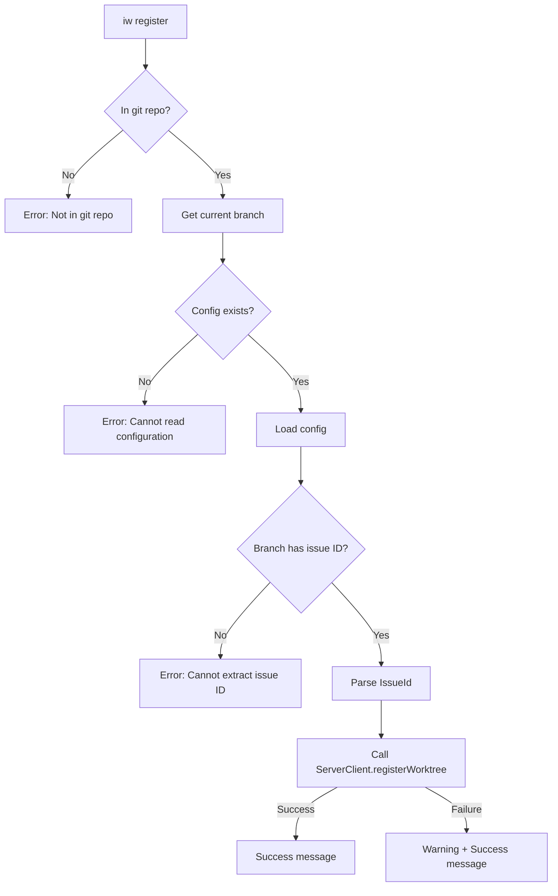
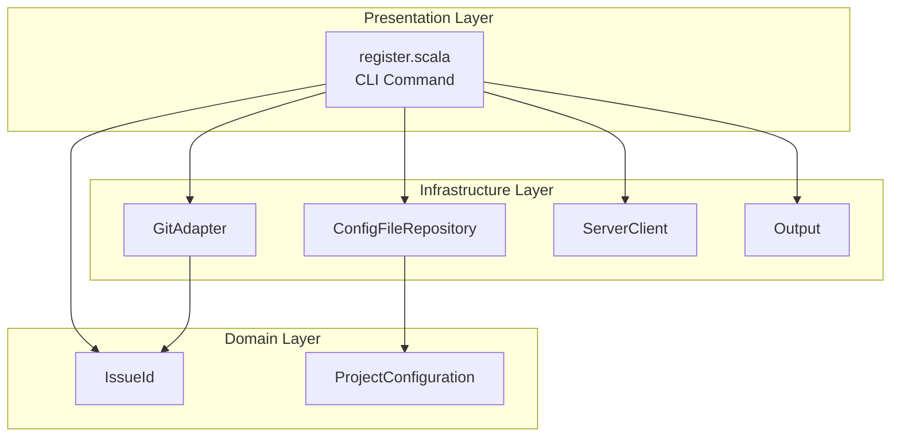

# Review Packet: Phase 1 - Register current worktree to dashboard

**Issue:** IW-63
**Phase:** 1 of 1
**PR:** https://github.com/iterative-works/iw-cli/pull/65

## Goals

Implement the `iw register` command that allows users to manually register worktrees created outside of `iw start` with the dashboard. The command:

1. Auto-detects the issue ID from the current git branch
2. Registers the current working directory path with the dashboard server
3. Provides clear error messages for invalid states
4. Treats dashboard failures as warnings (best-effort, exit 0)

**User Story:** As a developer working in an existing worktree, I want to run `iw register` without arguments so that the worktree is automatically detected and registered to the dashboard.

## Scenarios

- [ ] **Success case:** Run `iw register` in worktree with branch `IW-63-foo` → outputs "Registered worktree for IW-63 at [path]"
- [ ] **Not in git repo:** Run `iw register` outside git repo → outputs error about git
- [ ] **Branch without issue ID:** Run `iw register` on branch `main` → outputs "Cannot extract issue ID from branch 'main'"
- [ ] **Missing config:** Run `iw register` without `.iw/config.conf` → outputs "Cannot read configuration"
- [ ] **Dashboard failure:** Run when dashboard unavailable → outputs warning but exits 0
- [ ] **Lowercase branch:** Run on branch `iwle-999` → normalizes to `IWLE-999` in output

## Entry Points

| File | Method/Class | Why Start Here |
|------|--------------|----------------|
| `.iw/commands/register.scala` | `@main def register` | Main entry point - orchestrates the entire command flow |
| `.iw/commands/register.scala:12` | `GitAdapter.getCurrentBranch` | First validation - checks git repo and gets branch |
| `.iw/commands/register.scala:30` | `IssueId.fromBranch` | Core logic - extracts issue ID from branch name |
| `.iw/commands/register.scala:38` | `ServerClient.registerWorktree` | Dashboard integration - registers with server |

## Diagrams

### Component Flow

### Layer Diagram (FCIS)

## Test Summary

| Test | Type | Verifies |
|------|------|----------|
| `register succeeds in valid worktree with issue branch` | E2E | Happy path - command outputs success with issue ID and path |
| `register fails when not in a git repository` | E2E | Error handling for non-git directory |
| `register fails on branch without issue ID` | E2E | Error handling for branches like `main` or `feature-xyz` |
| `register fails without config file` | E2E | Error handling when `.iw/config.conf` missing |
| `register shows warning if dashboard communication fails but exits 0` | E2E | Best-effort behavior - warns but succeeds |
| `register converts lowercase issue ID from branch to uppercase` | E2E | Case normalization - `iwle-999` → `IWLE-999` |

**Test coverage:** 6 E2E tests covering all acceptance criteria scenarios

## Files Changed

**6 files changed**, +229 insertions, -19 deletions

Full file list

| File | Status | Description |
|------|--------|-------------|
| `.iw/commands/register.scala` | A | New CLI command (50 lines) |
| `.iw/test/register.bats` | A | E2E test suite (113 lines) |
| `project-management/issues/IW-63/implementation-log.md` | A | Implementation tracking |
| `project-management/issues/IW-63/phase-01-tasks.md` | M | Task checkboxes updated |
| `project-management/issues/IW-63/review-state.json` | M | Review state updated |
| `project-management/issues/IW-63/tasks.md` | M | Phase marked complete |

## Code Review Notes

**Code review passed** with no critical issues or warnings. 4 minor suggestions noted:

1. **Style:** Order of checks (branch then config) differs from `open.scala` (config then branch) - acceptable given the different error messaging goals
2. **Scala3:** Unused `args` parameter - acceptable for CLI command extensibility
3. **Testing:** Permissive assertion patterns - still validates correct behavior
4. **Testing:** Cleanup order in one test - minor debugging impact only

## Comparison to Similar Commands

The implementation follows established patterns from `open.scala` and `start.scala`:

| Aspect | register.scala | open.scala | start.scala |
|--------|---------------|------------|-------------|
| Config loading | ✓ Same pattern | ✓ | ✓ |
| Error messages | ✓ Same pattern | ✓ | ✓ |
| Dashboard call | Best-effort (warn) | Best-effort (warn) | Best-effort (warn) |
| Issue ID source | Branch only | Args or branch | Args required |
