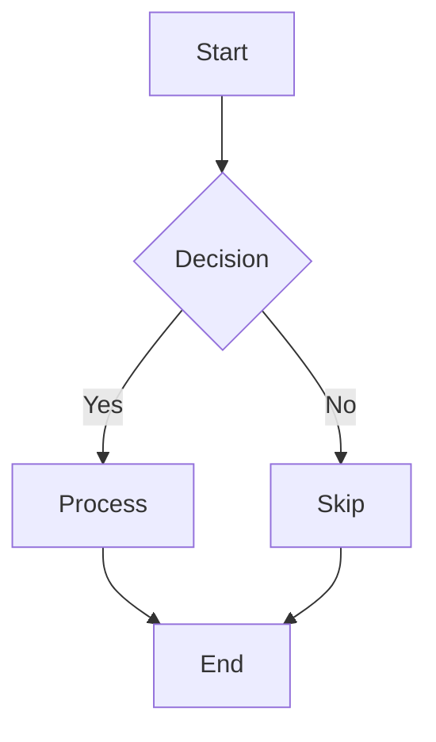
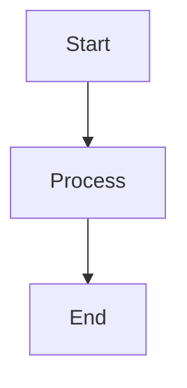

# Phase 1 Context: Render Mermaid flowchart diagram

**Issue:** IW-67
**Phase:** 1 of 3
**Story:** Story 1 - Render Mermaid flowchart diagram
**Estimated Effort:** 3-4 hours

---

## Goals

Enable rendering of Mermaid diagrams in the artifact viewer by:
1. Adding Mermaid.js library (v10.9.4 from jsDelivr CDN) to the artifact viewer HTML
2. Post-processing markdown-generated HTML to convert Mermaid code blocks into Mermaid-renderable divs
3. Initializing Mermaid.js with the `neutral` theme to render diagrams on page load
4. Ensuring non-Mermaid code blocks remain unchanged (no regression)

**User Value:** Documentation authors can create visual diagrams (flowcharts, sequence diagrams, etc.) directly in markdown without external tools.

---

## Scope

### In Scope for Phase 1
- Add `<script>` tag for Mermaid.js v10.9.4 from jsDelivr CDN to `ArtifactView.render()`
- Add Mermaid initialization script with `neutral` theme to `ArtifactView.render()`
- Post-process HTML in `MarkdownRenderer.toHtml()` to convert `<pre><code class="language-mermaid">` to `<div class="mermaid">`
- Preserve HTML entity encoding in Mermaid content during transformation
- Unit tests for HTML post-processing in `MarkdownRendererTest`
- Unit tests for script tag inclusion in `ArtifactViewTest`
- Manual browser verification of flowchart rendering (E2E test)

### Out of Scope for Phase 1
- Error handling for invalid Mermaid syntax (Phase 2)
- Testing multiple diagram types beyond flowchart (Phase 3 - validation only)
- Custom Mermaid themes or styling beyond `neutral` theme
- Offline support or self-hosted Mermaid.js
- CSP headers or SRI hashes (not needed for local dev tool)
- Dark mode support (dashboard is light theme only)

---

## Dependencies

### Existing Codebase Components

**Files that exist and will be modified:**
- `/home/mph/Devel/projects/iw-cli-IW-67/.iw/core/MarkdownRenderer.scala`
  - Current: Converts markdown to HTML using flexmark with GFM extensions
  - Needed: Post-process HTML output to transform Mermaid code blocks
  
- `/home/mph/Devel/projects/iw-cli-IW-67/.iw/core/presentation/views/ArtifactView.scala`
  - Current: Renders full HTML page with markdown content
  - Needed: Add Mermaid.js script tags and initialization

**Test files that exist and will be extended:**
- `/home/mph/Devel/projects/iw-cli-IW-67/.iw/core/test/MarkdownRendererTest.scala`
  - Current: Tests markdown-to-HTML conversion for GFM features
  - Needed: Add tests for Mermaid code block transformation

- `/home/mph/Devel/projects/iw-cli-IW-67/.iw/core/test/ArtifactViewTest.scala`
  - Current: Tests HTML structure and rendering
  - Needed: Add tests for Mermaid.js script tag inclusion

**No prior phases:** This is Phase 1, so no dependencies on previous implementation phases.

**External dependency:**
- Mermaid.js v10.9.4 from jsDelivr CDN: `https://cdn.jsdelivr.net/npm/mermaid@10.9.4/dist/mermaid.min.js`
  - Rationale: Latest stable version with security backports, well-documented, reliable CDN

---

## Technical Approach

### High-Level Strategy

**Integration Point 1: MarkdownRenderer (Server-side transformation)**

Flexmark already renders ` ```mermaid ` code blocks as:
```html
<pre><code class="language-mermaid">graph TD
  A[Start] --&gt; B[End]
</code></pre>
```

We need to post-process this HTML to:
```html
<div class="mermaid">graph TD
  A[Start] --> B[End]
</div>
```

**Why server-side?**
- More reliable than client-side JavaScript manipulation
- Testable at unit level (verify HTML output)
- Avoids flash of unstyled content
- Follows existing flexmark extension patterns

**Implementation approach:**
1. After flexmark renders HTML, scan for `<pre><code class="language-mermaid">` patterns
2. Extract code content (preserving decoded HTML entities)
3. Replace with `<div class="mermaid">content</div>`
4. Return transformed HTML

**Integration Point 2: ArtifactView (Client-side rendering)**

Add to the `<head>` section:
```html
<script src="https://cdn.jsdelivr.net/npm/mermaid@10.9.4/dist/mermaid.min.js"></script>
<script>
  mermaid.initialize({ startOnLoad: true, theme: 'neutral' });
</script>
```

**Why `neutral` theme?**
- Grayscale/minimal colors work with artifact viewer's clean aesthetic
- No custom CSS needed
- Good contrast with white background

### Technical Decisions from Analysis

1. **CDN Source:** jsDelivr with exact version pin (v10.9.4)
   - Ensures reproducibility
   - Security fixes included
   - Fast and reliable

2. **Theme:** Mermaid `neutral` theme
   - Visual consistency with artifact viewer
   - No additional styling needed

3. **Integration:** Post-process HTML in MarkdownRenderer
   - Server-side transformation (testable, reliable)
   - Mermaid.js auto-renders `<div class="mermaid">` on page load

4. **No CSP/SRI:** Local development tool, not needed

### HTML Entity Handling

Flexmark HTML-encodes special characters in code blocks:
- `<` becomes `&lt;`
- `>` becomes `&gt;`
- `&` becomes `&amp;`

The browser automatically decodes these when reading `.textContent` of a DOM node. Our transformation must:
1. Parse the HTML to access decoded text content
2. Preserve the decoded content in the `<div class="mermaid">` output

**Important:** Mermaid.js expects raw syntax (e.g., `A --> B`), not encoded syntax (e.g., `A --&gt; B`).

---

## Files to Modify

### 1. `.iw/core/MarkdownRenderer.scala`

**Changes needed:**
- Add post-processing function after flexmark rendering
- Parse HTML output to find `<pre><code class="language-mermaid">` blocks
- Transform matched blocks to `<div class="mermaid">` with decoded content
- Return transformed HTML

**Implementation notes:**
- Use simple string manipulation or basic HTML parsing
- Preserve all other HTML structure unchanged
- Handle multiple Mermaid blocks in same document
- Ensure HTML entities are properly decoded

### 2. `.iw/core/presentation/views/ArtifactView.scala`

**Changes needed:**
- Add Mermaid.js `<script>` tag to `<head>` section
- Add initialization script with `neutral` theme configuration

**Implementation notes:**
- Use scalatags to add script tags
- Place before closing `</head>` tag
- Use `raw()` for script content to avoid escaping

### 3. `.iw/core/test/MarkdownRendererTest.scala`

**New tests needed:**
- Test that basic Mermaid flowchart code block is transformed to `<div class="mermaid">`
- Test that transformed content has HTML entities decoded
- Test that multiple Mermaid blocks are all transformed
- Test that non-Mermaid code blocks (e.g., `scala`, `javascript`) are NOT transformed
- Test that Mermaid block with special characters (arrows `-->`, etc.) is handled correctly

**Regression tests:**
- Run existing test suite to ensure no regressions in markdown rendering
- Verify tables, code blocks, headers, lists still render correctly

### 4. `.iw/core/test/ArtifactViewTest.scala`

**New tests needed:**
- Test that rendered HTML includes Mermaid.js script tag with correct CDN URL
- Test that rendered HTML includes initialization script
- Test that initialization script configures `neutral` theme
- Test that script tags are in the `<head>` section

**Regression tests:**
- Run existing test suite to ensure no regressions in page structure
- Verify back links, titles, content div still render correctly

---

## Testing Strategy

### Unit Tests (Automated)

**MarkdownRendererTest additions:**

```scala
test("transforms mermaid code block to mermaid div"):
  val markdown = """```mermaid
                   |graph TD
                   |  A[Start] --> B[End]
                   |```""".stripMargin
  val html = MarkdownRenderer.toHtml(markdown)
  
  assert(html.contains("<div class=\"mermaid\">"))
  assert(html.contains("graph TD"))
  assert(html.contains("A[Start] --> B[End]"))
  assert(!html.contains("<pre><code class=\"language-mermaid\">"))

test("preserves non-mermaid code blocks"):
  val markdown = """```scala
                   |def hello = "world"
                   |```""".stripMargin
  val html = MarkdownRenderer.toHtml(markdown)
  
  assert(html.contains("<pre>") || html.contains("<code>"))
  assert(!html.contains("<div class=\"mermaid\">"))

test("handles multiple mermaid blocks"):
  val markdown = """```mermaid
                   |graph TD
                   |  A --> B
                   |```
                   |
                   |Text between diagrams.
                   |
                   |```mermaid
                   |graph LR
                   |  C --> D
                   |```""".stripMargin
  val html = MarkdownRenderer.toHtml(markdown)
  
  // Count occurrences of mermaid div
  assert(html.split("<div class=\"mermaid\">").length == 3) // 2 divs = 3 parts

test("decodes HTML entities in mermaid content"):
  val markdown = """```mermaid
                   |graph TD
                   |  A[Start] --> B[End]
                   |```""".stripMargin
  val html = MarkdownRenderer.toHtml(markdown)
  
  assert(html.contains("-->"))
  assert(!html.contains("--&gt;"))
```

**ArtifactViewTest additions:**

```scala
test("render includes mermaid.js script tag"):
  val html = ArtifactView.render(
    artifactLabel = "test.md",
    renderedHtml = "<p>Content</p>",
    issueId = "TEST-1"
  )
  
  assert(html.contains("<script src=\"https://cdn.jsdelivr.net/npm/mermaid@10.9.4/dist/mermaid.min.js\"></script>"))

test("render includes mermaid initialization with neutral theme"):
  val html = ArtifactView.render(
    artifactLabel = "test.md",
    renderedHtml = "<p>Content</p>",
    issueId = "TEST-1"
  )
  
  assert(html.contains("mermaid.initialize"))
  assert(html.contains("startOnLoad: true"))
  assert(html.contains("theme: 'neutral'"))

test("mermaid scripts are in head section"):
  val html = ArtifactView.render(
    artifactLabel = "test.md",
    renderedHtml = "<p>Content</p>",
    issueId = "TEST-1"
  )
  
  val headEnd = html.indexOf("</head>")
  val scriptPos = html.indexOf("mermaid")
  assert(scriptPos < headEnd, "Mermaid script should be in <head>")
```

### Integration Tests

Run unit tests together to verify end-to-end flow:
1. Markdown with Mermaid code block → MarkdownRenderer.toHtml → transformed HTML
2. Transformed HTML → ArtifactView.render → full HTML page with scripts
3. Verify final page has both `<div class="mermaid">` and Mermaid.js script

### E2E Tests (Manual Browser Verification)

**Test Procedure:**
1. Create a markdown file with a Mermaid flowchart in project-management directory
2. Start the dashboard server: `./iw server start`
3. Open artifact viewer in browser
4. Navigate to the test markdown file
5. Verify diagram renders visually (not as code text)

**Test markdown file:**
```markdown
# Test Mermaid Diagram

This is a simple flowchart:



Regular code block should still render as code:

```scala
def hello = "world"
```
```

**Success criteria:**
- Flowchart renders as visual diagram (boxes, arrows, labels)
- Decision node renders as diamond shape
- Arrows show correct directionality
- Labels ("Yes", "No") appear on edges
- Scala code block still renders as code (not transformed)

### Regression Tests

Run existing test suites:
```bash
./iw test unit
```

Verify:
- All existing MarkdownRendererTest tests pass
- All existing ArtifactViewTest tests pass
- No changes to other markdown rendering (tables, lists, headers, etc.)

---

## Acceptance Criteria

From Story 1 Gherkin scenario:

**Given:** I have a markdown file with a Mermaid flowchart:
```markdown

```

**When:** I view the markdown file in the artifact viewer

**Then:**
- ✅ I see a rendered flowchart diagram (not code text)
- ✅ The diagram shows boxes for "Start", "Process", and "End"
- ✅ The diagram shows arrows connecting the boxes
- ✅ Non-Mermaid code blocks still render as code (no regression)

**Technical verification:**
- Unit tests pass for MarkdownRenderer Mermaid transformation
- Unit tests pass for ArtifactView script inclusion
- Manual browser test confirms visual diagram rendering
- Existing test suite passes (no regressions)

---

## Implementation Checklist

- [ ] Modify `MarkdownRenderer.toHtml()` to post-process Mermaid code blocks
- [ ] Add Mermaid.js script tag to `ArtifactView.render()`
- [ ] Add Mermaid initialization script with `neutral` theme
- [ ] Add unit tests for Mermaid transformation in MarkdownRendererTest
- [ ] Add unit tests for script inclusion in ArtifactViewTest
- [ ] Run existing test suite to verify no regressions
- [ ] Create test markdown file with Mermaid diagram
- [ ] Manual browser verification of diagram rendering
- [ ] Verify non-Mermaid code blocks still render correctly

---

## Notes

**HTML Entity Handling Details:**

Flexmark outputs:
```html
<pre><code class="language-mermaid">A --&gt; B</code></pre>
```

We need:
```html
<div class="mermaid">A --> B</div>
```

**Strategy:** Use a DOM parser or text content extraction that automatically decodes entities. Avoid naive string replacement that might preserve encoded forms.

**Mermaid.js Behavior:**

With `startOnLoad: true`, Mermaid.js automatically:
1. Finds all elements with `class="mermaid"`
2. Parses the text content as Mermaid syntax
3. Renders SVG diagram in place
4. Handles errors internally (logs to console)

Phase 2 will add explicit error handling configuration.

---

**Phase Status:** Ready for Implementation

**Next Step:** Run `/iterative-works:ag-implement IW-67` to begin implementation
