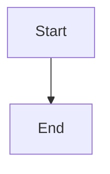

# Phase 2 Context: Handle invalid Mermaid syntax gracefully

**Issue:** IW-67
**Phase:** 2 of 3
**Story:** Story 2 - Handle invalid Mermaid syntax gracefully
**Estimated Effort:** 1-2 hours

---

## Goals

Enable graceful handling of invalid Mermaid syntax by:
1. Configuring Mermaid.js error handling to display user-friendly error messages
2. Ensuring invalid diagrams show error information including location hints
3. Ensuring page remains functional when one diagram has errors (other content/diagrams still render)
4. Adding styling for error messages to match the artifact viewer aesthetic

**User Value:** Documentation authors can easily identify and fix syntax errors in their Mermaid diagrams without breaking the entire page.

---

## Scope

### In Scope for Phase 2
- Configure Mermaid.js `securityLevel` and error handling options
- Add error callback or `suppressErrors: false` configuration to show inline errors
- Add CSS styling for Mermaid error messages to match artifact viewer aesthetic
- Unit tests for error handling configuration in ArtifactViewTest
- E2E test with intentionally invalid Mermaid syntax

### Out of Scope for Phase 2
- Custom error message rendering (use Mermaid's built-in error display)
- Error recovery or auto-correction of syntax
- Integration with external error reporting
- Line number highlighting in original markdown

---

## Dependencies

### From Phase 1 (completed)

**Implemented components available:**
- `MarkdownRenderer.transformMermaidBlocks()` - Converts `<pre><code class="language-mermaid">` to `<div class="mermaid">`
- `MarkdownRenderer.decodeHtmlEntities()` - Decodes HTML entities (e.g., `--&gt;` → `-->`)
- ArtifactView includes Mermaid.js v10.9.4 script from jsDelivr CDN
- Mermaid initialization with `neutral` theme

**Files modified in Phase 1:**
- `.iw/core/MarkdownRenderer.scala` - Has post-processing pipeline
- `.iw/core/presentation/views/ArtifactView.scala` - Has Mermaid script tags
- `.iw/core/test/MarkdownRendererTest.scala` - Has Mermaid transformation tests
- `.iw/core/test/ArtifactViewTest.scala` - Has script inclusion tests

### External dependency
- Mermaid.js v10.9.4 - Already included from Phase 1

---

## Technical Approach

### High-Level Strategy

**Mermaid.js Error Handling Behavior:**

Mermaid.js has built-in error handling that can be configured via `mermaid.initialize()`:

1. **Default behavior:** When parsing fails, Mermaid replaces the diagram div with an error message
2. **Error callback:** Can register a callback function for custom error handling
3. **Error element:** Mermaid creates an SVG with error text inside the diagram div

**Configuration options:**
```javascript
mermaid.initialize({
  startOnLoad: true,
  theme: 'neutral',
  // Error handling
  suppressErrors: false,  // Show error messages (default: false)
  securityLevel: 'loose', // Required for some error message features
});
```

**Implementation approach:**

1. **Update Mermaid initialization** in `ArtifactView.render()` to:
   - Ensure `suppressErrors: false` (explicit for clarity)
   - Set appropriate `securityLevel` for error display

2. **Add error styling** to page CSS:
   - Style `.mermaid .error-text` for readable error messages
   - Style `.mermaid .error-icon` if Mermaid uses icons
   - Ensure error container has visible border/background

3. **Verify error isolation:**
   - Invalid diagram in one block shouldn't affect other diagrams
   - Page content around the diagram should render normally

### Error Message Structure

When Mermaid encounters a parse error, it generates an SVG containing:
```html
<div class="mermaid">
  <svg>
    <text class="error-text">Parse error on line X: ...</text>
  </svg>
</div>
```

The exact structure varies by Mermaid version. Phase 2 should:
1. Test actual error output with Mermaid v10.9.4
2. Add CSS to style whatever structure it produces
3. Ensure error is visible and readable

### CSS Approach

Add to `ArtifactView.styles`:
```css
/* Mermaid error styling */
.mermaid[data-processed="true"] .error-text {
  fill: #d32f2f;
  font-family: 'Source Code Pro', monospace;
  font-size: 12px;
}

.mermaid:has(.error-text) {
  border: 2px solid #d32f2f;
  border-radius: 4px;
  padding: 8px;
  background: #ffebee;
}
```

Note: The actual CSS selectors may need adjustment based on Mermaid's actual error output structure.

---

## Files to Modify

### 1. `.iw/core/presentation/views/ArtifactView.scala`

**Changes needed:**
- Update Mermaid initialization options to include error handling config
- Add CSS styling for error messages

**Implementation notes:**
- Keep existing `startOnLoad: true` and `theme: 'neutral'`
- Add `suppressErrors: false` explicitly
- Add CSS rules for error styling to `styles` section

### 2. `.iw/core/test/ArtifactViewTest.scala`

**New tests needed:**
- Test that Mermaid initialization includes `suppressErrors: false`
- Test that CSS includes error styling rules
- Test error styling targets appropriate classes

**Regression tests:**
- Existing Mermaid script tests should still pass

---

## Testing Strategy

### Unit Tests (Automated)

**ArtifactViewTest additions:**

```scala
test("mermaid initialization includes error handling config"):
  val html = ArtifactView.render(
    artifactLabel = "test.md",
    renderedHtml = "<p>Content</p>",
    issueId = "TEST-1"
  )

  assert(html.contains("suppressErrors"))

test("styles include mermaid error styling"):
  val html = ArtifactView.render(
    artifactLabel = "test.md",
    renderedHtml = "<p>Content</p>",
    issueId = "TEST-1"
  )

  assert(html.contains(".error-text") || html.contains("error"))
```

### E2E Tests (Manual Browser Verification)

**Test Procedure:**
1. Create a markdown file with invalid Mermaid syntax
2. View in artifact viewer
3. Verify error message is displayed
4. Verify error indicates problem location
5. Verify other content on page still renders

**Test markdown file:**
```markdown
# Test Invalid Mermaid

Valid flowchart:



Invalid syntax (missing arrow type):

```mermaid
graph TD
  A[Start] -> INVALID SYNTAX HERE
  B{{broken node
```

More content that should still render normally.

Regular text and tables should work:

| Column 1 | Column 2 |
|----------|----------|
| Data     | More     |
```

**Success criteria:**
- ✅ Error message displayed for invalid diagram
- ✅ Error message indicates location or nature of problem
- ✅ Valid flowchart still renders correctly
- ✅ Table and other content render normally
- ✅ Page doesn't crash or show JavaScript errors

---

## Acceptance Criteria

From Story 2 Gherkin scenario:

**Given:** I have a markdown file with invalid Mermaid syntax:
```markdown
```mermaid
graph TD
  A[Start] -> INVALID SYNTAX HERE
```
```

**When:** I view the markdown file in the artifact viewer

**Then:**
- ✅ I see an error message indicating the Mermaid syntax is invalid
- ✅ I see the line or location of the syntax error (if provided by Mermaid)
- ✅ The error does not break the entire page
- ✅ Other diagrams on the same page still render correctly

**Technical verification:**
- Unit tests pass for error handling configuration
- Manual browser test confirms error display
- Multiple diagrams on same page work (one invalid doesn't break others)

---

## Implementation Checklist

- [ ] Update Mermaid initialization in ArtifactView with error handling config
- [ ] Add CSS styling for Mermaid error messages
- [ ] Add unit tests for error handling configuration
- [ ] Add unit tests for error CSS styling
- [ ] Create test markdown file with invalid Mermaid syntax
- [ ] Manual browser verification of error display
- [ ] Verify valid diagrams still work alongside invalid ones
- [ ] Run existing test suite to verify no regressions

---

## Notes

**Mermaid v10.9.4 Error Handling:**

Research shows Mermaid.js v10.x has improved error handling:
- Errors are displayed inline by default
- Parse errors include line/column information when available
- Errors are isolated per diagram (don't break others)

**Testing actual error output:**
Before finalizing CSS, need to:
1. Test actual error message structure from Mermaid v10.9.4
2. Adjust CSS selectors to match actual output
3. Ensure styling works across different error types

**Minimal changes principle:**
Phase 2 should be minimal - just configure Mermaid properly and add styling. Mermaid's built-in error handling is sufficient; we don't need custom error rendering.

---

**Phase Status:** Ready for Implementation

**Next Step:** Generate phase-02-tasks.md then implement
