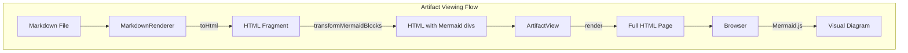
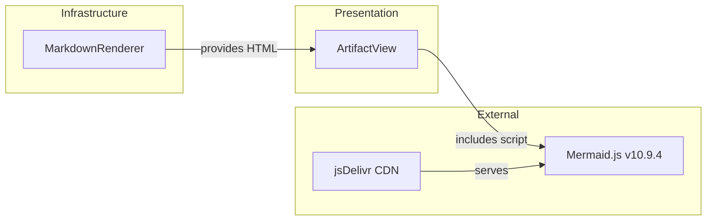
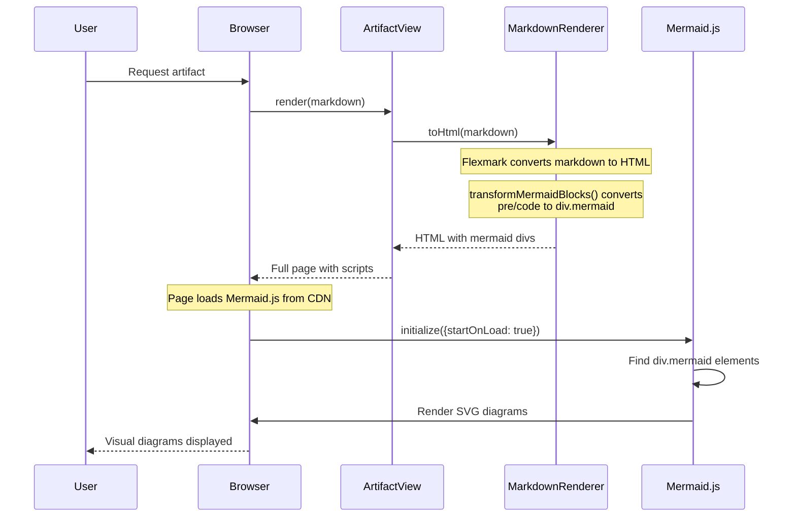
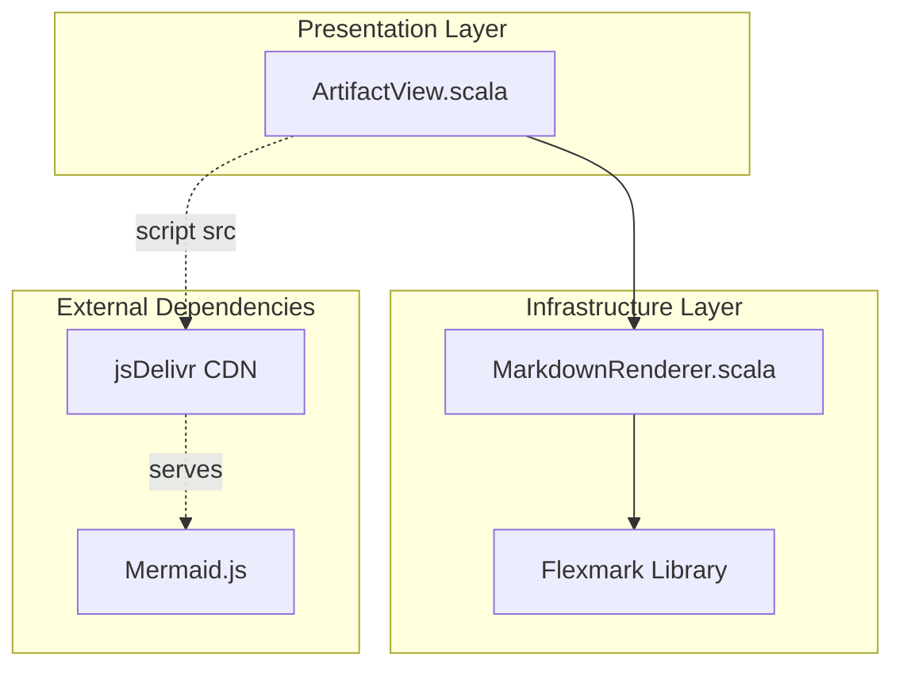

# Review Packet: Phase 1 - Render Mermaid flowchart diagram

**Issue:** IW-67
**Phase:** 1 of 3
**Branch:** IW-67-phase-01

---

## Goals

Enable rendering of Mermaid diagrams in the artifact viewer by:

1. **Add Mermaid.js library** (v10.9.4 from jsDelivr CDN) to artifact viewer HTML
2. **Post-process HTML** to convert Mermaid code blocks to Mermaid-renderable divs
3. **Initialize Mermaid.js** with `neutral` theme for automatic diagram rendering
4. **Preserve backward compatibility** - non-Mermaid code blocks remain unchanged

**User Value:** Documentation authors can create visual diagrams (flowcharts, sequence diagrams, etc.) directly in markdown without external tools.

---

## Scenarios

From Story 1 acceptance criteria:

- [ ] User views markdown file with Mermaid flowchart → diagram renders visually (not code text)
- [ ] Diagram shows boxes with labels (Start, Process, End)
- [ ] Diagram shows arrows connecting the boxes
- [ ] Non-Mermaid code blocks (e.g., Scala) still render as code (no regression)
- [ ] Multiple Mermaid diagrams on same page all render correctly
- [ ] HTML entities in diagrams are decoded (arrows `-->` display correctly)

---

## Entry Points

| File | Method/Class | Why Start Here |
|------|--------------|----------------|
| `.iw/core/MarkdownRenderer.scala` | `toHtml()` | Core transformation logic - converts markdown to HTML with Mermaid post-processing |
| `.iw/core/MarkdownRenderer.scala` | `transformMermaidBlocks()` | The new Mermaid transformation logic |
| `.iw/core/presentation/views/ArtifactView.scala` | `render()` | HTML page generation - includes Mermaid.js script tags |
| `.iw/core/test/MarkdownRendererTest.scala` | Mermaid tests (line 154+) | 6 new unit tests for transformation logic |
| `.iw/core/test/ArtifactViewTest.scala` | Mermaid tests (line 133+) | 6 new unit tests for script inclusion |

---

## Diagrams

### Architecture Overview

### Component Relationships

### Data Transformation Flow

### Layer Diagram (FCIS)

---

## Test Summary

| Test | Type | Verifies |
|------|------|----------|
| `transforms mermaid code block to mermaid div` | Unit | Basic transformation from `<pre><code class="language-mermaid">` to `
` |
| `mermaid div contains unescaped diagram syntax` | Unit | HTML entity decoding (`-->` not `--&gt;`) |
| `transforms multiple mermaid blocks` | Unit | Multiple diagrams in same document |
| `preserves non-mermaid code blocks` | Unit | Scala/JavaScript code blocks unchanged |
| `handles empty mermaid block` | Unit | Edge case: empty content |
| `mermaid block with special characters preserves content` | Unit | Complex syntax with pipes and braces |
| `render includes mermaid.js script tag from CDN` | Unit | Script tag present with correct URL |
| `script tag uses correct version v10.9.4` | Unit | Version pinning verified |
| `render includes mermaid initialization script` | Unit | `mermaid.initialize()` call present |
| `initialization script configures neutral theme` | Unit | Theme configuration |
| `initialization script sets startOnLoad true` | Unit | Auto-render on page load |
| `mermaid scripts are in head section` | Unit | Script placement before `</head>` |

**Test Counts:**
- Unit tests added: 12
- Integration tests: 0 (existing test suite covers integration)
- E2E tests: Manual browser verification needed

---

## Files Changed

**5 files changed**, +216 insertions, -31 deletions

Full file list

- `.iw/core/MarkdownRenderer.scala` (M) - Added `transformMermaidBlocks()` and `decodeHtmlEntities()` functions
- `.iw/core/presentation/views/ArtifactView.scala` (M) - Added Mermaid.js script tags and initialization
- `.iw/core/test/MarkdownRendererTest.scala` (M) - Added 6 Mermaid transformation tests
- `.iw/core/test/ArtifactViewTest.scala` (M) - Added 6 Mermaid script inclusion tests
- `project-management/issues/IW-67/test-mermaid.md` (A) - E2E test file with sample diagrams

---

## Implementation Notes

### Key Technical Decisions

1. **Server-side transformation** (in MarkdownRenderer) rather than client-side JavaScript manipulation
   - More reliable and testable
   - Avoids flash of unstyled content
   - Follows existing flexmark patterns

2. **Simple string replacement** for HTML entity decoding
   - Handles common entities: `&lt;`, `&gt;`, `&amp;`, `&quot;`, `&#39;`
   - Sufficient for Mermaid syntax requirements

3. **Regex with DOTALL flag** for matching multiline code blocks
   - Pattern: `(?s)<pre><code class="language-mermaid">(.*?)</code></pre>`
   - Correctly handles diagrams spanning multiple lines

4. **CDN with version pinning** (v10.9.4)
   - Ensures reproducibility
   - Latest stable with security fixes
   - Fast and reliable jsDelivr CDN

### Potential Review Focus Areas

- **Regex correctness**: Verify the pattern handles edge cases
- **HTML entity handling**: Check if any entities are missed
- **Script placement**: Confirm scripts load in correct order
- **Test coverage**: All new functionality has corresponding tests

---

## E2E Test File

A test file `project-management/issues/IW-67/test-mermaid.md` has been created for manual browser verification containing:
- Flowchart with decision diamond
- Sequence diagram
- Regular Scala code block (regression test)
- Multiple Mermaid diagrams

---

**Review Packet Status:** Ready for Review
