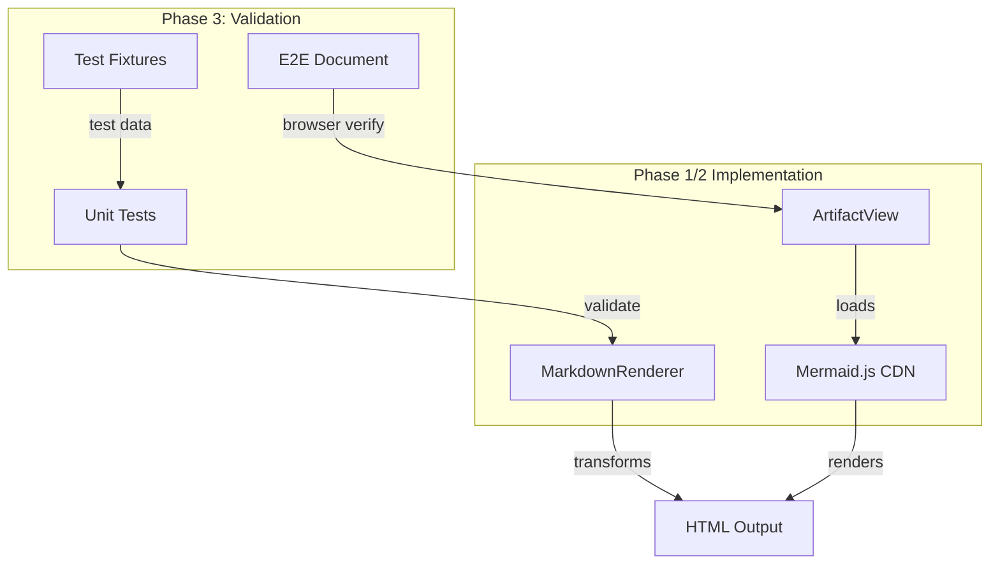
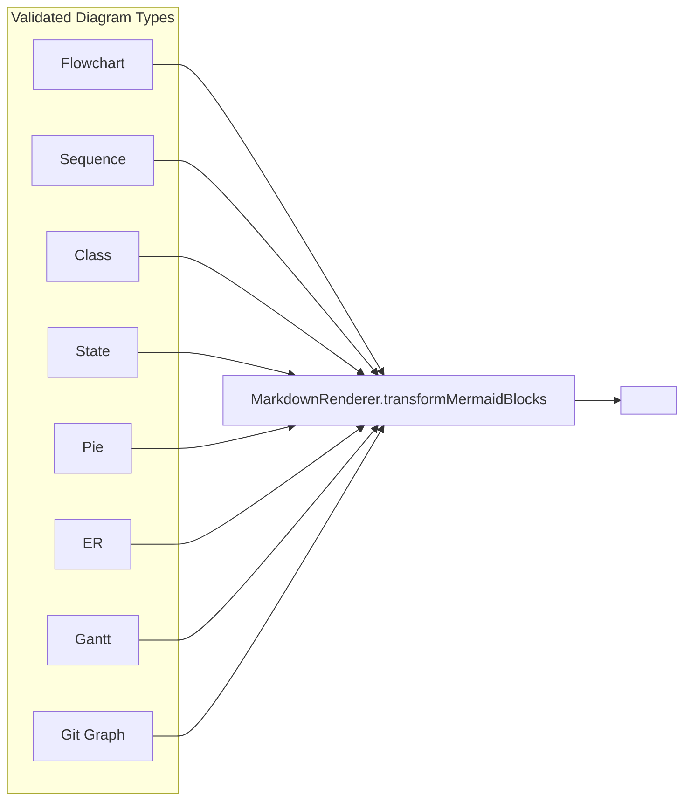

# Review Packet: Phase 3 - Support common Mermaid diagram types

**Issue:** IW-67
**Phase:** 3 of 3
**Branch:** `IW-67-phase-03`

---

## Goals

This phase validates that the Mermaid.js integration from Phase 1 correctly handles multiple diagram types. Since Mermaid.js supports all diagram types with the same JavaScript library, this phase is primarily verification and documentation.

**Primary objectives:**
1. Verify sequence diagrams render correctly
2. Verify class diagrams render correctly
3. Verify other common diagram types (gantt, pie, state) work
4. Create test fixtures demonstrating each diagram type

---

## Scenarios

- [ ] Sequence diagram renders with participants and message arrows
- [ ] Class diagram renders with boxes, relationships, and labels
- [ ] State diagram renders with states and transitions
- [ ] Pie chart renders with labeled segments
- [ ] ER diagram renders with entity boxes and relationships
- [ ] Gantt chart renders with timeline bars
- [ ] Git graph renders with commits and branches
- [ ] Flowchart still works (regression - Phase 1)
- [ ] Error handling still works (regression - Phase 2)

---

## Entry Points

| File | Method/Class | Why Start Here |
|------|--------------|----------------|
| `.iw/core/test/MarkdownRendererTest.scala` | `test("transforms sequence diagram...")` | Unit tests for new diagram types - validates transformation logic |
| `.iw/core/test/fixtures/mermaid-diagram-types.md` | N/A | Test fixture with 8 diagram type examples |
| `project-management/issues/IW-67/test-mermaid-diagrams.md` | N/A | Manual E2E verification document with expected results |

---

## Diagrams

### Architecture Overview

### Diagram Type Coverage

---

## Test Summary

| Test | Type | Verifies |
|------|------|----------|
| `MarkdownRendererTest."transforms sequence diagram code block"` | Unit | Sequence diagram with participants preserves syntax |
| `MarkdownRendererTest."transforms class diagram code block"` | Unit | Class diagram with inheritance preserves structure |
| `MarkdownRendererTest."transforms state diagram code block"` | Unit | State machine with transitions preserves syntax |
| `MarkdownRendererTest."transforms pie chart code block"` | Unit | Pie chart with percentages preserves data |
| `test-mermaid-diagrams.md` verification checklist | E2E (manual) | All 8 diagram types render correctly in browser |

**Test counts:**
- Unit tests added: 4 new tests
- E2E scenarios: 9 (manual browser verification)
- Total MarkdownRendererTest tests: 25 (including Phase 1/2 tests)

---

## Key Findings

**No code changes were required for Phase 3.**

This validates the architectural decision from Phase 1: by transforming Mermaid blocks generically (using only the `language-mermaid` CSS class), the implementation naturally supports all Mermaid diagram types without additional code. The transformation is content-agnostic.

The `transformMermaidBlocks()` function handles:
- Flowcharts (`graph TD`, `flowchart LR`)
- Sequence diagrams (`sequenceDiagram`)
- Class diagrams (`classDiagram`)
- State diagrams (`stateDiagram-v2`)
- Pie charts (`pie`)
- ER diagrams (`erDiagram`)
- Gantt charts (`gantt`)
- Git graphs (`gitGraph`)

All diagram types work identically because:
1. MarkdownRenderer only looks for `language-mermaid` class
2. Content is passed through unchanged (with HTML entity decoding)
3. Mermaid.js client-side library handles type detection and rendering

---

## Files Changed

**4 files changed, ~300 insertions**

Full file list

- `.iw/core/test/MarkdownRendererTest.scala` (M) - Added 4 diagram type tests
- `.iw/core/test/fixtures/mermaid-diagram-types.md` (A) - Test fixtures with 8 diagram types
- `project-management/issues/IW-67/test-mermaid-diagrams.md` (A) - E2E verification document
- `project-management/issues/IW-67/implementation-log.md` (M) - Phase 3 summary

---

## Review Guidance

### Focus Areas

1. **Test coverage**: Are the 4 new unit tests sufficient to validate diagram type support?
2. **Test fixture quality**: Does `mermaid-diagram-types.md` cover representative use cases?
3. **E2E documentation**: Is `test-mermaid-diagrams.md` clear for manual verification?

### Out of Scope

- No changes to MarkdownRenderer.scala (existing implementation works)
- No changes to ArtifactView.scala (existing integration works)
- No new CSS or styling needed

### Verification Steps

1. Run unit tests: `./iw test unit`
2. Start server: `./iw server`
3. View `test-mermaid-diagrams.md` in artifact viewer
4. Verify all 8 diagram types render correctly
