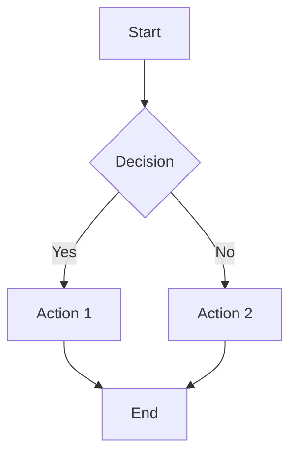
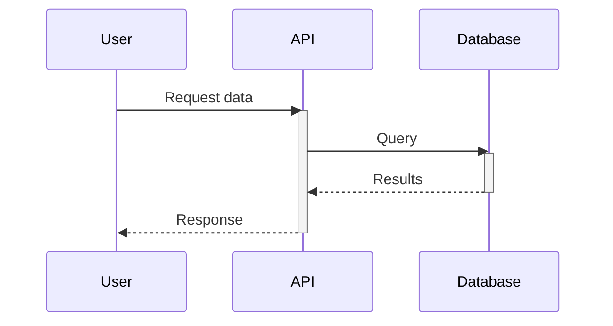
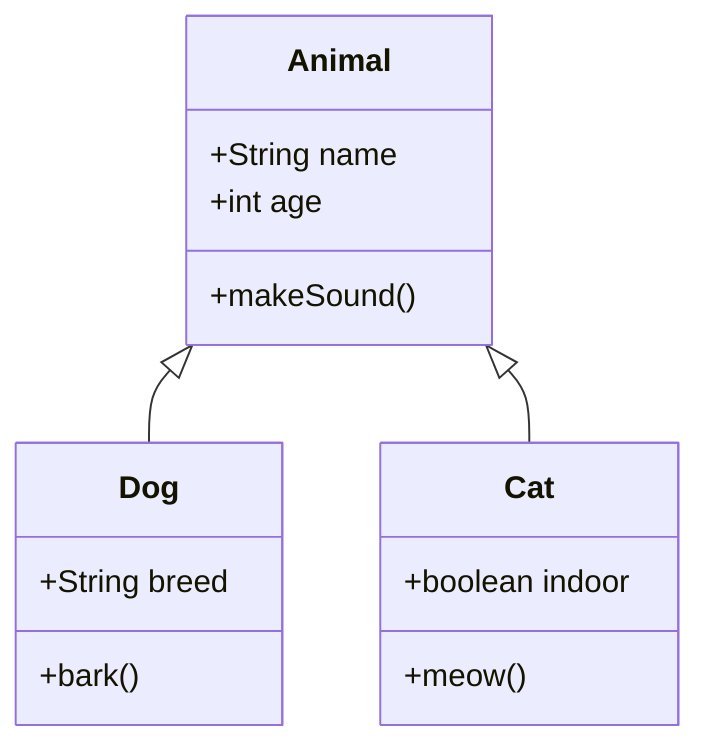
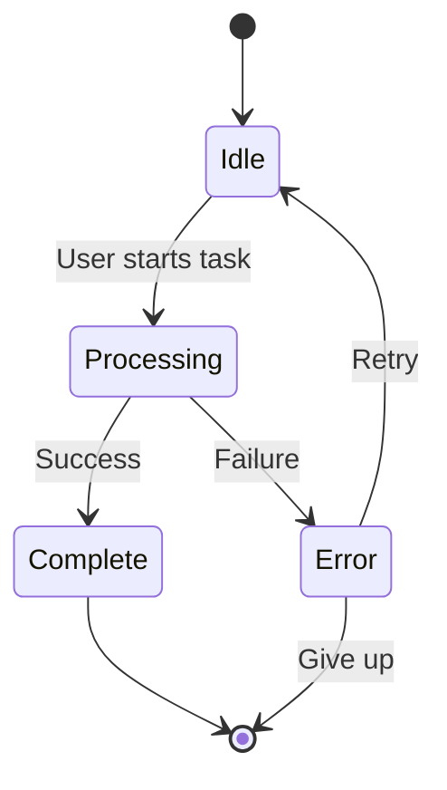
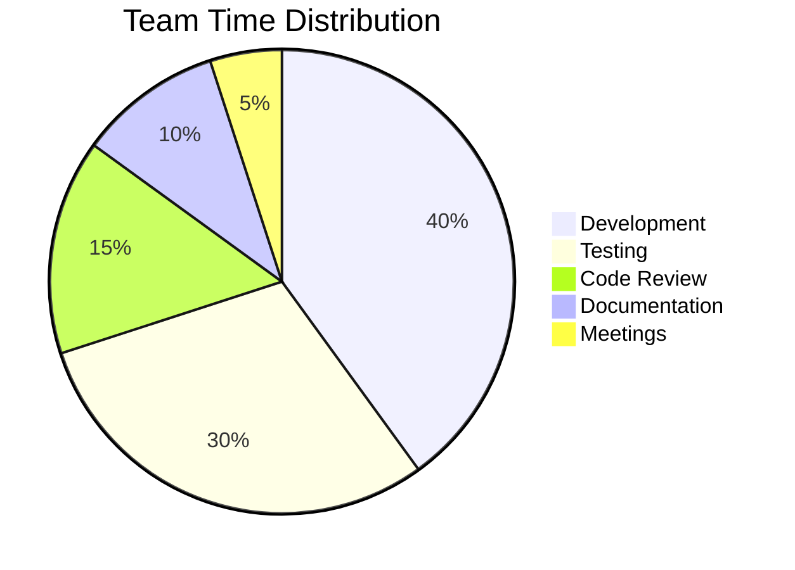
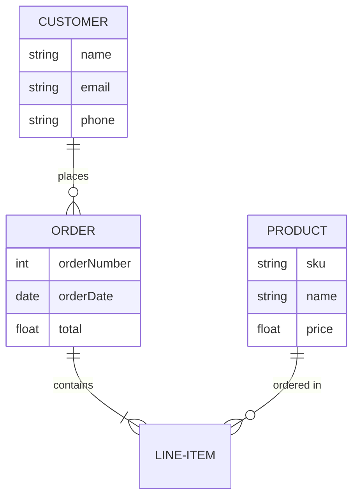
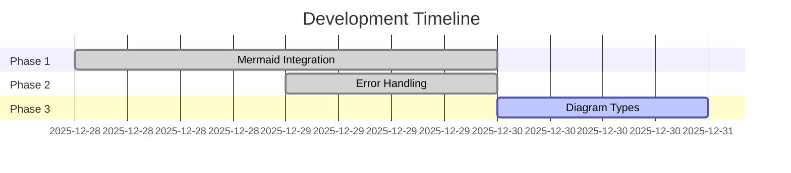
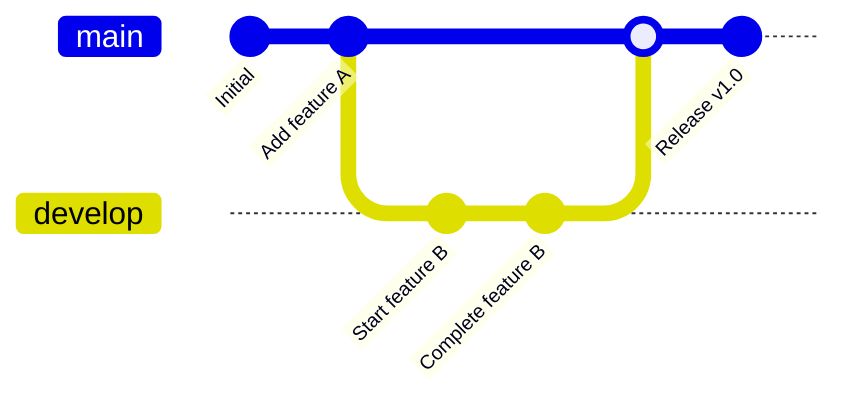

# Mermaid Diagram Types - Manual E2E Verification

This document contains examples of all major Mermaid diagram types for manual browser testing. Each diagram should render correctly in the artifact viewer.

## Test Instructions

1. Start the iw-cli server: `./iw server`
2. Register this worktree: `./iw register`
3. Open the dashboard in a browser
4. Click on this artifact to view it
5. Verify that all diagrams below render correctly

---

## 1. Flowchart (Already verified in Phase 1)

This is the basic diagram type verified in Phase 1. It should still work (regression test).

**Expected result:** A flowchart with a diamond decision node and arrows labeled "Yes" and "No".

---

## 2. Sequence Diagram

Sequence diagrams show interactions between participants over time.

**Expected result:** Three vertical participant lines with arrows showing message flow between them.

---

## 3. Class Diagram

Class diagrams show object-oriented relationships.

**Expected result:** Three boxes with class names, attributes, and methods, connected by inheritance arrows.

---

## 4. State Diagram

State diagrams show state transitions in a system.

**Expected result:** Circles/boxes representing states with labeled transition arrows.

---

## 5. Pie Chart

Pie charts show data distribution.

**Expected result:** A circular pie chart with colored segments and a legend.

---

## 6. Entity-Relationship Diagram

ER diagrams show database schema relationships.

**Expected result:** Boxes representing entities with their attributes, connected by relationship lines.

---

## 7. Gantt Chart

Gantt charts show project timelines.

**Expected result:** A horizontal bar chart showing tasks on a timeline.

---

## 8. Git Graph

Git graphs visualize branch and merge operations.

**Expected result:** A graph showing commits and branches with merge operations.

---

## Verification Checklist

After viewing this artifact in the browser, verify:

- [ ] All 8 diagram types render without errors
- [ ] No "Syntax error" messages from Mermaid
- [ ] Diagrams are readable and properly styled
- [ ] No JavaScript console errors
- [ ] Flowchart still works (regression test for Phase 1)
- [ ] Error handling still works (regression test for Phase 2)

---

## Notes

- All diagrams use Mermaid.js v10.9.4 from CDN
- Theme: `neutral`
- Security level: `loose` (for error display)
- The existing `transformMermaidBlocks()` function handles all diagram types uniformly
- No code changes were needed for Phase 3 - the implementation is diagram-type agnostic
