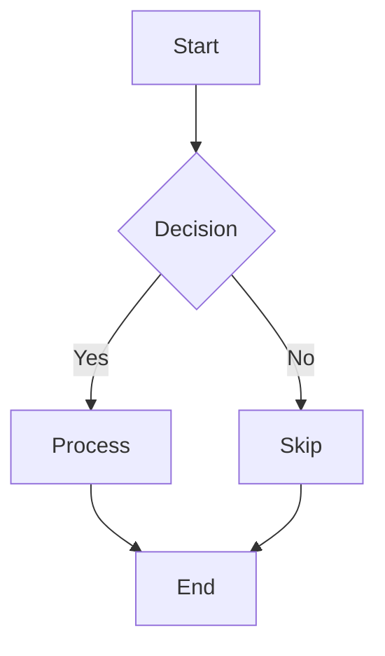
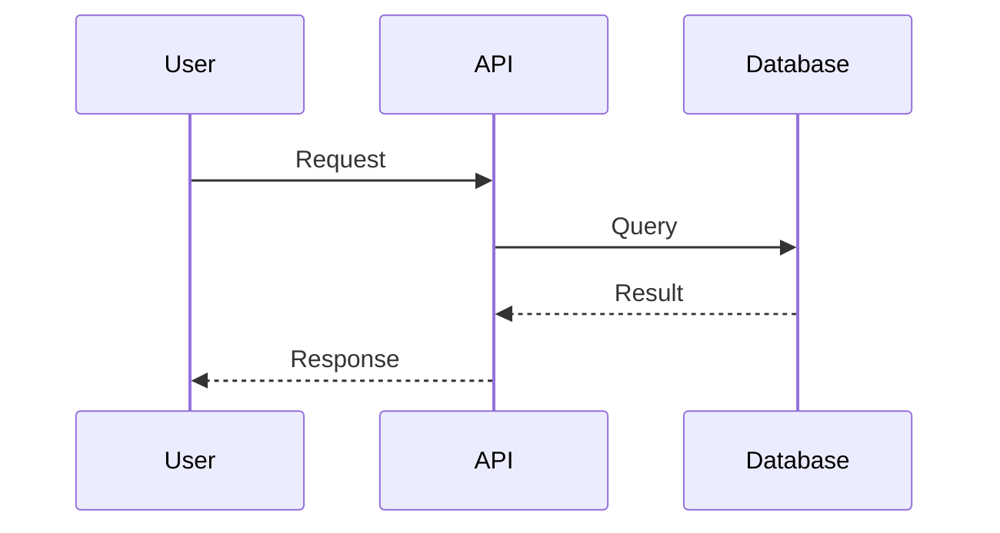

# Test Mermaid Error Handling

This file tests that invalid Mermaid syntax is handled gracefully.

## Valid Flowchart (should render)



## Invalid Syntax (should show error)

```mermaid
graph TD
  A[Start] -> INVALID SYNTAX HERE
  B{{broken node
```

## Content After Error (should still render)

This content should display normally even though the diagram above has errors.

| Column 1 | Column 2 |
|----------|----------|
| Data     | More     |

## Another Valid Diagram (should render)


