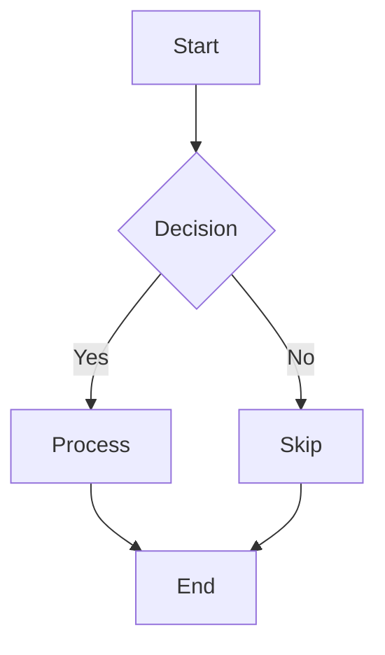
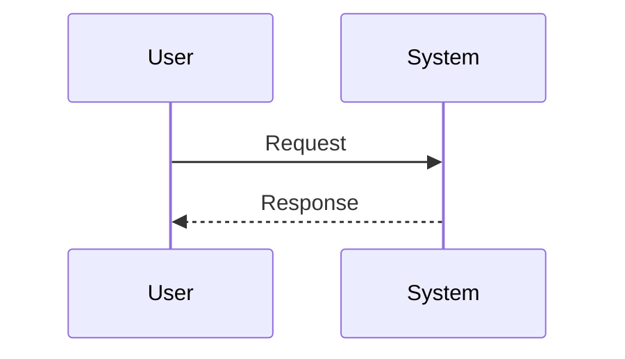
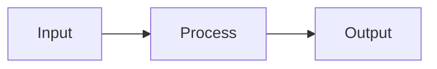
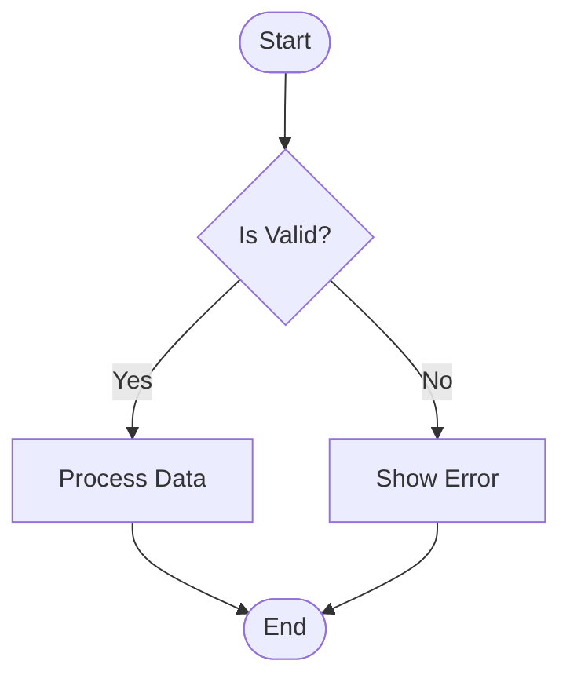

# Test Mermaid Diagram Rendering

This file tests Mermaid diagram rendering in the artifact viewer.

## Test 1: Basic Flowchart



## Test 2: Sequence Diagram



## Test 3: Regular Code Block (Regression Check)

This Scala code block should **NOT** be transformed:

```scala
def hello(): String = {
  val greeting = "Hello, World!"
  greeting
}
```

## Test 4: Multiple Diagrams

First diagram:



Second diagram:



## Verification Checklist

- [ ] All Mermaid diagrams render as visual graphics
- [ ] Decision nodes appear as diamond shapes
- [ ] Arrows and edge labels display correctly
- [ ] Scala code block renders as syntax-highlighted code
- [ ] No raw Mermaid syntax visible as text
