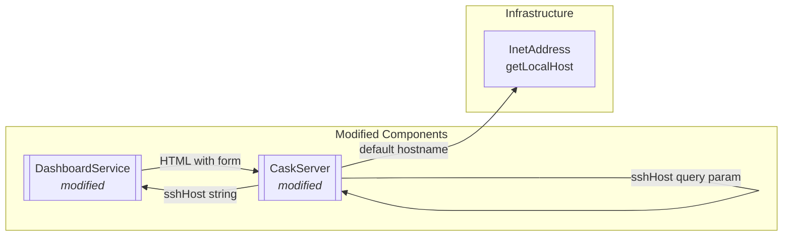
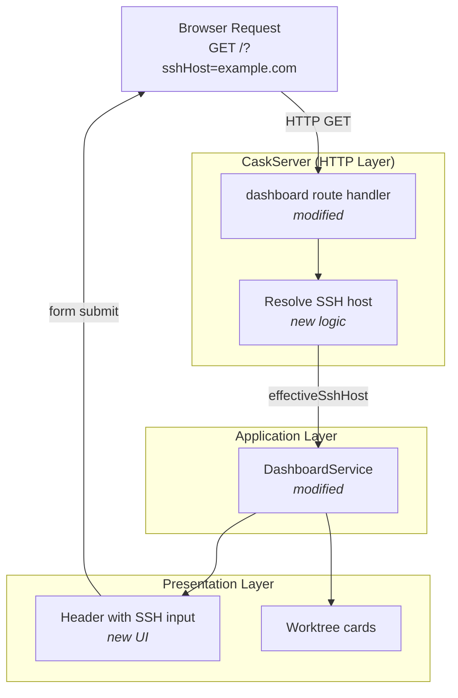

# Phase 1: Configure SSH Host for Zed Links

## Goals

This phase establishes the SSH host configuration mechanism that will be used by Zed buttons in Phase 2. Users accessing the dashboard remotely need to configure which SSH hostname their local Zed editor should use to connect back to the server.

Key objectives:
- Add SSH hostname input field to dashboard header
- Persist SSH host configuration via URL query parameter
- Provide sensible default (server hostname) when no configuration exists
- Support form submission that updates the query parameter

## Scenarios

- [ ] User can view SSH host input field in dashboard header
- [ ] Input shows server hostname as default when no query parameter present
- [ ] User can enter custom SSH hostname and submit form
- [ ] Submitting form reloads page with `?sshHost=<value>` in URL
- [ ] Input value matches `sshHost` query parameter when present
- [ ] All existing tests continue to pass

## Entry Points

Start your review from these locations:

| File | Method/Class | Why Start Here |
|------|--------------|----------------|
| `.iw/core/CaskServer.scala` | `dashboard()` | HTTP entry point - accepts `sshHost` query param and resolves default hostname |
| `.iw/core/DashboardService.scala` | `renderDashboard()` | Orchestrates dashboard rendering - receives `sshHost` and generates HTML with input field |

## Component Relationships

**Key points for reviewer:**
- CaskServer reads `sshHost` query parameter (line 16)
- Default hostname resolved via `InetAddress.getLocalHost().getHostName()` (line 19)
- DashboardService receives `sshHost` parameter (line 33) and renders form (lines 91-111)
- Form submits via GET to current URL with updated query parameter (line 93)

## Test Summary

| Test | Type | Verifies |
|------|------|----------|
| `CaskServerTest."GET / with sshHost query parameter includes value in HTML"` | Integration | Query parameter is accepted and rendered in HTML |
| `CaskServerTest."GET / without sshHost query parameter uses default hostname"` | Integration | Default hostname fallback behavior |
| `DashboardServiceTest."renderDashboard accepts sshHost parameter"` | Unit | Service method signature accepts sshHost |
| `DashboardServiceTest."renderDashboard includes SSH host input field in HTML"` | Unit | Input field is rendered with correct value |
| `DashboardServiceTest."renderDashboard SSH host form submits to current URL"` | Unit | Form structure is correct for query param submission |

Coverage: 5 tests added covering SSH host configuration mechanism

## Architecture Overview

This diagram shows where the SSH host configuration changes fit within the dashboard rendering flow.

**Key points for reviewer:**
- Query parameter handling is at the HTTP layer boundary (CaskServer)
- Application layer (DashboardService) is unaware of HTTP details
- Default hostname resolution happens early in the request lifecycle
- Form submission creates a GET request with updated query parameter

## Files Changed

**4 files** changed, +219 insertions, -15 deletions (excluding documentation)

Full file list

- `.iw/core/CaskServer.scala` (M) +10 -4 lines
- `.iw/core/DashboardService.scala` (M) +74 -11 lines
- `.iw/core/test/CaskServerTest.scala` (M) +52 lines
- `.iw/core/test/DashboardServiceTest.scala` (M) +83 lines

Documentation files:
- `project-management/issues/IW-74/analysis.md` (A) +175 lines
- `project-management/issues/IW-74/phase-01-context.md` (A) +104 lines
- `project-management/issues/IW-74/phase-01-tasks.md` (A) +30 lines
- `project-management/issues/IW-74/review-state.json` (A) +9 lines
- `project-management/issues/IW-74/tasks.md` (A) +24 lines

