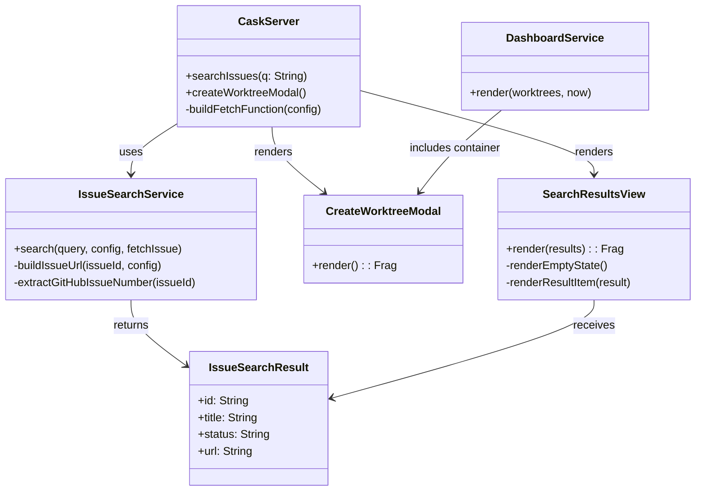
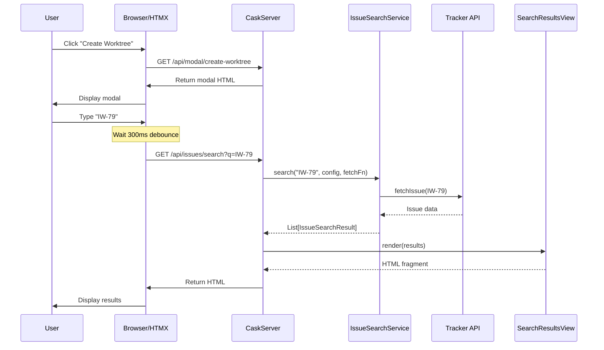
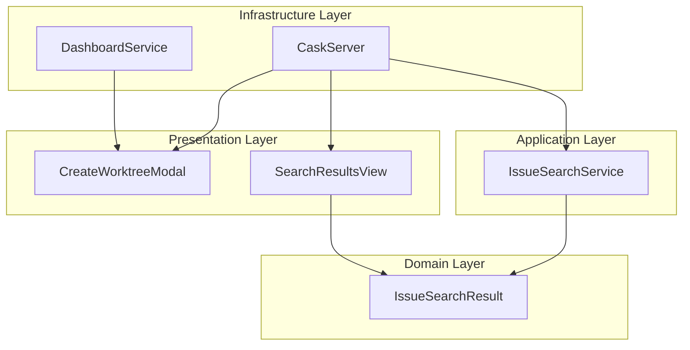

# Review Packet: Phase 1 - Modal UI + Issue Search

**Issue:** IW-79
**Phase:** 1 of 4
**Branch:** IW-79-phase-01

## Goals

This phase establishes the foundation for dashboard-based worktree creation by adding:

1. **"Create Worktree" button** in the dashboard header
2. **Modal dialog component** that opens on button click
3. **Search input** with debounced live search (300ms delay)
4. **Issue search API endpoint** (`GET /api/issues/search?q=...`)
5. **Search results display** showing issue ID, title, and status
6. **Cross-tracker search support** (GitHub, Linear, YouTrack)

At the end of this phase, users can:
- Click "Create Worktree" button to open a modal
- Type in the search field to search for issues
- See search results appear dynamically (debounced)
- View issue details (ID, title, status) in results

## Scenarios

- [ ] User sees "Create Worktree" button in dashboard header
- [ ] Clicking button opens modal with search input
- [ ] Typing valid issue ID (e.g., "IW-79") shows matching result
- [ ] Typing invalid issue ID shows "No issues found"
- [ ] Search has 300ms debounce (no immediate API calls)
- [ ] Results show issue ID, title, and status
- [ ] Close button (×) closes modal
- [ ] Modal has proper styling (centered, shadow, backdrop)
- [ ] Search works with Linear tracker
- [ ] Search works with GitHub tracker
- [ ] Search works with YouTrack tracker

## Entry Points

| File | Method/Class | Why Start Here |
|------|--------------|----------------|
| `.iw/core/CaskServer.scala` | `searchIssues()`, `createWorktreeModal()` | HTTP entry points for search and modal APIs |
| `.iw/core/application/IssueSearchService.scala` | `IssueSearchService.search()` | Core business logic for issue search |
| `.iw/core/presentation/views/CreateWorktreeModal.scala` | `CreateWorktreeModal.render()` | Modal UI component with HTMX integration |
| `.iw/core/presentation/views/SearchResultsView.scala` | `SearchResultsView.render()` | Search results rendering with empty state |
| `.iw/core/DashboardService.scala` | `render()` | Dashboard integration with button and styles |

## Diagrams

### Architecture Overview

```mermaid
graph TD
    subgraph Browser
        UI[Dashboard UI]
        HTMX[HTMX Library]
    end

    subgraph Server
        CS[CaskServer]
        ISS[IssueSearchService]
        DS[DashboardService]
        Views[View Components]
    end

    subgraph Trackers
        LN[Linear API]
        GH[GitHub CLI]
        YT[YouTrack API]
    end

    UI -->|Click Button| HTMX
    HTMX -->|GET /api/modal/create-worktree| CS
    CS -->|render()| Views

    UI -->|Type in Search| HTMX
    HTMX -->|GET /api/issues/search?q=...| CS
    CS -->|search()| ISS
    ISS -->|fetchIssue| LN
    ISS -->|fetchIssue| GH
    ISS -->|fetchIssue| YT
    CS -->|render()| Views
```

### Component Relationships



### Search Flow Sequence



### Layer Diagram (FCIS)



## Test Summary

| Test | Type | Verifies |
|------|------|----------|
| `IssueSearchResultTest."create IssueSearchResult with all fields"` | Unit | Value object creation with all fields |
| `IssueSearchResultTest."create IssueSearchResult with empty title"` | Unit | Empty title is allowed |
| `IssueSearchResultTest."create IssueSearchResult with different tracker URLs"` | Unit | URL formats for Linear/GitHub/YouTrack |
| `IssueSearchResultTest."IssueSearchResult is a case class with equality"` | Unit | Equality semantics |
| `IssueSearchServiceTest."search with valid Linear issue ID returns result"` | Unit | Linear search with successful fetch |
| `IssueSearchServiceTest."search with invalid issue ID returns empty list"` | Unit | Invalid ID handling |
| `IssueSearchServiceTest."search with valid ID but fetch failure returns empty list"` | Unit | Fetch error handling |
| `IssueSearchServiceTest."search with GitHub issue ID returns result"` | Unit | GitHub tracker support |
| `IssueSearchServiceTest."search with YouTrack issue ID returns result"` | Unit | YouTrack tracker support |
| `IssueSearchServiceTest."search with empty query returns empty list"` | Unit | Empty query handling |
| `IssueSearchServiceTest."search with whitespace-only query returns empty list"` | Unit | Whitespace query handling |
| `IssueSearchServiceTest."search handles case-insensitive issue IDs"` | Unit | Case normalization |
| `CreateWorktreeModalTest."render creates modal with correct structure"` | Unit | Modal HTML structure |
| `CreateWorktreeModalTest."render includes modal header with title"` | Unit | Header presence |
| `CreateWorktreeModalTest."render includes close button with HTMX attributes"` | Unit | Close button HTMX setup |
| `CreateWorktreeModalTest."render includes search input with correct attributes"` | Unit | Search input attributes |
| `CreateWorktreeModalTest."search input includes HTMX debounce attributes"` | Unit | HTMX debounce configuration |
| `CreateWorktreeModalTest."render includes search results container"` | Unit | Results container presence |
| `CreateWorktreeModalTest."render includes modal body"` | Unit | Modal body structure |
| `CreateWorktreeModalTest."render returns valid HTML fragment"` | Unit | HTML validity |
| `SearchResultsViewTest."render with empty results shows no issues found message"` | Unit | Empty state display |
| `SearchResultsViewTest."render with single result shows result item"` | Unit | Single result rendering |
| `SearchResultsViewTest."render with multiple results shows all items"` | Unit | Multiple results rendering |
| `SearchResultsViewTest."result item includes issue ID with correct CSS class"` | Unit | ID styling |
| `SearchResultsViewTest."result item includes title with correct CSS class"` | Unit | Title styling |
| `SearchResultsViewTest."result item includes status with correct CSS class"` | Unit | Status styling |
| `SearchResultsViewTest."result item is wrapped in clickable div"` | Unit | Result item wrapper |
| `SearchResultsViewTest."render limits results to maximum 10 items"` | Unit | Result limit enforcement |
| `SearchResultsViewTest."empty state has appropriate styling class"` | Unit | Empty state styling |
| `SearchResultsViewTest."render returns valid HTML fragment"` | Unit | HTML validity |

**Test Counts:**
- Unit: 30 tests
- Integration: 0 tests (API endpoints manual tested)
- E2E: 0 tests (deferred to verification phase)

## Files Changed

**11 files changed**

- **4 new source files** (domain, application, presentation)
- **4 new test files** (comprehensive unit tests)
- **2 modified files** (CaskServer, DashboardService)
- **1 modified tracking file** (phase-01-tasks.md)

<details>
<summary>Full file list</summary>

**New Files:**
- `.iw/core/IssueSearchResult.scala` (A) - Domain model
- `.iw/core/IssueSearchService.scala` (A) - Application service
- `.iw/core/presentation/views/CreateWorktreeModal.scala` (A) - Modal component
- `.iw/core/presentation/views/SearchResultsView.scala` (A) - Results view
- `.iw/core/test/IssueSearchResultTest.scala` (A) - Domain tests
- `.iw/core/test/IssueSearchServiceTest.scala` (A) - Service tests
- `.iw/core/test/CreateWorktreeModalTest.scala` (A) - Modal tests
- `.iw/core/test/SearchResultsViewTest.scala` (A) - Results view tests

**Modified Files:**
- `.iw/core/CaskServer.scala` (M) - Added 2 new API endpoints
- `.iw/core/DashboardService.scala` (M) - Added HTMX, button, modal container, CSS
- `project-management/issues/IW-79/phase-01-tasks.md` (M) - Task checkboxes

</details>

## Implementation Highlights

### Key Patterns Applied

1. **Functional Core, Imperative Shell (FCIS)**
   - Pure functions in `IssueSearchService` for business logic
   - Side effects isolated in `CaskServer` (HTTP, tracker API calls)

2. **ScalaTags for HTML Generation**
   - Type-safe HTML rendering
   - Composable view components
   - No inline JavaScript

3. **HTMX for Interactivity**
   - Debounced search with `hx-trigger="keyup changed delay:300ms"`
   - Dynamic result swapping with `hx-target` and `hx-swap`
   - Modal lifecycle without JavaScript

4. **Dependency Injection via Higher-Order Functions**
   - `fetchIssue` function injected into `IssueSearchService.search()`
   - Enables easy mocking in tests

### Phase 1 Limitations (Intentional)

- **ID-only search**: Title/text search stubbed for future phases
- **No worktree creation**: Clicking results does nothing (Phase 2)
- **Basic error handling**: API errors return empty results (Phase 3)
- **No concurrent protection**: Multiple clicks not protected (Phase 4)

## Review Checklist

Before approving, verify:

- [ ] All 30 unit tests passing
- [ ] Dashboard loads with "Create Worktree" button
- [ ] Modal opens when button clicked
- [ ] Search input has HTMX attributes
- [ ] Search by valid issue ID returns result
- [ ] Search by invalid ID shows empty state
- [ ] Modal styling looks correct
- [ ] No JavaScript required (HTMX only)
- [ ] Code follows functional programming principles
- [ ] All files have PURPOSE comments
