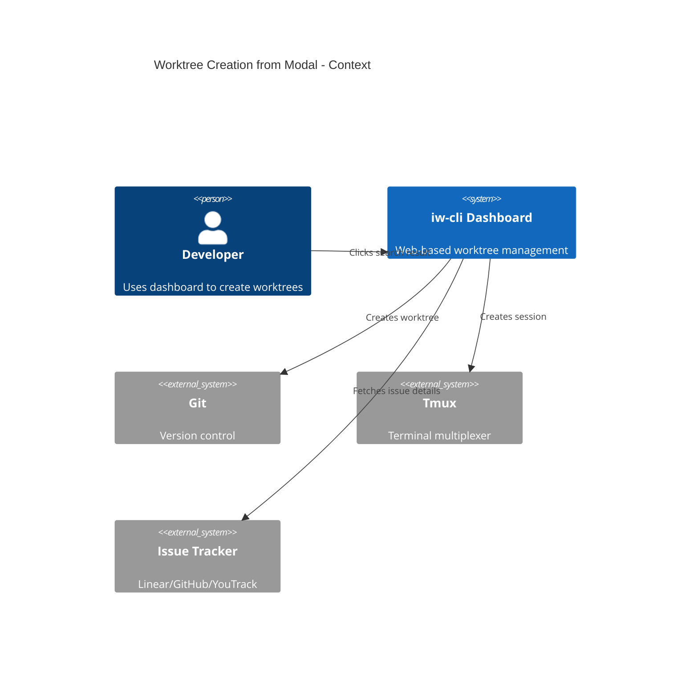
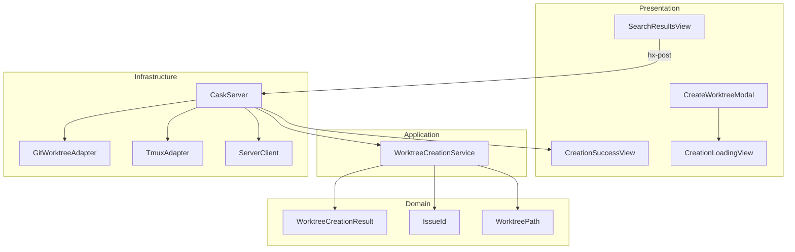
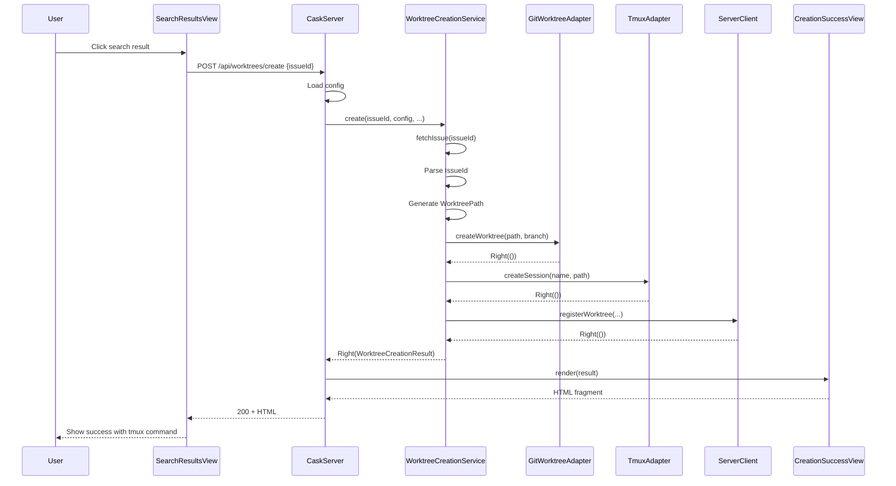
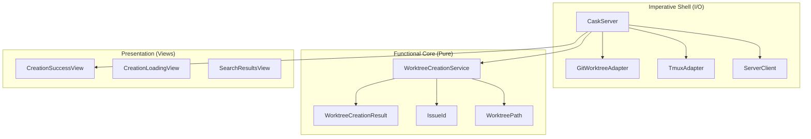

# Review Packet: Phase 2 - Worktree Creation from Modal

**Issue:** IW-79
**Phase:** 2 of 4
**Branch:** IW-79-phase-02

## Goals

This phase adds the actual worktree creation functionality to the modal built in Phase 1:

1. **Click handler on search results** - Results are now clickable to trigger creation
2. **Creation API endpoint** (`POST /api/worktrees/create`) - Orchestrates worktree creation
3. **Progress states** - Show "Creating..." while worktree is being created
4. **Success state** - Display tmux attach command with copy button
5. **Reuse existing start logic** - Leverage domain objects for branch/path generation
6. **Tmux session creation** - Create detached session user can attach to

At the end of this phase, users can:
- Click on a search result to create a worktree
- See progress indicator during creation
- Get tmux attach command upon success
- Copy the command to clipboard

## Scenarios

- [ ] User clicks on search result item
- [ ] Loading spinner appears during creation
- [ ] Success message with checkmark appears after creation
- [ ] Tmux attach command is displayed in code block
- [ ] Copy button copies command to clipboard
- [ ] Close button dismisses modal
- [ ] Created worktree exists in filesystem
- [ ] Tmux session is created (detached)
- [ ] Worktree is registered in state file

## Entry Points

| File | Method/Class | Why Start Here |
|------|--------------|----------------|
| `.iw/core/CaskServer.scala:324` | `createWorktree()` | HTTP endpoint - entry point for creation requests |
| `.iw/core/application/WorktreeCreationService.scala:25` | `create()` | Pure business logic orchestration |
| `.iw/core/presentation/views/SearchResultsView.scala:60` | `renderResultItem()` | HTMX click handler setup |
| `.iw/core/presentation/views/CreationSuccessView.scala:23` | `render()` | Success state UI component |
| `.iw/core/presentation/views/CreateWorktreeModal.scala:44` | Loading integration | Modal structure with loading indicator |

## Diagrams

### Architecture Overview

### Component Relationships

### Key Flow: Worktree Creation

### Layer Diagram (FCIS)

## Test Summary

| Test | Type | Verifies |
|------|------|----------|
| `WorktreeCreationResultTest."construction with valid fields"` | Unit | Value object creation |
| `WorktreeCreationResultTest."fields are accessible"` | Unit | Field accessors |
| `WorktreeCreationResultTest."different issue IDs are distinct"` | Unit | Equality |
| `WorktreeCreationServiceTest."all dependencies succeeding returns Right"` | Unit | Happy path orchestration |
| `WorktreeCreationServiceTest."fetchIssue fails returns Left"` | Unit | Issue fetch error handling |
| `WorktreeCreationServiceTest."createWorktree fails returns Left"` | Unit | Git error handling |
| `WorktreeCreationServiceTest."createTmuxSession fails returns Left"` | Unit | Tmux error handling |
| `WorktreeCreationServiceTest."registerWorktree fails returns Left"` | Unit | Registration error handling |
| `WorktreeCreationServiceTest."generates branch name with issue ID"` | Unit | Branch naming |
| `WorktreeCreationServiceTest."generates worktree path with project name"` | Unit | Path generation |
| `WorktreeCreationServiceTest."generates tmux session name"` | Unit | Session naming |
| `WorktreeCreationServiceTest."calls registerWorktree with correct params"` | Unit | Registration parameters |
| `CreationSuccessViewTest."includes success message"` | Unit | Success text |
| `CreationSuccessViewTest."includes issue ID in message"` | Unit | Issue display |
| `CreationSuccessViewTest."includes tmux attach command"` | Unit | Command display |
| `CreationSuccessViewTest."includes copy button"` | Unit | Copy button presence |
| `CreationSuccessViewTest."copy button has onclick handler"` | Unit | Clipboard integration |
| `CreationSuccessViewTest."includes close button"` | Unit | Close button presence |
| `CreationSuccessViewTest."close button has HTMX attributes"` | Unit | Modal dismiss |
| `CreationSuccessViewTest."includes worktree path"` | Unit | Path display |
| `CreationSuccessViewTest."has success icon"` | Unit | Checkmark icon |
| `CreationSuccessViewTest."has CSS class for success state"` | Unit | Styling class |
| `CreationSuccessViewTest."tmux command is in code block"` | Unit | Command formatting |
| `CreationLoadingViewTest."includes loading message"` | Unit | Loading text |
| `CreationLoadingViewTest."includes spinner element"` | Unit | Spinner div |
| `CreationLoadingViewTest."has htmx-indicator class"` | Unit | HTMX integration |
| `CreationLoadingViewTest."has creation-spinner id"` | Unit | Element ID |
| `SearchResultsViewTest."has hx-post for worktree creation"` | Unit | POST trigger |
| `SearchResultsViewTest."has hx-vals with issue ID"` | Unit | JSON payload |
| `SearchResultsViewTest."has hx-target for modal body"` | Unit | Content target |
| `SearchResultsViewTest."has hx-swap set to innerHTML"` | Unit | Swap strategy |
| `SearchResultsViewTest."has hx-indicator for loading spinner"` | Unit | Loading indicator |
| `CreateWorktreeModalTest."includes loading indicator element"` | Unit | Spinner integration |
| `CreateWorktreeModalTest."loading indicator has htmx-indicator class"` | Unit | Auto show/hide |
| `CreateWorktreeModalTest."modal body has wrapper div for content swap"` | Unit | HTMX target |

**Total:** 36 new tests added for Phase 2

## Files Changed

**8 files changed, ~500 insertions**

Full file list

**New Files (A):**
- `.iw/core/application/WorktreeCreationService.scala` - Pure function orchestration
- `.iw/core/domain/WorktreeCreationResult.scala` - Value object for result
- `.iw/core/presentation/views/CreationSuccessView.scala` - Success UI component
- `.iw/core/presentation/views/CreationLoadingView.scala` - Loading spinner
- `.iw/core/test/WorktreeCreationResultTest.scala` - Value object tests
- `.iw/core/test/WorktreeCreationServiceTest.scala` - Service tests
- `.iw/core/test/CreationSuccessViewTest.scala` - Success view tests
- `.iw/core/test/CreationLoadingViewTest.scala` - Loading view tests

**Modified Files (M):**
- `.iw/core/CaskServer.scala` - Added POST /api/worktrees/create endpoint
- `.iw/core/presentation/views/SearchResultsView.scala` - Added HTMX click handlers
- `.iw/core/presentation/views/CreateWorktreeModal.scala` - Added loading indicator
- `.iw/core/test/SearchResultsViewTest.scala` - Added HTMX attribute tests
- `.iw/core/test/CreateWorktreeModalTest.scala` - Added loading indicator tests

## Architecture Highlights

1. **Pure Business Logic**: `WorktreeCreationService.create()` is a pure function with all I/O injected as parameters
2. **Dependency Injection**: I/O operations (git, tmux, registration) passed as function parameters
3. **Domain Reuse**: Leverages existing `IssueId` and `WorktreePath` domain objects
4. **Consistent Error Handling**: `Either[String, T]` pattern throughout
5. **HTMX Integration**: Clean separation with HTML fragments for dynamic updates

## Review Checklist

- [ ] WorktreeCreationService is truly pure (no side effects)
- [ ] Error messages are user-friendly
- [ ] HTMX attributes are correct for content swapping
- [ ] Copy button uses correct clipboard API
- [ ] Tests cover all error paths
- [ ] Code reuses existing adapters without duplication
