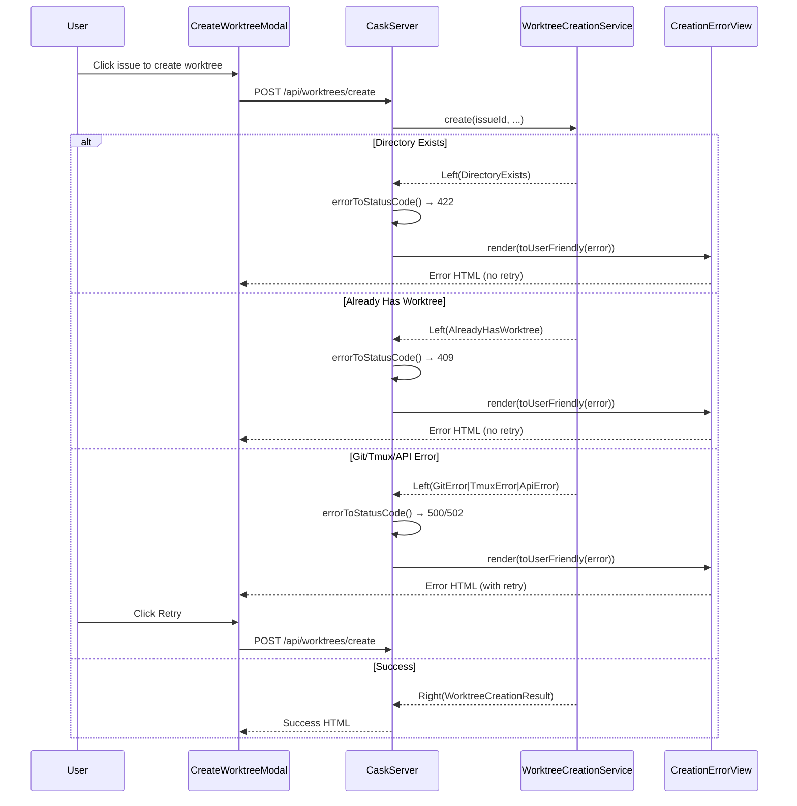
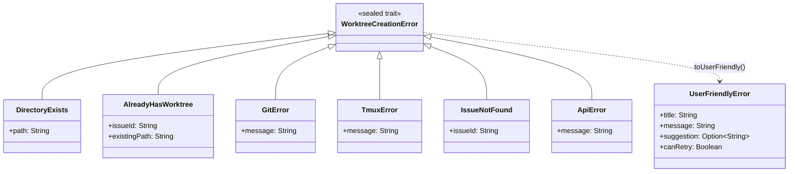
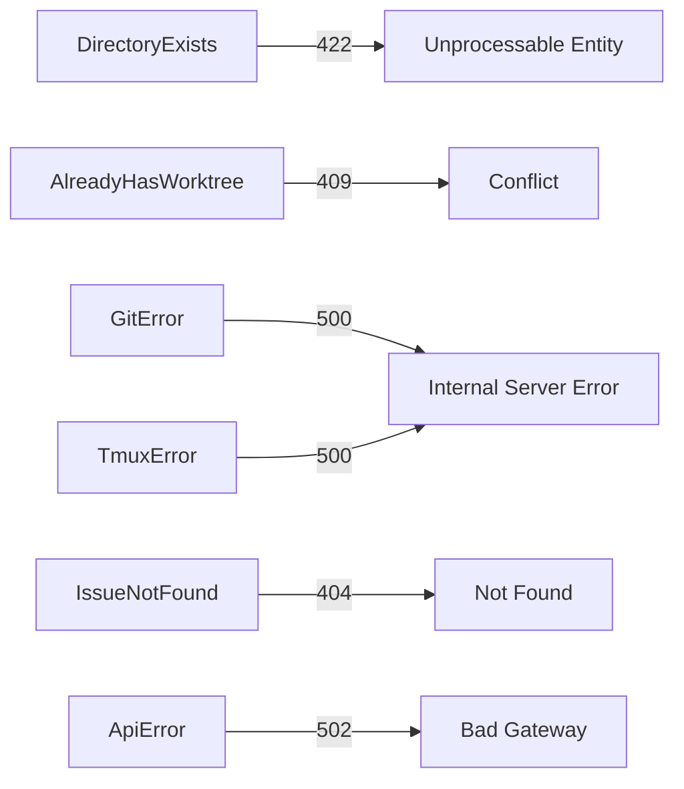
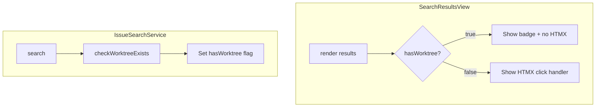

# Review Packet: Phase 3 - Error Handling

**Issue:** IW-79 - Spawn worktrees from dashboard
**Phase:** 3 of 4
**Branch:** IW-79-phase-03

## Goals

This phase enhances error handling throughout the worktree creation flow to provide user-friendly error messages and graceful degradation:

1. **Map all error scenarios to clear, actionable messages** - Replace raw exceptions with user-friendly titles, messages, and suggestions
2. **Handle "already has worktree" case with appropriate UI** - Show badge in search results, prevent duplicate creation
3. **Add retry capability after errors** - Allow retrying transient failures (Git/Tmux/API errors)
4. **Detect existing worktrees in search results** - Show visual indicator and different action for issues with worktrees

## Scenarios

- [ ] User attempts to create worktree when directory already exists → sees "Directory Already Exists" error with suggestion to remove or register
- [ ] User attempts to create worktree for issue that already has one → sees "Worktree Already Exists" error with tmux attach command
- [ ] Git operation fails during worktree creation → sees "Git Operation Failed" error with retry button
- [ ] Tmux session creation fails → sees "Tmux Session Failed" error with retry button
- [ ] Issue not found in tracker → sees "Issue Not Found" error with verification suggestion
- [ ] API connection fails → sees "API Connection Error" with retry button and connection check suggestion
- [ ] User searches for issue that already has worktree → sees "Already has worktree" badge, no HTMX click action
- [ ] User clicks retry button after error → creation is attempted again

## Entry Points

| File | Method/Class | Why Start Here |
|------|--------------|----------------|
| `.iw/core/domain/WorktreeCreationError.scala` | `WorktreeCreationError` sealed trait | Domain error types - foundation of the error handling system |
| `.iw/core/domain/WorktreeCreationError.scala` | `toUserFriendly()` | Error mapping logic - converts domain errors to user-facing messages |
| `.iw/core/presentation/views/CreationErrorView.scala` | `render()` | Error view component - generates HTML for error states with retry/dismiss |
| `.iw/core/CaskServer.scala` | `createWorktree()` (line 324) | API endpoint - orchestrates error handling and HTTP status code mapping |
| `.iw/core/presentation/views/SearchResultsView.scala` | `renderResultItem()` | Search results - conditionally shows badge and HTMX attributes |

## Diagrams

### Error Handling Flow

### Error Type Hierarchy

### HTTP Status Code Mapping

### Search Results with Badge

## Test Summary

| Test | Type | Verifies |
|------|------|----------|
| `WorktreeCreationErrorTest."DirectoryExists error holds path"` | Unit | Error type stores path correctly |
| `WorktreeCreationErrorTest."AlreadyHasWorktree error holds issue ID and existing path"` | Unit | Error type stores both fields |
| `WorktreeCreationErrorTest."all error types extend WorktreeCreationError"` | Unit | Sealed trait hierarchy is complete |
| `WorktreeCreationErrorMappingTest."DirectoryExists maps to user-friendly error with title"` | Unit | Error mapping produces title |
| `WorktreeCreationErrorMappingTest."DirectoryExists maps with helpful suggestion"` | Unit | Suggestion includes remediation action |
| `WorktreeCreationErrorMappingTest."DirectoryExists is not retryable"` | Unit | canRetry = false for non-transient errors |
| `WorktreeCreationErrorMappingTest."GitError is retryable"` | Unit | canRetry = true for transient errors |
| `WorktreeCreationErrorMappingTest."ApiError maps with retry suggestion"` | Unit | Suggestion includes retry guidance |
| `CreationErrorViewTest."render includes error title"` | Unit | HTML contains title |
| `CreationErrorViewTest."render shows suggestion when present"` | Unit | Suggestion renders when provided |
| `CreationErrorViewTest."render includes retry button when canRetry is true"` | Unit | Retry button appears conditionally |
| `CreationErrorViewTest."retry button has hx-post to /api/worktrees/create"` | Unit | HTMX retry functionality |
| `CreationErrorViewTest."render does not include retry button when canRetry is false"` | Unit | No retry for non-transient errors |
| `CreationErrorViewTest."render includes dismiss button"` | Unit | Dismiss button always present |
| `UserFriendlyErrorTest."UserFriendlyError stores all fields"` | Unit | Value object holds data correctly |
| `WorktreeCreationServiceTest."returns DirectoryExists when directory exists"` | Unit | Pre-flight directory check works |
| `WorktreeCreationServiceTest."returns AlreadyHasWorktree when worktree registered"` | Unit | Pre-flight worktree check works |
| `WorktreeCreationServiceTest."returns GitError when git fails"` | Unit | Git failure mapped to domain error |
| `WorktreeCreationServiceTest."returns TmuxError when tmux fails"` | Unit | Tmux failure mapped to domain error |
| `SearchResultsViewTest."renders worktree badge for issues with existing worktree"` | Unit | Badge appears when hasWorktree=true |
| `SearchResultsViewTest."does not include HTMX attributes for issues with worktree"` | Unit | Prevents creation for existing worktrees |

## Files Changed

**15 files changed** (7 modified, 8 new)

Full file list

### New Files
- `.iw/core/domain/WorktreeCreationError.scala` (A) - Domain error type hierarchy
- `.iw/core/domain/UserFriendlyError.scala` (A) - User-facing error model
- `.iw/core/presentation/views/CreationErrorView.scala` (A) - Error view component
- `.iw/core/test/WorktreeCreationErrorTest.scala` (A) - Error type tests
- `.iw/core/test/UserFriendlyErrorTest.scala` (A) - Error model tests
- `.iw/core/test/WorktreeCreationErrorMappingTest.scala` (A) - Error mapping tests
- `.iw/core/test/CreationErrorViewTest.scala` (A) - Error view tests

### Modified Files
- `.iw/core/application/WorktreeCreationService.scala` (M) - Returns `Either[WorktreeCreationError, ...]`, added pre-flight checks
- `.iw/core/CaskServer.scala` (M) - Added `errorToStatusCode()`, error handling in `createWorktree()`
- `.iw/core/presentation/views/SearchResultsView.scala` (M) - Added badge rendering, conditional HTMX
- `.iw/core/IssueSearchResult.scala` (M) - Added `hasWorktree: Boolean` field
- `.iw/core/IssueSearchService.scala` (M) - Added worktree existence check
- `.iw/core/test/WorktreeCreationServiceTest.scala` (M) - Updated for new error types
- `.iw/core/test/SearchResultsViewTest.scala` (M) - Added badge tests
- `project-management/issues/IW-79/phase-03-tasks.md` (M) - Task checkboxes

## Key Implementation Decisions

1. **Breaking change to service signature**: `WorktreeCreationService.create()` now returns `Either[WorktreeCreationError, WorktreeCreationResult]` instead of `Either[String, ...]`. This provides type-safe error handling.

2. **Pre-flight checks with default parameters**: Added `checkDirectoryExists` and `checkWorktreeExists` function parameters with defaults, maintaining backward compatibility for callers.

3. **HTTP status code mapping**: Each domain error maps to an appropriate HTTP status (422, 409, 500, 502, 404) rather than generic 500.

4. **Conditional HTMX in search results**: Issues with existing worktrees don't have `hx-post` attributes, preventing accidental creation attempts.

5. **Retry capability**: Only transient errors (Git, Tmux, API) are marked as retryable. Directory/Worktree existence and Issue Not Found are not retryable.
