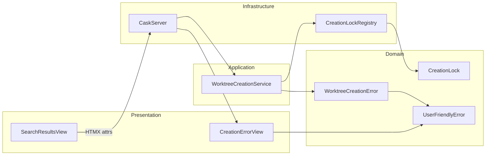
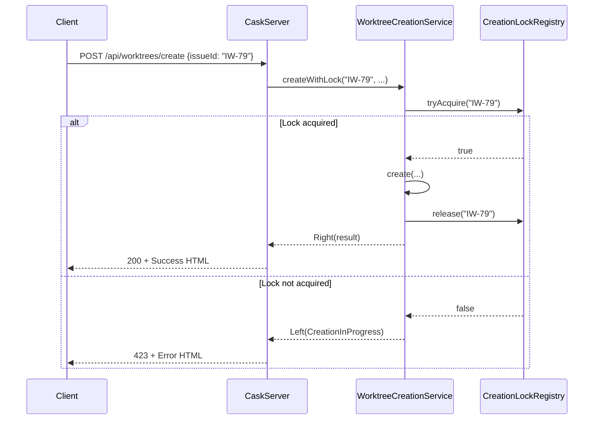
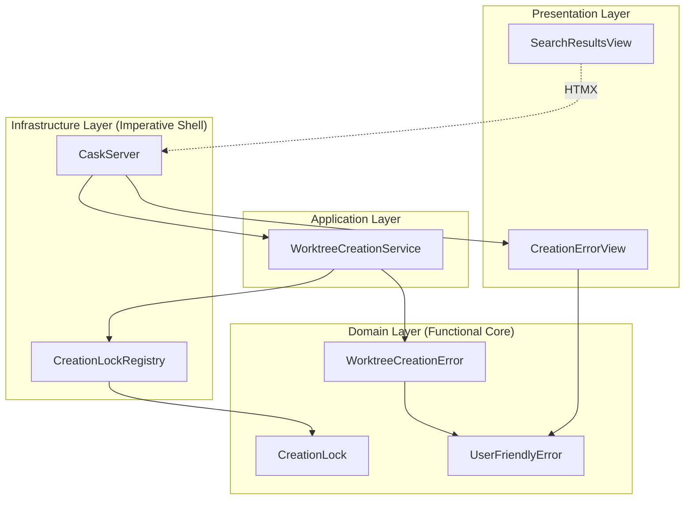

# Review Packet: Phase 4 - Concurrent Creation Protection

**Issue:** IW-79
**Phase:** 4 of 4
**Branch:** `IW-79-phase-04`

## Goals

This phase adds protection against concurrent worktree creation attempts to prevent race conditions and duplicate creation:

1. **UI disabling during creation** - Prevent user from clicking other issues while creation is in progress
2. **Server-side locking per issue ID** - Prevent concurrent creation requests for the same issue
3. **Lock cleanup** - Release locks on completion, failure, or timeout (30s)
4. **HTTP 423 response** - Return "Locked" status when lock cannot be acquired

## Scenarios

- [ ] **Scenario 1:** User clicks issue to create worktree → UI becomes disabled (grayed out, no pointer events)
- [ ] **Scenario 2:** Creation completes successfully → UI re-enables automatically
- [ ] **Scenario 3:** Creation fails → UI re-enables, error message shown
- [ ] **Scenario 4:** Rapid double-click on same issue → Only one creation attempt proceeds
- [ ] **Scenario 5:** Concurrent API requests for same issue → First succeeds, second gets 423 "Creation In Progress"
- [ ] **Scenario 6:** Lock held too long (30s+) → Lock auto-expires via cleanupExpired

## Entry Points

| File | Method/Class | Why Start Here |
|------|--------------|----------------|
| `.iw/core/infrastructure/CreationLockRegistry.scala` | `CreationLockRegistry` object | Core locking logic - thread-safe lock management with ConcurrentHashMap |
| `.iw/core/application/WorktreeCreationService.scala` | `createWithLock()` | Business logic orchestration - wraps `create()` with lock acquisition/release |
| `.iw/core/domain/WorktreeCreationError.scala` | `CreationInProgress` case | New error type for when lock cannot be acquired |
| `.iw/core/CaskServer.scala` | `createWorktree()` endpoint (line 324) | HTTP entry point - uses `createWithLock()` and maps error to 423 status |
| `.iw/core/presentation/views/SearchResultsView.scala` | `renderResults()` | UI state management - HTMX attributes for disabling during creation |

## Diagrams

### Architecture Overview

```mermaid
graph TB
    subgraph "Client (Browser)"
        UI[Search Results View]
        HTMX[HTMX Events]
    end

    subgraph "Server"
        API[POST /api/worktrees/create]
        Service[WorktreeCreationService]
        LockRegistry[CreationLockRegistry]
        Create[create()]
    end

    UI -->|"hx-post"| API
    HTMX -->|"before-request"| UI
    HTMX -->|"after-request"| UI

    API -->|"createWithLock()"| Service
    Service -->|"tryAcquire()"| LockRegistry
    Service -->|"create()"| Create
    Service -->|"release()"| LockRegistry

    LockRegistry -->|"423 if locked"| API
    Create -->|"result"| API
```

### Component Relationships



### Lock Acquisition Flow



### Layer Diagram (FCIS)



## Test Summary

| Test | Type | Verifies |
|------|------|----------|
| `CreationLock construction with valid fields succeeds` | Unit | Domain model construction |
| `CreationLock fields are accessible` | Unit | Field access |
| `CreationLock with different issue IDs are distinct` | Unit | Equality semantics |
| `CreationLock with different timestamps are distinct` | Unit | Equality semantics |
| `tryAcquire returns true when issue is not locked` | Unit | Lock acquisition succeeds when unlocked |
| `tryAcquire returns false when issue is already locked` | Unit | Lock prevents concurrent acquisition |
| `release allows subsequent acquire` | Unit | Lock release enables re-acquisition |
| `isLocked returns true when issue is locked` | Unit | Lock state checking |
| `isLocked returns false when issue is not locked` | Unit | Lock state checking |
| `isLocked returns false after release` | Unit | Lock release updates state |
| `cleanupExpired removes old locks` | Unit | Timeout cleanup mechanism |
| `cleanupExpired does not remove recent locks` | Unit | Cleanup preserves active locks |
| `different issues can be locked independently` | Unit | Multi-issue locking |
| `release does not affect other locked issues` | Unit | Lock isolation |
| `release on non-existent lock does not throw` | Unit | Defensive release handling |
| `createWithLock acquires lock before creation` | Unit | Lock acquisition in service |
| `createWithLock returns CreationInProgress when already locked` | Unit | Error when lock unavailable |
| `createWithLock releases lock on success` | Unit | Lock cleanup after success |
| `createWithLock releases lock on failure` | Unit | Lock cleanup after failure |
| `CreationInProgress maps to user-friendly error` | Unit | Error mapping |
| `CreationInProgress maps with descriptive message` | Unit | Error message content |
| `CreationInProgress maps with helpful suggestion` | Unit | Error suggestion content |
| `CreationInProgress is retryable` | Unit | Retry flag |
| `CreationInProgress includes issueId for retry` | Unit | Retry context |
| `results container has hx-on::before-request to disable UI` | Unit | HTMX disabling attribute |
| `results container has hx-on::after-request to re-enable UI` | Unit | HTMX re-enabling attribute |

## Files Changed

**13 files changed**: +248 insertions, -29 deletions

<details>
<summary>Full file list</summary>

### New Files
- `.iw/core/domain/CreationLock.scala` (A) - Domain model for tracking in-progress creation
- `.iw/core/infrastructure/CreationLockRegistry.scala` (A) - Thread-safe lock registry
- `.iw/core/test/CreationLockTest.scala` (A) - Unit tests for CreationLock
- `.iw/core/test/CreationLockRegistryTest.scala` (A) - Unit tests for lock registry

### Modified Files
- `.iw/core/domain/WorktreeCreationError.scala` (M) - Added CreationInProgress error case
- `.iw/core/application/WorktreeCreationService.scala` (M) - Added createWithLock method
- `.iw/core/CaskServer.scala` (M) - Updated to use createWithLock, added 423 status mapping
- `.iw/core/presentation/views/SearchResultsView.scala` (M) - Added HTMX hx-on attributes
- `.iw/core/DashboardService.scala` (M) - Added .disabled CSS class
- `.iw/core/test/SearchResultsViewTest.scala` (M) - Tests for UI state attributes
- `.iw/core/test/WorktreeCreationErrorMappingTest.scala` (M) - Tests for CreationInProgress mapping
- `.iw/core/test/WorktreeCreationErrorTest.scala` (M) - Tests for new error case
- `.iw/core/test/WorktreeCreationServiceTest.scala` (M) - Tests for createWithLock

</details>

## Key Implementation Details

### 1. Thread-Safe Locking

The `CreationLockRegistry` uses Java's `ConcurrentHashMap` with `putIfAbsent` for atomic lock acquisition:

```scala
def tryAcquire(issueId: String): Boolean =
  val lock = CreationLock(issueId, Instant.now())
  locks.putIfAbsent(issueId, lock) == null  // Returns null if key was absent
```

### 2. Automatic Lock Release

The `createWithLock` method uses try-finally to guarantee lock release:

```scala
def createWithLock(...): Either[..., ...] =
  if !CreationLockRegistry.tryAcquire(issueId) then
    Left(WorktreeCreationError.CreationInProgress(issueId))
  else
    try
      create(...)
    finally
      CreationLockRegistry.release(issueId)  // Always releases
```

### 3. UI State Management

HTMX event handlers disable/enable the results container:

```html
<div hx-on::before-request="this.classList.add('disabled')"
     hx-on::after-request="this.classList.remove('disabled')">
```

With CSS:
```css
.disabled { pointer-events: none; opacity: 0.5; }
```

## Review Checklist

- [ ] Lock acquisition is atomic (uses ConcurrentHashMap.putIfAbsent)
- [ ] Lock is always released (try-finally pattern)
- [ ] Error mapping includes correct HTTP status (423 Locked)
- [ ] UI disabling uses correct HTMX event names (hx-on::before-request)
- [ ] CSS disabled state prevents pointer events
- [ ] Tests cover all lock lifecycle states
- [ ] No information disclosure in error messages
