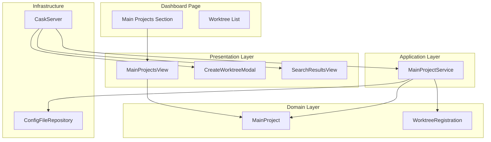
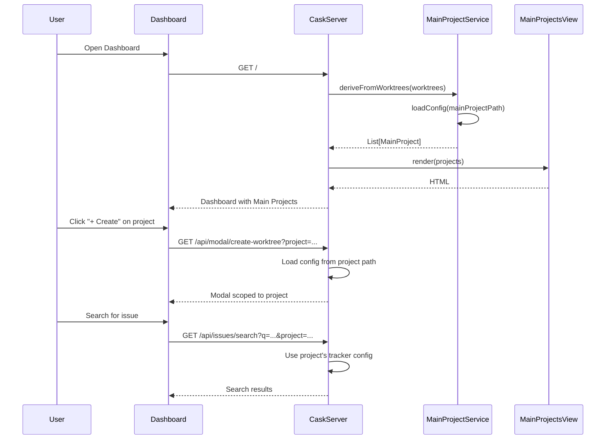
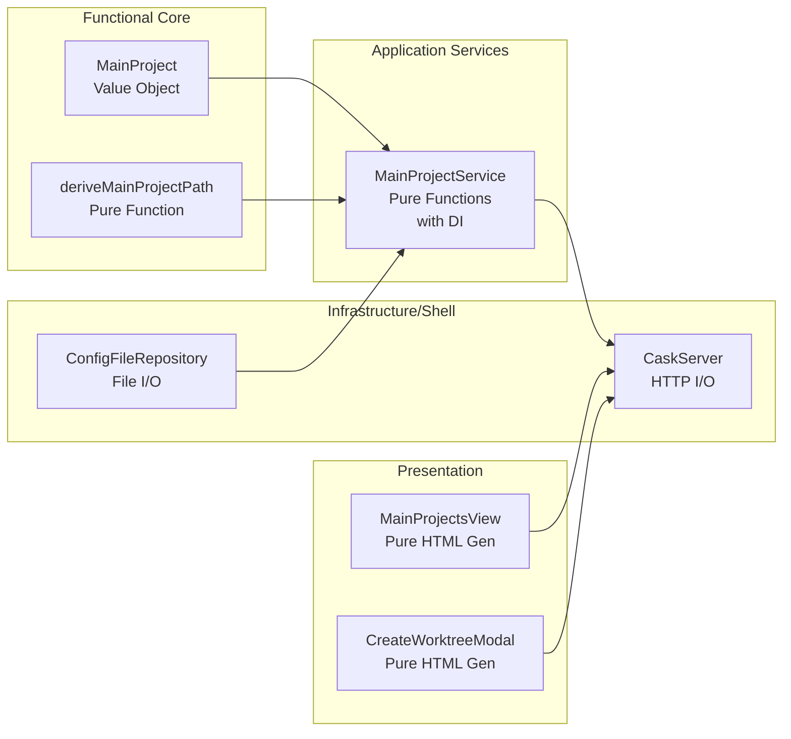

# Review Packet: Phase 5 - Main Projects Listing

**Issue:** IW-79
**Phase:** 5
**Branch:** IW-79-phase-05

## Goals

This phase addresses a UX gap identified during human review: the dashboard manages worktrees from multiple projects, but the "Create Worktree" button only used the server's CWD config. Phase 5 fixes this by:

1. **Deriving main projects** from registered worktree paths (pattern: `{mainProjectPath}-{issueId}`)
2. **Showing main projects section** above worktree list with per-project create buttons
3. **Scoping modal and search** to the selected project
4. **Removing global create button** from dashboard header

## Scenarios

- [ ] Dashboard shows main projects section above worktree list
- [ ] Main projects derived from registered worktrees (no manual registration)
- [ ] Each project shows tracker type (GitHub/Linear/YouTrack) and team identifier
- [ ] Create button opens modal scoped to that specific project
- [ ] Search uses correct tracker API for selected project
- [ ] Missing/invalid main projects handled gracefully (not shown)
- [ ] Empty state shown when no worktrees registered
- [ ] Multiple worktrees from same project = one entry in main projects
- [ ] Global "Create Worktree" button no longer in header

## Entry Points

| File | Method/Class | Why Start Here |
|------|--------------|----------------|
| `.iw/core/domain/MainProject.scala` | `MainProject`, `deriveMainProjectPath()` | Domain model and path derivation logic |
| `.iw/core/application/MainProjectService.scala` | `deriveFromWorktrees()`, `loadConfig()` | Orchestrates project extraction from worktrees |
| `.iw/core/presentation/views/MainProjectsView.scala` | `render()` | Generates main projects section HTML |
| `.iw/core/DashboardService.scala` | Dashboard HTML generation | Wires up main projects section, removes global button |
| `.iw/core/CaskServer.scala` | `/api/modal/create-worktree`, `/api/issues/search` | HTTP endpoints with project parameter |

## Diagrams

### Architecture Overview

### Component Flow

### Layer Diagram (FCIS)

## Test Summary

| Test | Type | Verifies |
|------|------|----------|
| `MainProjectTest."construction with all required fields"` | Unit | Case class construction |
| `MainProjectTest."deriveMainProjectPath strips standard issue ID suffix"` | Unit | Path derivation (IW-79 format) |
| `MainProjectTest."deriveMainProjectPath handles LINEAR issue format"` | Unit | Path derivation (IWLE-123 format) |
| `MainProjectTest."deriveMainProjectPath handles GitHub issue format"` | Unit | Path derivation (numeric 123 format) |
| `MainProjectTest."deriveMainProjectPath handles project names with hyphens"` | Unit | Path derivation for hyphenated names |
| `MainProjectTest."deriveMainProjectPath returns None for path without issue ID"` | Unit | Edge case - no issue ID |
| `MainProjectServiceTest."deriveFromWorktrees with empty list returns empty list"` | Unit | Empty input handling |
| `MainProjectServiceTest."deriveFromWorktrees with single worktree returns one project"` | Unit | Basic derivation |
| `MainProjectServiceTest."deriveFromWorktrees with multiple worktrees from same project"` | Unit | Deduplication |
| `MainProjectServiceTest."deriveFromWorktrees with multiple worktrees from different projects"` | Unit | Multiple projects |
| `MainProjectServiceTest."deriveFromWorktrees filters out projects with missing config"` | Unit | Config loading failure |
| `MainProjectsViewTest."render with empty projects list shows empty state"` | Unit | Empty state UI |
| `MainProjectsViewTest."render with single project shows project card"` | Unit | Single card rendering |
| `MainProjectsViewTest."render with multiple projects shows all project cards"` | Unit | Multiple cards rendering |
| `MainProjectsViewTest."create button includes correct project path parameter"` | Unit | URL-encoded project path |
| `MainProjectsViewTest."displays tracker type correctly for GitHub"` | Unit | GitHub formatting |
| `MainProjectsViewTest."displays tracker type correctly for Linear"` | Unit | Linear formatting |
| `MainProjectsViewTest."displays tracker type correctly for YouTrack"` | Unit | YouTrack formatting |

**Total:** 25 unit tests for Phase 5 components

## Files Changed

**New Files (6):**
- `.iw/core/domain/MainProject.scala` - Domain model
- `.iw/core/application/MainProjectService.scala` - Service logic
- `.iw/core/presentation/views/MainProjectsView.scala` - View rendering
- `.iw/core/test/MainProjectTest.scala` - Domain tests (12 tests)
- `.iw/core/test/MainProjectServiceTest.scala` - Service tests (6 tests)
- `.iw/core/test/MainProjectsViewTest.scala` - View tests (7 tests)

**Modified Files (4):**
- `.iw/core/CaskServer.scala` - Added project parameter to endpoints
- `.iw/core/DashboardService.scala` - Main projects section, removed global button, CSS
- `.iw/core/presentation/views/CreateWorktreeModal.scala` - Project path parameter
- `.iw/core/presentation/views/SearchResultsView.scala` - Project path in HTMX vals

Full file list

- `.iw/core/domain/MainProject.scala` (A)
- `.iw/core/application/MainProjectService.scala` (A)
- `.iw/core/presentation/views/MainProjectsView.scala` (A)
- `.iw/core/presentation/views/CreateWorktreeModal.scala` (M)
- `.iw/core/presentation/views/SearchResultsView.scala` (M)
- `.iw/core/CaskServer.scala` (M)
- `.iw/core/DashboardService.scala` (M)
- `.iw/core/test/MainProjectTest.scala` (A)
- `.iw/core/test/MainProjectServiceTest.scala` (A)
- `.iw/core/test/MainProjectsViewTest.scala` (A)

## Key Implementation Details

### Path Derivation Pattern
The `MainProject.deriveMainProjectPath()` function uses regex pattern `-([A-Z]+-\d+|\d+)$` to match issue ID suffixes:
- `IW-79` (standard)
- `IWLE-123` (Linear)
- `123` (GitHub numeric)

### Project-Scoped Flow
1. Dashboard renders main projects via `MainProjectsView`
2. Create button includes URL-encoded project path: `?project=%2Fhome%2Fuser%2Fprojects%2Fiw-cli`
3. Modal endpoint loads config from specified project path
4. Search endpoint uses project's tracker configuration
5. Worktree creation uses project context throughout

### CSS Styling
Added styles for:
- `.main-projects-section` - Section container
- `.main-projects-list` - Grid layout for cards
- `.main-project-card` - Individual project cards with hover effects
- `.main-projects-empty` - Empty state styling
