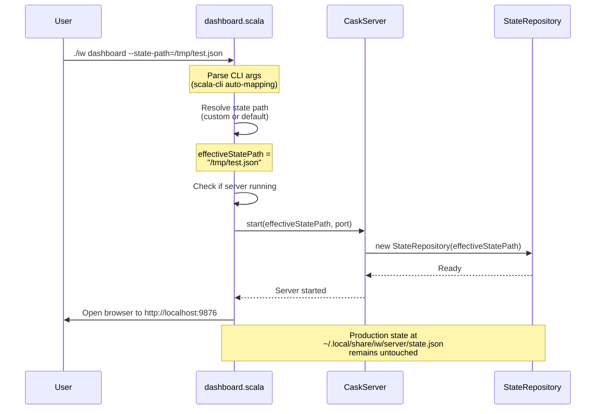

# Phase 1: Run server with custom state file

## Goals

This phase enables developers to run the dashboard server with a custom state file path, providing complete isolation from production state. This is the foundation for all dev mode features.

Key objectives:
- Add `--state-path=<path>` CLI flag to dashboard command
- Enable server startup with isolated state file
- Ensure production state remains untouched when custom path is used

## Scenarios

- [ ] `./iw dashboard --state-path=<path>` starts server with custom state file
- [ ] Production state at `~/.local/share/iw/server/state.json` remains untouched when custom path is used
- [ ] Server successfully persists worktrees to custom path
- [ ] Browser opens to dashboard as usual
- [ ] No `--state-path` flag uses production path (backward compatible)

## Entry Points

Start your review from these locations:

| File | Method/Class | Why Start Here |
|------|--------------|----------------|
| `.iw/commands/dashboard.scala` | `dashboard()` main function | CLI entry point where `--state-path` parameter is parsed |
| `.iw/commands/dashboard.scala` | State path resolution logic | Where custom vs production path is determined |
| `.iw/commands/dashboard.scala` | `startServerAndOpenBrowser()` | Where effective state path is passed to CaskServer |

## Component Relationships

```mermaid
flowchart TD
    CLI[dashboard.scala<br/><i>modified</i>]
    
    subgraph "State Path Resolution"
        CLI -->|"--state-path param"| RESOLVE[effectiveStatePath<br/><i>new logic</i>]
        RESOLVE -->|"custom path"| CUSTOM[/tmp/custom/state.json]
        RESOLVE -->|"default"| PROD[~/.local/share/iw/server/state.json]
    end
    
    RESOLVE --> SERVER[[CaskServer.start<br/><i>unchanged</i>]]
    SERVER --> REPO[(StateRepository<br/><i>unchanged</i>)]
    
    style CLI fill:#e1f5ff
    style RESOLVE fill:#fff4e1
```

**Key points for reviewer:**
- Only `dashboard.scala` changes - no modifications to CaskServer or StateRepository
- State path resolution happens before server startup
- CaskServer already supports custom paths via `statePath` parameter
- Production path is the default when no flag provided

## Key Flow: Starting Dashboard with Custom State



**Key points for reviewer:**
- Custom state path flows through to StateRepository constructor
- No interaction with production state file when custom path used
- Backward compatibility: no flag = production path

## Test Summary

**Note:** This phase follows the CLI script pattern and relies on manual verification rather than automated tests.

### Manual Verification Checklist

| Scenario | Verification Steps |
|----------|-------------------|
| Custom state path | 1. Create temp directory: `mkdir -p /tmp/iw-test`<br/>2. Run: `./iw dashboard --state-path=/tmp/iw-test/state.json`<br/>3. Verify server starts and browser opens<br/>4. Register a worktree via dashboard<br/>5. Verify `/tmp/iw-test/state.json` exists and contains worktree<br/>6. Verify `~/.local/share/iw/server/state.json` is unchanged |
| Production path (default) | 1. Run: `./iw dashboard` (no flags)<br/>2. Register a worktree<br/>3. Verify worktree saved to `~/.local/share/iw/server/state.json` |
| Relative path support | 1. Run: `./iw dashboard --state-path=./local-state.json`<br/>2. Verify `./local-state.json` created in current directory |
| Parent directory creation | 1. Run: `./iw dashboard --state-path=/tmp/nested/deep/state.json`<br/>2. Verify StateRepository creates parent directories |

**Coverage:** Manual verification covers all acceptance criteria

## Files Changed

**4 files** changed, +739 insertions, -0 deletions

<details>
<summary>Full file list</summary>

- `project-management/issues/IW-82/analysis.md` (A) +515 lines
- `project-management/issues/IW-82/phase-01-context.md` (A) +151 lines
- `project-management/issues/IW-82/phase-01-tasks.md` (A) +42 lines
- `project-management/issues/IW-82/tasks.md` (A) +31 lines

**Note:** Current branch contains only planning documents. Code changes to `.iw/commands/dashboard.scala` are pending implementation.

</details>

## Implementation Notes

### Expected Changes to dashboard.scala

The implementation should modify `dashboard.scala` to:

1. **Add CLI parameter:**
   ```scala
   @main def dashboard(statePath: String = ""): Unit =
   ```

2. **Resolve effective state path:**
   ```scala
   val effectiveStatePath = if statePath.isEmpty then defaultStatePath else statePath
   ```

3. **Print effective state path:**
   ```scala
   println(s"Using state file: $effectiveStatePath")
   ```

4. **Pass to server:**
   ```scala
   startServerAndOpenBrowser(effectiveStatePath, port, url)
   ```

### What Should NOT Change

- `CaskServer.scala` - already accepts `statePath` parameter
- `StateRepository.scala` - already supports custom paths
- `ServerConfigRepository.scala` - config continues using production path (isolation comes in later phases)
- Any production state files - must remain untouched when custom path is used

### Error Handling

- StateRepository handles invalid paths gracefully
- Parent directory creation is handled by StateRepository
- Both absolute and relative paths should work

## Review Checklist

Before approving this phase, verify:

- [ ] `dashboard.scala` has `statePath` parameter in `@main` signature
- [ ] Effective state path logic correctly chooses custom vs default
- [ ] Custom state path is printed to stdout for developer visibility
- [ ] Effective state path is passed to `startServerAndOpenBrowser()`
- [ ] No changes to CaskServer, StateRepository, or other infrastructure
- [ ] Manual verification shows production state untouched with custom path
- [ ] Manual verification shows backward compatibility (no flag = production path)
- [ ] Code follows functional programming principles (pure path resolution)
- [ ] No unnecessary changes beyond the stated scope
