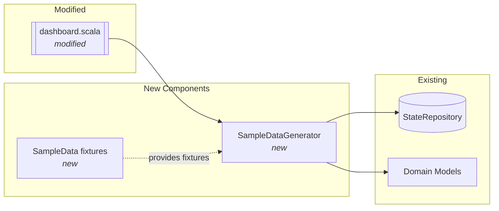

# Phase 2: Sample Data Generation for Dashboard

## Goals

This phase implements sample data generation for the dashboard's development mode, enabling developers to populate the dashboard with realistic sample data across multiple tracker types, PR states, and workflow progress scenarios.

Key objectives:
- Add `--sample-data` CLI flag to dashboard command
- Create comprehensive sample fixtures in TestFixtures.scala
- Implement SampleDataGenerator for generating complete ServerState
- Generate 5 worktrees spanning 3 tracker types (Linear, GitHub, YouTrack)
- Include diverse cache data with edge cases

## Scenarios

- [ ] User can run `./iw dashboard --sample-data` to populate state with fixtures
- [ ] Sample includes 5 worktrees across Linear (2), GitHub (1), and YouTrack (2) tracker types
- [ ] Each worktree has cached issue data with various statuses
- [ ] Sample includes cached PR data with Open, Merged, and Closed states
- [ ] Sample includes workflow progress with 10%, 40%, 60%, and 100% completion percentages
- [ ] Sample includes review states with artifact collections
- [ ] Edge cases included: missing assignees (GH-100), no PR (GH-100), no workflow (YT-111), no review state (YT-111)
- [ ] Generated data can be serialized and read back via StateRepository
- [ ] Sample data is deterministic across multiple generations

## Entry Points

Start your review from these locations:

| File | Method/Class | Why Start Here |
|------|--------------|----------------|
| `.iw/core/domain/SampleDataGenerator.scala` | `generateSampleState()` | Core generation logic - creates complete ServerState |
| `.iw/commands/dashboard.scala` | `dashboard()` main function | CLI integration - parses `--sample-data` flag |
| `.iw/core/test/TestFixtures.scala` | `SampleData` object | Foundation fixtures used by generator |

## Component Relationships



**Key points for reviewer:**
- SampleDataGenerator is a pure object - no side effects in generation
- dashboard.scala handles all I/O (reading/writing state)
- SampleData fixtures are reusable across tests and production code
- Generated state is deterministic (same data on every run, except timestamps)

## Sample Data Design

The generator creates 5 worktrees with intentional variety:

| Issue ID | Tracker | Progress | PR State | Review State | Edge Cases |
|----------|---------|----------|----------|--------------|------------|
| IWLE-123 | Linear | 40% (2/5) | PR#42 Open | in_review | - |
| IWLE-456 | Linear | 100% (5/5) | PR#45 Merged | ready_to_merge | - |
| GH-100 | GitHub | 10% (1/3) | None | awaiting_review | No PR, no assignee |
| YT-111 | YouTrack | None | PR#1 Closed | None | No workflow, no review state |
| YT-222 | YouTrack | 60% (3/4) | PR#5 Open | in_review | - |

**Verify these scenarios render correctly in the dashboard UI.**

## Test Summary

| Test | Type | Verifies |
|------|------|----------|
| `SampleDataGeneratorTest."generates 5 worktrees"` | Unit | Correct worktree count and IDs |
| `SampleDataGeneratorTest."uses 3 tracker types"` | Unit | Linear, GitHub, YouTrack coverage |
| `SampleDataGeneratorTest."is deterministic"` | Unit | Consistent data across runs |
| `SampleDataGeneratorTest."issueCache contains 5 entries"` | Unit | All worktrees have cached issues |
| `SampleDataGeneratorTest."progressCache contains 4 entries"` | Unit | YT-111 excluded (edge case) |
| `SampleDataGeneratorTest."prCache contains 4 entries"` | Unit | GH-100 excluded (edge case) |
| `SampleDataGeneratorTest."reviewStateCache contains 4 entries"` | Unit | YT-111 excluded (edge case) |
| `SampleDataGeneratorTest."includes missing assignee"` | Unit | GH-100 has no assignee |
| `SampleDataGeneratorTest."covers all PRState values"` | Unit | Open, Merged, Closed states |
| `SampleDataGeneratorTest."serializes via StateRepository"` | Integration | Round-trip serialization works |
| `SampleDataTest.*` (16 tests) | Unit | Validates SampleData fixtures |

Coverage: 27 tests covering sample data generation and fixtures.

## CLI Usage

```bash
# Generate sample data and start dashboard
./iw dashboard --sample-data

# Generate sample data to custom state file
./iw dashboard --state-path=/tmp/test.json --sample-data

# Verify sample data was written
./iw dashboard --state-path=/tmp/test.json
```

## Files Changed

**5 files** changed, +1149 insertions, -54 deletions

<details>
<summary>Full file list</summary>

- `.iw/commands/dashboard.scala` (M) +45 -0 lines
  - Added `--sample-data` flag parsing
  - Generate and persist sample data before server startup
  - Verify write by reading back
- `.iw/core/domain/SampleDataGenerator.scala` (A) +337 lines
  - New generator for complete ServerState
  - 5 worktrees across 3 tracker types
  - Complete cache data (issues, PRs, progress, review states)
- `.iw/core/test/SampleDataGeneratorTest.scala` (A) +118 lines
  - Unit tests for generator determinism
  - Validates cache sizes and edge cases
  - Integration test with StateRepository
- `.iw/core/test/SampleDataTest.scala` (A) +185 lines
  - Unit tests for SampleData fixtures
  - Validates worktrees, issues, PRs, progress, review states
  - Checks for edge cases (missing assignee, all PR states)
- `.iw/core/test/TestFixtures.scala` (M) +422 -0 lines
  - Expanded SampleData object with comprehensive fixtures
  - 5 sample worktrees (sampleWorktrees)
  - 5 sample issues (sampleIssues)
  - 4 sample cached PRs (sampleCachedPRs)
  - 4 sample workflow progress (sampleWorkflowProgress)
  - 4 sample review states (sampleReviewStates)

</details>

## Implementation Notes

### Pure vs Effectful Separation

The implementation follows functional core / imperative shell pattern:

**Pure (Functional Core):**
- `SampleDataGenerator.generateSampleState()` - returns ServerState, no side effects
- All `SampleData` fixtures - pure immutable values

**Effectful (Imperative Shell):**
- `dashboard.scala` - reads CLI args, writes to filesystem via StateRepository
- StateRepository I/O operations

### Timestamp Handling

Sample data uses relative timestamps via `Instant.now().minus(...)`:
- Worktrees: registeredAt/lastSeenAt span 10 days to 10 minutes ago
- Issue cache: fetchedAt spans 2 hours to 1 minute ago
- PR cache: fetchedAt spans 5 minutes to 30 seconds ago
- Progress cache: filesMtime spans 2 days to 10 minutes ago
- Review cache: filesMtime spans 2 days to 10 minutes ago

This creates realistic "freshness" variations in cached data.

### Edge Cases Intentionally Included

1. **GH-100**: No PR (prCache excludes it), no assignee
2. **YT-111**: No workflow progress (progressCache excludes it), no review state
3. **Stale caches**: Some cached data is intentionally expired (beyond TTL)

These edge cases ensure the dashboard UI handles missing or incomplete data gracefully.

## Verification Checklist

- [ ] Run `./iw dashboard --sample-data` and verify 5 worktrees appear in UI
- [ ] Verify tracker types show Linear (2), GitHub (1), YouTrack (2)
- [ ] Check GH-100 shows "No PR" and "Unassigned"
- [ ] Check YT-111 shows "No workflow" and "No review state"
- [ ] Verify PR states render correctly (Open, Merged, Closed)
- [ ] Check progress bars show 10%, 40%, 60%, 100% correctly
- [ ] Verify review states show correct status badges
- [ ] Run unit tests: `./iw test unit`
- [ ] Confirm all 27 sample data tests pass

