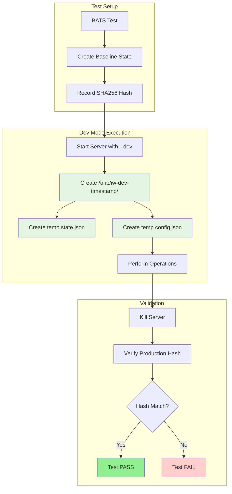
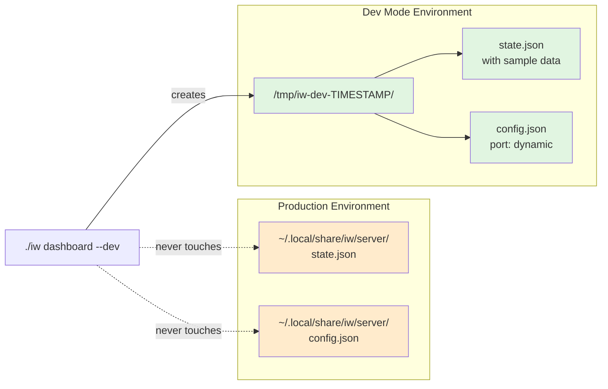

# Phase 5: Validate Development Mode Isolation

## Goals

This phase validates that development mode (`--dev` flag) provides complete isolation from production data. The goal is to ensure production state and config files are never modified when using `--dev` mode.

Key objectives:
- Verify production state file remains untouched in dev mode
- Verify production config file remains untouched in dev mode
- Validate dev mode creates isolated temporary directory
- Document isolation guarantees in CLI help text

## Scenarios

- [ ] Dev mode creates temporary directory with timestamp
- [ ] Dev mode creates state.json in temp directory
- [ ] Dev mode creates config.json in temp directory
- [ ] Production state file unchanged after dev mode operations
- [ ] Production config file unchanged after dev mode operations
- [ ] Dev mode enables sample data by default
- [ ] Help text clearly documents isolation guarantees

## Entry Points

Start your review from these locations:

| File | Method/Class | Why Start Here |
|------|--------------|----------------|
| `.iw/test/dashboard-dev-mode.bats` | Test suite | E2E validation tests for dev mode isolation |
| `.iw/commands/dashboard.scala` | `printHelp()` | Documentation of isolation guarantees |
| `.iw/commands/dashboard.scala` | Dev mode setup (lines 48-78) | Temp directory and config creation logic |

## Test Architecture

This diagram shows how the E2E tests validate isolation:



**Key points for reviewer:**
- Tests verify byte-for-byte integrity of production files
- Dev mode creates timestamped temp directories for complete isolation
- All tests use SHA256 hashing to detect any production file changes

## Test Summary

| Test | Type | Verifies |
|------|------|----------|
| `dev mode creates temp directory` | E2E | Dev mode creates `/tmp/iw-dev-*` directory |
| `dev mode creates state.json in temp directory` | E2E | State file exists in temp directory, not production |
| `dev mode creates config.json in temp directory` | E2E | Config file exists in temp directory, not production |
| `production state file unchanged after dev mode` | E2E | Production state hash identical before/after dev mode |
| `production config file unchanged after dev mode` | E2E | Production config hash identical before/after dev mode |
| `dev mode enables sample data by default` | E2E | Sample data automatically loaded in dev mode |

Coverage: 6 E2E tests covering complete isolation of dev mode from production state

**Test Results:**
```
1..6
ok 1 dev mode creates temp directory
ok 2 dev mode creates state.json in temp directory
ok 3 dev mode creates config.json in temp directory
ok 4 production state file unchanged after dev mode
ok 5 production config file unchanged after dev mode
ok 6 dev mode enables sample data by default
```

All tests passing ✅

## Isolation Architecture

This diagram shows how dev mode isolates production from development:



**Key points for reviewer:**
- Solid arrows show actual file operations
- Dashed arrows show files that are never accessed
- Temp directory uses timestamp to avoid conflicts
- Production files (orange) remain completely untouched

## Documentation Added

The CLI help text now includes comprehensive isolation guarantees:

**Help Output Sections:**
1. **Development Mode Description**: Explains what `--dev` does
2. **Isolation Guarantees**: Explicit promises about production safety
3. **Examples**: Usage patterns for different scenarios

**Key Documentation Points:**
- Production state file is never read or written in dev mode
- Production config file is never modified in dev mode
- All operations happen in isolated temporary directory
- Safe to experiment without affecting real worktree registrations

Review the `printHelp()` function in `dashboard.scala` (lines 183-214) for full documentation.

## Files Changed

**3 files** changed, +218 insertions, -9 deletions

<details>
<summary>Full file list</summary>

- `.iw/test/dashboard-dev-mode.bats` (A) +180 lines - E2E test suite for dev mode isolation
- `.iw/commands/dashboard.scala` (M) +38 -9 lines - Added help text and help flag support
- `project-management/issues/IW-82/phase-05-tasks.md` (M) - Task tracking updates

</details>

## Review Checklist

Use this checklist while reviewing:

**E2E Tests:**
- [ ] Tests use proper setup/teardown to avoid pollution
- [ ] SHA256 hashing correctly verifies byte-for-byte integrity
- [ ] Tests handle server lifecycle (start, wait, kill) properly
- [ ] Temp directory cleanup happens in teardown
- [ ] All 6 tests are independent and can run in any order

**Documentation:**
- [ ] Help text clearly states isolation guarantees
- [ ] Examples demonstrate both dev and production modes
- [ ] Warning about production file locations is prominent
- [ ] Help flag (`--help`, `-h`) works correctly

**Isolation Logic:**
- [ ] Dev mode creates timestamped temp directory
- [ ] Config file is created in temp directory (not just state)
- [ ] Production paths are never accessed in dev mode
- [ ] Sample data is auto-enabled in dev mode

