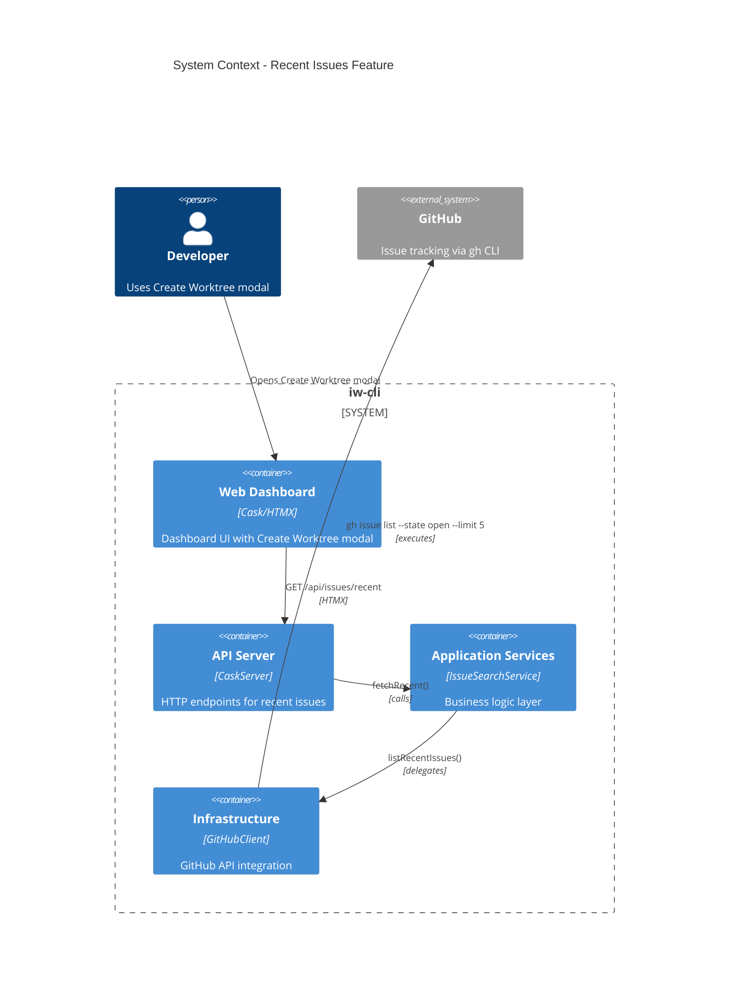
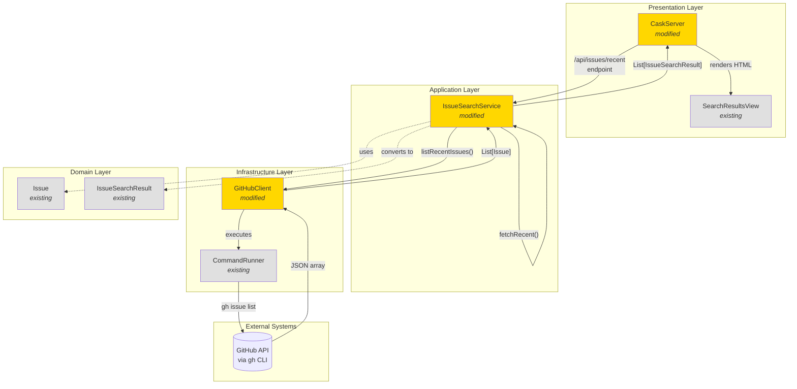
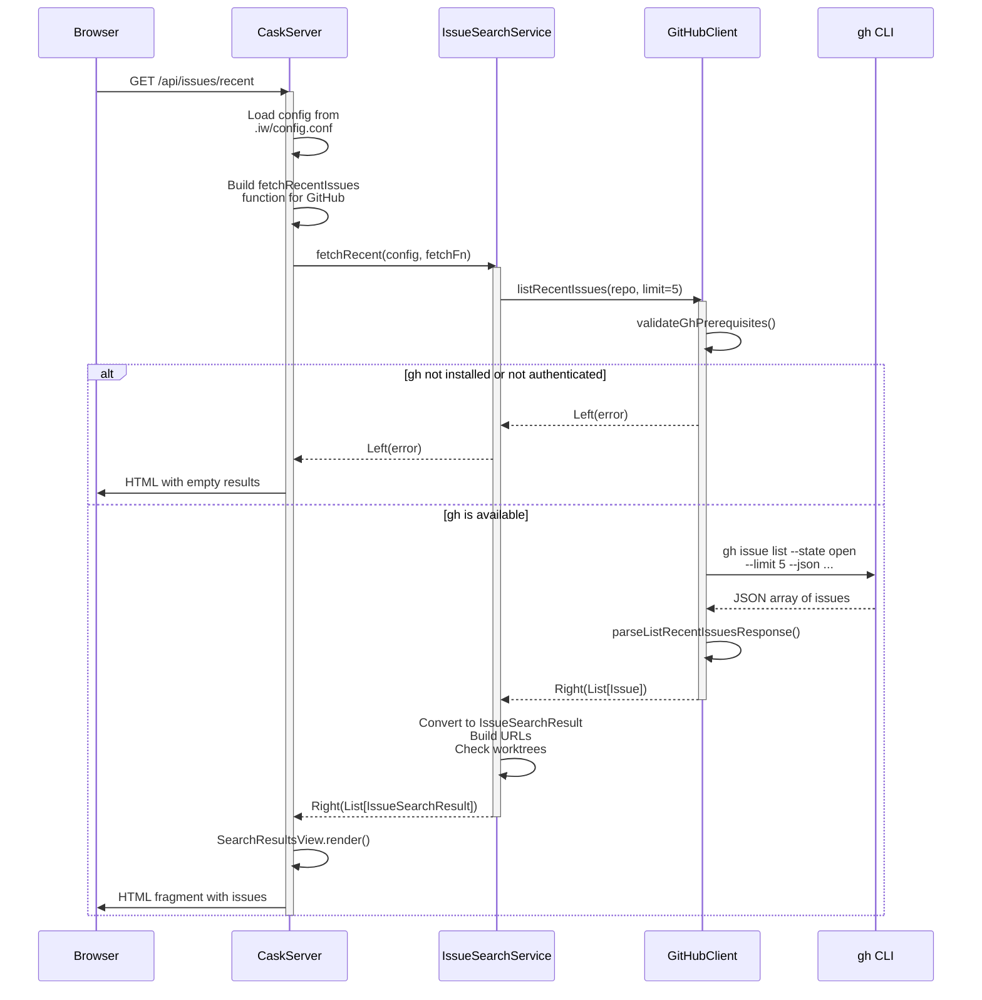
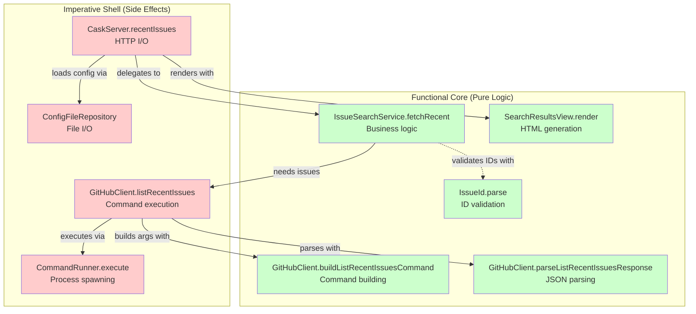

# Phase 1: Recent issues - GitHub

## Goals

This phase implements the ability to fetch and display 5 most recent open issues from GitHub when the Create Worktree modal opens. This establishes the foundation pattern that will be replicated for Linear and YouTrack in later phases.

Key objectives:
- Add GitHub client method to list recent issues via `gh` CLI
- Add application service method to fetch recent issues
- Add `/api/issues/recent` API endpoint returning HTML fragment
- Maintain consistent architecture (Functional Core, Imperative Shell)
- Provide comprehensive test coverage for all new code

## Scenarios

- [ ] GitHubClient.listRecentIssues() fetches 5 recent open issues
- [ ] Issues are sorted by most recently updated (gh CLI default)
- [ ] `/api/issues/recent` endpoint returns HTML fragment with issue list
- [ ] Empty state renders when no issues found
- [ ] Error cases return empty list without crashing the server
- [ ] gh CLI not installed returns appropriate error message
- [ ] gh CLI not authenticated returns appropriate error message
- [ ] All unit tests pass with comprehensive coverage

## Entry Points

Start your review from these locations:

| File | Method/Class | Why Start Here |
|------|--------------|----------------|
| `.iw/core/GitHubClient.scala` | `listRecentIssues()` (line 368) | Infrastructure layer entry point - fetches issues from GitHub via gh CLI |
| `.iw/core/IssueSearchService.scala` | `fetchRecent()` (line 128) | Application service orchestrating recent issue fetching and URL building |
| `.iw/core/CaskServer.scala` | `recentIssues()` endpoint (line 316) | HTTP API endpoint serving recent issues as HTML fragment |

## Architecture Overview

This diagram shows how the new recent issues feature fits within the existing layered architecture.

**Key points for reviewer:**
- New functionality follows existing layered architecture
- No changes to domain layer (reuses existing `Issue` model)
- Clean separation: HTTP -> Application -> Infrastructure -> External API
- All GitHub communication through gh CLI (no direct HTTP calls)

## Component Relationships

This diagram shows the relationships between components modified in this phase.

**Key points for reviewer:**
- No new domain objects needed - reuses `Issue` and `IssueSearchResult`
- `IssueSearchService.fetchRecent()` mirrors existing `search()` pattern
- `GitHubClient.listRecentIssues()` follows same structure as `fetchIssue()`
- All components inject dependencies for testability
- Command execution abstracted through `CommandRunner`

## Key Flow: Fetching Recent Issues

This sequence diagram shows the runtime flow when the modal loads recent issues.

**Key points for reviewer:**
- Error handling at every layer - errors converted to empty results
- Prerequisite validation prevents execution if gh CLI unavailable
- JSON parsing happens in GitHubClient (infrastructure layer)
- Domain conversion happens in IssueSearchService (application layer)
- HTML rendering happens in CaskServer (presentation layer)

## Layer Diagram (FCIS Architecture)

This diagram shows how the implementation maps to Functional Core / Imperative Shell architecture.

**Key points for reviewer:**
- Pure functions are heavily tested (easily testable without mocks)
- Effectful functions inject dependencies for testability
- Command building and JSON parsing are pure (no side effects)
- Only command execution and HTTP handling have side effects
- This pattern makes incremental testing straightforward

## Test Summary

| Test | Type | Verifies |
|------|------|----------|
| `GitHubClientTest."buildListRecentIssuesCommand with default limit"` | Unit | Command structure with default limit=5 |
| `GitHubClientTest."buildListRecentIssuesCommand with custom limit"` | Unit | Command structure with custom limit |
| `GitHubClientTest."parseListRecentIssuesResponse parses valid JSON array"` | Unit | JSON parsing with multiple issues |
| `GitHubClientTest."parseListRecentIssuesResponse parses empty array"` | Unit | Empty array returns empty list |
| `GitHubClientTest."parseListRecentIssuesResponse handles malformed JSON"` | Unit | Graceful error handling for bad JSON |
| `GitHubClientTest."parseListRecentIssuesResponse handles missing required fields"` | Unit | Error handling for incomplete data |
| `GitHubClientTest."listRecentIssues success case with mocked command"` | Unit | Full flow with mocked command execution |
| `GitHubClientTest."listRecentIssues fails when gh CLI not available"` | Unit | Prerequisite validation - gh not installed |
| `GitHubClientTest."listRecentIssues fails when gh CLI not authenticated"` | Unit | Prerequisite validation - gh not authenticated |
| `IssueSearchServiceTest."fetchRecent success case with GitHub tracker"` | Unit | Application service happy path |
| `IssueSearchServiceTest."fetchRecent with worktree check integration"` | Unit | Worktree existence flag integration |
| `IssueSearchServiceTest."fetchRecent handles fetch errors gracefully"` | Unit | Error propagation from infrastructure |
| `IssueSearchServiceTest."fetchRecent returns empty list when no issues"` | Unit | Empty state handling |

Coverage: 13 unit tests covering all new methods and error paths. All infrastructure functions inject dependencies (isCommandAvailable, execCommand) for testability without real gh CLI execution.

## Files Changed

**5 files** changed, +421 insertions (source + tests)

Full file list

**Source files (3):**
- `.iw/core/GitHubClient.scala` (+92 lines)
  - Added: `buildListRecentIssuesCommand()`, `parseListRecentIssuesResponse()`, `listRecentIssues()`
- `.iw/core/IssueSearchService.scala` (+36 lines)
  - Added: `fetchRecent()` method
- `.iw/core/CaskServer.scala` (+66 lines)
  - Added: `/api/issues/recent` endpoint, `buildFetchRecentFunction()` helper

**Test files (2):**
- `.iw/core/test/GitHubClientTest.scala` (+133 lines)
  - 9 new tests for recent issues functionality
- `.iw/core/test/IssueSearchServiceTest.scala` (+94 lines)
  - 4 new tests for fetchRecent method

**Documentation files (5):**
- `project-management/issues/IW-88/analysis.md` (+542 lines) - Story-driven analysis
- `project-management/issues/IW-88/phase-01-context.md` (+195 lines) - Phase context
- `project-management/issues/IW-88/phase-01-tasks.md` (+68 lines) - Task breakdown
- `project-management/issues/IW-88/review-state.json` (+9 lines) - Review state metadata
- `project-management/issues/IW-88/tasks.md` (+29 lines) - Task index

## Notes for Reviewers

**Testing approach:**
- All tests follow TDD approach (tests written first, then implementation)
- Pure functions tested directly without mocking
- Effectful functions tested with injected dependencies
- No actual gh CLI execution in tests (fully mocked)

**Error handling strategy:**
- Prerequisite validation prevents execution if gh CLI unavailable
- JSON parsing errors return Left with descriptive messages
- API errors propagated through Either monad
- Server endpoint converts all errors to empty HTML (never returns 500)

**Consistency with existing patterns:**
- `listRecentIssues()` mirrors structure of `fetchIssue()`
- `fetchRecent()` mirrors structure of `search()`
- `/api/issues/recent` endpoint mirrors `/api/issues/search`
- All methods follow existing error handling patterns

**Future phases:**
- Phase 2: Add title-based search for GitHub
- Phase 3-4: Add recent issues + search for Linear
- Phase 5-6: Add recent issues + search for YouTrack
- Phase 7: Wire up `/api/issues/recent` to modal load event (UI integration)
