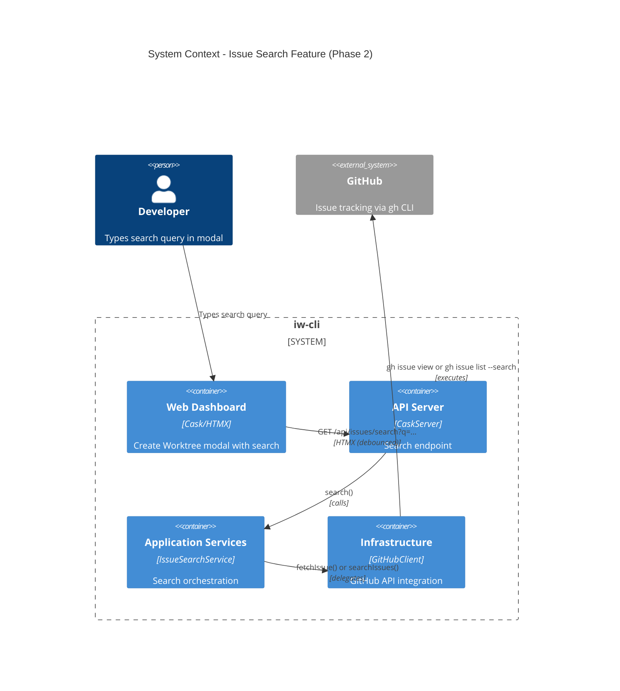
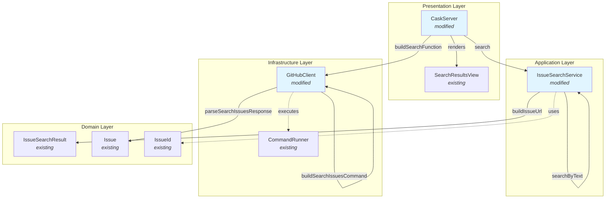
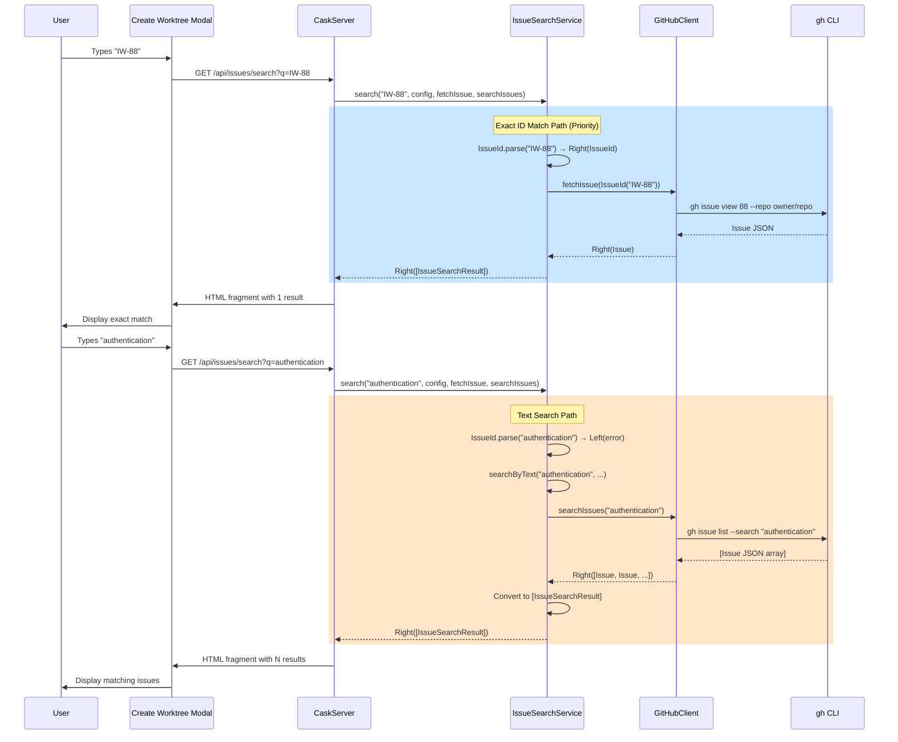

# Phase 2: Search by title - GitHub

## Goals

This phase extends the issue search functionality to support title-based search for GitHub issues. When a user types text that doesn't match an exact issue ID, the system searches GitHub issues by title and returns matching results.

Key objectives:
- Add `GitHubClient.searchIssues()` method to search issues via `gh issue list --search`
- Modify `IssueSearchService.search()` to fall back to title search when query is not an ID
- Maintain priority: exact ID match returns first, then title search
- Comprehensive unit tests for all new functionality
- No changes to UI (search endpoint already exists)

## Scenarios

- [ ] `GitHubClient.searchIssues()` searches issues by text via gh CLI
- [ ] Exact ID match returns that specific issue (priority behavior maintained)
- [ ] Non-ID text triggers title search fallback
- [ ] Valid ID but issue not found triggers title search fallback
- [ ] Search results display issue ID, title, status, and URL
- [ ] Empty query returns empty results
- [ ] gh CLI not installed returns appropriate error message
- [ ] gh CLI not authenticated returns appropriate error message
- [ ] Error cases don't crash the server
- [ ] All unit tests pass with comprehensive coverage

## Entry Points

Start your review from these locations:

| File | Method/Class | Why Start Here |
|------|--------------|----------------|
| `.iw/core/IssueSearchService.scala` | `search()` (line 24) | Application service orchestrating search logic with ID match priority and text search fallback |
| `.iw/core/GitHubClient.scala` | `searchIssues()` (line 440) | Infrastructure layer entry point - searches GitHub issues via gh CLI |
| `.iw/core/CaskServer.scala` | `buildSearchFunction()` (line 559) | Adapter function connecting HTTP endpoint to GitHub search implementation |

## Architecture Overview

This diagram shows how the search functionality fits within the existing system.

**Key points for reviewer:**
- Search flow maintains layered architecture
- Two paths: exact ID match (priority) or text search fallback
- All GitHub communication through gh CLI (consistent with Phase 1)
- No direct HTTP calls to GitHub API

## Component Relationships

This diagram shows the relationships between components modified in Phase 2.

**Key relationships:**
- `CaskServer.buildSearchFunction()` creates adapter for GitHub search (new in Phase 2)
- `IssueSearchService.search()` now accepts `searchIssues` parameter (modified in Phase 2)
- `IssueSearchService.searchByText()` private helper for text search fallback (new in Phase 2)
- `GitHubClient.searchIssues()` new method reusing validation and parsing patterns from Phase 1
- `GitHubClient.parseSearchIssuesResponse()` reuses `parseListRecentIssuesResponse()` (DRY principle)

## Key Flow: Search with ID Priority and Fallback

This sequence diagram shows the search flow with exact ID match priority and text search fallback.

**Key flow points:**
- Priority path: exact ID match returns immediately (no text search)
- Fallback path 1: valid ID format but issue not found → triggers text search
- Fallback path 2: invalid ID format → triggers text search immediately
- Both paths return consistent `IssueSearchResult` format
- Search is debounced by HTMX (300ms delay, configured in modal)

## Test Summary

| Test | Type | Verifies |
|------|------|----------|
| **GitHubClient Tests** | | |
| `buildSearchIssuesCommand with default limit` | Unit | Command structure with default limit (10) |
| `buildSearchIssuesCommand with custom limit` | Unit | Command structure with custom limit parameter |
| `buildSearchIssuesCommand query parameter` | Unit | Query text is passed correctly to gh CLI |
| `parseSearchIssuesResponse reuses parseListRecentIssuesResponse` | Unit | JSON parsing reuses existing logic (DRY) |
| `searchIssues success case with mocked command` | Unit | Happy path with mocked gh CLI execution |
| `searchIssues when gh CLI not available` | Unit | Returns error when gh not installed |
| `searchIssues empty results` | Unit | Handles empty search results |
| **IssueSearchService Tests** | | |
| `search() exact ID match returns that issue (priority over text search)` | Unit | Exact ID match returns immediately without text search |
| `search() invalid ID format triggers text search` | Unit | Non-ID query triggers text search fallback |
| `search() valid ID but not found triggers text search` | Unit | ID parsed but fetch fails → text search fallback |
| `search() text search returns matching issues` | Unit | Text search returns multiple matching issues |
| `search() empty query returns empty results (skips text search)` | Unit | Empty query validation before search |
| `search() text search error handling` | Unit | Text search errors propagated correctly |

**Coverage:**
- 6 new tests for `GitHubClient.searchIssues()` covering command building, parsing, and execution
- 6 new tests for `IssueSearchService.search()` covering ID priority, text fallback, and error handling
- Total: 12 new tests added in Phase 2
- All tests use pure functions with dependency injection (no mocking of real logic)

## Files Changed

**5 files** changed, +426 insertions, -74 deletions

Full file list with changes

- `.iw/core/GitHubClient.scala` (+113 -3 lines)
  - Added `buildSearchIssuesCommand()` - build gh CLI search command
  - Added `parseSearchIssuesResponse()` - parse search results (reuses parsing logic)
  - Added `searchIssues()` - search GitHub issues via gh CLI

- `.iw/core/IssueSearchService.scala` (+47 -2 lines)
  - Modified `search()` - added `searchIssues` parameter, ID match priority, text fallback
  - Added `searchByText()` - private helper for text search fallback logic

- `.iw/core/CaskServer.scala` (+65 -1 lines)
  - Added `buildSearchFunction()` - adapter creating search function for tracker type
  - Modified `searchIssues` endpoint - passes search function to service

- `.iw/core/test/GitHubClientTest.scala` (+167 -3 lines)
  - Added 6 tests for `searchIssues()` command building, parsing, and execution
  - Tests cover success, errors, empty results, and prerequisite validation

- `.iw/core/test/IssueSearchServiceTest.scala` (+108 -6 lines)
  - Added 6 tests for text search fallback behavior
  - Tests cover ID priority, text fallback triggers, and error handling

## Review Checklist

Key areas to verify during review:

- [ ] **Search Priority**: Exact ID match returns immediately without calling text search
- [ ] **Fallback Logic**: Valid ID format but fetch fails → triggers text search
- [ ] **Fallback Logic**: Invalid ID format → triggers text search immediately
- [ ] **Command Building**: `buildSearchIssuesCommand()` uses correct gh CLI syntax
- [ ] **JSON Parsing**: `parseSearchIssuesResponse()` correctly reuses existing parsing logic
- [ ] **Error Handling**: gh CLI not installed/authenticated returns user-friendly errors
- [ ] **Empty Results**: Empty search results handled gracefully (no crashes)
- [ ] **URL Building**: Search results include correct GitHub issue URLs
- [ ] **Dependency Injection**: All functions use injected dependencies (testable)
- [ ] **Test Coverage**: All new code paths covered by unit tests
- [ ] **No UI Changes**: Modal and search endpoint unchanged (only backend logic)
