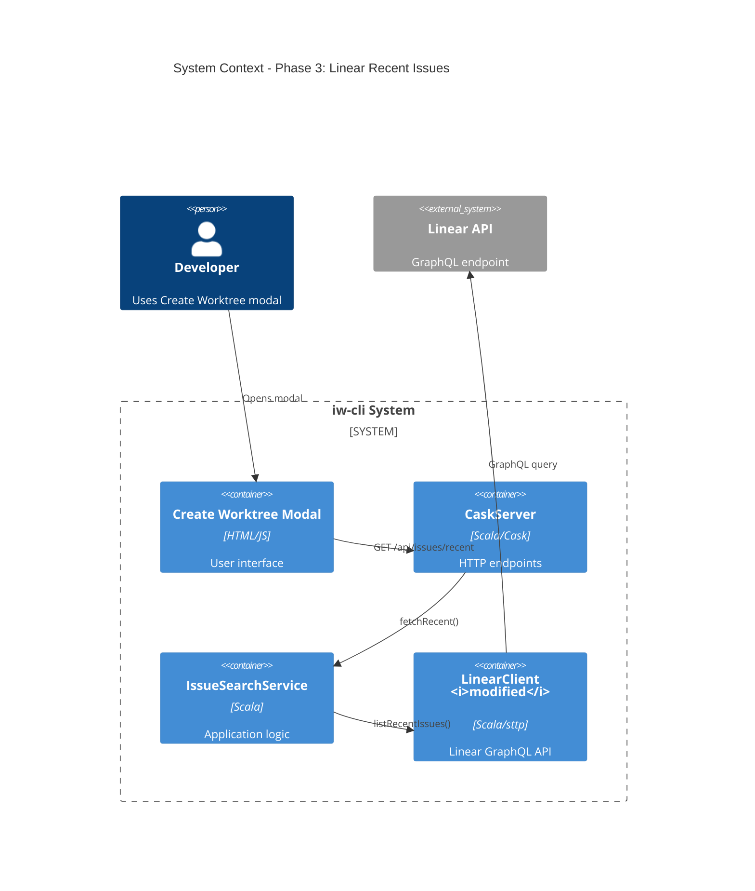
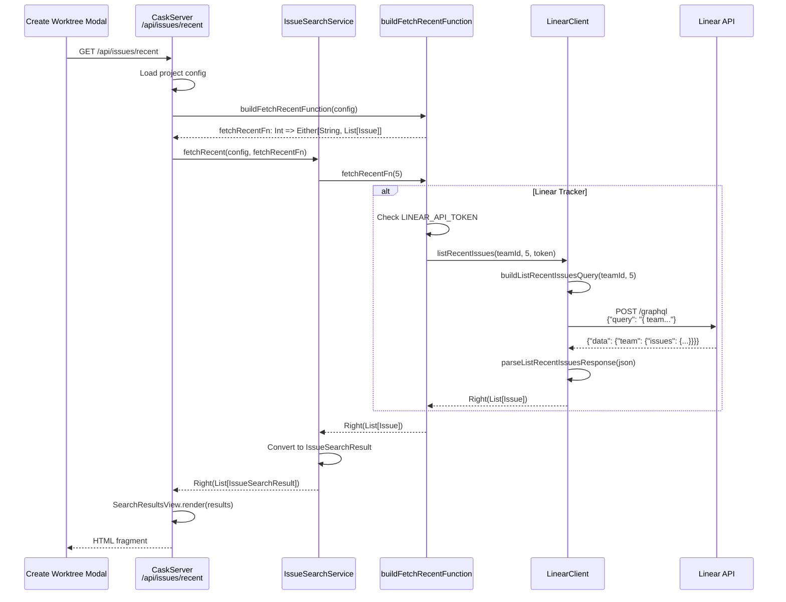

# Phase 3: Recent issues - Linear

## Goals

This phase implements recent issues display for Linear tracker, enabling developers to see the 5 most recent issues when opening the Create Worktree modal. This follows the same pattern established in Phase 1 for GitHub.

Key objectives:
- Fetch recent Linear issues via GraphQL API
- Respect team configuration from project config
- Reuse existing UI rendering (same HTML fragments as GitHub)
- Handle errors gracefully with empty list fallback

## Scenarios

- [ ] Modal opens with 5 recent Linear issues
- [ ] Issues fetched from correct Linear team (respects config)
- [ ] Each issue displays ID, title, and state
- [ ] Issues sorted by creation date (newest first)
- [ ] Returns empty list on API errors (graceful degradation)
- [ ] Returns error on missing LINEAR_API_TOKEN
- [ ] Returns error on missing team configuration

## Entry Points

Start your review from these locations:

| File | Method/Class | Why Start Here |
|------|--------------|----------------|
| `.iw/core/LinearClient.scala` | `listRecentIssues()` | HTTP entry point for fetching recent issues (lines 280-306) |
| `.iw/core/LinearClient.scala` | `buildListRecentIssuesQuery()` | Builds GraphQL query for team issues (lines 90-94, pure function) |
| `.iw/core/LinearClient.scala` | `parseListRecentIssuesResponse()` | Parses GraphQL response to List[Issue] (lines 183-230, pure function) |
| `.iw/core/CaskServer.scala` | `buildFetchRecentFunction()` | Routes Linear tracker to LinearClient (lines 546-551) |

## Architecture Overview

This diagram shows where the Phase 3 changes fit within the existing system architecture.



**Key points for reviewer:**
- No changes to UI or service layer - reuses existing components
- LinearClient gains 3 new methods following established patterns
- CaskServer routes Linear case to new LinearClient method
- Integration point is `buildFetchRecentFunction` (line 546)

## Component Relationships

This diagram shows how the new LinearClient methods relate to existing components.

```mermaid
graph TB
    subgraph presentation["Presentation Layer"]
        UI[Create Worktree Modal<br/>HTML/HTMX]
        EP[CaskServer<br/>/api/issues/recent]
    end
    
    subgraph application["Application Layer"]
        SVC[IssueSearchService<br/>fetchRecent]
    end
    
    subgraph infrastructure["Infrastructure Layer - Modified"]
        BFRF[buildFetchRecentFunction<br/><i>modified</i>]
        LC[LinearClient]
        BLRIQ[buildListRecentIssuesQuery<br/><i>new</i>]
        PLRIR[parseListRecentIssuesResponse<br/><i>new</i>]
        LRI[listRecentIssues<br/><i>new</i>]
    end
    
    subgraph external["External"]
        API[Linear GraphQL API]
    end
    
    UI -->|HTMX request| EP
    EP -->|fetchRecent| SVC
    SVC -->|calls| BFRF
    BFRF -->|routes to| LRI
    LRI -->|builds query| BLRIQ
    LRI -->|HTTP POST| API
    API -->|JSON response| LRI
    LRI -->|parses| PLRIR
    PLRIR -->|List[Issue]| SVC
    
    style BFRF fill:#e1f5ff
    style BLRIQ fill:#d4f1d4
    style PLRIR fill:#d4f1d4
    style LRI fill:#d4f1d4
```

**Key points for reviewer:**
- `buildListRecentIssuesQuery` and `parseListRecentIssuesResponse` are pure functions (no I/O)
- `listRecentIssues` accepts backend parameter for dependency injection (testability)
- CaskServer's `buildFetchRecentFunction` now routes Linear case to new method
- Follows exact same pattern as Phase 1 GitHubClient implementation

## Key Flows

### Sequence: Fetching Recent Issues



**Key points for reviewer:**
- Dependency injection: backend parameter allows mocking HTTP in tests
- Pure functions: query building and response parsing have no side effects
- Error handling: returns Left(message) for all error cases
- Token validation: checks environment variable before making API call

## Layer Diagram

This shows how the implementation follows Functional Core / Imperative Shell pattern.

```mermaid
graph LR
    subgraph imperative["Imperative Shell (I/O Effects)"]
        LRI[listRecentIssues<br/>HTTP POST]
        ENV[Environment<br/>LINEAR_API_TOKEN]
        API[Linear GraphQL API]
    end
    
    subgraph functional["Functional Core (Pure)"]
        BLRIQ[buildListRecentIssuesQuery<br/>teamId, limit → String]
        PLRIR[parseListRecentIssuesResponse<br/>JSON → Either[Error, List]]
    end
    
    ENV -->|token| LRI
    LRI -->|teamId, limit| BLRIQ
    BLRIQ -->|GraphQL query string| LRI
    LRI -->|HTTP request| API
    API -->|JSON response| LRI
    LRI -->|JSON string| PLRIR
    PLRIR -->|Either[String, List[Issue]]| LRI
    
    style LRI fill:#fff4e6
    style ENV fill:#fff4e6
    style API fill:#fff4e6
    style BLRIQ fill:#e8f5e9
    style PLRIR fill:#e8f5e9
```

**Key points for reviewer:**
- Pure functions are easily testable (no mocking needed)
- Effectful function accepts backend parameter for test injection
- Follows established pattern from existing LinearClient methods
- Query building and parsing logic can be reused in Phase 4

## Test Summary

| Test | Type | Verifies |
|------|------|----------|
| `buildListRecentIssuesQuery with default limit (5)` | Unit | GraphQL query structure with default limit |
| `buildListRecentIssuesQuery with custom limit` | Unit | GraphQL query with custom limit parameter |
| `parseListRecentIssuesResponse with valid response` | Unit | Parses 3 issues correctly from GraphQL response |
| `parseListRecentIssuesResponse with empty issues array` | Unit | Handles empty array (no issues in team) |
| `parseListRecentIssuesResponse with missing fields` | Unit | Returns Left on malformed GraphQL response |
| `listRecentIssues success case (mocked backend)` | Unit | HTTP execution with mocked sttp backend |
| `listRecentIssues unauthorized (401) response` | Unit | Handles invalid/expired API token |
| `listRecentIssues network error` | Unit | Handles HTTP 500 errors gracefully |

**Coverage:** 8 tests added covering:
- Pure function logic (query building, parsing)
- HTTP execution with mocked backend
- Error handling (auth, network, malformed responses)

**Testing approach:**
- Uses sttp's `SyncBackendStub` for HTTP mocking
- No real API calls in tests
- Follows TDD methodology (tests written first)

## Files Changed

**4 files** changed, +278 insertions, -23 deletions

<details>
<summary>Full file list</summary>

- `.iw/core/LinearClient.scala` (M) +91 lines
  - Added `buildListRecentIssuesQuery()` method (lines 90-94)
  - Added `parseListRecentIssuesResponse()` method (lines 183-230)
  - Added `listRecentIssues()` method (lines 280-306)

- `.iw/core/CaskServer.scala` (M) +7 -5 lines
  - Modified `buildFetchRecentFunction()` Linear case (lines 546-551)
  - Changed from "not yet supported" error to LinearClient integration
  - Added token retrieval from environment variable

- `.iw/core/test/LinearClientMockTest.scala` (M) +161 lines
  - Added 3 tests for `buildListRecentIssuesQuery` (query structure)
  - Added 3 tests for `parseListRecentIssuesResponse` (parsing logic)
  - Added 3 tests for `listRecentIssues` (HTTP execution)

- `project-management/issues/IW-88/phase-03-tasks.md` (M) +19 -18 lines
  - Marked implementation tasks as complete
  - Updated phase status to "Implementation Complete"

</details>

---

## Review Checklist

Use this checklist to guide your review:

- [ ] **Query Building**: Verify GraphQL query syntax matches Linear API spec
- [ ] **Parsing Logic**: Check all required fields are extracted from response
- [ ] **Error Handling**: Confirm graceful degradation on missing fields
- [ ] **Token Management**: Verify LINEAR_API_TOKEN is read from environment
- [ ] **Team Configuration**: Check teamId is passed from project config
- [ ] **Dependency Injection**: Confirm backend parameter enables testing
- [ ] **Test Coverage**: Verify all error paths are tested
- [ ] **Pattern Consistency**: Compare with Phase 1 GitHubClient implementation
- [ ] **Pure Functions**: Verify no side effects in build/parse functions
- [ ] **Integration**: Check CaskServer routing logic is correct

