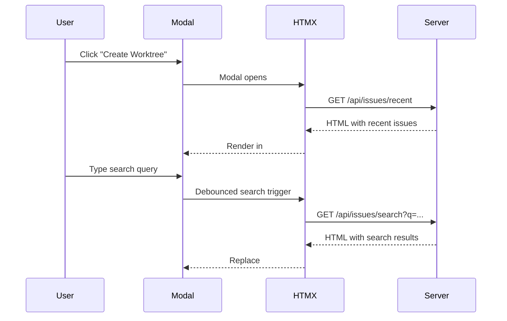

# Review Packet: Phase 7 - Load recent issues on modal open

**Issue:** IW-88
**Phase:** 7 of 7
**Branch:** IW-88-phase-07
**Date:** 2026-01-14

## Goals

When users open the Create Worktree modal, they should see the 5 most recent issues immediately - before typing anything. This reduces friction by removing the need to know issue IDs upfront.

## Scenarios

- [ ] Modal opens → recent issues appear within 1 second
- [ ] Type search query → results replace recent issues
- [ ] Clear search query → recent issues appear again
- [ ] Works for all three tracker types (GitHub, Linear, YouTrack)

## Entry Points

1. **Modal View:** `.iw/core/presentation/views/CreateWorktreeModal.scala:69-79`
   - Added HTMX attributes to search-results container

2. **Tests:** `.iw/core/test/CreateWorktreeModalTest.scala:80-99`
   - New tests for auto-load behavior

## Changes Diagram



## Test Summary

| Test | Type | Status |
|------|------|--------|
| hx-trigger load attribute | Unit | ✅ Pass |
| hx-get recent endpoint | Unit | ✅ Pass |
| project parameter encoding | Unit | ✅ Pass |
| hx-swap innerHTML | Unit | ✅ Pass |

## Files Changed

```
M  .iw/core/presentation/views/CreateWorktreeModal.scala  (+10 lines)
M  .iw/core/test/CreateWorktreeModalTest.scala            (+20 lines)
```

## Implementation Notes

- Used HTMX `hx-trigger="load"` for automatic loading on modal open
- Reused existing `/api/issues/recent` endpoint (no backend changes needed)
- Same URL encoding pattern as search input for consistency
- Minimal change: ~10 lines of production code
