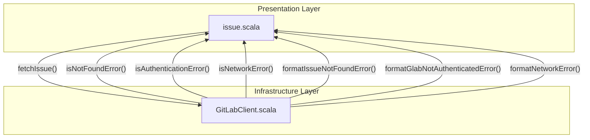
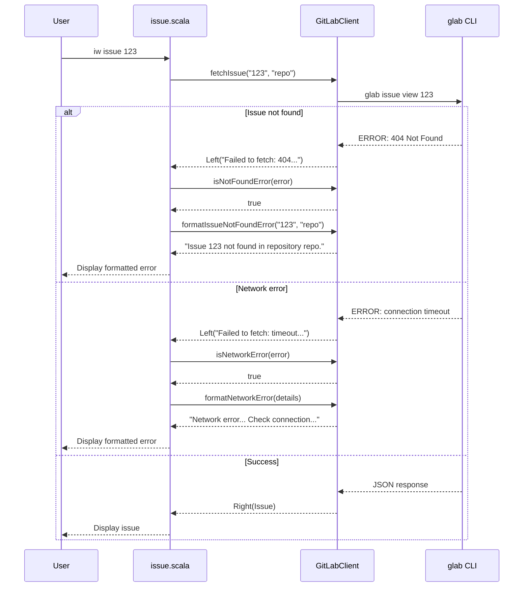
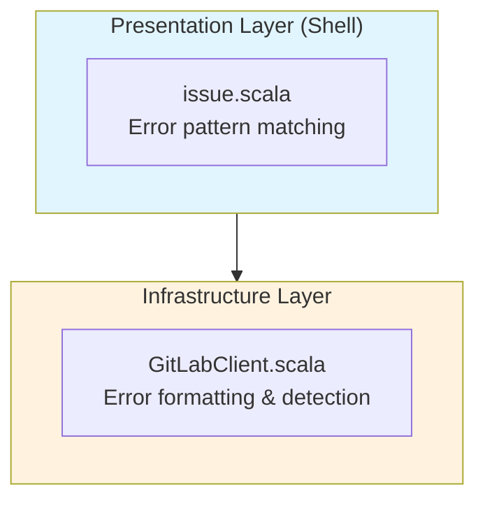

# Review Packet: Phase 2 - Handle GitLab-specific error conditions gracefully

**Issue:** IW-90
**Phase:** 2 of 7

## Goals

This phase improves user experience by providing clear, actionable error messages when GitLab operations fail. Users should understand exactly what went wrong and how to fix it.

**Primary goal:** When glab CLI operations fail, users see helpful error messages with specific remediation steps.

**What was built:**
- Error formatting functions that transform technical glab errors into user-friendly guidance
- Error detection utilities to classify error types (auth, not found, network)
- Enhanced error handling in `issue.scala` to use the new formatters

## Scenarios

- [ ] **glab CLI not installed**: User runs `iw issue 123` without glab installed → sees installation instructions
- [ ] **glab not authenticated**: User runs `iw issue 123` without authentication → sees `glab auth login` instructions
- [ ] **Issue not found**: User runs `iw issue 999999` for non-existent issue → sees clear "not found" message with repository context
- [ ] **Network error**: glab CLI returns network/connection error → user sees network troubleshooting guidance
- [ ] **Authentication failure**: glab CLI returns 401/unauthorized → user sees authentication instructions

## Entry Points

| File | Method/Class | Why Start Here |
|------|--------------|----------------|
| `.iw/commands/issue.scala:94-113` | `fetchIssue` GitLab case | HTTP entry point - shows how error detection and formatting integrates |
| `.iw/core/GitLabClient.scala:44-86` | Error formatting functions | Core error message generation - review message quality |
| `.iw/core/GitLabClient.scala:88-116` | Error detection functions | Classification logic - review detection patterns |
| `.iw/core/test/GitLabClientTest.scala:398-481` | Error tests | Test coverage - verify all error scenarios covered |

## Diagrams

### Component Relationships

### Error Handling Flow

### Layer Diagram (FCIS)

## Test Summary

| Test | Type | Verifies |
|------|------|----------|
| `formatGlabNotInstalledError returns installation instructions` | Unit | Error message contains glab install URL and auth command |
| `formatGlabNotAuthenticatedError returns auth login instructions` | Unit | Error message contains `glab auth login` command |
| `formatIssueNotFoundError includes issue ID and repository` | Unit | Error message is contextual with issue ID and repo name |
| `formatNetworkError includes details and suggestions` | Unit | Error message includes original details and remediation |
| `isAuthenticationError detects 401 status code` | Unit | Detection of HTTP 401 errors |
| `isAuthenticationError detects unauthorized string` | Unit | Detection of "unauthorized" keyword |
| `isAuthenticationError detects authentication string` | Unit | Detection of "authentication" keyword |
| `isNotFoundError detects 404 status code` | Unit | Detection of HTTP 404 errors |
| `isNotFoundError detects not found string` | Unit | Detection of "not found" phrase |
| `isNetworkError detects network string` | Unit | Detection of "network" keyword |
| `isNetworkError detects connection string` | Unit | Detection of "connection" keyword |
| `isNetworkError detects timeout string` | Unit | Detection of "timeout" keyword |
| `isNetworkError detects could not resolve` | Unit | Detection of DNS resolution errors |
| `isAuthenticationError returns false for non-auth errors` | Unit | No false positives for auth detection |
| `isNotFoundError returns false for non-404 errors` | Unit | No false positives for not-found detection |
| `isNetworkError returns false for non-network errors` | Unit | No false positives for network detection |

**Test counts:** 16 new unit tests for error handling

## Files Changed

**3 files changed, ~100 insertions**

Full file list

- `.iw/core/GitLabClient.scala` (M) - Added error formatting and detection functions
- `.iw/core/test/GitLabClientTest.scala` (M) - Added 16 tests for error handling
- `.iw/commands/issue.scala` (M) - Enhanced GitLab case with error pattern matching

## Review Checklist

- [ ] Error messages are user-friendly and actionable
- [ ] Error detection patterns cover common glab CLI error formats
- [ ] No false positives in error detection (negative tests verify this)
- [ ] Pattern matching in issue.scala is correct and complete
- [ ] Test coverage includes all error scenarios
- [ ] Error messages include specific commands to run (e.g., `glab auth login`)
