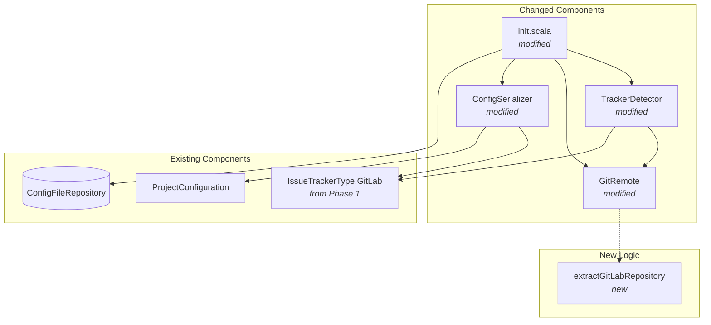
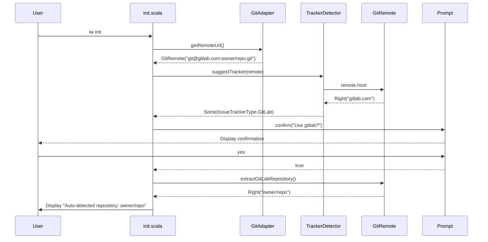
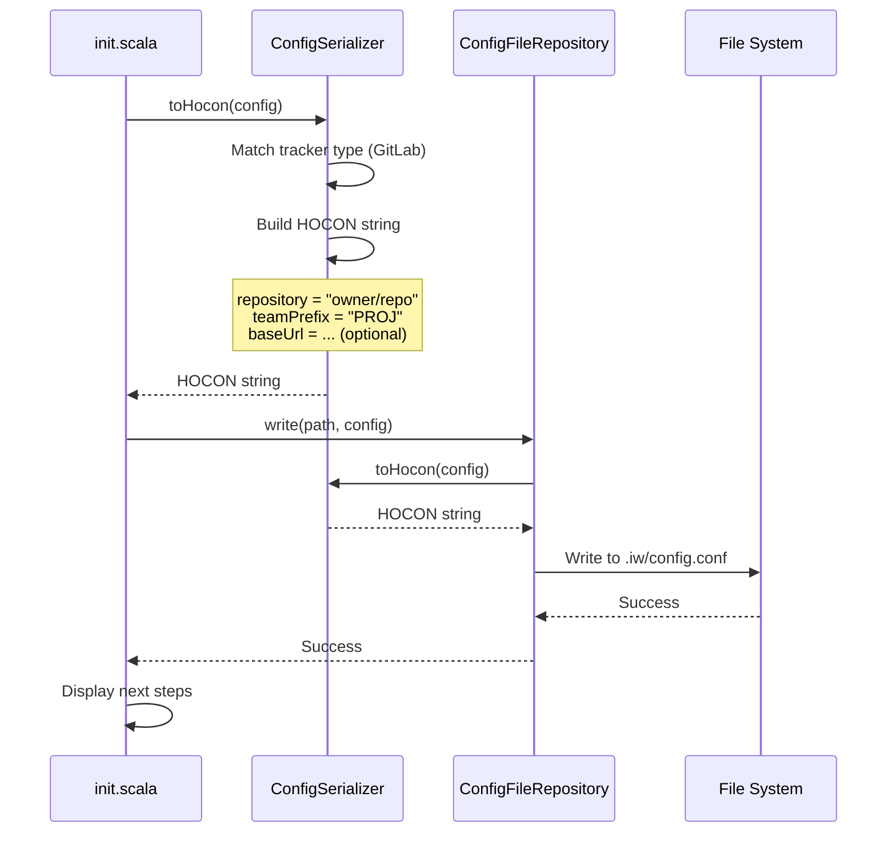
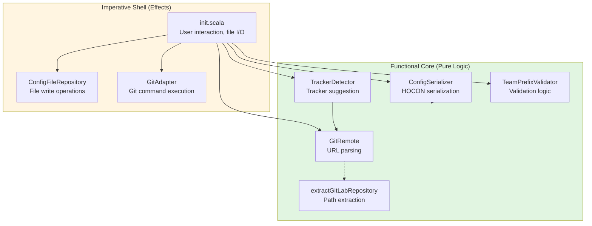

# Phase 3: Configure GitLab tracker during iw init

## Goals

This phase enables users to configure GitLab as their issue tracker during `iw init`. After this phase, users can set up GitLab tracking for their projects through both automatic detection (from git remote) and manual configuration.

**Key objectives:**
- Detect GitLab from git remote URLs (gitlab.com and self-hosted instances)
- Extract repository paths including nested groups (e.g., `group/subgroup/project`)
- Support optional baseUrl for self-hosted GitLab instances
- Integrate GitLab configuration into init command workflow
- Provide clear next steps after GitLab configuration

## Scenarios

- [ ] User runs `iw init` in repo with gitlab.com remote - GitLab is suggested
- [ ] User runs `iw init` in repo with self-hosted GitLab remote - GitLab is suggested with baseUrl prompt
- [ ] User manually selects GitLab during `iw init` - prompts for repository and optional baseUrl
- [ ] TrackerDetector correctly identifies gitlab.com and self-hosted GitLab URLs
- [ ] GitRemote.extractGitLabRepository handles nested groups (e.g., `company/team/project`)
- [ ] GitRemote.extractGitLabRepository rejects malformed paths with clear error messages
- [ ] ConfigSerializer serializes GitLab config with repository, teamPrefix, and optional baseUrl
- [ ] ConfigSerializer deserializes GitLab config correctly (round-trip test)
- [ ] Init command displays glab CLI installation instructions after GitLab configuration

## Entry Points

Start your review from these locations:

| File | Method/Class | Why Start Here |
|------|--------------|----------------|
| `.iw/core/Config.scala` | `GitRemote.extractGitLabRepository` | New pure function extracting GitLab repository paths from git URLs |
| `.iw/core/Config.scala` | `TrackerDetector.suggestTracker` | Modified to detect GitLab hosts and suggest GitLab tracker |
| `.iw/core/Config.scala` | `ConfigSerializer.toHocon` / `fromHocon` | Updated serialization logic for GitLab tracker type |
| `.iw/commands/init.scala` | `init` main function (line 135-190) | GitLab-specific configuration flow in init command |
| `.iw/core/test/ConfigTest.scala` | GitLab test suite (lines 448-733) | Comprehensive unit tests for GitLab configuration |

## Component Relationships

This diagram shows how the GitLab configuration components relate to existing configuration infrastructure:



**Key points for reviewer:**
- `extractGitLabRepository` is a pure function - verify no side effects
- TrackerDetector logic updated to handle gitlab.com and self-hosted hosts
- ConfigSerializer reuses `youtrackBaseUrl` field for GitLab baseUrl (consistent with YouTrack pattern)
- Init command flow mirrors GitHub setup (repository + teamPrefix + optional baseUrl)

## Key Flows

### GitLab Detection Flow (Auto-detection during init)



**Key verification points:**
- Detection chain: GitAdapter → GitRemote → TrackerDetector → Init
- Pure functions used throughout (GitRemote.host, extractGitLabRepository)
- User confirmation before committing to suggested tracker

### GitLab Configuration Serialization Flow



**Key verification points:**
- ConfigSerializer.toHocon handles GitLab case
- Optional baseUrl only included when present
- teamPrefix validation occurs before serialization
- Round-trip: serialize → write → read → deserialize produces same config

## Layer Diagram (Functional Core / Imperative Shell)



**Review focus:**
- Pure functions in Functional Core: `extractGitLabRepository`, `suggestTracker`, `toHocon`, `fromHocon`, `TeamPrefixValidator.validate`
- Effects isolated to Imperative Shell: file I/O, git commands, user prompts
- Clear boundaries between pure and effectful code

## Test Summary

### ConfigTest.scala - GitLab Support Tests

#### GitLab Repository Extraction Tests (10 happy path + 7 error path tests)

| Test | Type | Verifies |
|------|------|----------|
| `extractGitLabRepository from HTTPS URL` | Unit | GitLab HTTPS URL parsing (owner/repo) |
| `extractGitLabRepository from SSH URL` | Unit | GitLab SSH URL parsing (owner/repo) |
| `extractGitLabRepository nested groups HTTPS` | Unit | Nested group paths (group/subgroup/project) |
| `extractGitLabRepository nested groups SSH` | Unit | Nested group paths via SSH |
| `extractGitLabRepository self-hosted HTTPS` | Unit | Self-hosted GitLab HTTPS URLs |
| `extractGitLabRepository self-hosted SSH` | Unit | Self-hosted GitLab SSH URLs |
| `extractGitLabRepository error for non-GitLab` | Unit | Error handling for non-GitLab URLs |
| `extractGitLabRepository handles URL without .git` | Unit | URL normalization without .git suffix |
| `extractGitLabRepository handles URL with trailing slash` | Unit | URL normalization with trailing slash |
| `extractGitLabRepository handles nested groups from self-hosted` | Unit | Self-hosted with nested groups |
| **Error Path: empty path component** | Unit | Rejects URLs with empty path segments (owner//repo) |
| **Error Path: only owner (no repo)** | Unit | Rejects URLs with single component |
| **Error Path: trailing slashes only** | Unit | Rejects malformed URLs (///) |
| **Error Path: SSH with empty component** | Unit | SSH URL validation with empty segments |
| **Error Path: SSH with only owner** | Unit | SSH URL requires at least owner/repo |
| **Error Path: nested groups with empty component** | Unit | Nested path validation |
| **Error Path: self-hosted with malformed path** | Unit | Self-hosted URL validation |

#### TrackerDetector Tests (4 tests)

| Test | Type | Verifies |
|------|------|----------|
| `TrackerDetector suggests GitLab for gitlab.com HTTPS` | Unit | Detection of gitlab.com HTTPS remote |
| `TrackerDetector suggests GitLab for gitlab.com SSH` | Unit | Detection of gitlab.com SSH remote |
| `TrackerDetector suggests GitLab for self-hosted` | Unit | Detection of self-hosted GitLab instances |
| `TrackerDetector prioritizes GitHub over GitLab` | Unit | Detection priority order verification |

#### ConfigSerializer Tests (12 tests)

| Test | Type | Verifies |
|------|------|----------|
| `ConfigSerializer serializes GitLab without baseUrl` | Unit | HOCON generation for gitlab.com |
| `ConfigSerializer serializes GitLab with baseUrl` | Unit | HOCON generation for self-hosted GitLab |
| `ConfigSerializer serializes nested groups` | Unit | HOCON with nested group repository paths |
| `ConfigSerializer deserializes GitLab config` | Unit | HOCON parsing for GitLab tracker |
| `ConfigSerializer deserializes with baseUrl` | Unit | HOCON parsing with optional baseUrl |
| `ConfigSerializer deserializes nested groups` | Unit | HOCON parsing with nested group paths |
| `ConfigSerializer requires repository for GitLab` | Unit | Validation: repository field required |
| `ConfigSerializer requires teamPrefix for GitLab` | Unit | Validation: teamPrefix field required |
| `ConfigSerializer validates GitLab repository format` | Unit | Validation: repository must contain "/" |
| `ConfigSerializer round-trip without baseUrl` | Unit | Serialize → deserialize produces same config |
| `ConfigSerializer round-trip with baseUrl` | Unit | Round-trip with baseUrl field |
| `ConfigSerializer round-trip nested groups` | Unit | Round-trip with nested group paths |

**Unit test coverage:** 33 new tests covering GitLab repository extraction, tracker detection, and configuration serialization. All tests are pure unit tests (no I/O, no mocks).

### init.bats - GitLab E2E Tests

| Test | Type | Verifies |
|------|------|----------|
| `init creates config with gitlab tracker and HTTPS remote` | E2E | End-to-end GitLab HTTPS flow with auto-detection |
| `init creates config with gitlab tracker and SSH remote` | E2E | End-to-end GitLab SSH flow with auto-detection |
| `init shows glab CLI hint for gitlab tracker` | E2E | Next steps display includes glab CLI instructions |
| `init with gitlab validates tracker type in error message` | E2E | Error message includes gitlab as valid option |
| `init with gitlab and nested group repository` | E2E | Nested groups extraction in E2E flow |
| `init with gitlab and self-hosted instance with --base-url` | E2E | Self-hosted GitLab configuration with baseUrl flag |
| `init with gitlab validates team prefix format` | E2E | Team prefix validation in GitLab flow |
| `init with gitlab shows warning for non-GitLab remote` | E2E | Warning when remote doesn't match tracker |
| `init with gitlab and multiple remotes uses origin` | E2E | Remote priority (origin over upstream) |
| `init with gitlab and HTTPS URL with trailing slash` | E2E | URL normalization in E2E flow |
| `init with gitlab still works (regression test)` | E2E | Full GitLab flow regression |

**E2E test coverage:** 11 new tests covering GitLab end-to-end flows with real git remotes, file I/O, and command-line parsing.

**Combined coverage:** 44 new tests (33 unit + 11 E2E)

**Test quality observations:**
- Tests cover happy paths AND error cases (7 dedicated error path tests)
- Edge cases tested: nested groups, self-hosted instances, URL variations, malformed paths
- Round-trip tests verify serialization integrity
- Validation tests ensure config constraints enforced
- E2E tests verify complete user flows with real git repositories

## Files Changed

**4 files** changed, +621 insertions (Phase 3 incremental: +241 since last review packet)

<details>
<summary>Full file list (Phase 3 changes)</summary>

- `.iw/core/Config.scala` (M) +46 lines
  - Added `extractGitLabRepository` method to GitRemote
  - Updated TrackerDetector.suggestTracker for GitLab detection
  - Updated ConfigSerializer.toHocon for GitLab serialization
  - Updated ConfigSerializer.fromHocon for GitLab deserialization

- `.iw/core/test/ConfigTest.scala` (M) +286 lines (35 new since last packet)
  - Added 10 tests for GitLab repository extraction (happy path)
  - Added 7 tests for GitLab repository extraction (error paths)
  - Added 4 tests for GitLab tracker detection
  - Added 12 tests for GitLab config serialization/deserialization
  - Includes round-trip and validation tests

- `.iw/commands/init.scala` (M) +83 lines
  - Added GitLab to tracker type selection menu
  - Added GitLab configuration flow (lines 135-190)
  - Added repository extraction from git remote for GitLab
  - Added team prefix prompts for GitLab
  - Added baseUrl detection and prompt for self-hosted GitLab
  - Added glab CLI installation instructions in next steps

- `.iw/test/init.bats` (A) +206 lines (new file)
  - Added 11 E2E tests for GitLab init flows
  - Tests cover HTTPS/SSH remotes, nested groups, self-hosted instances
  - Tests include validation, error handling, and regression tests

</details>

## Implementation Highlights

### 1. GitLab Repository Extraction with Error Handling

The `extractGitLabRepository` method (Config.scala, lines 71-103) is a pure function that:
- Handles both HTTPS and SSH URL formats
- Supports nested groups (unlimited depth: `group/subgroup/project`)
- Works with gitlab.com and self-hosted instances
- Returns `Either[String, String]` for clear error handling
- **NEW: Validates path components** - rejects empty segments, single components, malformed paths

**Review focus:** Verify path extraction logic handles edge cases AND error cases. Check error messages are clear and actionable.

### 2. Tracker Detection Logic

TrackerDetector.suggestTracker (Config.scala, lines 137-144) updated to:
- Check for exact match on "gitlab.com"
- Check for any host containing "gitlab" (catches self-hosted instances)
- Maintain priority order: GitHub → YouTrack-specific → GitLab → None

**Review focus:** Ensure detection doesn't false-positive on non-GitLab hosts.

### 3. Config Serialization

ConfigSerializer (Config.scala, lines 146-230) handles GitLab with:
- Repository field serialization (same as GitHub)
- TeamPrefix field serialization (validated, same as GitHub)
- Optional baseUrl serialization (reuses `youtrackBaseUrl` field, same pattern as YouTrack)

**Review focus:** Verify round-trip integrity (serialize → deserialize produces identical config).

### 4. Init Command Integration

Init.scala (lines 135-190) implements GitLab flow:
- Auto-detection from git remote
- Repository extraction with fallback to manual prompt
- Team prefix suggestion and validation
- Self-hosted detection and baseUrl prompt
- glab CLI installation instructions

**Review focus:** Ensure user experience is smooth (clear prompts, helpful defaults, informative next steps).

### 5. Error Path Coverage (NEW)

ConfigTest.scala now includes 7 dedicated error path tests that verify:
- Empty path components are rejected (`owner//repo`)
- Single-component paths are rejected (`single-component`)
- Malformed URLs are rejected (`///` or `/`)
- Clear error messages for each failure case

**Review focus:** Run tests and verify error messages are helpful to end users.

## Configuration Examples

### GitLab.com (Public Instance)

```hocon
tracker {
  type = gitlab
  repository = "my-org/my-project"
  teamPrefix = "MYPROJ"
}

project {
  name = my-project
}
```

### Self-Hosted GitLab

```hocon
tracker {
  type = gitlab
  repository = "company/team/project"
  teamPrefix = "PROJ"
  baseUrl = "https://gitlab.company.com"
}

project {
  name = project
}
```

### Nested Groups

```hocon
tracker {
  type = gitlab
  repository = "group/subgroup/subsubgroup/project"
  teamPrefix = "PROJ"
}

project {
  name = project
}
```

## Next Steps Display

After successful GitLab configuration, users see:

```
GitLab tracker configured.
Ensure the glab CLI is installed and authenticated:
  brew install glab  (macOS)
  glab auth login

For other platforms, see: https://gitlab.com/gitlab-org/cli

Run './iw doctor' to verify your setup.
```

**Review focus:** Verify instructions are helpful and accurate.

## Regression Verification

**Existing tracker configurations must still work:**
- Linear config (uses `team` field, no repository/teamPrefix)
- YouTrack config (uses `team` field + `baseUrl`, no repository/teamPrefix)
- GitHub config (uses `repository` + `teamPrefix`, no baseUrl)

**Review focus:** Check ConfigTest.scala lines 169-199 for existing tracker round-trip tests. Verify all pass.

## Quality Observations

**Strengths:**
- Pure functions dominate (extractGitLabRepository, suggestTracker, serializers)
- Comprehensive test coverage (33 unit tests + 11 E2E tests)
- **NEW: Error path testing** - 7 dedicated tests for malformed inputs
- Consistent patterns (mirrors GitHub configuration flow)
- Clear error messages (validation errors, format errors)
- E2E tests verify complete user flows with real git operations

**Potential concerns:**
- `youtrackBaseUrl` field name reused for GitLab baseUrl (acceptable but consider renaming to generic `baseUrl` in future refactor)
- TrackerDetector heuristic `host.contains("gitlab")` might be too broad (review for false positives)

**Recommendations:**
- Verify glab CLI installation instructions are up-to-date
- Document baseUrl field reuse in CLAUDE.md or architecture docs
- Consider adding E2E test for interactive prompts (currently tested via timeout)

## Changes Since Last Review Packet

**Updated from commit:** `0b26bd2d6f71e086269dcbd2ed112f7cf0015740`
**Current commit:** `bd9d727794e0929bf9e1731805599564c6b0ad08`

**Incremental changes (241 lines added):**
1. **ConfigTest.scala:** Added 35 lines with 7 new error path tests
   - Tests for empty path components
   - Tests for single-component paths
   - Tests for malformed URLs
   - Improved error message validation

2. **init.bats:** Added 206 lines with 11 new E2E tests
   - Full GitLab initialization flows
   - Nested groups, self-hosted instances
   - URL normalization, validation
   - Regression tests

**Test summary updated:**
- Unit tests: 21 → 33 (added 12 tests: 7 error path + 4 TrackerDetector + 1 nested self-hosted)
- E2E tests: 0 → 11 (new file)
- Total tests: 21 → 44

**All existing scenarios still verified, plus new error handling scenarios.**
