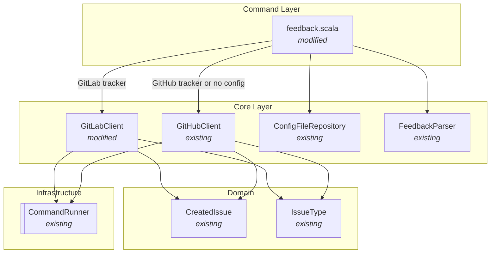
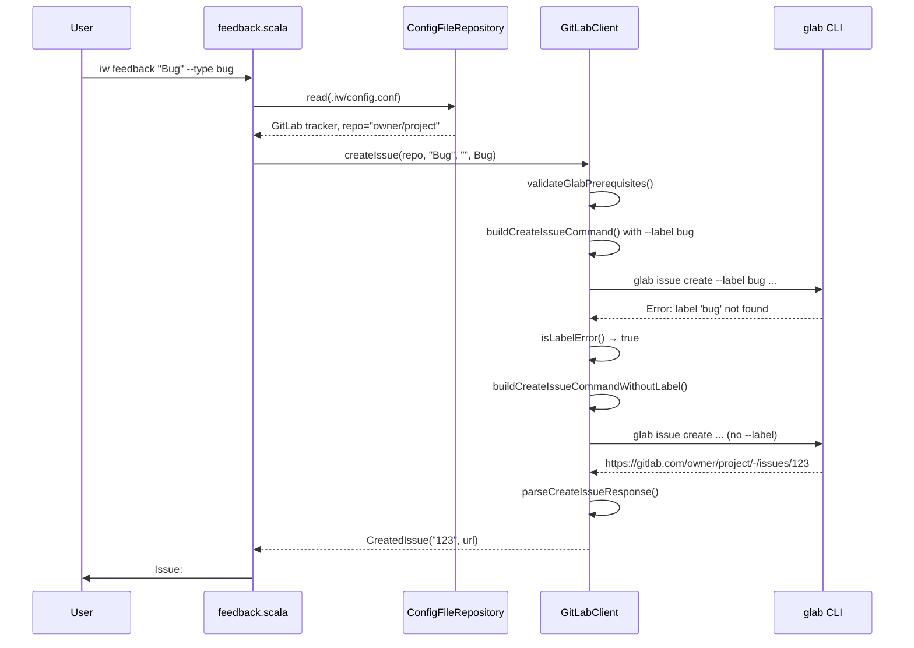

# Phase 5: Create GitLab issues via glab CLI

## Goals

This phase completes the GitLab tracker integration by adding issue creation capability through the `iw feedback` command.

Key objectives:
- Enable bug reporting and feature requests for projects using GitLab tracker
- Support label-based issue type mapping (bug/feature) with graceful fallback
- Maintain feature parity with existing GitHub feedback workflow
- Parse issue URLs from both gitlab.com and self-hosted GitLab instances

## Scenarios

- [ ] User can create bug report in GitLab via `iw feedback "Bug title" --type bug`
- [ ] User can create feature request in GitLab via `iw feedback "Feature title" --type feature`
- [ ] Bug issues are created with "bug" label (or without label if label doesn't exist)
- [ ] Feature issues are created with "feature" label (or without label if label doesn't exist)
- [ ] Created issue URL is displayed correctly for both gitlab.com and self-hosted instances
- [ ] Error messages for glab not installed include installation instructions
- [ ] Error messages for glab not authenticated include `glab auth login` guidance
- [ ] Feedback command falls back to GitHub repository when GitLab not configured
- [ ] Label errors trigger automatic retry without labels

## Entry Points

Start your review from these locations:

| File | Method/Class | Why Start Here |
|------|--------------|----------------|
| `.iw/core/GitLabClient.scala` | `createIssue()` | Main entry point for GitLab issue creation with label fallback logic |
| `.iw/commands/feedback.scala` | `feedback()` main function | Routing logic that selects GitLab or GitHub client based on config |
| `.iw/core/GitLabClient.scala` | `buildCreateIssueCommand()` | Command building logic showing glab CLI argument structure |
| `.iw/core/GitLabClient.scala` | `parseCreateIssueResponse()` | URL parsing for GitLab issue URLs (gitlab.com and self-hosted) |

## Component Relationships

This diagram shows how the feedback command routes to GitLabClient for GitLab-configured projects:



**Key points for reviewer:**
- `feedback.scala` reads `.iw/config.conf` to determine tracker type
- GitLab tracker routes to `GitLabClient.createIssue`
- No config or non-GitLab tracker routes to `GitHubClient.createIssue` (backward compatible)
- Both clients share the same domain models (`CreatedIssue`, `IssueType`)
- Command execution is injected via `CommandRunner` for testability

## Key Flow: Issue Creation with Label Fallback

This sequence shows the label fallback mechanism when GitLab project doesn't have required labels:



**Key points for reviewer:**
- Prerequisite validation happens before any commands execute
- First attempt includes `--label` flag based on issue type
- Label errors are detected via `isLabelError()` string matching
- Automatic retry without label ensures issue creation succeeds
- Non-label errors (auth, network) don't trigger retry
- URL parsing works for both gitlab.com and self-hosted instances

## Test Summary

| Test | Type | Verifies |
|------|------|----------|
| `GitLabClientTest."buildCreateIssueCommand generates correct glab CLI arguments for Bug type"` | Unit | Bug type maps to --label bug |
| `GitLabClientTest."buildCreateIssueCommand generates correct glab CLI arguments for Feature type"` | Unit | Feature type maps to --label feature |
| `GitLabClientTest."buildCreateIssueCommand handles empty description"` | Unit | Empty description passes through as empty string |
| `GitLabClientTest."buildCreateIssueCommandWithoutLabel generates command without label flag"` | Unit | Fallback command omits --label entirely |
| `GitLabClientTest."parseCreateIssueResponse parses gitlab.com URL"` | Unit | Extracts issue number from gitlab.com URL pattern |
| `GitLabClientTest."parseCreateIssueResponse parses self-hosted GitLab URL"` | Unit | Works with custom GitLab domains |
| `GitLabClientTest."parseCreateIssueResponse returns error for empty response"` | Unit | Handles empty glab output gracefully |
| `GitLabClientTest."parseCreateIssueResponse returns error for invalid URL format"` | Unit | Rejects malformed URLs |
| `GitLabClientTest."isLabelError detects label not found error"` | Unit | Identifies label-specific errors for retry |
| `GitLabClientTest."isLabelError returns false for network timeout"` | Unit | Non-label errors don't trigger fallback |
| `GitLabClientTest."createIssue validates prerequisites - glab not installed"` | Integration | Prerequisite checks run before commands |
| `GitLabClientTest."createIssue validates prerequisites - glab not authenticated"` | Integration | Authentication validation works |
| `GitLabClientTest."createIssue success path with label"` | Integration | Happy path creates issue with label |
| `GitLabClientTest."createIssue retries without label on label error"` | Integration | Label fallback mechanism works end-to-end |
| `GitLabClientTest."createIssue does not retry on non-label error"` | Integration | Network/auth errors don't trigger retry |

Coverage: 15 unit/integration tests covering command building, URL parsing, error detection, prerequisite validation, and label fallback logic.

## Files Changed

**4 files** changed, +33/-0 lines in this phase

<details>
<summary>Full file list</summary>

- `.iw/commands/feedback.scala` (M) +33 lines
  - Added config reading to detect GitLab tracker
  - Added GitLab routing logic (lines 29-46)
  - Maintained backward compatibility with GitHub
  
- `.iw/core/GitLabClient.scala` (M) +128 lines
  - Added `buildCreateIssueCommand()` (lines 224-251)
  - Added `buildCreateIssueCommandWithoutLabel()` (lines 253-271)
  - Added `parseCreateIssueResponse()` (lines 273-292)
  - Added `isLabelError()` (lines 294-305)
  - Added `createIssue()` (lines 307-351)
  
- `.iw/core/test/GitLabClientTest.scala` (M) +274 lines
  - Added command building tests (lines 483-549)
  - Added response parsing tests (lines 551-601)
  - Added label error detection tests (lines 602-627)
  - Added createIssue integration tests (lines 629-754)
  
- `project-management/issues/IW-90/phase-05-tasks.md` (M) -14 lines
  - Marked implementation tasks as complete

</details>

## Implementation Decisions

### Decision 1: Label Fallback Strategy

**Choice:** Retry without labels if label assignment fails, same as GitHubClient.

**Rationale:** 
- Not all GitLab projects have standardized labels
- Issue creation shouldn't fail due to missing labels
- Labels are nice-to-have for categorization, not required
- Consistent with GitHub feedback implementation

**Alternative considered:** Fail fast and require labels to exist
- Rejected: Creates friction for users in projects without label conventions

### Decision 2: glab CLI Flag Differences

**Choice:** Use `--description` instead of `--body` (gh CLI uses `--body`).

**Rationale:**
- glab and gh are different CLIs with different conventions
- glab documentation specifies `--description` for issue body
- Tested with real glab CLI to verify flag names

**Implementation detail:**
```scala
// GitHub: --body
GitHubClient.buildCreateIssueCommand uses "--body"

// GitLab: --description  
GitLabClient.buildCreateIssueCommand uses "--description"
```

### Decision 3: Config Reading in feedback.scala

**Choice:** Read config at command execution time, not at module load.

**Rationale:**
- Config may not exist during module initialization
- User might create/modify config between runs
- Allows fallback to GitHub when no config exists
- Clean separation of concerns (feedback doesn't assume config)

**Implementation:**
```scala
val maybeConfig = ConfigFileRepository.read(os.pwd / ".iw" / "config.conf")
maybeConfig match
  case Some(config) if config.trackerType == IssueTrackerType.GitLab => // GitLab
  case _ => // GitHub fallback
```

### Decision 4: URL Pattern Matching

**Choice:** Use regex `.*/-/issues/(\d+)$` to extract issue number.

**Rationale:**
- GitLab URLs have `/-/issues/` path segment (different from GitHub's `/issues/`)
- Pattern works for gitlab.com and self-hosted instances
- Regex is simple and well-tested
- Captures only the issue number for CreatedIssue model

**Examples matched:**
- `https://gitlab.com/owner/project/-/issues/123`
- `https://gitlab.company.com/team/app/-/issues/456`
- `https://gitlab.e-bs.cz/CMI/mdr/project/-/issues/789`

---

**Review Status:** Ready for review
**Phase Status:** Implementation complete, tests passing
**Next Phase:** Phase 6 - GitLab issue ID parsing and validation
