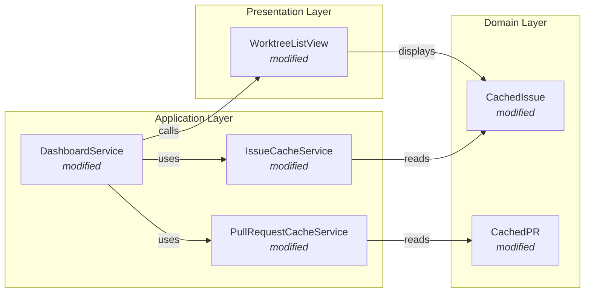
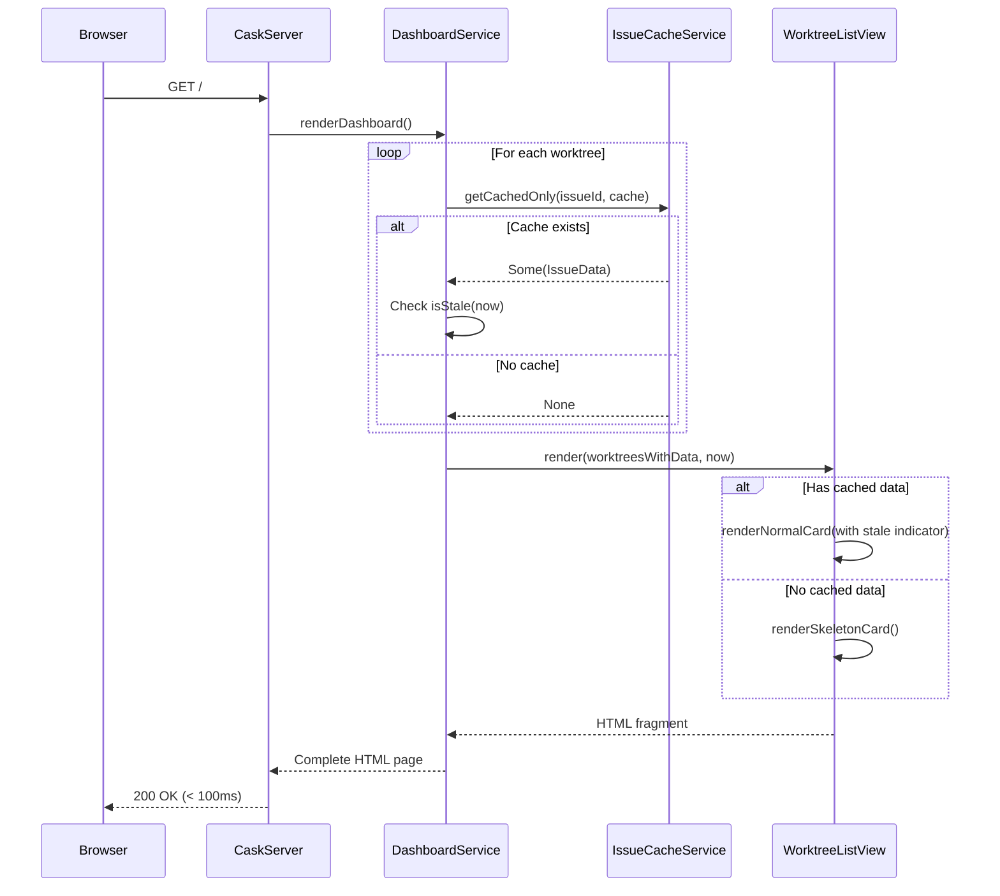
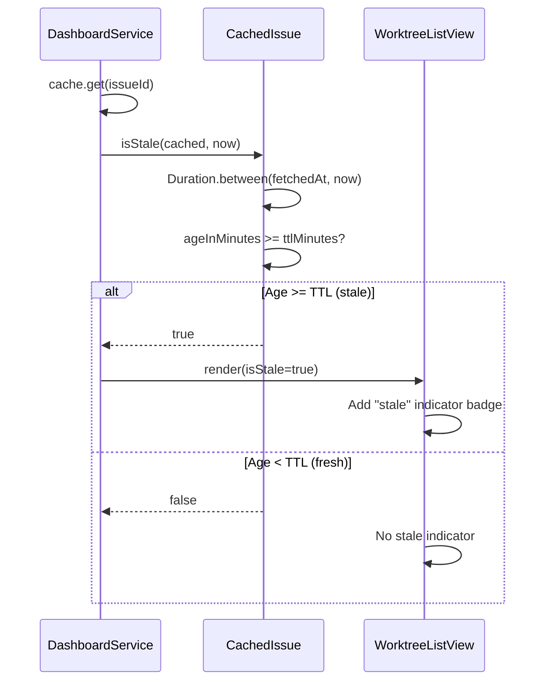
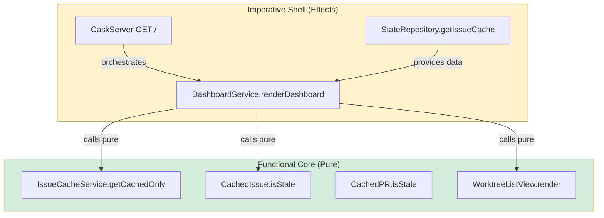

# Phase 1: Fast initial dashboard load with cached data

## Goals

This phase establishes the foundation for instant dashboard loading by changing the rendering pattern from "fetch-all-then-render" to "render-cache-immediately".

Key objectives:
- Dashboard renders immediately using cached data without blocking API calls
- Visual indicators show when cached data is stale (age >= TTL)
- Dashboard loads in < 100ms when cache is populated
- Skeleton cards displayed for worktrees with no cached data
- All git status and file reads remain synchronous (fast enough)

## Scenarios

The reviewer should verify these acceptance criteria:

- [ ] Dashboard HTML loads in < 100ms with cached data (no API blocking)
- [ ] All worktree cards are visible immediately
- [ ] Stale data shows visual indicator ("stale" badge when age >= TTL)
- [ ] Cache misses show skeleton/placeholder cards with shimmer animation
- [ ] No blank screen or loading spinner for initial page load
- [ ] Existing functionality preserved (cards still show all info when cached)
- [ ] Git status and workflow progress still load synchronously (unchanged)

## Entry Points

Start your review from these locations:

| File | Method/Class | Why Start Here |
|------|--------------|----------------|
| `.iw/core/DashboardService.scala` | `fetchIssueForWorktreeCachedOnly()` | Core change - renders dashboard without blocking API calls |
| `.iw/core/IssueCacheService.scala` | `getCachedOnly()` | New method that returns cache without calling API |
| `.iw/core/WorktreeListView.scala` | `renderSkeletonCard()` | Handles cache misses with skeleton cards |
| `.iw/core/CachedIssue.scala` | `isStale()` | New domain logic for staleness detection |

## Architecture Overview

This diagram shows the before/after flow for dashboard rendering:

```mermaid
flowchart TB
    subgraph "BEFORE (Blocking)"
        A1[GET /] --> B1[DashboardService]
        B1 --> C1{For each worktree}
        C1 --> D1[IssueCacheService.fetchWithCache]
        D1 --> E1{Cache valid?}
        E1 -->|No| F1[Call API - BLOCKS]
        E1 -->|Yes| G1[Return cached]
        F1 --> H1[Wait for response]
        H1 --> I1[Return HTML]
        G1 --> I1
    end

    subgraph "AFTER (Non-blocking)"
        A2[GET /] --> B2[DashboardService]
        B2 --> C2{For each worktree}
        C2 --> D2[IssueCacheService.getCachedOnly]
        D2 --> E2{Cache exists?}
        E2 -->|Yes| F2[Return cached immediately]
        E2 -->|No| G2[Return None]
        F2 --> H2[Check if stale]
        G2 --> H2
        H2 --> I2[Render card or skeleton]
        I2 --> J2[Return HTML < 100ms]
    end
```

**Key points for reviewer:**
- No API calls during initial render - `getCachedOnly()` never calls fetch function
- Stale detection is pure function based on timestamp comparison
- Skeleton cards render when cache is empty (graceful degradation)

## Component Relationships

**Key relationships:**
- `DashboardService` now calls `getCachedOnly()` instead of `fetchWithCache()`
- `IssueCacheService.getCachedOnly()` returns `Option[IssueData]` without side effects
- `CachedIssue.isStale()` provides pure staleness checking
- `WorktreeListView` handles both normal cards and skeleton cards

## Key Flows

### Sequence 1: Dashboard render with cached data

**Critical timing:**
- No API calls in this flow - all operations are memory/cache lookups
- Target response time: < 100ms
- Skeleton cards ensure we always return HTML, never error on cache miss

### Sequence 2: Staleness detection

## Layer Diagram (FCIS)

**Architecture notes:**
- Pure functions: `getCachedOnly()`, `isStale()`, `render()` - no side effects
- Imperative shell: `DashboardService.renderDashboard()` - coordinates effects
- All API calls removed from render path (deferred to future phase)

## Test Summary

| Test | Type | Verifies |
|------|------|----------|
| `CachedIssueTest."isStale returns true when cache older than TTL"` | Unit | Staleness detection for aged cache |
| `CachedIssueTest."isStale returns false when cache newer than TTL"` | Unit | Fresh cache not marked stale |
| `CachedPRTest."isStale returns true when cache older than TTL"` | Unit | PR staleness detection |
| `CachedPRTest."isStale returns false when cache newer than TTL"` | Unit | Fresh PR cache handling |
| `IssueCacheServiceTest."getCachedOnly returns cached data"` | Unit | Cache retrieval without API calls |
| `IssueCacheServiceTest."getCachedOnly returns None when empty"` | Unit | Graceful handling of cache miss |
| `IssueCacheServiceTest."getCachedOnly does NOT call fetch function"` | Unit | Critical: no API calls in getCachedOnly |
| `IssueCacheServiceTest."getCachedOnly returns stale cache"` | Unit | Returns even stale data (no refresh) |
| `PullRequestCacheServiceTest."getCachedOnly returns cached PR"` | Unit | PR cache retrieval |
| `PullRequestCacheServiceTest."getCachedOnly returns None when empty"` | Unit | PR cache miss handling |
| `WorktreeListViewTest."renderSkeletonCard shows skeleton"` | Unit | Skeleton rendering for cache miss |
| `WorktreeListViewTest."renderNormalCard shows stale indicator"` | Unit | Stale badge when isStale=true |
| `WorktreeListViewTest."renderNormalCard hides stale indicator"` | Unit | No badge when isStale=false |
| `DashboardServiceTest."renderDashboard < 100ms with cache"` | Integration | Performance target verification |
| `DashboardServiceTest."renderDashboard with empty cache"` | Integration | Skeleton cards for cache misses |

**Coverage:** All new methods (`getCachedOnly`, `isStale`) have comprehensive unit tests. Integration tests verify end-to-end behavior and performance target (< 100ms).

**Critical tests to review:**
1. `getCachedOnly does NOT call fetch function` - Ensures no API blocking
2. `renderDashboard < 100ms with cache` - Verifies performance goal
3. Staleness tests - Ensure visual indicators work correctly

## Files Changed

**11 files** changed (estimated), split between implementation and tests:

Full file list (planned changes)

**Domain Layer:**
- `.iw/core/CachedIssue.scala` (M) - Add `isStale()` method (+10 lines)
- `.iw/core/CachedPR.scala` (M) - Add `isStale()` method (+10 lines)

**Application Layer:**
- `.iw/core/IssueCacheService.scala` (M) - Add `getCachedOnly()` method (+15 lines)
- `.iw/core/PullRequestCacheService.scala` (M) - Add `getCachedOnly()` method (+15 lines)
- `.iw/core/DashboardService.scala` (M) - Add non-blocking render methods (+40 lines)

**Presentation Layer:**
- `.iw/core/WorktreeListView.scala` (M) - Add skeleton card rendering (+30 lines)

**CSS (embedded in DashboardService):**
- Add `.skeleton-card`, `.stale-indicator` styles (+25 lines)

**Tests:**
- `.iw/core/test/CachedIssueTest.scala` (M) - Add staleness tests (+20 lines)
- `.iw/core/test/CachedPRTest.scala` (M) - Add staleness tests (+20 lines)
- `.iw/core/test/IssueCacheServiceTest.scala` (M) - Add getCachedOnly tests (+40 lines)
- `.iw/core/test/PullRequestCacheServiceTest.scala` (M) - Add getCachedOnly tests (+40 lines)
- `.iw/core/test/WorktreeListViewTest.scala` (M) - Add skeleton/stale tests (+50 lines)

**Summary:**
- Core implementation: ~145 lines
- Tests: ~170 lines
- Total: ~315 lines added

**Change classification:**
- 6 files modified (M)
- 0 files added (A)
- 0 files deleted (D)

---

## Review Checklist

Before approving this phase, verify:

### Functional Requirements
- [ ] Dashboard loads in < 100ms with populated cache (measure actual time)
- [ ] Stale indicator appears when cache age >= TTL (verify visually)
- [ ] Skeleton cards render for cache misses (test with empty cache)
- [ ] All existing dashboard features still work (regression test)

### Code Quality
- [ ] No API calls in `getCachedOnly()` - check implementation
- [ ] Pure functions in domain layer (no side effects)
- [ ] Test coverage for staleness detection (both true/false cases)
- [ ] CSS styles work across browsers (check skeleton shimmer)

### Performance
- [ ] Dashboard response time measured and logged
- [ ] No performance regression for cached data path
- [ ] Memory usage reasonable with large cache (test with 20+ worktrees)

### Error Handling
- [ ] Cache misses don't cause errors (skeleton cards render)
- [ ] Stale detection handles edge cases (exactly at TTL boundary)
- [ ] Invalid timestamps handled gracefully

---

**Generated by:** iw-cli review packet generator
**Review this packet before:** Phase 1 implementation review
**Next phase:** Phase 2 (Background refresh after initial render)
