# Phase 2: Aggressive caching for instant subsequent loads

## Goals

This phase implements aggressive caching to ensure subsequent dashboard loads are instant by:

- Extending cache TTLs from 5 minutes (issues) and 2 minutes (PRs) to configurable longer durations (default 30 and 15 minutes)
- Implementing pure configuration with environment variable support (no I/O in domain layer)
- Preserving stale cache on API failures (never clearing cache on errors)
- Supporting custom TTL per cache instance for flexibility

Key objectives:
- Subsequent dashboard loads render in < 50ms using cached data
- Cache persists across server restarts (already handled by Phase 1's StateRepository)
- API failures never destroy cached data
- Configuration is optional with sensible defaults

## Scenarios

- [ ] Subsequent dashboard loads render in < 50ms with cached data
- [ ] Cache TTLs can be configured via environment variables (IW_ISSUE_CACHE_TTL_MINUTES, IW_PR_CACHE_TTL_MINUTES)
- [ ] Cache TTLs default to 30 minutes (issues) and 15 minutes (PRs) when not configured
- [ ] API failures preserve existing cache instead of clearing it
- [ ] Stale data is displayed with indicators (not blank or error)
- [ ] Cache isStale() methods correctly identify aged data
- [ ] All Phase 1 functionality is preserved

## Entry Points

Start your review from these locations:

| File | Method/Class | Why Start Here |
|------|--------------|----------------|
| `.iw/core/CacheConfig.scala` | `CacheConfig` | Pure configuration for cache TTL values - no I/O, accepts env map |
| `.iw/core/CachedPR.scala` | `CachedPR.isStale()` | Core stale detection logic for PR cache (used by UI indicators) |
| `.iw/core/PullRequestCacheService.scala` | `fetchPR()` | Error handling - preserves stale cache on API failures (see lines 70-83) |
| `.iw/core/test/PullRequestCacheServiceTest.scala` | `"preserves stale cache when CLI fails"` | Key test for Phase 2 error preservation behavior |

## Architecture Overview

This diagram shows the cache configuration and validation flow in Phase 2:


**Key points for reviewer:**
- CacheConfig is pure domain object - accepts env Map, no System.getenv() calls
- CachedIssue and CachedPR support configurable TTL via constructor parameter
- isStale() methods added to both cache types for UI indicators
- PullRequestCacheService.fetchPR() preserves stale cache on API errors (fallback pattern)
- Phase 1's getCachedOnly() methods remain unchanged (pure cache reads)

## Cache Error Handling Flow

This sequence diagram shows the critical Phase 2 improvement - preserving stale cache on API failures:

```mermaid
sequenceDiagram
    participant View as WorktreeListView
    participant Service as PullRequestCacheService
    participant Cache as Map[String, CachedPR]
    participant API as gh/glab CLI
    
    Note over View,API: Scenario: API failure with stale cache
    
    View->>Service: fetchPR(issueId)
    Service->>Cache: Get cached PR
    Cache-->>Service: CachedPR (3 min old, TTL 2 min)
    
    Service->>Service: isValid() → false (expired)
    Service->>API: Execute gh pr view
    API-->>Service: Left("rate limit exceeded")
    
    Service->>Cache: Check for stale cache
    Cache-->>Service: Some(staleCache)
    Service-->>View: Right(Some(stale PR data))
    
    Note over View,API: Phase 2 behavior: Return stale data (graceful degradation)
    Note over View,API: Old behavior would have been: Left(error) or cleared cache
    
    View->>View: Display PR with stale indicator
```



**Key points for reviewer:**
- API errors no longer clear cache (Phase 2 improvement)
- Stale cache is preferred over error messages
- Only returns error if no cache exists at all
- This enables dashboard to always show something useful

## Test Summary

| Test | Type | Verifies |
|------|------|----------|
| `CacheConfigTest."returns default value when env var not set"` | Unit | Default TTL values (30 min issues, 15 min PRs) |
| `CacheConfigTest."reads from IW_ISSUE_CACHE_TTL_MINUTES"` | Unit | Environment variable configuration |
| `CacheConfigTest."falls back to default on invalid env var"` | Unit | Error handling for invalid config |
| `CacheConfigTest."falls back to default on negative value"` | Unit | Validation of positive TTL values |
| `CacheConfigTest."CacheConfig.Default uses default values"` | Unit | Default instance with no environment variables |
| `CachedIssueTest."isStale respects custom TTL of 30 minutes"` | Unit | Custom TTL support in CachedIssue |
| `CachedIssueTest."isStale returns true with custom TTL when old"` | Unit | Stale detection with extended TTL |
| `CachedPRTest."isStale respects custom TTL of 15 minutes"` | Unit | Custom TTL support in CachedPR |
| `CachedPRTest."isStale returns true with custom TTL when old"` | Unit | Stale detection with extended TTL |
| `PullRequestCacheServiceTest."preserves stale cache when CLI fails"` | Unit | **Critical Phase 2 test** - error preservation behavior |
| `PullRequestCacheServiceTest."getCachedOnly returns stale cache without CLI"` | Unit | Pure cache reads (no API calls) |

Coverage: 11 tests total focusing on:
- Configuration with defaults and validation (5 tests)
- Custom TTL support in cache instances (4 tests)  
- Error preservation - never clearing cache (2 tests)

## Files Changed

**8 files** changed, +268 insertions, -34 deletions

<details>
<summary>Full file list</summary>

- `.iw/core/CacheConfig.scala` (A) +44 lines - Pure configuration for cache TTLs
- `.iw/core/CachedPR.scala` (M) +18 -11 lines - Added isStale() method, custom TTL support
- `.iw/core/PullRequestCacheService.scala` (M) +35 -6 lines - Error preservation logic
- `.iw/core/test/CacheConfigTest.scala` (A) +62 lines - Configuration tests
- `.iw/core/test/CachedIssueTest.scala` (M) +20 lines - Stale detection tests
- `.iw/core/test/CachedPRTest.scala` (M) +20 lines - Stale detection tests  
- `.iw/core/test/PullRequestCacheServiceTest.scala` (M) +18 lines - Error preservation test
- `project-management/issues/IW-92/phase-02-tasks.md` (M) +46 -34 lines - Task tracking

</details>

## Implementation Details

### What Changed from Phase 1

Phase 2 builds on Phase 1's foundation by:

1. **Making TTLs configurable** (Phase 1 used hardcoded 5 min/2 min)
   - New `CacheConfig` accepts env Map (pure - no I/O side effects)
   - `CachedIssue` and `CachedPR` accept custom `ttlMinutes` parameter
   - Defaults increased to 30 min (issues) and 15 min (PRs)

2. **Adding stale detection** (Phase 1 only had isValid())
   - New `isStale()` methods in both cache types
   - Used by UI to show indicators (from Phase 1's WorktreeListView)
   - Stale data can still be rendered (stale-while-revalidate)

3. **Preserving cache on API errors** (Phase 1 behavior unclear)
   - `PullRequestCacheService.fetchPR()` now explicitly falls back to stale cache
   - Never return error if stale cache exists
   - Better user experience - show something instead of errors

### Key Design Patterns

**Pure configuration (Functional Core pattern):**
```scala
case class CacheConfig(env: Map[String, String]):
  def issueCacheTTL: Int = 
    env.get("IW_ISSUE_CACHE_TTL_MINUTES")
      .flatMap(_.toIntOption)
      .filter(_ > 0)
      .getOrElse(30)
```
- No side effects (reads env via injected map, not System.getenv)
- Validates positive integers
- Falls back to sensible defaults
- **IMPORTANT**: No I/O in domain layer

**Graceful degradation:**
```scala
maybeCached match
  case Some(staleCache) =>
    // Return stale cache (better than error)
    Right(Some(staleCache.pr))
  case None =>
    Left(error)
```
- Always prefer stale data over errors
- Only fail if no cache exists
- User sees something rather than nothing

**Separation of concerns:**
- `isValid()` - for cache refresh decisions (internal)
- `isStale()` - for UI indicators (external)
- Both use same TTL but serve different purposes

### Critical Fix: CacheConfig Purity

**Issue identified and fixed:**
The original implementation had a `fromSystemEnv()` method that called `System.getenv()` directly, violating the Functional Core principle by performing I/O in the domain layer.

**Fixed implementation:**
```scala
object CacheConfig:
  val Default: CacheConfig = CacheConfig(Map.empty)
```

The fixed version:
- Accepts environment via constructor parameter (injected from caller)
- Provides a Default instance for common usage
- Keeps I/O at the edges (caller reads System.getenv, passes Map to CacheConfig)
- Pure domain logic with testable behavior

## Review Checklist

When reviewing this phase, verify:

- [ ] CacheConfig has NO I/O side effects (no System.getenv calls)
- [ ] CacheConfig validates positive TTL values
- [ ] CacheConfig falls back to defaults on invalid/missing env vars
- [ ] CachedIssue.isStale() and CachedPR.isStale() use instance ttlMinutes
- [ ] PullRequestCacheService.fetchPR() never clears cache on API errors
- [ ] Tests cover custom TTL scenarios (15 min, 30 min)
- [ ] Tests verify error preservation (stale cache returned on API failure)
- [ ] No hardcoded TTL values remain (except DEFAULT_ constants)
- [ ] All Phase 1 functionality still works (getCachedOnly, isValid, etc.)

## Notes for Reviewer

**This phase is purely additive:**
- No breaking changes to Phase 1 APIs
- Adds configuration (CacheConfig) without requiring it
- Extends cache types (isStale) without changing existing methods
- Improves error handling without changing happy path

**Functional Core adherence:**
- CacheConfig is pure domain logic (no I/O)
- Environment reading happens at edges (caller responsibility)
- All cache validation is pure (no mutations)

**What's NOT in this phase:**
- Background refresh (comes in Phase 3)
- HTMX polling (comes in Phase 4)
- Priority-based refresh (comes in Phase 5)

**Testing philosophy:**
- Unit tests cover all new pure functions (CacheConfig, isStale)
- Unit tests verify error preservation (stale cache fallback)
- No integration/E2E tests in this phase (no behavioral changes visible to user)
- Phase 3 will add integration tests for background refresh
