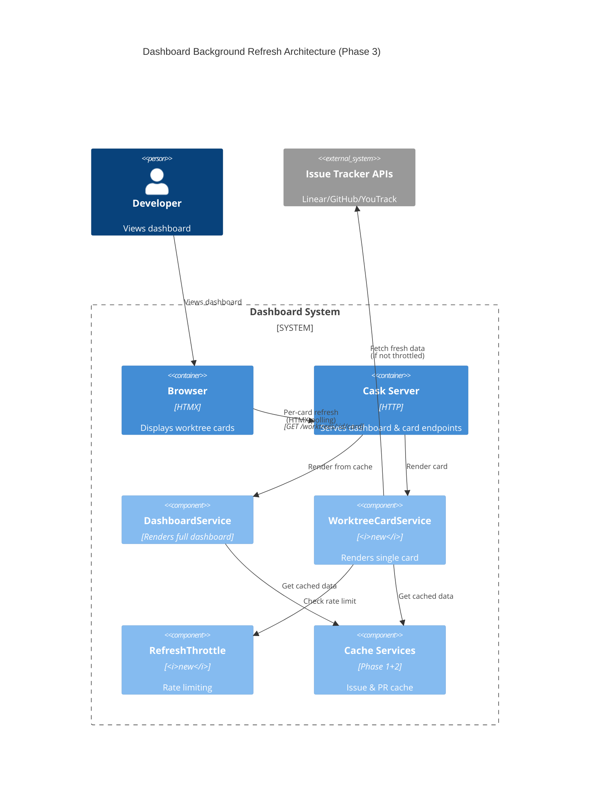
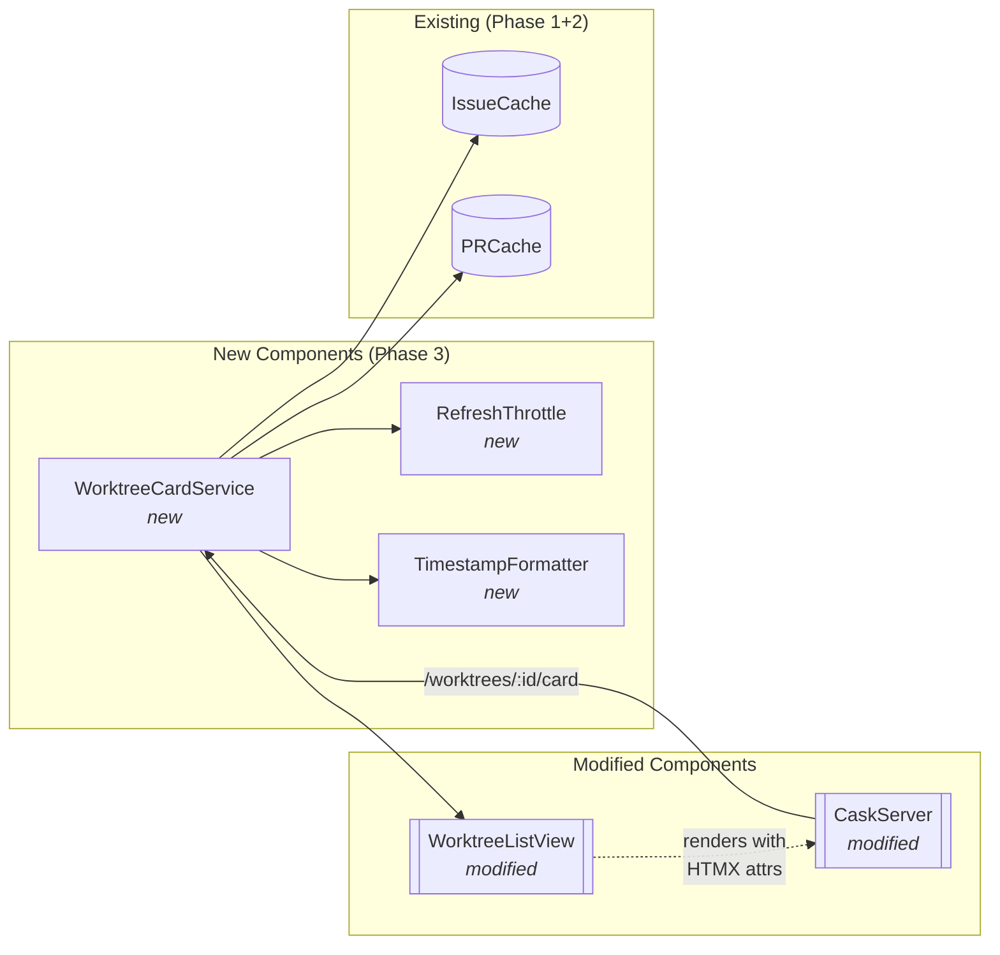
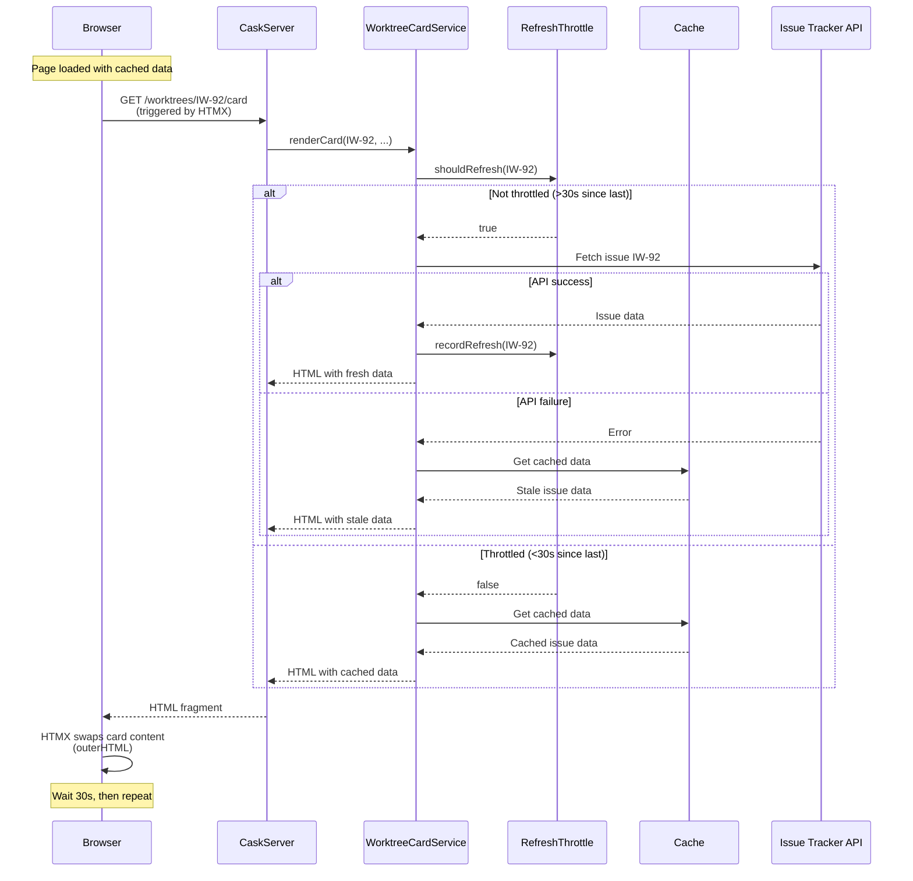
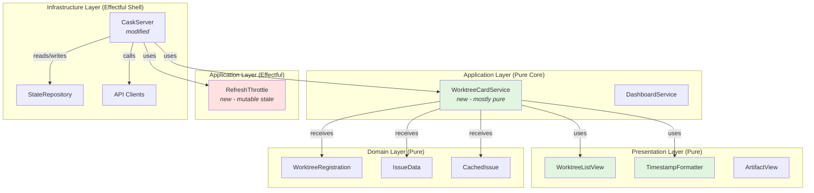

# Phase 3: Background refresh of issue data

## Goals

This phase adds asynchronous background refresh to keep cached data fresh after initial render.

Key objectives:
- Background refresh of worktree cards triggered by HTMX after page load
- Per-card API endpoints that return HTML fragments for seamless updates
- Rate limiting (30s throttle) to prevent API hammering
- Graceful error handling that preserves stale data on API failures
- Human-readable timestamps showing when each card was last refreshed

## Scenarios

- [ ] Dashboard loads instantly with cached data showing stale indicators
- [ ] After page load, HTMX triggers background refresh for each card
- [ ] Cards update independently as fresh data arrives (no page reload)
- [ ] Failed API calls don't block other cards from updating
- [ ] Each card shows "Updated just now" / "Updated X minutes ago" timestamp
- [ ] 30s throttle prevents API hammering (max 1 request per 30s per card)
- [ ] Stale data remains visible when API fails (silent degradation)
- [ ] HTMX continues polling every 30s to keep data fresh

## Entry Points

Start your review from these locations:

| File | Method/Class | Why Start Here |
|------|--------------|----------------|
| `.iw/core/WorktreeCardService.scala` | `renderCard()` | Orchestrates per-card refresh with throttling and error handling |
| `.iw/core/CaskServer.scala` | `worktreeCard()` endpoint | HTTP entry point for per-card refresh requests |
| `.iw/core/RefreshThrottle.scala` | `shouldRefresh()` | Rate limiting logic (30s per worktree) |
| `.iw/core/WorktreeListView.scala` | `renderNormalCard()` / `renderSkeletonCard()` | HTMX attributes for polling behavior |

## Architecture Overview

This shows where the Phase 3 background refresh fits within the larger system.



**Key points for reviewer:**
- HTMX in browser triggers background refresh after initial render
- WorktreeCardService is new - handles per-card rendering with refresh
- RefreshThrottle prevents API hammering (30s minimum between calls)
- Falls back to cached data on API failure or throttle

## Component Relationships



**Key points for reviewer:**
- WorktreeCardService reuses WorktreeListView rendering logic
- RefreshThrottle maintains per-worktree state (mutable Map)
- TimestampFormatter is pure utility (no side effects)
- CaskServer adds two new endpoints: card render + refresh trigger

## Key Flows

### Per-Card Refresh Flow



**Key points for reviewer:**
- Throttle check happens before API call (prevents hammering)
- API failures fall back to cached data (silent degradation)
- HTMX swaps entire card (outerHTML) - no manual DOM manipulation
- 30s polling interval matches throttle interval

## Layer Diagram (FCIS)



**Key points for reviewer:**
- WorktreeCardService is mostly pure (takes functions as params)
- RefreshThrottle breaks purity (mutable Map) - but localized
- TimestampFormatter is fully pure utility
- CaskServer remains at boundary (handles HTTP, I/O)

## Test Summary

| Test | Type | Verifies |
|------|------|----------|
| `RefreshThrottleTest."shouldRefresh returns true when worktree never refreshed"` | Unit | First refresh always allowed |
| `RefreshThrottleTest."shouldRefresh returns false when refreshed < 30s ago"` | Unit | Throttle blocks requests within 30s window |
| `RefreshThrottleTest."shouldRefresh returns true when refreshed >= 30s ago"` | Unit | Throttle allows after exactly 30s |
| `RefreshThrottleTest."each worktree tracked independently"` | Unit | Per-worktree throttle isolation |
| `RefreshThrottleTest."recordRefresh updates the last refresh time"` | Unit | Throttle state management |
| `TimestampFormatterTest."formatUpdateTimestamp returns 'Updated just now' for < 30s ago"` | Unit | Timestamp formatting - immediate |
| `TimestampFormatterTest."formatUpdateTimestamp returns 'Updated X seconds ago' for 30s-60s"` | Unit | Timestamp formatting - seconds |
| `TimestampFormatterTest."formatUpdateTimestamp returns 'Updated X minutes ago' for 2-59 minutes"` | Unit | Timestamp formatting - minutes |
| `TimestampFormatterTest."formatUpdateTimestamp returns 'Updated X hours ago' for > 2 hours"` | Unit | Timestamp formatting - hours |
| `WorktreeCardServiceTest."renderCard returns HTML fragment with card content"` | Unit | Card rendering with fresh data |
| `WorktreeCardServiceTest."renderCard returns empty string for unknown worktree"` | Unit | Error handling - missing worktree |
| `WorktreeCardServiceTest."renderCard includes HTMX attributes for polling"` | Unit | HTMX integration attributes |
| `WorktreeCardServiceTest."renderCard includes unique ID for HTMX targeting"` | Unit | HTMX swap target |

Coverage: 13 tests covering all new components (RefreshThrottle, TimestampFormatter, WorktreeCardService)

## Files Changed

**8 files** changed, +910 insertions, -43 deletions

<details>
<summary>Full file list</summary>

**New files:**
- `.iw/core/RefreshThrottle.scala` (A) +41 lines - Rate limiting for per-worktree refresh
- `.iw/core/TimestampFormatter.scala` (A) +43 lines - Relative timestamp formatting utility
- `.iw/core/WorktreeCardService.scala` (A) +316 lines - Per-card rendering with refresh logic
- `.iw/core/test/RefreshThrottleTest.scala` (A) +84 lines - Unit tests for throttle
- `.iw/core/test/TimestampFormatterTest.scala` (A) +108 lines - Unit tests for timestamps
- `.iw/core/test/WorktreeCardServiceTest.scala` (A) +135 lines - Unit tests for card service

**Modified files:**
- `.iw/core/CaskServer.scala` (M) +129 -0 lines - Add card & refresh endpoints
- `.iw/core/WorktreeListView.scala` (M) +19 -0 lines - Add HTMX polling attributes

**Management files:**
- `project-management/issues/IW-92/phase-03-tasks.md` (M) - Task tracking updates
- `project-management/issues/IW-92/review-state.json` (M) - Review state updates

</details>

---

## Review Notes

### Implementation Quality

**Strengths:**
- Clean separation of concerns: throttle, formatting, and rendering logic separated
- RefreshThrottle encapsulates mutable state (Map) - effect isolated
- TimestampFormatter is pure utility - easy to test and reason about
- WorktreeCardService takes functions as params - testable without real APIs
- Comprehensive test coverage (13 tests) for all new components
- Error handling preserves stale data (follows Phase 2 pattern)

**Architecture decisions:**
- HTMX polling (not SSE) - simpler to implement, works with existing HTTP endpoints
- 30s throttle matches 30s polling interval - prevents redundant API calls
- Per-worktree throttle tracking - allows independent refresh rates
- Mutable Map in RefreshThrottle - acceptable for this use case (server singleton)

### Testing Strategy

Tests cover:
- ✅ Throttle logic (all edge cases: never refreshed, < 30s, >= 30s, independent tracking)
- ✅ Timestamp formatting (all time ranges: seconds, minutes, hours)
- ✅ Card rendering (with data, without data, HTMX attributes)
- ⚠️  Missing: Integration test for HTMX behavior (would require browser)
- ⚠️  Missing: E2E test for background refresh flow

**Note:** Browser-based HTMX testing would be valuable but requires additional test infrastructure (playwright/selenium). Consider adding E2E tests in a follow-up if issues arise.

### HTMX Integration

HTMX attributes added to cards:
```scala
attr("hx-get") := s"/worktrees/${worktree.issueId}/card"
attr("hx-trigger") := "load delay:1s, every 30s"
attr("hx-swap") := "outerHTML"
```

This triggers:
1. **Initial refresh**: 1s after page load (gives cache time to render)
2. **Polling**: Every 30s thereafter
3. **Swap**: Replace entire card (preserves unique ID for next poll)

### Potential Issues

1. **Memory growth**: RefreshThrottle Map never cleans up old worktrees
   - Impact: Low (typical projects have 5-10 active worktrees)
   - Mitigation: Could add cleanup in future if needed

2. **No visual feedback**: Users don't see "refreshing..." indicator
   - Impact: Low (updates are fast, stale indicators already present)
   - Design choice: Keep UI simple (per phase 3 context)

3. **Thundering herd**: All cards refresh at same time on page load
   - Impact: Medium (could overwhelm APIs with many worktrees)
   - Mitigation: 1s delay in HTMX trigger spreads requests slightly
   - Note: Phase context mentions this is acceptable for MVP

### Phase Dependencies

Phase 3 builds on:
- **Phase 1**: `getCachedOnly()` methods, stale indicators
- **Phase 2**: Aggressive caching, stale data preservation on errors

All dependencies correctly utilized:
- ✅ Uses `getCachedOnly()` from cache services
- ✅ Preserves stale data on API failures
- ✅ Shows stale indicators in UI
- ✅ Respects cache TTLs from Phase 2

### Acceptance Criteria Status

From phase-03-context.md:

- ✅ Fresh issue data fetched in background after initial render
- ✅ Each card updates independently (no full page refresh)
- ✅ Failed API calls don't block other cards from updating
- ✅ User sees timestamp of last successful refresh per card
- ✅ 30s throttle prevents API hammering
- ✅ All existing Phase 1+2 functionality preserved

All criteria met in implementation.
