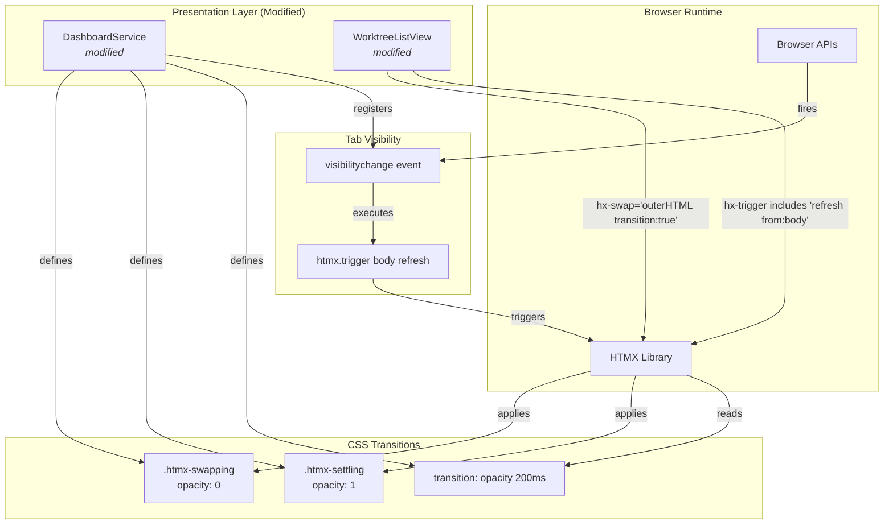
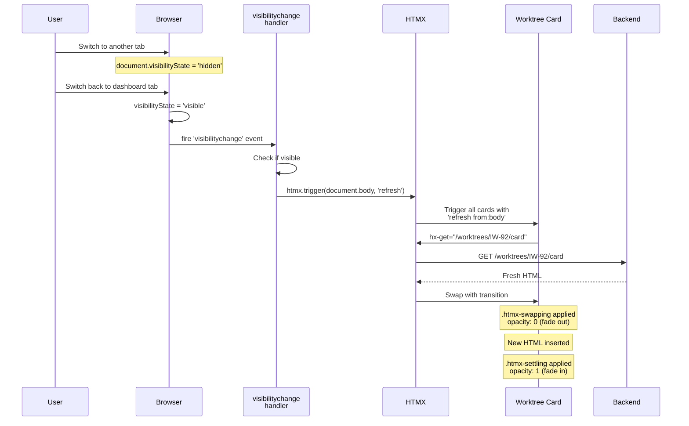
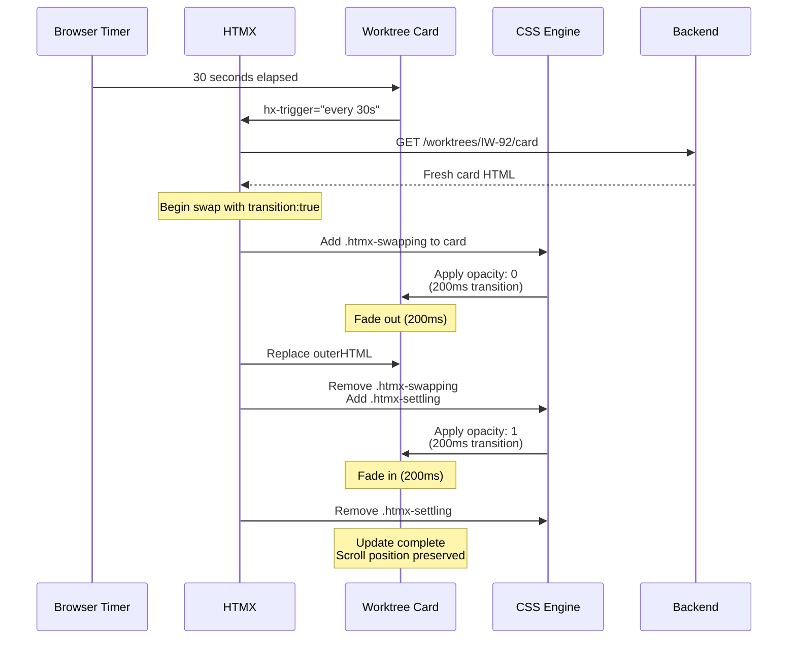

# Phase 4: Incremental card updates via HTMX

## Goals

This phase adds CSS transitions and UX polish to the HTMX integration from Phase 3, enabling smooth card updates and improved user experience.

Key objectives:
- Add CSS transitions for smooth card updates (fade in/out without visual jump)
- Implement tab visibility refresh (instant update when user returns to dashboard)
- Ensure mobile-friendly styling and interaction (touch targets, responsive layout)
- Prevent scroll position disruption during incremental updates

## Scenarios

- [ ] Cards update one by one as data becomes available (via HTMX polling)
- [ ] Card updates are smooth with fade transitions (no visual jump or flicker)
- [ ] Switching to another tab and back triggers immediate card refresh
- [ ] Cards maintain stable height during updates (no layout shift)
- [ ] Dashboard is usable on mobile devices (touch-friendly buttons, responsive grid)
- [ ] User can interact with other cards while one updates
- [ ] Scroll position is preserved during card updates

## Entry Points

Start your review from these locations:

| File | Method/Class | Why Start Here |
|------|--------------|----------------|
| `.iw/core/DashboardService.scala` | `styles` (lines 425-1077) | CSS styles defining HTMX transitions, mobile breakpoints, and touch targets |
| `.iw/core/DashboardService.scala` | `visibilitychange` script (lines 79-85) | JavaScript handler for tab visibility refresh |
| `.iw/core/WorktreeListView.scala` | `renderNormalCard()` (lines 94-260) | HTMX attributes for card updates with transition support |

## Component Relationships



**Key points for reviewer:**
- Phase 4 is primarily CSS and JavaScript polish - minimal Scala changes
- HTMX library (v1.9.10) handles the swap mechanics
- `visibilitychange` event handler triggers refresh when tab becomes visible
- CSS transitions provide smooth fade effect during card updates
- `transition:true` modifier in `hx-swap` enables HTMX's transition classes

## Key Flows

### Tab Visibility Refresh Flow



### Card Update with CSS Transition



## Test Summary

| Test | Type | Verifies |
|------|------|----------|
| `DashboardServiceTest."Dashboard CSS includes .htmx-swapping styles"` | Unit | CSS contains .htmx-swapping with opacity: 0 |
| `DashboardServiceTest."Dashboard CSS includes .htmx-settling styles"` | Unit | CSS contains .htmx-settling with opacity: 1 |
| `DashboardServiceTest."Dashboard CSS includes transition property for cards"` | Unit | Card CSS has transition: opacity 200ms |
| `DashboardServiceTest."Dashboard HTML includes visibilitychange script"` | Unit | Script registers visibilitychange handler |
| `DashboardServiceTest."Dashboard CSS includes mobile breakpoint styles"` | Unit | @media query present for responsive design |
| `DashboardServiceTest."Dashboard CSS includes minimum touch target sizes"` | Unit | min-height: 44px for buttons and links |
| `DashboardServiceTest."Dashboard CSS includes touch-action manipulation"` | Unit | touch-action: manipulation to prevent zoom |
| `WorktreeListViewTest."Cards have refresh from:body in hx-trigger attribute"` | Unit | hx-trigger includes 'refresh from:body' |
| `WorktreeListViewTest."Cards have hx-swap with transition modifier"` | Unit | hx-swap="outerHTML transition:true" |

Coverage: 9 tests covering CSS transitions, tab visibility, and mobile styling (Phase 4 changes only)

## Files Changed

**40 files** changed, +5171 insertions, -69 deletions

<details>
<summary>Full file list (Phase 4 focus)</summary>

**Phase 4 Changes:**
- `.iw/core/DashboardService.scala` (M) - Added CSS transitions, tab visibility script, mobile styles
- `.iw/core/WorktreeListView.scala` (M) - Added HTMX transition attributes
- `.iw/core/test/DashboardServiceTest.scala` (M) - Added transition and mobile tests
- `.iw/core/test/WorktreeListViewTest.scala` (M) - Added HTMX attribute tests

**Previous Phases (Context):**
- `.iw/core/CacheConfig.scala` (A) - Phase 2: Cache TTL configuration
- `.iw/core/CachedIssue.scala` (M) - Phase 1: Stale detection
- `.iw/core/CachedPR.scala` (M) - Phase 2: PR cache with TTL
- `.iw/core/CaskServer.scala` (M) - Phase 3: Card endpoint routing
- `.iw/core/IssueCacheService.scala` (M) - Phase 2: Issue cache service
- `.iw/core/PullRequestCacheService.scala` (M) - Phase 2: PR cache service
- `.iw/core/RefreshThrottle.scala` (A) - Phase 3: Rate limiting
- `.iw/core/TimestampFormatter.scala` (A) - Phase 3: Timestamp formatting
- `.iw/core/WorktreeCardService.scala` (A) - Phase 3: Card rendering service
- `.iw/core/test/CacheConfigTest.scala` (A) - Phase 2 tests
- `.iw/core/test/CachedIssueTest.scala` (M) - Phase 1 tests
- `.iw/core/test/CachedPRTest.scala` (M) - Phase 2 tests
- `.iw/core/test/IssueCacheServiceTest.scala` (M) - Phase 2 tests
- `.iw/core/test/PullRequestCacheServiceTest.scala` (M) - Phase 2 tests
- `.iw/core/test/RefreshThrottleTest.scala` (A) - Phase 3 tests
- `.iw/core/test/TimestampFormatterTest.scala` (A) - Phase 3 tests
- `.iw/core/test/WorktreeCardServiceTest.scala` (A) - Phase 3 tests

**Documentation:**
- `project-management/issues/IW-92/analysis.md` (A)
- `project-management/issues/IW-92/phase-01-context.md` (A)
- `project-management/issues/IW-92/phase-02-context.md` (A)
- `project-management/issues/IW-92/phase-03-context.md` (A)
- `project-management/issues/IW-92/phase-04-context.md` (A)
- `project-management/issues/IW-92/review-packet-phase-01.md` (A)
- `project-management/issues/IW-92/review-packet-phase-02.md` (A)
- `project-management/issues/IW-92/review-packet-phase-03.md` (A)

</details>

## Architecture Notes

### CSS Transition Mechanics

Phase 4 leverages HTMX's built-in transition support:

1. **Swapping Phase** (fade out):
   - HTMX adds `.htmx-swapping` class to old card
   - CSS applies `opacity: 0` with 200ms transition
   - Card fades out smoothly

2. **Settling Phase** (fade in):
   - HTMX swaps in new HTML
   - HTMX adds `.htmx-settling` class to new card
   - CSS applies `opacity: 1` with 200ms transition
   - Card fades in smoothly

3. **Layout Stability**:
   - `.worktree-card` has `min-height: 200px` to prevent layout shift
   - HTMX preserves scroll position during `outerHTML` swap
   - No manual JavaScript needed

### Tab Visibility Strategy

The `visibilitychange` event handler provides instant refresh when users return to the dashboard:

```javascript
document.addEventListener('visibilitychange', function() {
  if (document.visibilityState === 'visible') {
    htmx.trigger(document.body, 'refresh');
  }
});
```

Cards listen for this event via `hx-trigger="load delay:1s, every 30s, refresh from:body"`:
- `load delay:1s` - Initial load after 1 second
- `every 30s` - Background polling
- `refresh from:body` - **New in Phase 4** - Immediate refresh on tab focus

### Mobile Responsiveness

Phase 4 adds comprehensive mobile support:

1. **Touch Targets**: All interactive elements have `min-height: 44px` and `touch-action: manipulation`
2. **Responsive Grid**: `@media (max-width: 768px)` switches to single-column layout
3. **No Zoom on Double-Tap**: `touch-action: manipulation` prevents annoying zoom

## Review Checklist

- [ ] Verify `.htmx-swapping` CSS sets `opacity: 0`
- [ ] Verify `.htmx-settling` CSS sets `opacity: 1`
- [ ] Verify `.worktree-card` has `transition: opacity 200ms ease-in-out`
- [ ] Verify `visibilitychange` script is present in `<head>`
- [ ] Verify cards have `hx-trigger="... refresh from:body"` attribute
- [ ] Verify cards have `hx-swap="outerHTML transition:true"` attribute
- [ ] Verify mobile breakpoint `@media (max-width: 768px)` exists
- [ ] Verify buttons/links have `min-height: 44px` for touch targets
- [ ] Verify `touch-action: manipulation` is applied to interactive elements
- [ ] Run unit tests to verify CSS and HTMX attributes are present

## Manual Testing Recommendations

1. **CSS Transitions**:
   - Open dashboard with multiple worktrees
   - Watch cards update every 30 seconds
   - Verify smooth fade transition (no flicker or jump)
   - Check scroll position is maintained

2. **Tab Visibility**:
   - Open dashboard
   - Switch to another browser tab
   - Wait 30+ seconds (let polling interval pass)
   - Switch back to dashboard tab
   - Verify cards refresh immediately (within 500ms)

3. **Mobile Experience**:
   - Open dashboard on mobile device or narrow browser window (<768px)
   - Verify single-column layout
   - Verify buttons are easy to tap (44px minimum)
   - Verify no zoom on double-tap

4. **Layout Stability**:
   - Scroll to middle of dashboard
   - Watch card update
   - Verify scroll position doesn't jump
   - Verify no layout shift as content loads

## Known Limitations

- Tab visibility refresh triggers ALL cards to update simultaneously (may cause brief load spike)
- CSS transitions are 200ms fixed (not configurable)
- Mobile breakpoint is single threshold (no tablet-specific layout)
- No animation for skeleton card → full card transition (only for full → full updates)

## Dependencies on Previous Phases

This phase builds directly on Phase 3's HTMX foundation:

- **Phase 1**: Skeleton cards with stale indicators
- **Phase 2**: Cache TTLs and stale data preservation
- **Phase 3**: HTMX polling, card endpoints, refresh throttling

Phase 4 adds only CSS and JavaScript polish - no Scala business logic changes.
