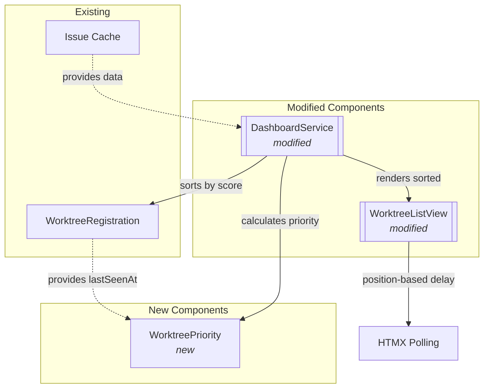
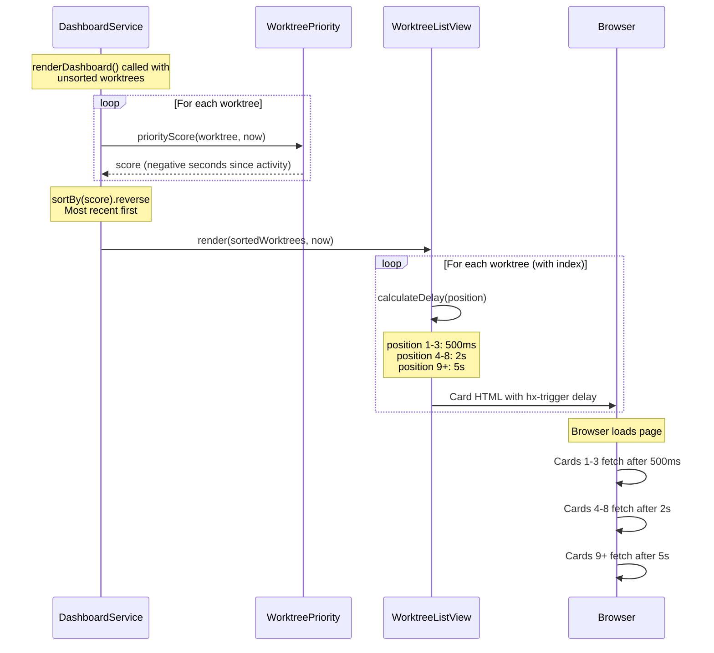

# Phase 5: Visible-items-first optimization

## Goals

This phase optimizes dashboard refresh ordering for users with many worktrees by prioritizing the most recently active items. Users now see the most relevant worktrees refresh first, improving perceived performance.

Key objectives:
- Sort worktrees by last activity timestamp (most recent first)
- Stagger HTMX polling delays based on priority (500ms/2s/5s tiers)
- Prioritize "above the fold" cards to load faster
- Scale gracefully with 10+ worktrees

## Scenarios

- [ ] Dashboard displays worktrees sorted by last activity (most recent first)
- [ ] Top 3 worktrees refresh within 1 second of page load
- [ ] Cards 4-8 refresh within 2 seconds
- [ ] Remaining worktrees refresh within 5 seconds
- [ ] Sort is stable and deterministic for worktrees with equal activity times
- [ ] Dashboard feels fast even with 10+ registered worktrees
- [ ] No race conditions or performance degradation with staggered polling

## Entry Points

Start your review from these locations:

| File | Method/Class | Why Start Here |
|------|--------------|----------------|
| `.iw/core/WorktreePriority.scala` | `priorityScore()` | Pure priority calculation based on activity timestamps |
| `.iw/core/DashboardService.scala` | `renderDashboard()` (line 36) | Sorts worktrees before rendering using priority scores |
| `.iw/core/WorktreeListView.scala` | `calculateDelay()` (line 278) | Staggered polling delays based on card position |

## Component Relationships

This diagram shows how the new priority system integrates with existing dashboard components.



**Key points for reviewer:**
- `WorktreePriority` is a pure object with a single function - no side effects
- `DashboardService` calls `priorityScore()` before sorting worktrees (line 36)
- `WorktreeListView.calculateDelay()` determines polling intervals based on position
- Position in list acts as a proxy for viewport visibility (top = likely visible)

## Key Flow: Priority-Based Rendering

This sequence shows how worktrees are sorted by priority and rendered with staggered delays.



**Key points for reviewer:**
- Priority score is based on time since last activity (more recent = higher score)
- Sorting happens once per render, not per card
- HTMX delays are position-based, not priority-based (position is result of priority sort)
- Staggered delays prevent API request burst on page load

## Test Summary

| Test | Type | Verifies |
|------|------|----------|
| `WorktreePriorityTest."recent activity gets higher priority score"` | Unit | Recent activity scores higher than older |
| `WorktreePriorityTest."older activity gets lower priority score"` | Unit | Relative priority ordering is correct |
| `WorktreePriorityTest."priority score is deterministic"` | Unit | Same input produces same score |
| `WorktreePriorityTest."handles very recent activity"` | Unit | Edge case: activity at same instant as "now" |
| `DashboardServiceTest."sorts worktrees by priority"` | Unit | Dashboard renders worktrees in priority order |
| `DashboardServiceTest."sort is stable for equal priorities"` | Unit | Stable sort preserves registration order for ties |
| `WorktreeListViewTest."First 3 cards have delay:500ms"` | Unit | Top priority cards have shortest delay |
| `WorktreeListViewTest."Cards 4-8 have delay:2s"` | Unit | Medium priority cards have medium delay |
| `WorktreeListViewTest."Cards 9+ have delay:5s"` | Unit | Lower priority cards have longest delay |

Coverage: 9 new/modified tests covering priority calculation, sorting behavior, and staggered polling delays.

## Files Changed

**6 files** changed, +359 insertions, -47 deletions

<details>
<summary>Full file list</summary>

- `.iw/core/WorktreePriority.scala` (A) +26 lines
- `.iw/core/DashboardService.scala` (M) +9 -1 lines
- `.iw/core/WorktreeListView.scala` (M) +40 -2 lines
- `.iw/core/test/WorktreePriorityTest.scala` (A) +100 lines
- `.iw/core/test/DashboardServiceTest.scala` (M) +100 lines
- `.iw/core/test/WorktreeListViewTest.scala` (M) +67 lines

</details>

---

## Implementation Notes

### Priority Score Algorithm

The priority score is calculated as the negative number of seconds since last activity:

```scala
def priorityScore(registration: WorktreeRegistration, now: Instant): Long =
  val secondsSinceActivity = Duration.between(registration.lastSeenAt, now).getSeconds
  -secondsSinceActivity  // Negative so more recent = higher score
```

This simple approach:
- Is deterministic (same input always produces same output)
- Is a pure function (no side effects)
- Works with Scala's `sortBy()` using reverse ordering
- Handles edge cases (activity at "now" returns 0, which is highest)

### Staggered Delay Tiers

The delay calculation uses position-based thresholds:

```scala
def calculateDelay(position: Int): String =
  position match
    case p if p <= 3 => "500ms"  // High priority
    case p if p <= 8 => "2s"     // Medium priority
    case _ => "5s"               // Lower priority
```

Rationale:
- First 3 cards are likely "above the fold" on most screens
- 500ms feels instantaneous to users
- 2s delay spreads out API load while still feeling responsive
- 5s for low-priority cards prevents burst of requests

### Sorting Implementation

Dashboard sorting happens in a single line:

```scala
val sortedWorktrees = worktrees.sortBy(wt => WorktreePriority.priorityScore(wt, now))(Ordering[Long].reverse)
```

Using `sortBy()` with reverse ordering:
- Maintains stable sort (preserves registration order for ties)
- O(n log n) complexity (acceptable for typical worktree counts)
- Explicit `Ordering[Long].reverse` makes intent clear
